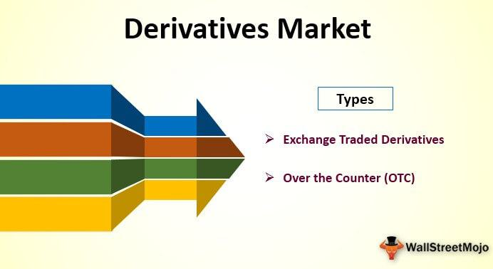

Financial trading has evolved significantly over the years, with algorithmic trading taking center stage in global markets. Among the numerous derivatives markets available, the MEFF derivatives market stands out as a significant platform for derivatives trading, especially in Spain.

Historically, financial markets have witnessed considerable advancements, with technology transforming the mechanisms of trading. Algorithmic trading, in particular, has revolutionized how traders interact with the markets, offering heightened speed and precision. The MEFF derivatives market embodies this progress by providing a sophisticated environment for derivatives trading that aligns with these technological developments.

MEFF is particularly notable for encapsulating a broad spectrum of derivative products that cater to various trading strategies and risk management needs. Its offerings range from futures and options on indices like the IBEX 35 to more specialized instruments like stock dividend futures and electricity derivatives. The diversification of its products helps traders leverage different facets of the market to optimize their portfolios and manage exposure effectively.

In the context of trading mechanisms, MEFF integrates algorithmic strategies that enhance trading efficacy. These strategies rely on complex algorithms to make informed trade decisions, resulting in rapid execution and reduced market impact. The ability to incorporate algorithmic trading in MEFF allows participants to maintain a competitive edge, making it a crucial component of modern trading practices.

Understanding the intricate dynamics and functionalities of the MEFF derivatives market is imperative for traders and investors aiming to enhance their competitive advantage. By navigating the features of this market and employing algorithmic trading strategies, participants can optimize their trading outcomes, adapting to market shifts and regulatory changes effectively. The insights into MEFF highlight its position as a pivotal player in the international financial landscape, particularly within the European derivatives trading sphere.

## Table of Contents

## History and Overview of MEFF

The Mercado Español de Futuros Financieros (MEFF) was established in 1989 and is headquartered in Madrid, Spain. It originally concentrated on trading Spanish government bond futures, a foundational element of its initial operations. Over time, MEFF broadened its scope to include equity derivatives, reflecting a growing diversification within the market to cater to an expanding range of financial instruments.

In 2002, MEFF underwent a significant transition, becoming part of Bolsas y Mercados Españoles (BME), the principal operator of all stock markets and financial systems in Spain. This integration encompassed the major Spanish stock exchanges located in Madrid, Barcelona, Bilbao, and Valencia. This strategic move enhanced MEFF's capabilities and broadened its service offerings, aligning it more closely with the broader Spanish financial market system.

MEFF's structural changes continued in 2013 when it restructured to separate its trading platform from the clearing house. This change was primarily driven by the need to comply with European regulations that demanded a clear distinction between trading activities and the clearing process to manage and mitigate risks effectively. Consequently, BME Clearing was established to handle the clearing operations, ensuring that MEFF aligns with regulatory standards and maintains operational efficiency. This restructuring not only enhanced compliance but also strengthened risk management protocols, ensuring the integrity and stability of the market.

## Products Offered by MEFF

MEFF, as a principal derivatives exchange in Spain, offers an extensive array of financial derivatives to cater to diverse trading needs. Among its offerings are futures and options on the IBEX 35 index, single stocks, and bond futures. The IBEX 35 index futures and options are particularly pivotal, reflecting the Spanish stock market's overall performance and serving as key instruments for portfolio management and hedging strategies.

The exchange ensures robust [liquidity](/wiki/liquidity-risk-premium) in single stock futures, facilitating efficient price discovery and hedging opportunities for participants. Furthermore, MEFF has expanded its product range to include stock dividend futures, allowing investors to hedge or speculate on the potential dividend payouts of single stocks. Additionally, electricity derivatives have been incorporated into MEFF's portfolio, catering to the energy sector's hedging demands.

Futures contracts on the IBEX 35 index remain a cornerstone of MEFF's offerings due to their significance in the Spanish financial market. These contracts allow traders to speculate or hedge against movements in the index, providing a mechanism for risk management associated with broad economic and market conditions.

In recent enhancements, MEFF has introduced the xRolling® [FX](/wiki/fx-anomaly) products, facilitating perpetual futures trading in currency pairs. This innovation allows participants to engage in continuous trading without the typical expiry associated with standard futures contracts, optimizing the currency trading processes. This perpetual feature is beneficial for traders looking to maintain long-term positions without the need for contract rollover.

MEFF's product diversification and innovation in derivatives are integral in providing solutions for risk management, speculation, and investment strategies, supporting a wide array of market participants, including individuals, institutions, and corporations.

## Algorithmic Trading at MEFF

Algorithmic trading at MEFF is characterized by the use of advanced computerized systems designed to execute trades based on predefined criteria. This method allows traders to make quick decisions and execute trades efficiently, an essential [factor](/wiki/factor-investing) in the fast-paced derivatives markets.

MEFF's trading platform is built to support a variety of [algorithmic trading](/wiki/algorithmic-trading) strategies, enabling enhanced efficiency and speed. By automating trade execution, algorithms can respond to market conditions more swiftly than traditional manual trading methods. This capability is particularly advantageous in the highly volatile derivatives markets, where timely decisions can significantly affect profitability.

High-frequency trading ([HFT](/wiki/high-frequency-trading-strategies)) is an integral part of algorithmic trading at MEFF. HFT utilizes algorithms to execute a large number of orders at extremely high speeds. The presence of HFT and professional market makers on MEFF creates an environment with tight bid-ask spreads and high liquidity. Such conditions are favorable for algorithmic trading, as they allow for the rapid execution of trades with minimal price impact and reduced transaction costs.

Traders also have access to MEFF's advanced market data services, which provide real-time data essential for the development and successful execution of trading algorithms. This data can include price movements, [order book](/wiki/order-book-trading-strategies) depth, and transaction history, which traders use to identify trading opportunities and execute trades efficiently.

Additionally, MEFF offers colocation services, whereby traders can place their trading servers in close proximity to the exchange's servers. This physical proximity reduces latency—the time it takes for data to travel between the trader's systems and the exchange—allowing for faster trade execution. The reduction in latency is crucial for traders employing high-frequency and other latency-sensitive strategies, providing a competitive edge by ensuring their orders reach the market faster than those of competitors located further away.

In summary, the integration of algorithmic trading within MEFF exemplifies the exchange's commitment to leveraging technological advancements to enhance trading efficiency and speed. By providing a conducive environment with tight spreads, high liquidity, and advanced data and colocation services, MEFF ensures that algorithmic traders can execute their strategies effectively, maintaining a competitive edge in the dynamic derivatives market.

## Regulatory Environment and Compliance

MEFF operates under strict regulatory oversight to ensure the integrity and transparency of its derivatives market. It is regulated by the Comisión Nacional del Mercado de Valores (CNMV), Spain’s securities market regulator, which mandates compliance with both national and European Union (EU) financial regulations.

One key regulatory framework impacting MEFF is the European Market Infrastructure Regulation (EMIR), which was implemented to enhance the stability of the over-the-counter (OTC) derivatives markets. EMIR requires entities engaged in derivatives trading to adopt stringent risk management procedures, including clearing obligations, trade reporting, and risk mitigation techniques. As a result, MEFF has evolved its processes to align with these requirements, leveraging BME Clearing to handle the clearing and settlement of trades. This separation of the trading platform from the clearing house enhances the robustness and reliability of MEFF’s market infrastructure.

Furthermore, MEFF adheres to the Markets in Financial Instruments Directive II (MiFID II), a comprehensive legislative framework enacted by the EU to improve financial market transparency and investor protection. MiFID II has introduced enhanced pre-trade and post-trade transparency standards, which are particularly beneficial for algorithmic trading strategies. By providing more detailed and timely market data, MiFID II reduces information asymmetry and lowers counterparty risk, thereby creating a more equitable trading environment. 

Algorithmic traders at MEFF benefit significantly from these regulatory measures. The transparency and standardization brought about by EMIR and MiFID II ensure a level playing field, enabling traders to develop and implement sophisticated trading algorithms with greater confidence. Additionally, tighter spreads and enhanced liquidity resulting from these regulations further contribute to optimizing trade execution and strategies.

Compliance with these EU regulations places MEFF at the forefront of international derivatives markets, ensuring it operates under a framework designed to safeguard participants and support efficient market functioning. This regulatory environment fosters trust and stability, vital for sustaining the growth and competitiveness of the MEFF derivatives market.

## Conclusion

The MEFF derivatives market maintains its significance within the European financial landscape through a range of robust product offerings and advanced trading technologies. Its pivotal role is underscored by the variety and sophistication of financial instruments available, which cater to a diverse array of trading strategies and objectives. By incorporating algorithmic trading capabilities, participants in the MEFF market can optimize their trading outcomes. Algorithmic trading facilitates the execution of large orders with speed and precision, leveraging pre-programmed rules and complex quantitative models to navigate market dynamics effectively.

In a regulatory environment characterized by continuous evolution, staying informed about new guidelines and market shifts is crucial for achieving success in trading on MEFF. Adherence to regulations such as the European Market Infrastructure Regulation (EMIR) and the Markets in Financial Instruments Directive II (MiFID II) ensures compliance and enhances the overall transparency and stability of trading activities. 

For traders seeking to maximize opportunities within the Spanish derivatives market, MEFF offers an expansive and well-integrated platform. Its capacity to support a wide range of derivatives and accommodate advanced trading technologies makes it an attractive venue for pursuing financial objectives. As the market evolves, traders must remain adaptable, continually refining their strategies and leveraging the technological and regulatory advantages that MEFF provides to sustain and enhance their competitive edge.

## References & Further Reading

[1]: ["European Market Infrastructure Regulation (EMIR)"](https://en.wikipedia.org/wiki/European_Market_Infrastructure_Regulation) - European Securities and Markets Authority.

[2]: ["Markets in Financial Instruments Directive II (MiFID II)"](https://finance.ec.europa.eu/regulation-and-supervision/financial-services-legislation/implementing-and-delegated-acts/markets-financial-instruments-directive-ii_en) - European Commission.

[3]: López de Prado, M. (2018). ["Advances in Financial Machine Learning."](https://www.amazon.com/Advances-Financial-Machine-Learning-Marcos/dp/1119482089) Wiley.

[4]: Chan, E. P. (2009). ["Quantitative Trading: How to Build Your Own Algorithmic Trading Business."](https://github.com/egorpe/EPChan-QuantitativeTrading/blob/master/example7_6.m) Wiley.

[5]: Jansen, S. (2020). ["Machine Learning for Algorithmic Trading."](https://github.com/stefan-jansen/machine-learning-for-trading) Packt Publishing.

[6]: Aronson, D. (2006). ["Evidence-Based Technical Analysis: Applying the Scientific Method and Statistical Inference to Trading Signals."](https://www.amazon.com/Evidence-Based-Technical-Analysis-Scientific-Statistical/dp/0470008741) Wiley.

[7]: García, J., & Molla, R. (2015). ["Spanish Financial Market Reform: The Role of MEFF in European Derivatives Markets."](https://www.sciencedirect.com/science/article/abs/pii/S0378426614003811) Economic & Industrial Democracy.