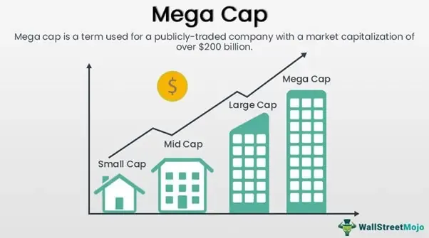

In today's rapidly evolving financial markets, mega cap companies and algorithmic trading are two dominant forces shaping the landscape. Mega cap companies, defined as those with market capitalizations exceeding $200 billion, exert significant influence on global markets due to their economic size, widespread consumer reach, and capacity for technological innovation. These firms often set industry standards, influencing trends in sectors such as technology, finance, and consumer goods.

Algorithmic trading, on the other hand, utilizes computer algorithms to execute trades rapidly and efficiently, based on predetermined criteria. This technological approach allows for the processing of massive volumes of data at high speeds, enabling traders to capitalize on market opportunities that would be impossible to detect manually. The integration of advanced technologies like machine learning and high-frequency trading amplifies the capabilities of algorithmic trading, offering increased execution speed, lower transaction costs, and enhanced market liquidity.



This article explores the interaction between these two formidable elements—mega cap companies and algorithmic trading—and their combined impact on market dynamics. As these entities continuously adapt to technological advancements and market demands, understanding their intersection provides crucial insights into the complexities of modern financial ecosystems. Additionally, examining present interactions and emerging trends can offer a glimpse into the future landscape of global markets. The interplay between the vast economic influence of mega cap firms and the precise, data-driven strategies of algorithmic trading is reshaping investment decisions and market structures in unprecedented ways.

## Table of Contents

## Understanding Market Capitalization

Market capitalization, commonly referred to as market cap, is a fundamental measure used to assess a company's size and overall financial strength. It is calculated by multiplying the share price by the total number of a company's outstanding shares:

$$
\text{Market Capitalization} = \text{Share Price} \times \text{Number of Outstanding Shares}
$$

Mega cap companies are those with market capitalizations exceeding $200 billion. These companies are often perceived as stable and influential leaders within the market due to their substantial resources, extensive global reach, and solid financial performance. As such, they can significantly impact market trends and investor sentiment.

Market capitalization is divided into several categories, which include large-cap, mid-cap, and small-cap. Each category helps investors assess potential risks and returns associated with investing in companies of various sizes:

- **Large-cap**: Companies typically valued at over $10 billion, known for their stability and reliability, often providing regular dividends.
- **Mid-cap**: Companies with market caps ranging from $2 billion to $10 billion, offering a blend of growth potential and stability.
- **Small-cap**: Companies valued at less than $2 billion, usually associated with higher volatility and growth potential but also higher risk.

These categories assist investors in constructing portfolios aligned with their financial goals and risk tolerance.

Trends in market capitalization are reflective of broader changes in the global business environment. Innovative technologies and shifting economic conditions can lead to significant fluctuations in a company's market value. For instance, technological advancements have propelled many firms in the technology sector to achieve mega cap status, as seen with notable examples like Apple and Microsoft. Furthermore, the increased focus on sustainable energy sources and AI indicates that emerging sectors could contribute new leaders to the list of mega cap companies in the future.

Overall, understanding market capitalization enables investors and analysts to evaluate a company's market position and growth prospects within the broader industry landscape.

## What is Algorithmic Trading?

Algorithmic trading employs computer algorithms to automate trading decisions, executing orders at speeds and volumes that surpass human capabilities. These algorithms are developed based on pre-set rules derived from technical indicators, historical data, and economic variables, making the process systematic and devoid of emotional bias.

Key technologies underpinning [algorithmic trading](/wiki/algorithmic-trading) include high-frequency trading ([HFT](/wiki/high-frequency-trading-strategies)), [machine learning](/wiki/machine-learning), and quantitative analysis. High-frequency trading leverages advanced technologies and powerful computers to transact a large number of orders at extraordinarily high speeds. It exploits minute price discrepancies and trading opportunities available on electronic trading platforms. Machine learning and [artificial intelligence](/wiki/ai-artificial-intelligence) enable systems to adapt to new data and predict future market movements by identifying patterns that are not immediately apparent to human traders. Quantitative analysis uses mathematical and statistical models to analyze market data and predict price movements, providing a data-driven basis for developing trading strategies.

The advantages of algorithmic trading are manifold. The primary benefit is increased trade execution speed, which enables the capture of opportunities that may last only milliseconds. This also contributes to improved market [liquidity](/wiki/liquidity-risk-premium), as algorithmic trading often involves large volumes of trades, adding to the overall [volume](/wiki/volume-trading-strategy) in the markets. Additionally, by automating trading processes, firms can reduce trading costs related to human errors and labor expenses.

Despite its benefits, algorithmic trading raises concerns about market stability. One of the notable risks is the potential for flash crashes, events where rapid and huge sell-offs occur within minutes, leading to dramatic and largely unexplained market price drops. These are often triggered by algorithms reacting to false or misleading signals. Consequently, algorithmic trading is subject to regulatory scrutiny, with measures such as circuit breakers introduced to halt trading temporarily if extreme [volatility](/wiki/volatility-trading-strategies) is detected, thus helping stabilize the markets.

By balancing these technological advancements with regulatory oversight, the financial sector aims to leverage the efficiencies of algorithmic trading while minimizing the associated risks.

## Top Companies by Market Capitalization

As of 2023, the global financial markets are dominated by mega cap companies, with a significant presence in the technology and consumer sectors. These companies have achieved valuations exceeding $200 billion, reflecting their robust market influence and economic prowess. The dominance of these sectors is driven by multiple factors, including continuous innovation, expansive global reach, and a track record of strong financial performance.

Innovation plays a critical role in propelling these companies to the forefront of the market. Firms such as Tesla and NVIDIA have demonstrated remarkable growth, in large part due to their substantial investments in technology and strategic innovation. Tesla, for instance, has revolutionized the automotive industry with its advancements in electric vehicles and battery technology. This technological edge has facilitated its rapid ascension to mega cap status. Similarly, NVIDIA's rise can be attributed to its pioneering work in graphic processing units (GPUs) and artificial intelligence, which have found widespread applications across various industries, thus driving its market capitalization.

The global reach of these companies also significantly contributes to their market dominance. Companies that successfully operate across multiple international markets can leverage economies of scale and tap into diverse revenue streams. This global presence not only stabilizes their financial performance amidst regional economic fluctuations but also enhances their competitive positioning in an increasingly interconnected world.

In addition to the current leaders, emerging sectors such as renewable energy and artificial intelligence (AI) are poised to introduce new market leaders. Companies in these sectors are leveraging cutting-edge technologies to address pressing global challenges, thereby attracting substantial investment and positioning themselves as potential mega cap entities. The intersection of sustainability with technological advancement presents significant opportunities for growth and innovation, suggesting a shift in market leadership dynamics in the coming years.

The progression of these sectors and their leading companies exemplify the dynamic nature of global financial markets. As these industries evolve, the companies at their helm will continue to influence market trends and economic development on a global scale, shaping the future of financial markets with their strategic vision and innovative prowess.

## Involvement of Top Companies in Algorithmic Trading

Mega cap companies frequently employ algorithmic trading to increase operational efficiency and manage substantial trade volumes effectively. Firms such as Goldman Sachs and Morgan Stanley are at the forefront, utilizing proprietary algorithms to gain competitive advantages in the market. These algorithms are designed to execute trades at high speeds and with precision, minimizing human error and taking advantage of market fluctuations even in fractions of a second.

Algorithmic trading significantly contributes to the revenue streams of these companies. By automating their trading processes, they can handle larger volumes of trades than could be managed manually, which allows them to capitalize on a higher number of market opportunities. Additionally, this approach can lead to reduced transaction costs, which is financially beneficial, especially for trades involving millions of shares.

The competitive positioning of mega cap firms like Goldman Sachs and Morgan Stanley is bolstered through their ability to process vast amounts of market data and execute trades accordingly. By implementing advanced quantitative models, these companies can identify and exploit [arbitrage](/wiki/arbitrage) opportunities, maintain optimal price execution, and manage risks more efficiently.

Looking forward, advancements in artificial intelligence (AI) and machine learning are anticipated to refine these algorithmic trading strategies further. Machine learning, particularly, offers the potential to improve predictive models by allowing algorithms to learn from historical data and adapt to new information. This capability enables firms to enhance the accuracy of their trading predictions and strategies continually.

In Python, these strategies might involve libraries such as NumPy and pandas for data manipulation, combined with machine learning frameworks like TensorFlow or PyTorch for developing predictive models. A simple example of loading and preprocessing financial data might look like this:

```python
import pandas as pd
import numpy as np

# Load financial data
data = pd.read_csv('market_data.csv')

# Preprocessing: fill missing values, compute technical indicators
data.fillna(method='ffill', inplace=True)
data['SMA'] = data['Close'].rolling(window=50).mean()  # Simple Moving Average

# Example of a machine learning model setup
from sklearn.model_selection import train_test_split
from sklearn.ensemble import RandomForestRegressor

# Features and target variable
X = data[['Open', 'High', 'Low', 'SMA']]
y = data['Close']

# Train-test split
X_train, X_test, y_train, y_test = train_test_split(X, y, test_size=0.2, random_state=42)

# Train a model
model = RandomForestRegressor(n_estimators=100, random_state=42)
model.fit(X_train, y_train)
```

Such tools and techniques help enhance the decision-making capabilities of mega cap firms in the financial marketplace. These advancements are not only pivotal in maintaining their competitive edge but also in navigating the challenges posed by increasingly complex market environments.

## Impact of Algorithmic Trading on Market Dynamics

Algorithmic trading has significantly reshaped market dynamics by enhancing the liquidity and efficiency of financial markets. The capacity for executing trades at high speeds and volumes ensures that buyers and sellers can be matched more readily, reducing bid-ask spreads and improving price discovery. However, this efficiency comes with potential drawbacks, notably the stability risks associated with flash crashes. These are rapid and significant declines in asset prices within an extremely short timeframe, often triggered by unexpected events or algorithmic anomalies.

Large-cap companies, due to their substantial market influence, significantly impact the trends and volumes within algorithmic trading. As these companies engage in high-frequency trading and leverage advanced algorithms, they add considerable transactional weight to market activities. This involvement underscores the dual impact of algorithmic trading: enhancing liquidity while simultaneously necessitating a vigilant approach to market stability.

Regulatory bodies have developed mechanisms, such as circuit breakers, to mitigate the risks associated with algorithmic trading. Circuit breakers temporarily halt trading on an exchange to prevent panic selling and stabilize markets during sharp declines. For example, the U.S. Securities and Exchange Commission (SEC) employs these measures to maintain orderly market conditions, especially during tumultuous trading sessions.

Balancing innovation with regulation is crucial for maintaining market integrity while fostering technological advancements in trading. Regulatory frameworks must evolve alongside technological progress to address the challenges posed by increasingly sophisticated trading algorithms. Policymakers aim to support the beneficial aspects of algorithmic trading, such as improved liquidity and efficiency, while mitigating the risks that could jeopardize market stability. The challenge lies in crafting regulations that do not stifle innovation but provide a resilient safety net to preserve the integrity of financial markets.

## Conclusion

Market capitalization and algorithmic trading are intricately linked in shaping the dynamics of contemporary financial markets. Mega cap companies, with their vast resources and substantial market influence, are increasingly deploying algorithmic trading strategies to enhance operational efficiency and impact the market. These strategies allow for streamlined trading at lower costs and improved execution speed, thereby cementing their dominance and maintaining a competitive edge.

Understanding the strategies leveraged by these mega cap companies provides valuable insights into current investment decisions and market trends. For instance, the use of high-frequency trading algorithms by these firms can lead to greater liquidity but also necessitates comprehensive risk management strategies to mitigate potential market anomalies such as flash crashes.

As technology continues to advance, particularly in fields like artificial intelligence and machine learning, we can anticipate further evolution in trading strategies. Future innovations are likely to refine these approaches, potentially offering more sophisticated analyses of market data, enhanced predictive capabilities, and further improved efficiencies. Thus, stakeholders in the financial markets must stay informed of these developments to optimize their strategies in an increasingly complex trading environment. Such progress will not only redefine trading practices but also sustain the dynamic and interconnected nature of global financial ecosystems.

## References & Further Reading

Bergstra, J., Bardenet, R., Bengio, Y., & Kégl, B. (2011). 'Algorithms for Hyper-Parameter Optimization.' Advances in Neural Information Processing Systems 24. This article provides a comprehensive examination of algorithms developed to optimize hyper-parameters in machine learning, which plays a pivotal role in refining algorithmic trading models.

Lopez de Prado, M. (2018). 'Advances in Financial Machine Learning.' Lopez de Prado addresses the intersection of finance and machine learning, offering insights into how advanced algorithms can be leveraged to improve decision-making and market predictions, highlighting the relevance of these technologies in algorithmic trading.

Aronson, D. (2006). 'Evidence-Based Technical Analysis: Applying the Scientific Method and Statistical Inference to Trading Signals.' This work emphasizes the application of scientific and statistical methods to technical analysis, providing a methodological approach crucial for developing reliable trading algorithms.

Jansen, S. (2020). 'Machine Learning for Algorithmic Trading.' This resource serves as a guide for integrating machine learning into algorithmic trading, offering practical insights and code examples to facilitate the development of trading strategies through machine learning techniques.

Chan, E.P. (2009). 'Quantitative Trading: How to Build Your Own Algorithmic Trading Business.' Chan outlines the fundamental aspects of creating a [quantitative trading](/wiki/quantitative-trading) business, providing a foundational understanding of how quantitative methods can be applied to build and refine trading algorithms.

