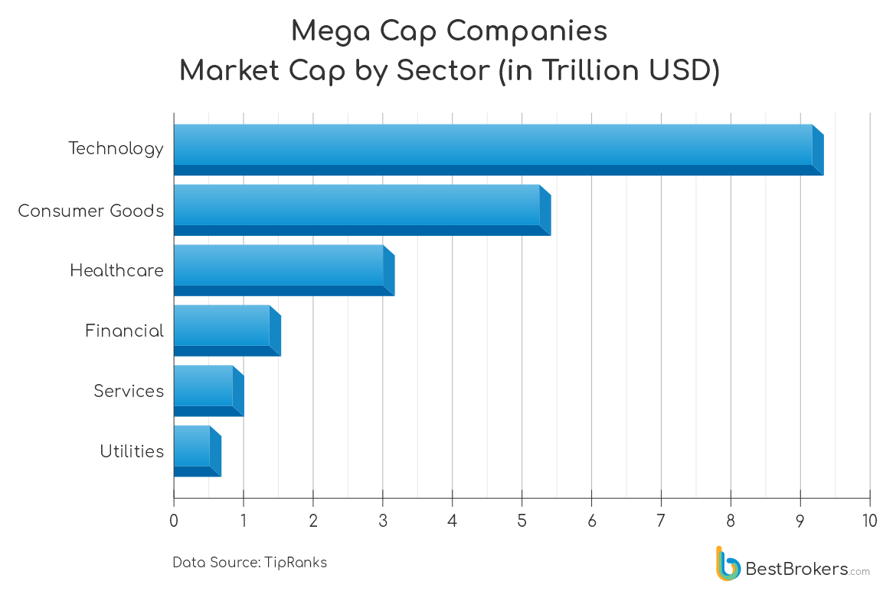

## Table of Contents

## What is a mega cap company?

A mega cap company is a very big business. It is worth a lot of money, usually more than $200 billion. These companies are leaders in their fields and are known all over the world. Examples include Apple, Microsoft, and Amazon.

People often invest in mega cap companies because they are seen as safe and stable. They have been around for a long time and are less likely to fail. Investors trust them because they have a strong history of making money and growing.

## How is market capitalization calculated?

Market capitalization, often called market cap, is calculated by multiplying the total number of a company's shares by the current price of one share. For example, if a company has 1 million shares and each share is worth $50, the market cap would be $50 million. This number gives investors an idea of the company's size and value in the stock market.

Market cap is important because it helps people understand how big a company is compared to others. It's like a snapshot of what the market thinks the company is worth at any given time. As share prices go up or down, the market cap changes too. This makes it a useful tool for investors to track the growth and health of a company over time.

## Why is $200 billion used as a threshold for mega cap companies?

The $200 billion threshold for mega cap companies is used because it helps investors and analysts easily identify the biggest and most influential companies in the world. This number is high enough to include only a small group of companies that have a huge impact on the global economy. When a company reaches this level, it shows that it has grown very big and is very valuable.

Using $200 billion as a cutoff makes it easier for people to compare companies and see which ones are the true giants. It also helps investors know which companies are seen as the safest and most stable because mega cap companies are usually well-established and have been successful for a long time. This threshold is a simple way to group companies by size and importance in the market.

## Which industries are most represented among mega cap companies?

Mega cap companies come from different industries, but technology is the biggest one. Companies like Apple, Microsoft, and Amazon are all in tech and they are some of the biggest companies in the world. Technology companies are important because they make things like computers, phones, and internet services that people use every day.

Another industry with mega cap companies is healthcare. Companies like Johnson & Johnson make medicines and medical devices that help people stay healthy. Healthcare is a big industry because everyone needs medical care at some point.

Other industries with mega cap companies include energy, like ExxonMobil, and finance, like JPMorgan Chase. These companies are important because they provide the energy and money that keep the world running. Even though they are not as many as tech or healthcare, they are still very big and influential.

## Can you list some mega cap companies with market capitalizations over $200 billion?

Some mega cap companies with market capitalizations over $200 billion are Apple, Microsoft, and Amazon. Apple makes iPhones and computers, and it's one of the biggest companies in the world. Microsoft is known for its Windows operating system and Office software. Amazon started as an online bookstore but now sells almost everything and also runs big cloud computing services.

Other mega cap companies include Alphabet, which owns Google, and Meta Platforms, which runs Facebook and Instagram. Alphabet is huge because Google is the most used search engine and also makes a lot of money from ads. Meta Platforms is important because so many people use its social media apps to connect with friends and family.

There are also mega cap companies in other industries, like Johnson & Johnson in healthcare, which makes medicines and medical devices, and Berkshire Hathaway, a big investment company run by Warren Buffett. These companies are very big and have a lot of influence in their fields.

## What are the key factors that contribute to a company reaching mega cap status?

Reaching mega cap status means a company has grown very big and valuable. One key [factor](/wiki/factor-investing) is innovation. Companies like Apple and Microsoft got to mega cap status by making new and useful products that people want to buy. They keep coming up with new ideas and improving their products, which helps them stay ahead of other companies. Another factor is strong leadership. Good leaders make smart decisions and guide the company to grow and make more money. They also know how to use the company's money wisely to invest in new projects and expand the business.

Another important factor is having a big and loyal customer base. Mega cap companies like Amazon and Google have millions of people using their services every day. They keep their customers happy by offering good products and services at fair prices. This helps them make a lot of money and grow even bigger. Finally, being in the right industry at the right time can help a company reach mega cap status. For example, technology and healthcare are growing fast, so companies in these industries have a good chance to become very big and valuable.

## How do mega cap companies impact the overall stock market?

Mega cap companies have a big impact on the overall stock market because they are so big and important. When a mega cap company does well, it can make the whole stock market go up. This is because these companies are often part of big stock indexes like the S&P 500. When their stock prices go up, the value of the index goes up too. Investors watch these companies closely because they can move the market a lot. For example, if Apple or Microsoft have a good earnings report, it can make people feel more confident about the market and they might buy more stocks.

On the other hand, if a mega cap company does badly, it can pull the whole market down. If a big company like Amazon has a problem, it can make investors worried about the economy. This can lead to selling off stocks and lower prices across the market. Mega cap companies are like the leaders of the stock market, so what they do can affect everyone else. Because of this, many investors pay a lot of attention to mega cap companies when they are making decisions about where to put their money.

## What are the risks associated with investing in mega cap companies?

Even though mega cap companies are seen as safe and stable, there are still risks when you invest in them. One risk is that their size can make it hard for them to grow quickly. These big companies are already so large that it can be tough for them to keep getting bigger at a fast pace. This can mean slower returns for investors who want their money to grow a lot over time. Another risk is that mega cap companies can be affected by big changes in the economy. If there's a recession or a big economic problem, these companies might not do as well as smaller ones that can change direction more easily.

Another risk is that mega cap companies can face a lot of competition. Even though they are big, new companies can come along and take away their customers with better or cheaper products. This can hurt their profits and make their stock prices go down. Also, because mega cap companies are so well-known, any problems they have can get a lot of attention. If they make a mistake or have a scandal, it can make their stock price drop a lot. So, even though investing in mega cap companies can seem safe, there are still things that can go wrong.

## How have mega cap companies performed historically compared to smaller cap companies?

Historically, mega cap companies have often done well, but they usually don't grow as fast as smaller cap companies. Mega cap companies are big and stable, so they can be safer to invest in. They have a lot of money and resources, which helps them keep making profits even when the economy is not doing great. But because they are already so big, it's hard for them to grow really fast. So, if you want to see your money grow a lot over a short time, you might do better with smaller companies that can grow faster.

On the other hand, smaller cap companies can be riskier. They don't have as much money and resources as mega cap companies, so they can have a harder time when the economy is bad. But when they do well, they can grow a lot faster than mega cap companies. This means that if you invest in smaller companies, you might make more money, but you also might lose more money if things go wrong. So, it depends on what you want: a safer investment with steady growth, or a riskier one with the chance for bigger gains.

## What role do mega cap companies play in global economic trends?

Mega cap companies are really important for global economic trends because they are so big and powerful. They can affect the economy all over the world. For example, when a mega cap company like Apple or Microsoft does well, it can make people feel more confident about the economy. This can lead to more spending and investing, which helps the economy grow. These companies also create a lot of jobs and spend a lot of money on things like research and development, which can help other businesses and industries grow too.

On the other hand, if a mega cap company has problems, it can make the global economy less stable. If a big company like Amazon has a bad year, it can make people worried about the economy. This can lead to less spending and investing, which can slow down the economy. Mega cap companies are like big ships that can move the whole ocean of the global economy, so people pay a lot of attention to what they do.

## How do regulatory environments affect mega cap companies differently than smaller companies?

Regulatory environments can affect mega cap companies differently than smaller companies because mega cap companies are so big and important. When governments make new rules, mega cap companies have to follow them just like everyone else. But because they are so big, they have to spend a lot of money and time to make sure they are following the rules. This can be hard for them, but they usually have enough money and lawyers to deal with it. Sometimes, new rules can even help mega cap companies because they can use their size and resources to follow the rules better than smaller companies.

Smaller companies, on the other hand, might have a harder time with new rules. They don't have as much money or as many people to help them follow the rules. This can make it tough for them to keep up with mega cap companies. But sometimes, smaller companies can be more flexible and change their business faster to fit the new rules. This can give them a chance to do well even if they have less money and resources than mega cap companies. So, while mega cap companies have to deal with a lot of rules, they usually have the tools to handle it, while smaller companies might struggle more but can also find new ways to succeed.

## What advanced financial metrics should be considered when analyzing mega cap companies?

When analyzing mega cap companies, it's important to look at advanced financial metrics like the price-to-earnings (P/E) ratio. This ratio tells you how much investors are willing to pay for each dollar of the company's earnings. A high P/E ratio might mean that people think the company will grow a lot in the future, while a low P/E ratio might mean that people think the company's growth will slow down. Another important metric is the return on equity (ROE), which shows how well a company is using the money that shareholders have invested to make more money. A high ROE is good because it means the company is making a lot of profit from the money it has.

Another useful metric is the debt-to-equity ratio, which shows how much debt a company has compared to its equity. Mega cap companies often have a lot of debt, but if their debt-to-equity ratio is too high, it might mean they are taking on too much risk. It's also good to look at the free cash flow, which is the money a company has left after it pays for everything it needs to run the business. A high free cash flow means the company has a lot of money to invest in new projects or to give back to shareholders. These metrics help investors understand how healthy and strong a mega cap company is, and whether it's a good investment.

## What is Understanding Market Capitalization?

Market capitalization, commonly referred to as market cap, is a fundamental measure used to assess a company's size and overall financial strength. It is calculated by multiplying the share price by the total number of a company's outstanding shares:

$$
\text{Market Capitalization} = \text{Share Price} \times \text{Number of Outstanding Shares}
$$

Mega cap companies are those with market capitalizations exceeding $200 billion. These companies are often perceived as stable and influential leaders within the market due to their substantial resources, extensive global reach, and solid financial performance. As such, they can significantly impact market trends and investor sentiment.

Market capitalization is divided into several categories, which include large-cap, mid-cap, and small-cap. Each category helps investors assess potential risks and returns associated with investing in companies of various sizes:

- **Large-cap**: Companies typically valued at over $10 billion, known for their stability and reliability, often providing regular dividends.
- **Mid-cap**: Companies with market caps ranging from $2 billion to $10 billion, offering a blend of growth potential and stability.
- **Small-cap**: Companies valued at less than $2 billion, usually associated with higher volatility and growth potential but also higher risk.

These categories assist investors in constructing portfolios aligned with their financial goals and risk tolerance.

Trends in market capitalization are reflective of broader changes in the global business environment. Innovative technologies and shifting economic conditions can lead to significant fluctuations in a company's market value. For instance, technological advancements have propelled many firms in the technology sector to achieve mega cap status, as seen with notable examples like Apple and Microsoft. Furthermore, the increased focus on sustainable energy sources and AI indicates that emerging sectors could contribute new leaders to the list of mega cap companies in the future.

Overall, understanding market capitalization enables investors and analysts to evaluate a company's market position and growth prospects within the broader industry landscape.

## References & Further Reading

Bergstra, J., Bardenet, R., Bengio, Y., & Kégl, B. (2011). 'Algorithms for Hyper-Parameter Optimization.' Advances in Neural Information Processing Systems 24. This article provides a comprehensive examination of algorithms developed to optimize hyper-parameters in [machine learning](/wiki/machine-learning), which plays a pivotal role in refining [algorithmic trading](/wiki/algorithmic-trading) models.

Lopez de Prado, M. (2018). 'Advances in Financial Machine Learning.' Lopez de Prado addresses the intersection of finance and machine learning, offering insights into how advanced algorithms can be leveraged to improve decision-making and market predictions, highlighting the relevance of these technologies in algorithmic trading.

Aronson, D. (2006). 'Evidence-Based Technical Analysis: Applying the Scientific Method and Statistical Inference to Trading Signals.' This work emphasizes the application of scientific and statistical methods to technical analysis, providing a methodological approach crucial for developing reliable trading algorithms.

Jansen, S. (2020). 'Machine Learning for Algorithmic Trading.' This resource serves as a guide for integrating machine learning into algorithmic trading, offering practical insights and code examples to facilitate the development of trading strategies through machine learning techniques.

Chan, E.P. (2009). 'Quantitative Trading: How to Build Your Own Algorithmic Trading Business.' Chan outlines the fundamental aspects of creating a [quantitative trading](/wiki/quantitative-trading) business, providing a foundational understanding of how quantitative methods can be applied to build and refine trading algorithms.

