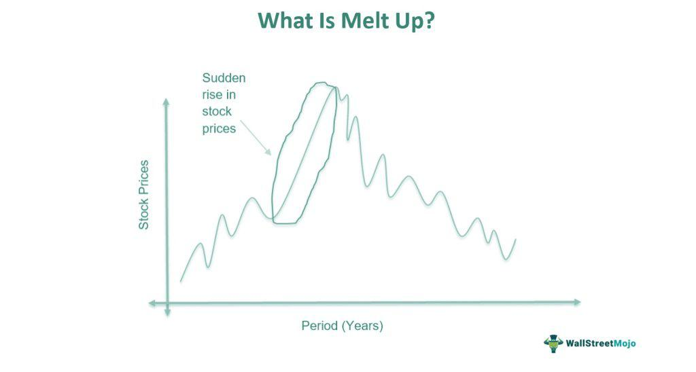

Financial markets are continually shaped by a range of forces including economic trends, market psychology, and technological advancements. These elements collectively contribute to the dynamic and ever-evolving nature of the financial landscape. At the forefront of these forces influencing current market dynamics are the phenomena of 'melt-ups' and algorithmic trading. 

A 'melt-up' refers to a rapid upward movement in stock prices, often propelled more by investor sentiment and psychological factors rather than substantive improvements in the economic fundamentals of the underlying companies. This can result in elevated market valuations and increased volatility, creating both opportunities and challenges for investors.



Simultaneously, algorithmic trading has emerged as a significant technological advancement within financial markets. This involves the use of computer algorithms to execute trades at speeds and frequencies that are impossible for human traders. Algorithmic trading can influence market trends by creating self-reinforcing movements, both upward and downward, and has been both praised for its efficiency and criticized for its role in exacerbating market volatility.

This article aims to provide a comprehensive exploration of how economic trends, market psychology, and technological progress through algorithmic trading converge to reshape financial markets. It discusses the benefits and potential risks associated with these dynamics and outlines strategies for investors navigating this rapidly changing environment. By understanding the interplay between these elements, investors can better position themselves to make informed decisions and manage risk effectively in the face of continuous market shifts.

## Table of Contents

## Understanding Melt-Ups in the Stock Market

A melt-up in the stock market is characterized by a rapid and unsustainable increase in asset prices, primarily influenced by investor sentiment rather than underlying economic factors. This psychological phenomenon is driven by fear of missing out (FOMO), where investors, observing rising prices, rush to purchase assets to capitalize on perceived gains, irrespective of their intrinsic values.

Historically, melt-ups have been observed in various markets. A notable example is the late 1990s dot-com bubble, where technological innovations and euphoria over internet-based businesses drove stock prices to exorbitant levels. Companies with minimal revenue were valued at multibillion-dollar market caps, fueled by speculative investments. Similarly, the Japanese asset price bubble of the late 1980s saw rapid increases in real estate and stock market prices, eventually leading to a prolonged economic stagnation.

Understanding the causes of melt-ups is critical as they often precede significant market corrections or meltdowns. Predominantly, a melt-up is preceded by a prolonged period of stable or slow economic growth, where positive investor sentiment accumulates. Catalysts such as tax cuts, monetary stimulus, or geopolitical stability can further enhance this sentiment, pushing prices higher.

Indicators of an impending melt-up include:

1. **Excessive Valuations**: Price-to-earnings (P/E) ratios significantly above historical averages suggest overvaluation, as seen during the dot-com bubble.

2. **Increased Speculation**: A surge in speculative trading, often evidenced by high volumes in options trading and increased margin debt, indicates a melt-up environment.

3. **Media Hype**: Media frenzy and frequent bullish commentary can inflate investor expectations and contribute to asset price increases.

4. **Low Volatility**: Periods of unusually low volatility can signal complacency in the market, often preceding a sharp market movement.

Investors need to remain vigilant for these indicators, as they can signal the transition from a melt-up to a market correction. Employing risk management strategies, such as diversification and setting stop-loss orders, can help mitigate potential losses when market corrections occur.

## Role of Economic Indicators in Melt-Ups

Economic indicators are crucial elements in shaping investor sentiment and driving phenomena like market melt-ups. These indicators are generally categorized into leading and lagging indicators, each offering insights into different stages of economic activity. 

Leading indicators, such as consumer confidence, are particularly pertinent during melt-ups. Consumer confidence reflects the degree of optimism that consumers feel about the overall state of the economy, which influences their spending and investment behaviors. A high level of consumer confidence often precedes robust economic activity and can trigger increased investment in equities. During melt-ups, high consumer confidence may lead investors to chase stock prices, contributing to unsustainable valuations.

GDP growth, a measure of the economy's health, is another pivotal economic indicator. While GDP is considered a lagging indicator as it reflects past economic activities, perceptions about future GDP growth can significantly impact investor sentiment. Strong GDP growth rates may drive expectations for enhanced corporate earnings, prompting investors to allocate more funds into the stock market. However, if GDP growth expectations are overly optimistic and unmatched by actual performances, it can lead to inflated asset prices that characterize melt-ups.

Employment rates, also a lagging indicator, offer valuable insights into economic stability and growth. Low unemployment rates can instill confidence in investors by indicating a thriving economy with potentially increasing consumer spending. This confidence can amplify buying pressures in the market, reinforcing upward trends. However, the risk lies in overvaluing stocks based on past employment data without considering future uncertainties, which can result in investment bubbles.

Ignoring these indicators, either by oversight or willful neglect, poses significant risks during economic bubbles. For instance, if investors overlook deteriorating consumer confidence or ignore signals indicating potential slowdowns in GDP growth, they may continue investing based on inertia rather than rational analysis. This can lead to poor investment decisions, locking investors into overvalued stocks that are poised for correction when reality catches up with market expectations. Understanding and appropriately responding to these indicators can, therefore, be instrumental in mitigating the risk of investing during a melt-up phase.

## Algorithmic Trading and Its Impact on Market Trends

Algorithmic trading, commonly referred to as algo-trading, involves the use of computer algorithms to automate trading strategies, allowing trades to be executed at exceptionally high speeds and frequencies. This method leverages a pre-defined set of rules or logic that assesses criteria like timing, price, or quantitative benchmarks, thus determining the optimal market timing to execute trades. By analyzing extensive datasets, these algorithms can identify patterns and execute trades that an individual trader may not perceive, resulting in increased market efficiency.

One of the significant impacts of [algorithmic trading](/wiki/algorithmic-trading) is its ability to create self-reinforcing market trends. This phenomenon occurs when algorithms, following similar trading signals, simultaneously buy or sell large volumes of stocks, leading to significant price movements. Such moves can exaggerate market trends, both upwards and downwards, as algorithms react to the same data, driving prices to new heights or lows. This behavior can contribute to a herding effect, where the market experiences substantial [momentum](/wiki/momentum) in one direction followed by swift reversals, potentially escalating [volatility](/wiki/volatility-trading-strategies).

The benefits of algorithmic trading include its capability to enhance trading speed and market efficiency. Algorithms can process complex calculations and large datasets more swiftly than human traders, allowing them to capitalize on fleeting market opportunities and execute trades at optimal prices. Additionally, algorithms frequently execute trades more methodically, helping minimize human errors and emotional biases that can adversely affect trading decisions. Algorithmic trading has also increased [liquidity](/wiki/liquidity-risk-premium) in the markets, improving price discovery and reducing bid-ask spreads.

However, algorithmic trading is not without risks. One major concern is market volatility, as the self-reinforcing nature of algorithms can intensify market fluctuations, leading to sharp price swings. Moreover, the speed of algorithmic trading can exacerbate the occurrence of "flash crashes"—rapid, deep, and volatile market drops followed by a quick recovery. Flash crashes are often the result of a cascade of automated selling triggered by algorithms responding to one another in a feedback loop.

Given these dynamics, it is crucial for stakeholders, including regulators, market participants, and developers of trading algorithms, to ensure that these tools are both effectively designed and responsibly deployed. This involves establishing circuit breakers and other regulatory measures to prevent market destabilization, as well as continuous monitoring to mitigate the systemic risks posed by algorithmic strategies. Enhanced regulatory frameworks combined with diligent risk management practices are essential to balancing the benefits of algorithmic trading with its inherent risks.

## Interplay Between Melt-Ups and Algo Trading

Algorithmic trading, which employs computers programmed to execute trades at high speeds based on preset conditions, plays a significant role in the dynamics of market melt-ups. In a melt-up, a sharp rise in stock prices is often driven by emotion and sentiment rather than fundamental improvements. Algorithmic trading interacts with these market conditions, potentially exacerbating or restraining fluctuations.

During a market melt-up, algorithmic trading strategies can amplify price movements through feedback loops. For example, momentum-based algorithms are designed to buy securities as prices rise and sell as they fall. In a melt-up scenario, these algorithms may continually purchase assets as their prices climb, further accelerating the upward trend. This self-reinforcing cycle can create an exaggerated surge in stock prices detached from underlying fundamentals.

Conversely, algorithmic trading can also mitigate market volatility. For instance, mean-reversion algorithms seek to capitalize on price anomalies by buying undervalued securities and selling overvalued ones. In a volatile market driven by a melt-up, these algorithms may introduce liquidity and stabilize price movements by countering extreme deviations.

However, the interaction between algorithmic trading and melt-ups is fraught with risks. The homogeneity of trading strategies can lead to a synchronized response among different traders, resulting in sharp market corrections. When multiple algorithms rely on similar indicators or signals, they can collectively pull out of a position, triggering a cascade of selling that magnifies the impact of a market downturn.

Consider the phenomenon of flash crashes, such as the one that occurred on May 6, 2010. During such events, rapid selling by high-frequency trading algorithms, triggered by predetermined thresholds, led to dramatic dips in stock prices in a matter of minutes. This illustrates how algorithmic trading can contribute to sudden market fluctuations during a melt-up.

To visualize the interaction between algorithmic trading and melt-ups, consider the following simple Python example using a momentum-based trading algorithm:

```python
import numpy as np
import matplotlib.pyplot as plt

# Simulated stock price data during a melt-up
np.random.seed(0)
days = np.arange(0, 100, 1)
price = np.exp(0.02 * days + np.random.normal(0, 0.1, 100))

# Momentum-based trading strategy
def momentum_strategy(prices, lookback_period=5):
    signals = np.zeros(len(prices))
    for i in range(lookback_period, len(prices)):
        if prices[i] > np.mean(prices[i-lookback_period:i]):
            signals[i] = 1  # Buy signal
    return signals

signals = momentum_strategy(price)

# Plotting the stock prices and buy signals
plt.figure(figsize=(14, 7))
plt.plot(days, price, label='Stock Price')
plt.scatter(days[signals == 1], price[signals == 1], color='red', label='Buy Signal', marker='^')
plt.title('Momentum-based Trading Signals during a Melt-Up')
plt.xlabel('Days')
plt.ylabel('Price')
plt.legend()
plt.show()
```

This code simulates a scenario where a stock's price increases sharply, typical of a melt-up, and demonstrates a basic algorithm reacting to the price trend. The interplay between melt-ups and algorithmic trading is complex, with the latter capable of both amplifying and moderating market trends. Investors and regulators need to be aware of these dynamics to better manage risks and ensure market stability.

## Risks and Challenges in the Current Economic Landscape

The convergence of melt-ups, algorithmic trading, and unpredictable economic indicators presents significant challenges for investors. One major concern is overvaluation, which occurs when asset prices rise rapidly and surpass their intrinsic value due to excessive investor enthusiasm or speculative behavior. This is frequently seen in melt-up scenarios, where valuations become disconnected from economic fundamentals, setting the stage for abrupt market corrections or crashes when reality catches up with inflated prices.

Increased market volatility is another risk accompanying this convergence. Algorithmic trading, while beneficial for its speed and efficiency, can exacerbate price swings. Algorithms often make rapid trades based on specific triggers and market signals, which may lead to self-reinforcing trends. For instance, during a melt-up, algorithms programmed to capitalize on upward momentum could potentially amplify price movements, contributing to higher volatility. This situation results in an unstable market environment in which prices can swing sharply in either direction with little or no warning.

The systemic risk posed by trending algorithmic strategies is a further concern. As many algorithms are designed around similar market signals and trends, they can act in unison during certain market conditions, creating feedback loops that magnify market fluctuations. This was demonstrated in events like the "Flash Crash" of May 6, 2010, when algorithmic trading contributed to a rapid, although brief, plunge in the U.S. stock market.

To mitigate these risks, investors can adopt several strategies to protect their portfolios. Firstly, maintaining a diversified portfolio can help spread risk across different asset classes, sectors, and geographic regions, thereby reducing the impact of any single adverse event. Diversification is a fundamental principle in investment management, intended to smooth out volatility and prevent overexposure to any one risk source.

Investors should also prioritize due diligence and [fundamental analysis](/wiki/fundamental-analysis) over speculative behavior. By focusing on assets with strong underlying financials, stable performance history, and growth potential, investors can make more informed decisions that are less influenced by transient market sentiments or automated trading anomalies.

Additionally, employing dynamic risk management strategies such as setting stop-loss orders or utilizing options for hedging can provide a safety net against sudden market downturns. Stop-loss orders automatically sell an asset when it reaches a specified price, thus limiting potential losses. Options, on the other hand, give investors the right but not the obligation to buy or sell an asset at a predetermined price, offering a mechanism to protect against downside risk while allowing for profit in upward markets.

Finally, staying abreast of macroeconomic indicators and potential regulatory changes is crucial. Understanding how variables like interest rates, employment data, and geopolitical events influence markets can aid in anticipating and reacting to shifts in economic conditions. Additionally, as regulatory bodies increasingly scrutinize algorithmic trading, staying informed about potential policy changes can help investors adapt their strategies proactively.

In conclusion, the intersection of melt-ups, algorithmic trading, and volatile economic signals demands heightened vigilance and strategic foresight from investors. While the challenges are considerable, a disciplined approach combining diversification, due diligence, and risk management can help navigate the complexities of the current economic landscape.

## Future Trends and Strategies for Navigating Market Ups and Downs

Emerging trends in algorithmic trading are significantly shaping the future of financial markets. A prominent trend is the incorporation of [artificial intelligence](/wiki/ai-artificial-intelligence) (AI) and big data analytics. AI-driven algorithms are transforming trading by enabling more sophisticated predictive models that can analyze vast datasets. These models enhance decision-making by identifying patterns and correlations that are not easily discernible through traditional methods. By leveraging [machine learning](/wiki/machine-learning), trading systems can continuously improve their strategies based on historical data and evolving market conditions, leading to potentially higher profitability and reduced risks.

Big data plays a crucial role by providing the extensive datasets required for AI algorithms to function effectively. With advancements in data collection technologies, traders can access an unprecedented amount of information from diverse sources, such as news articles, social media sentiments, and real-time market data. Analyzing this data allows traders to better understand market dynamics and investor behavior, which can be pivotal during volatile market conditions like melt-ups.

Regulatory frameworks are evolving to address the challenges posed by algorithmic trading, particularly in contexts dominated by technology-driven activities. As these high-frequency trading strategies can sometimes destabilize markets, regulatory bodies are considering measures to enhance market stability. Potential regulatory changes could involve implementing circuit breakers or transaction taxes to deter excessive speculative trading. These initiatives aim to mitigate flash crashes and other systemic risks associated with algorithmic trading.

To navigate market ups and downs effectively, investors can adopt several strategies. For leveraging market melt-ups, individuals may consider momentum trading strategies that capitalize on the upward trend, ensuring they [exit](/wiki/exit-strategy) positions before a market correction occurs. Incorporating algorithmic trading tools that utilize AI can assist investors in timing the market more accurately by identifying when a melt-up is likely to begin or end.

Risk management is essential to mitigating the potential downsides of algorithmic trading. Investors should diversify their portfolios to spread risk across different asset classes and employ stop-loss orders to protect against rapid market downturns. Additionally, maintaining awareness of economic indicators and market sentiment can help investors anticipate changes in market conditions, enabling them to adjust their strategies proactively.

In conclusion, advancements in AI and big data are transforming algorithmic trading, offering opportunities and challenges for investors. Through strategic use of these technologies and mindful adherence to potential regulatory changes, investors can adeptly navigate the complexities of modern financial markets, positioning themselves to benefit during periods of both market exuberance and correction.

## Conclusion

Economic trends, market melt-ups, and algorithmic trading are intricately linked in today's financial markets. A deep understanding of this interconnectedness is crucial for modern investors. Economic indicators provide the backdrop for market movements, influencing both investor sentiment and the algorithmic models that drive trading decisions. Melt-ups, characterized by rapid increases in stock prices primarily driven by investor psychology, often emerge during periods of economic optimism. However, these phenomena can be deceptive, often preceding market corrections or downturns.

Algorithmic trading, while offering advantages like speed and efficiency, can exacerbate these trends. Algorithms respond swiftly to economic data and market sentiment, sometimes amplifying market volatility through rapid, high-[volume](/wiki/volume-trading-strategy) transactions. This amplification is particularly evident during a melt-up, where algorithms might detect and magnify upward trends, contributing to unsustainable price increases.

Understanding market psychology is essential, as emotional and cognitive biases often drive investor decisions during volatile periods. Investors need to remain vigilant of economic indicators such as GDP growth, consumer confidence, and employment rates—key drivers of market sentiment that can fuel melt-ups.

A cautious, diversified investment approach becomes imperative in navigating these complexities. Emphasizing diversification can mitigate the risks associated with volatile market swings and algorithmic trading's unpredictability. Furthermore, ongoing adaptation and learning are necessary as new technologies and regulatory changes continually reshape the trading landscape.

Investors must be proactive, staying informed of emerging trends in algorithmic trading, such as the integration of artificial intelligence and big data analytics. These advancements promise enhanced market insights but also introduce new layers of complexity. Successfully navigating this evolving terrain requires a commitment to continuous education and an agile investment strategy tailored to a dynamic market environment.

## References & Further Reading

[1]: Shiller, R. J. (2000). ["Irrational Exuberance"](https://www.amazon.com/Irrational-Exuberance-Robert-J-Shiller/dp/0767923634). Princeton University Press.

[2]: Malkiel, B. G. (1999). ["A Random Walk Down Wall Street"](https://en.wikipedia.org/wiki/A_Random_Walk_Down_Wall_Street). W.W. Norton & Company.

[3]: Lewis, M. (2014). ["Flash Boys: A Wall Street Revolt"](https://en.wikipedia.org/wiki/Flash_Boys). W.W. Norton & Company.

[4]: Aldridge, I. (2013). ["High-Frequency Trading: A Practical Guide to Algorithmic Strategies and Trading Systems"](https://www.amazon.com/High-Frequency-Trading-Practical-Algorithmic-Strategies/dp/1118343506). Wiley.

[5]: Lasse, H. P. (1999). ["The Dot-Com Bubble Inflation: The Rise and Fall of Internet Stocks Purchase through Security Analysis"](https://www.iosrjournals.org/iosr-jhss/papers/Vol.28-Issue8/Ser-5/B2808050407.pdf). Journal of Applied Corporate Finance.

[6]: Bernanke, B. S. (2002). ["Asset Price 'Bubbles' and Monetary Policy."](https://www.federalreserve.gov/boarddocs/speeches/2002/20021015/default.htm) Federal Reserve Board.

[7]: Menkveld, A. J. (2013). ["High Frequency Trading and the New-Market Makers."](https://www.sciencedirect.com/science/article/pii/S1386418113000281) Journal of Economic Perspectives, 27(2), 35-60.