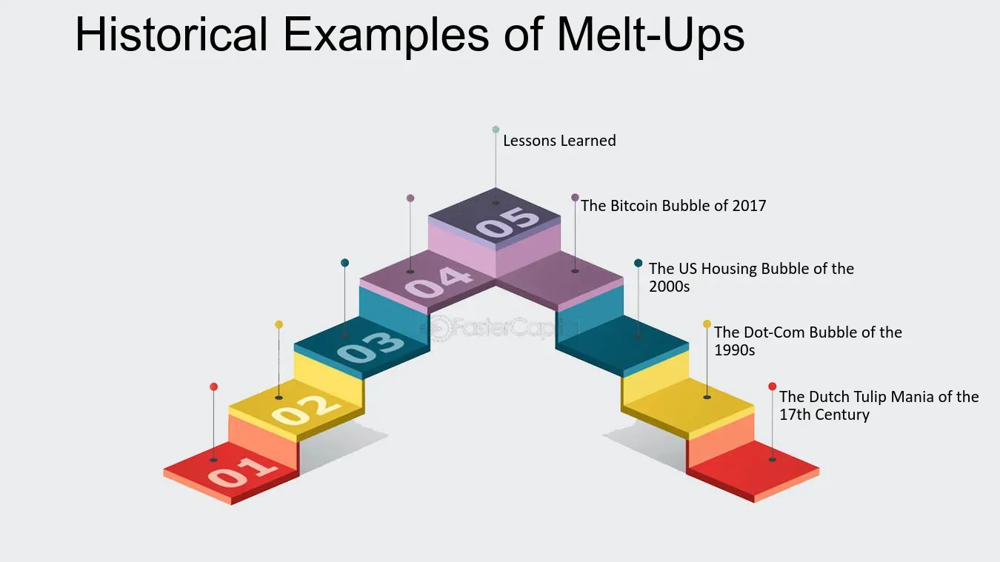

## Table of Contents

## What is a melt-up in financial markets?

A melt-up in financial markets is when the prices of stocks or other investments go up very quickly in a short time. It's like a sudden rush where everyone wants to buy, pushing the prices higher and higher. This often happens because people are excited and optimistic about the market, and they don't want to miss out on the gains. It can be driven by good news, like a strong economy or new technology, but sometimes it's just because people are following the crowd.

Melt-ups can be risky because they can lead to a bubble, where prices are much higher than what the investments are really worth. When the bubble bursts, prices can fall sharply, and people can lose a lot of money. It's important for investors to be careful during a melt-up and not get caught up in the excitement. They should think about whether the prices make sense and be ready for the possibility that the market could turn around quickly.

## What are the key characteristics of a melt-up?

A melt-up is when the prices of stocks or other investments go up really fast in a short time. It happens because a lot of people suddenly want to buy, which pushes the prices higher and higher. This often starts because people feel excited and hopeful about the market. They might hear good news about the economy or a new technology, and they don't want to miss out on making money. So, they jump in and start buying, which makes others want to buy too.

This rush to buy can lead to a bubble, where the prices of investments are much higher than they should be. When everyone is buying and the prices keep going up, it can feel like the good times will never end. But, a melt-up can be dangerous because it might not last. If too many people start to think the prices are too high, they might start selling, and the prices can fall quickly. This is why it's important for people to be careful during a melt-up and think about whether the prices make sense before they buy.

## How does a melt-up differ from a bubble?

A melt-up and a bubble are related but different things in the world of investing. A melt-up is when the prices of stocks or other investments go up very quickly in a short time. It happens because a lot of people suddenly want to buy, which pushes the prices higher and higher. People might feel excited and hopeful about the market, maybe because of good news about the economy or a new technology. They don't want to miss out on making money, so they jump in and start buying. This rush to buy can make others want to buy too, leading to a rapid increase in prices.

A bubble, on the other hand, is what can happen after a melt-up. It's when the prices of investments become much higher than what they're really worth. The excitement from the melt-up can lead to a bubble because everyone keeps buying, thinking the prices will just keep going up. But, a bubble is risky because it can burst. If too many people start to think the prices are too high, they might start selling, and the prices can fall quickly. So, a melt-up is the fast rise in prices, and a bubble is when those prices get too high and could lead to a big drop.

## What psychological factors contribute to a melt-up?

A melt-up happens because of how people feel and think. When people see prices going up fast, they can get really excited and hopeful. They don't want to miss out on making money, so they start buying too. This is called the fear of missing out, or FOMO. People see others making money and they want to join in, even if they're not sure if the prices make sense. This excitement can spread quickly, making more and more people want to buy.

Another psychological [factor](/wiki/factor-investing) is herd behavior. This is when people do what everyone else is doing, without thinking too much about it. If everyone is buying and the prices keep going up, people might think it's safe to buy too. They believe that if so many others are doing it, it must be a good idea. This can lead to a rush to buy, pushing prices even higher. But, this herd behavior can be risky because it can lead to a bubble, where prices get too high and could fall quickly.

## What economic conditions typically precede a melt-up?

A melt-up often happens when the economy is doing really well. People feel good about their jobs and money, so they're more willing to take risks and invest in the stock market. There might be good news about the economy, like low unemployment or strong company profits. Sometimes, new technologies or industries can make people excited and hopeful about the future, making them want to buy stocks.

Another condition that can lead to a melt-up is when interest rates are low. When borrowing money is cheap, people and companies can borrow more to invest in the stock market. This extra money can push prices up quickly. Also, if inflation is low and stable, people might feel more confident about investing because they think their money will keep its value. All these conditions together can create a rush to buy stocks, leading to a melt-up.

## Can government policies influence the occurrence of a melt-up?

Yes, government policies can influence whether a melt-up happens. When the government makes rules or takes actions that make people feel good about the economy, it can lead to a melt-up. For example, if the government cuts taxes, people might have more money to spend and invest. If the government spends a lot on things like building roads or helping businesses, it can make the economy grow faster. These actions can make people feel more confident and excited about investing in the stock market, which can push prices up quickly.

Also, the government can affect interest rates through its central bank. If the central bank decides to keep interest rates low, borrowing money becomes cheaper. This means people and companies might borrow more to invest in stocks, which can help start a melt-up. On the other hand, if the government raises interest rates or puts in strict rules to control the economy, it might slow down the excitement and prevent a melt-up from happening. So, what the government does can play a big role in whether a melt-up happens or not.

## What are the common indicators that a melt-up might be starting?

When a melt-up might be starting, you can see a few common signs. One big sign is that stock prices start going up really fast. This happens because a lot of people suddenly want to buy, and they keep pushing the prices higher and higher. Another sign is that people seem really excited and hopeful about the market. They might be talking about good news, like the economy doing well or new technologies that make them think the future will be great. This excitement can spread quickly, making more people want to buy stocks.

Another indicator is when you see a lot of people following the crowd, not thinking too much about it. This is called herd behavior. If everyone is buying and the prices keep going up, more people might think it's safe to buy too. They believe that if so many others are doing it, it must be a good idea. Also, if interest rates are low, it's easier for people to borrow money to invest, which can help start a melt-up. All these signs together can show that a melt-up might be starting.

## How do investors typically behave during a melt-up?

During a melt-up, investors often get very excited and hopeful about the market. They see stock prices going up quickly and they don't want to miss out on making money. This feeling is called the fear of missing out, or FOMO. So, they start buying stocks too, even if they're not sure if the prices make sense. They might hear good news about the economy or new technologies, and this makes them feel confident that the prices will keep going up. This excitement can spread fast, making more and more people want to buy.

Investors also tend to follow what everyone else is doing, which is called herd behavior. If they see others making money by buying stocks, they think it must be a good idea for them too. They might not think too much about it; they just want to join the rush. This behavior can push prices even higher because so many people are buying at the same time. But, it can be risky because if everyone is buying without thinking, it might lead to a bubble where prices get too high and could fall quickly.

## What are some historical examples of melt-ups in the stock market?

One famous example of a melt-up happened in the late 1990s, during the dot-com bubble. People got really excited about the internet and new technology companies. They thought these companies would make a lot of money in the future, so they started buying their stocks. The prices of these stocks went up very fast because so many people wanted to buy them. This excitement led to a melt-up, where stock prices kept going higher and higher. But, when people realized that many of these companies were not making money, the bubble burst, and the stock prices fell sharply.

Another example of a melt-up was in the years leading up to the 2008 financial crisis. In the mid-2000s, the housing market was doing really well, and people thought it would keep going up. This made them feel confident about investing in things related to housing, like mortgage-backed securities. The prices of these investments went up quickly because everyone wanted to buy them. This rush to buy led to a melt-up. But, when the housing market crashed, it caused a big drop in the prices of these investments, leading to the financial crisis.

## What are the potential risks associated with investing during a melt-up?

Investing during a melt-up can be risky because prices can go up so fast that they become much higher than what the investments are really worth. This can lead to a bubble, where everyone is buying because they think the prices will keep going up. But, if too many people start to think the prices are too high, they might start selling, and the prices can fall quickly. This sudden drop can make investors lose a lot of money, especially if they bought at the highest prices during the melt-up.

Another risk is that people might get caught up in the excitement and not think carefully about their investments. They might buy stocks just because everyone else is buying them, without checking if the prices make sense. This is called herd behavior, and it can lead to bad decisions. If the market turns around and the prices start to fall, these investors could be left with investments that are worth much less than what they paid for them. So, it's important for investors to stay calm and think about the real value of their investments, even during a melt-up.

## How can investors protect themselves from the downsides of a melt-up?

To protect themselves from the downsides of a melt-up, investors should stay calm and not get too excited about the fast-rising prices. They need to think carefully about the real value of the investments they're buying. Instead of following the crowd, they should do their own research and make sure the prices make sense. It's also a good idea to have a plan for what to do if the market turns around and prices start to fall. This might mean setting a price at which they will sell their investments to avoid big losses.

Another way to protect themselves is by not putting all their money into one type of investment. If they spread their money across different kinds of investments, like stocks, bonds, and maybe even some cash, they can lower their risk. This way, if the stock market has a big drop after a melt-up, they won't lose all their money. It's also important for investors to be ready to change their plans if the market changes. By staying flexible and not getting too caught up in the excitement, they can better handle the ups and downs of a melt-up.

## What strategies can be employed to capitalize on a melt-up?

To make the most of a melt-up, investors can start by buying stocks that are going up fast. They should look for companies that are doing well and have good news about them. When everyone is excited and buying, these stocks can keep going up. But, it's important to be quick. Since prices can go up very fast during a melt-up, investors need to buy before the prices get too high. They should also keep an eye on the market and be ready to sell if they think the prices are about to drop.

Another way to take advantage of a melt-up is by using a strategy called [momentum](/wiki/momentum) investing. This means buying stocks that have been going up and selling them when they start to go down. Investors can watch for stocks that are moving a lot and follow the trend. But, they need to be careful and not hold onto the stocks for too long. If the melt-up turns into a bubble and bursts, the prices can fall quickly. So, having a plan to sell at the right time is key to making money during a melt-up.

## References & Further Reading

[1]: Shiller, R. J. (2000). ["Irrational Exuberance"](https://www.amazon.com/Irrational-Exuberance-Robert-J-Shiller/dp/0767923634). Princeton University Press.

[2]: Malkiel, B. G. (1999). ["A Random Walk Down Wall Street"](https://en.wikipedia.org/wiki/A_Random_Walk_Down_Wall_Street). W.W. Norton & Company.

[3]: Lewis, M. (2014). ["Flash Boys: A Wall Street Revolt"](https://en.wikipedia.org/wiki/Flash_Boys). W.W. Norton & Company.

[4]: Aldridge, I. (2013). ["High-Frequency Trading: A Practical Guide to Algorithmic Strategies and Trading Systems"](https://www.amazon.com/High-Frequency-Trading-Practical-Algorithmic-Strategies/dp/1118343506). Wiley.

[5]: Lasse, H. P. (1999). ["The Dot-Com Bubble Inflation: The Rise and Fall of Internet Stocks Purchase through Security Analysis"](https://www.iosrjournals.org/iosr-jhss/papers/Vol.28-Issue8/Ser-5/B2808050407.pdf). Journal of Applied Corporate Finance.

[6]: Bernanke, B. S. (2002). ["Asset Price 'Bubbles' and Monetary Policy."](https://www.federalreserve.gov/boarddocs/speeches/2002/20021015/default.htm) Federal Reserve Board.

[7]: Menkveld, A. J. (2013). ["High Frequency Trading and the New-Market Makers."](https://www.sciencedirect.com/science/article/pii/S1386418113000281) Journal of Economic Perspectives, 27(2), 35-60.