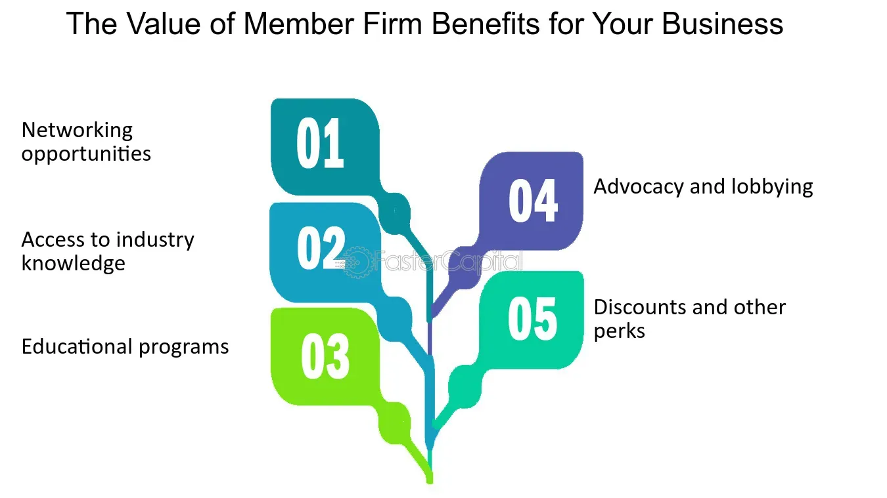

## Table of Contents

## What is a member firm in business?

A member firm in business is a company that is part of a larger network or association of firms. These networks often share resources, branding, and sometimes profits, but each member firm operates independently. For example, in accounting or law, member firms might belong to an international organization that allows them to collaborate and offer services globally while maintaining their own local operations.

Being a member firm can provide several benefits. It allows smaller firms to gain credibility and access to a larger client base through the network's established reputation. Additionally, member firms can share knowledge, technology, and best practices, which can help them improve their services and compete more effectively in the market. However, member firms must also adhere to the standards and policies set by the network, which can sometimes limit their flexibility.

## How does a member firm differ from an independent firm?

A member firm is part of a bigger group or network of companies. This means it works with other firms in the network to share things like a brand name, resources, and sometimes even profits. But, each member firm still runs its own business and makes its own decisions. Being in a network can help a member firm seem more trustworthy and reach more customers because of the network's good reputation. They can also learn from each other and use shared tools to do their jobs better.

An independent firm, on the other hand, does not belong to any network. It stands alone and handles everything by itself. This means it keeps all its profits and makes all its own decisions without having to follow rules set by a network. But, being independent can make it harder for the firm to be seen as trustworthy by new customers, and it might not have access to the same resources or knowledge that a member firm in a network would have. So, while an independent firm has more freedom, it might face more challenges in growing its business.

## What are the benefits of joining a member firm network?

Joining a member firm network can help a business grow and become more successful. When a firm becomes part of a network, it can use the network's good reputation to seem more trustworthy to new customers. This can help the firm get more clients and expand its business. Also, being in a network means the firm can share resources like technology and knowledge with other firms in the network. This can help the firm do its job better and offer better services to its clients.

Another big benefit of joining a member firm network is the support and collaboration it offers. Firms in a network can work together on big projects or share ideas and best practices. This teamwork can lead to new opportunities and help the firm solve problems more easily. Plus, being part of a network can give a firm access to a larger client base, which can lead to more business and more profits. Overall, joining a member firm network can provide a lot of advantages that can help a firm grow and succeed.

## What are the common types of member firm networks?

There are several common types of member firm networks. One type is the professional services network, which includes firms like accounting, law, and consulting companies. These networks help firms share resources and work together to offer services around the world. Another type is the franchise network, where businesses operate under the same brand name and follow similar business models. This helps them keep a consistent look and feel for customers, no matter where they are.

Another common type of member firm network is the cooperative network. In this type, member firms work together to buy things in bulk or share costs, which can save them money. This is often seen in industries like agriculture or retail. Lastly, there are industry-specific networks, where firms in the same field, like technology or healthcare, come together to share knowledge and support each other. These networks help firms stay up-to-date with the latest trends and technologies in their industry.

## How can a business become a member firm?

To become a member firm, a business first needs to find a network that fits its industry and goals. There are many networks out there, like those for accounting, law, or even specific industries like technology. The business should research these networks to see which one offers the best benefits and matches what they need. Once they find a good match, they can reach out to the network to learn about the membership process. This often involves filling out an application and providing information about the business, like its size, services, and financial health.

After submitting the application, the network will review it to see if the business meets their standards. This might take some time, and the network might ask for more information or even visit the business to check things out. If everything looks good, the business will be accepted as a member firm. Once accepted, the business will need to follow the network's rules and pay any membership fees. Being a member firm can help the business grow by sharing resources and working with other firms in the network.

## What are the typical requirements for joining a member firm network?

To join a member firm network, a business usually needs to meet certain standards set by the network. These can include things like having a good reputation, being financially stable, and offering services that match what the network is all about. The business will need to fill out an application form and provide details about its operations, like how big it is, what services it offers, and how well it's doing financially. The network will look at this information to make sure the business fits in with their goals and values.

After the application is submitted, the network might do more checks, like visiting the business or asking for more information. This is to make sure the business really meets all the requirements. If everything checks out, the business will be accepted as a member firm. Once accepted, the business will have to follow the network's rules and pay any membership fees. This can help the business grow by working with other firms in the network and using shared resources.

## What role does a member firm play within its network?

A member firm in a network works with other firms to help everyone do better. They share things like a brand name, tools, and ideas. This helps the member firm seem more trustworthy to new customers and reach more people. By being part of the network, the member firm can also work on big projects with other firms and learn new ways to do things better.

Being a member firm also means following the rules set by the network. They have to pay membership fees and meet the network's standards. But in return, they get to use the network's resources and work with other firms to grow their business. This teamwork can lead to more business and more profits for the member firm.

## How do member firms collaborate and share resources?

Member firms work together by sharing things like a brand name, technology, and knowledge. For example, if a member firm in one country needs help with a project, it can ask other firms in the network for advice or support. They might use the same computer systems or share information about how to do things better. This helps all the firms in the network to offer better services to their clients.

They also work on big projects together. If a client needs help in different countries, member firms can team up to provide services everywhere the client needs them. By working together, they can do things they might not be able to do alone. This teamwork can lead to more business and more profits for all the member firms in the network.

## What are the challenges faced by member firms in a network?

Being a member firm in a network can be hard sometimes. One challenge is that member firms have to follow the rules set by the network. This can limit what they can do on their own and make them feel less free to make their own choices. They also have to pay membership fees, which can be a lot of money, especially for smaller firms. This can make it tough for them to keep up with the costs.

Another challenge is working with other firms in the network. Sometimes, it can be hard to agree on things or share resources fairly. There might be disagreements about how to do things or who should get to use certain tools. This can cause tension and make it harder for member firms to work together smoothly. But, if they can overcome these challenges, being part of a network can help them grow and succeed.

## How does being part of a member firm network affect a company's branding and identity?

Being part of a member firm network can change how a company looks to its customers. When a company joins a network, it often uses the network's brand name along with its own. This can make the company seem more trustworthy because the network's good reputation rubs off on it. Customers might feel more comfortable doing business with the company because they know it's part of a bigger, well-known group. But, this can also mean the company has less control over its own brand. It has to follow the network's rules about how to present itself, which might not fit perfectly with what the company wants its own brand to be.

Even though being in a network can help a company's brand, it can also be hard to keep its own identity. The company might feel like it's losing some of what makes it special because it has to fit in with the network's overall look and feel. This can be tough, especially if the company has built a strong identity on its own. But, if the company can find a good balance, it can use the network's brand to its advantage while still keeping what makes it unique. This way, it can grow its business and reach more customers without losing its own identity completely.

## What advanced strategies can member firms use to maximize the benefits of their network?

Member firms can use advanced strategies to get the most out of being in a network. One way is to share knowledge and technology a lot. They can set up regular meetings where firms talk about what they've learned and how they've solved problems. This can help everyone do their jobs better. They can also use the network's technology to work together on big projects. By doing this, they can offer services that they couldn't do alone, which can bring in more business and make more money.

Another strategy is to work together on marketing and sales. Member firms can use the network's brand to reach more customers. They can create joint marketing plans and share leads with each other. This can help them get new clients and grow their business faster. It's also important for member firms to keep a good relationship with the network. They should follow the rules and pay fees on time. This helps them stay in good standing and get the most out of the network's resources and support.

## How do regulatory and compliance issues impact member firms within a network?

Regulatory and compliance issues can make things harder for member firms in a network. When a firm joins a network, it has to follow not just its own country's rules, but also the rules set by the network. These rules can be different in each country where the network operates. This means the firm might need to spend more time and money to make sure it's doing everything right. If the firm doesn't follow these rules, it could get in trouble with the law or be kicked out of the network.

Even though it can be tough, following these rules can also help member firms. It can make them seem more trustworthy to clients because they know the firm is part of a network that takes compliance seriously. This can help the firm get more business. But, it's important for the firm to keep up with changes in the rules and make sure everyone in the firm knows what they need to do to stay compliant. This way, they can avoid problems and use the network's good reputation to their advantage.

## References & Further Reading

[1]: Bergstra, J., Bardenet, R., Bengio, Y., & Kégl, B. (2011). ["Algorithms for Hyper-Parameter Optimization."](https://dl.acm.org/doi/10.5555/2986459.2986743) Advances in Neural Information Processing Systems 24.

[2]: ["Advances in Financial Machine Learning"](https://www.amazon.com/Advances-Financial-Machine-Learning-Marcos/dp/1119482089) by Marcos Lopez de Prado

[3]: ["Evidence-Based Technical Analysis: Applying the Scientific Method and Statistical Inference to Trading Signals"](https://www.amazon.com/Evidence-Based-Technical-Analysis-Scientific-Statistical/dp/0470008741) by David Aronson

[4]: ["Machine Learning for Algorithmic Trading"](https://github.com/stefan-jansen/machine-learning-for-trading) by Stefan Jansen

[5]: ["Quantitative Trading: How to Build Your Own Algorithmic Trading Business"](https://www.amazon.com/Quantitative-Trading-Build-Algorithmic-Business/dp/1119800064) by Ernest P. Chan