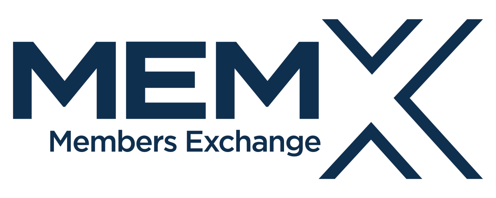

## Table of Contents

## What is Members Exchange (MEMX)?

Members Exchange, or MEMX, is a stock exchange that was created by a group of big banks and trading firms. They wanted to make trading cheaper and faster for everyone. MEMX started working in 2020. It helps people buy and sell stocks more easily and at a lower cost than some other exchanges.

MEMX is different because it focuses on being fair and clear to everyone who uses it. It tries to make sure that all trades happen quickly and at the best possible price. This is good for both the people who own the stocks and the people who want to buy them. By doing this, MEMX hopes to make the whole stock market work better for everyone.

## Who founded MEMX and when was it established?

MEMX, which stands for Members Exchange, was founded by a group of big banks and trading firms. Some of the founders include companies like Charles Schwab, Citadel Securities, and Morgan Stanley. They came together because they wanted to make stock trading cheaper and easier for everyone.

MEMX was established in 2020. The goal was to create a stock exchange that is fair and clear to all users. By making trading faster and less expensive, MEMX helps both people who own stocks and those who want to buy them, making the overall stock market better for everyone.

## What are the main goals of MEMX?

The main goal of MEMX is to make stock trading cheaper and easier for everyone. They want to lower the costs that people have to pay when they buy or sell stocks. By doing this, more people can trade stocks without spending too much money. This helps both people who own stocks and those who want to buy them.

Another important goal of MEMX is to make trading fair and clear. They want to make sure that all trades happen quickly and at the best possible price. This means that everyone who uses MEMX can trust that they are getting a good deal. By focusing on fairness and clarity, MEMX hopes to make the whole stock market work better for everyone.

## How does MEMX differ from traditional stock exchanges?

MEMX, or Members Exchange, is different from traditional stock exchanges because it was created by a group of big banks and trading firms who wanted to make trading cheaper and easier. Traditional exchanges often have high fees and complex systems that can make trading expensive and hard to understand. MEMX, on the other hand, focuses on keeping costs low so that more people can trade without spending a lot of money.

Another way MEMX differs is by aiming to make trading fair and clear. Traditional exchanges might have rules and systems that are hard to understand, which can make some people feel left out. MEMX works to make sure that all trades happen quickly and at the best possible price, so everyone knows they are getting a good deal. By being more open and straightforward, MEMX helps to build trust and make the stock market better for everyone.

## What types of securities can be traded on MEMX?

MEMX, or Members Exchange, lets people trade different types of securities. The main ones are stocks, which are shares in companies that people can buy and sell. When you own a stock, you own a little piece of that company. MEMX makes it easy and cheap to trade these stocks, so more people can do it.

Besides stocks, MEMX also lets people trade exchange-traded funds, or ETFs. ETFs are like baskets of different investments, like stocks or bonds, all put together. They are traded on the exchange just like stocks. By offering both stocks and ETFs, MEMX gives people more choices for what they can buy and sell, making it a helpful place for trading.

## How does the fee structure of MEMX work?

MEMX keeps its fees simple and low to make trading easier for everyone. When you trade stocks or ETFs on MEMX, you pay a small fee. This fee is less than what you might pay on other exchanges. The idea is to save money for people who are buying and selling, so more people can trade without worrying about high costs.

The fee structure is clear and easy to understand. MEMX charges a fee to the people who buy and sell stocks, but it's a lot smaller than what you'd find on some traditional exchanges. By keeping fees low and simple, MEMX helps make the stock market more fair and open to everyone who wants to trade.

## What are the technological advantages of using MEMX?

MEMX uses new technology to make trading faster and easier. They have a special computer system that can handle lots of trades very quickly. This means that when you want to buy or sell a stock, it happens almost right away. This fast trading helps everyone get the best price for their stocks because there's less waiting around.

Another good thing about MEMX's technology is that it's reliable. They have backup systems to make sure that trading keeps going even if something goes wrong. This means you can trust that your trades will go through without problems. By using these new technologies, MEMX makes the stock market work better for everyone who uses it.

## How does MEMX ensure market transparency and fairness?

MEMX works hard to make sure that trading is fair and clear for everyone. They do this by making sure all trades happen at the best possible price. This means that when you buy or sell a stock, you know you're getting a good deal. MEMX also makes sure that everyone can see what's happening in the market. They show all the trades and prices openly, so no one feels left out or tricked.

Another way MEMX keeps things fair is by treating everyone the same. They don't give special treatment to big banks or big traders. Everyone gets the same chance to buy and sell stocks at the same prices. By being open and fair, MEMX helps build trust in the stock market. This makes it a better place for everyone to trade.

## What role does MEMX play in market competition?

MEMX helps make the stock market more competitive by giving people another place to trade stocks. Before MEMX, there were only a few big exchanges where people could buy and sell stocks. These exchanges sometimes had high fees and complicated rules. MEMX came along and offered lower fees and simpler ways to trade. This makes it easier for more people to trade without spending a lot of money.

By being another choice for traders, MEMX pushes other exchanges to be better. When there's more competition, other exchanges might lower their fees or make their systems easier to use. This is good for everyone who trades stocks because it means they can find the best place to buy and sell at the best price. MEMX helps keep the market fair and open, so everyone has a good chance to trade.

## How can investors and traders access MEMX?

Investors and traders can access MEMX through their regular brokers. If your broker is connected to MEMX, you can buy and sell stocks and ETFs on this exchange just like you would on any other. Many big brokers, like Charles Schwab and Fidelity, are already connected to MEMX, so if you use one of these, you're all set to start trading.

To start trading on MEMX, you don't need to do anything special. Just use your broker's trading platform as you normally would. When you place an order, your broker will send it to MEMX if it's the best place to get the price you want. This makes it easy for you to take advantage of MEMX's low fees and fast trading without changing how you usually trade.

## What impact has MEMX had on the overall market since its inception?

Since MEMX started in 2020, it has made a big difference in the stock market. It has brought more competition to the big exchanges. Before MEMX, there were only a few places where people could trade stocks, and these places sometimes charged a lot of money. MEMX came along and offered lower fees, which made trading cheaper for everyone. This has pushed other exchanges to lower their fees too, making the whole market more affordable for people who want to buy and sell stocks.

MEMX has also made trading faster and more fair. Its new technology helps trades happen quickly, so people can get the best prices for their stocks. Plus, MEMX works hard to make sure everyone gets treated the same way, no matter how big or small they are. This has helped build trust in the market. More people feel comfortable trading because they know they have a good chance of getting a fair deal. Overall, MEMX has made the stock market better for everyone by making it cheaper, faster, and fairer.

## What are the future plans or expansions for MEMX?

MEMX wants to keep making the stock market better for everyone. They plan to add more types of securities that people can trade. Right now, you can trade stocks and ETFs on MEMX, but they might start letting people trade things like options and bonds too. This would give people more choices and make MEMX an even more useful place to trade.

Another big plan for MEMX is to grow in other countries. They want to help people all over the world trade stocks more easily and cheaply. By setting up in new places, MEMX can bring their low fees and fast trading to more people. This would make the global stock market fairer and more open to everyone, no matter where they live.

## References & Further Reading

[1]: Bergstra, J., Bardenet, R., Bengio, Y., & Kégl, B. (2011). ["Algorithms for Hyper-Parameter Optimization."](https://dl.acm.org/doi/10.5555/2986459.2986743) Advances in Neural Information Processing Systems 24.

[2]: ["Advances in Financial Machine Learning"](https://www.amazon.com/Advances-Financial-Machine-Learning-Marcos/dp/1119482089) by Marcos Lopez de Prado

[3]: ["Evidence-Based Technical Analysis: Applying the Scientific Method and Statistical Inference to Trading Signals"](https://www.amazon.com/Evidence-Based-Technical-Analysis-Scientific-Statistical/dp/0470008741) by David Aronson

[4]: ["Machine Learning for Algorithmic Trading"](https://github.com/stefan-jansen/machine-learning-for-trading) by Stefan Jansen

[5]: ["Quantitative Trading: How to Build Your Own Algorithmic Trading Business"](https://www.amazon.com/Quantitative-Trading-Build-Algorithmic-Business/dp/1119800064) by Ernest P. Chan