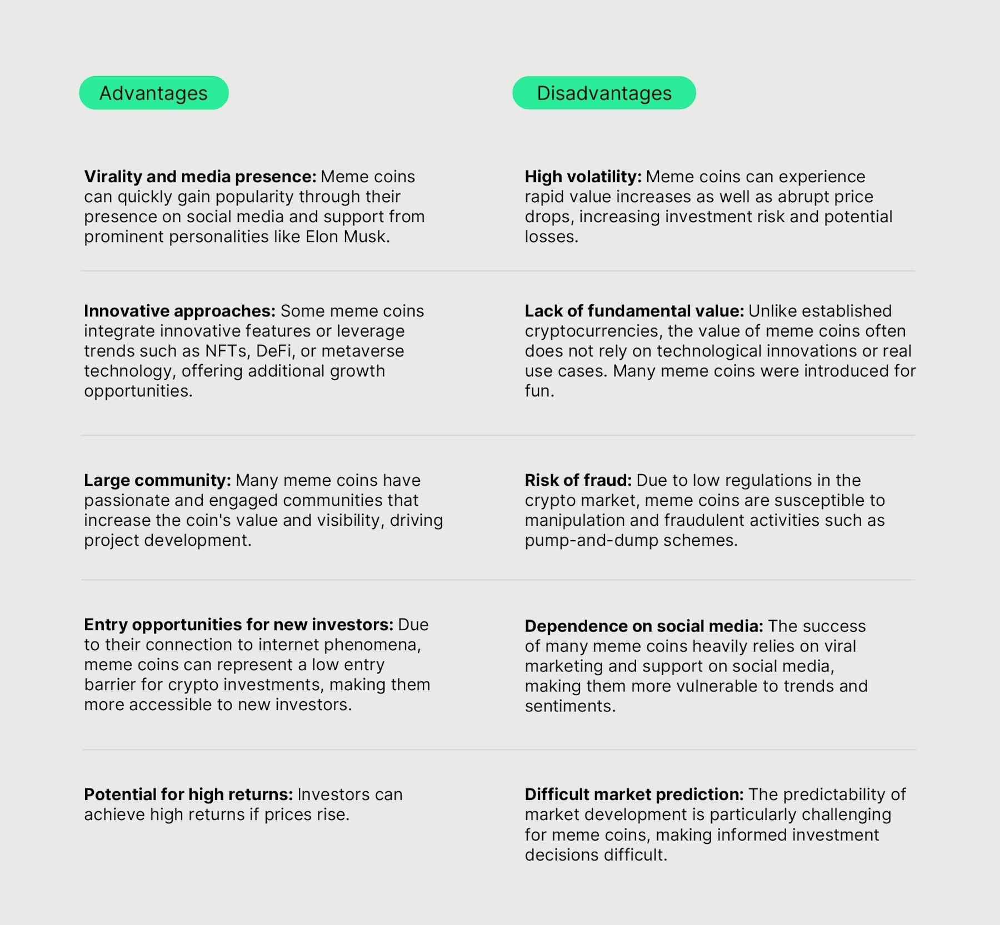

## Table of Contents

## What are meme coins?

Meme coins are a type of cryptocurrency that become popular because of internet memes and social media trends. They often start as jokes or fun ideas and don't have much real value or use. Dogecoin is a famous example of a meme coin. It was created based on a popular meme of a Shiba Inu dog and became well-known after getting support from celebrities and online communities.

Even though meme coins can be fun and exciting, they are very risky to invest in. Their prices can go up and down a lot because they depend on what people are talking about online. If the hype goes away, the value of the coin can drop quickly. It's important for people to be careful and understand that they might lose their money if they decide to buy meme coins.

## How did meme coins originate?

Meme coins started as a fun idea on the internet. The first big meme coin was Dogecoin, which was created in 2013 by two software engineers, Billy Markus and Jackson Palmer. They made Dogecoin as a joke, inspired by the "Doge" meme, which showed a Shiba Inu dog with funny captions. They didn't think it would become popular, but people on the internet loved it and started using it for tipping and small online transactions.

As social media grew, so did the popularity of meme coins. People shared them on platforms like Twitter and Reddit, and the coins became a way for communities to come together and have fun. Other meme coins like Shiba Inu and SafeMoon followed, each with their own stories and communities. These coins often don't have much real use or value, but they can become very popular very quickly because of online hype and celebrity endorsements.

## What are some popular examples of meme coins?

Dogecoin is probably the most famous meme coin. It started in 2013 as a joke based on the "Doge" meme of a Shiba Inu dog. People loved it and used it for small online tips and fun transactions. It got even more popular when celebrities like Elon Musk started talking about it on social media. Even though it began as a joke, Dogecoin became a big deal in the world of cryptocurrencies.

Shiba Inu is another popular meme coin. It was created in 2020 and is often called the "Dogecoin killer" because it's also based on a Shiba Inu dog. It got a lot of attention from online communities and even had its own special version called "Leash" and another called "Bone." People bought it hoping its value would go up, but like all meme coins, it's very risky.

SafeMoon is a newer meme coin that came out in 2021. It promises to reward people who hold onto it and charges a fee for selling it, which is supposed to make the price go up. It became popular on social media and got a lot of attention from people looking to make quick money. But, like other meme coins, its value can change a lot and it's very risky to invest in.

## What makes a cryptocurrency a meme coin?

A [cryptocurrency](/wiki/cryptocurrency) becomes a meme coin when it starts because of a funny internet meme or a trend on social media. These coins often don't have a real purpose or value, but they get popular because people think they're fun. For example, Dogecoin was made as a joke based on the "Doge" meme of a Shiba Inu dog. It became well-known because people on the internet liked it and shared it a lot.

Meme coins depend a lot on what people are talking about online. If a lot of people start talking about a meme coin and share it on places like Twitter or Reddit, its value can go up really fast. But if people stop talking about it, the value can drop just as quickly. That's why meme coins are very risky to invest in. They're more about the fun and excitement of the internet than about having real value or use.

## How do meme coins differ from traditional cryptocurrencies like Bitcoin?

Meme coins and traditional cryptocurrencies like Bitcoin are different in many ways. Bitcoin was made to be a serious kind of money that people could use without banks. It has a clear purpose and works on a special system called blockchain that keeps it safe and fair. Bitcoin's value comes from people believing it can be used as money and from the technology behind it. On the other hand, meme coins like Dogecoin were started as jokes or fun ideas. They don't have a real purpose or use, and their value comes from people talking about them on the internet and social media.

Another big difference is how their prices change. Bitcoin's price can go up and down, but it usually follows what's happening in the world and in the economy. People who invest in Bitcoin often do it because they believe in its future as a kind of money. Meme coins, however, can have their prices go up and down very quickly because of what people are saying online. If a meme coin gets a lot of attention on social media, its price can shoot up, but if the hype goes away, the price can drop just as fast. This makes meme coins much riskier to invest in than traditional cryptocurrencies like Bitcoin.

## What are the advantages of investing in meme coins?

One advantage of investing in meme coins is that they can make you a lot of money very quickly. Because meme coins are based on what people are talking about on the internet, their prices can go up really fast if they get a lot of attention. If you buy a meme coin at the right time and it becomes popular, you could see your money grow a lot in a short time. This is exciting for people who like to take risks and want to make quick profits.

Another advantage is that meme coins can be a lot of fun. They often start as jokes or fun ideas, so investing in them can feel like being part of a big online game or community. People who like to be part of internet trends and enjoy the excitement of social media might find meme coins interesting. It's a way to join in on the fun and feel connected to others who are also interested in these coins.

## What are the risks and disadvantages associated with meme coins?

Investing in meme coins can be very risky. Their prices can go up and down a lot because they depend on what people are talking about on the internet. If a meme coin gets a lot of attention on social media, its price might go up really fast. But if people stop talking about it, the price can drop just as quickly. This means you could lose a lot of money if you buy a meme coin and its hype goes away. Also, because meme coins often don't have much real value or use, they can be seen as more like gambling than investing.

Another disadvantage is that meme coins can be used by bad people to trick others. Some people might start a meme coin just to make money quickly and then disappear, leaving others with coins that are worthless. It's hard to know if a meme coin is a good investment or just a scam. This makes it important to be very careful and do a lot of research before deciding to buy a meme coin. Even then, there's no guarantee that you won't lose your money.

## How do meme coins impact the broader cryptocurrency market?

Meme coins can make the whole cryptocurrency market more exciting and bring in new people. When a meme coin gets a lot of attention on social media, it can make more people interested in cryptocurrencies in general. They might start buying other kinds of cryptocurrencies, not just meme coins. This can make the prices of all cryptocurrencies go up, even the serious ones like Bitcoin. So, meme coins can help grow the whole market by bringing in new people who are excited about the fun and quick profits that meme coins can offer.

But meme coins can also make the cryptocurrency market less stable and more risky. Because their prices can change a lot very quickly, they can make the whole market feel like a roller coaster. If a meme coin's price crashes, it can make people worried about all cryptocurrencies, and they might start selling their other coins too. This can lead to big drops in the prices of even the more serious cryptocurrencies. So, while meme coins can bring excitement and new people to the market, they can also make it more unpredictable and risky for everyone.

## What role does social media play in the popularity of meme coins?

Social media is really important for making meme coins popular. Meme coins often start as jokes or fun ideas that people share on places like Twitter, Reddit, and TikTok. If a meme coin gets a lot of attention and people start talking about it a lot, its price can go up really fast. Celebrities and influencers can also help make a meme coin more popular by talking about it on their social media accounts. This can make a lot of people want to buy the coin, hoping to make quick money.

But social media can also make meme coins risky. If people stop talking about a meme coin, its price can drop just as quickly as it went up. The hype on social media can be here one day and gone the next, which makes meme coins very unpredictable. Also, bad people can use social media to trick others into buying meme coins that are really just scams. So, while social media can make meme coins exciting and popular, it can also make them very risky and unstable.

## How can one evaluate the potential of a meme coin before investing?

When thinking about investing in a meme coin, it's good to look at how much people are talking about it on social media. If a lot of people are sharing and talking about the coin, it might become more popular and its price could go up. But be careful, because the hype can go away fast. Also, see if any big celebrities or influencers are talking about the coin. Their support can make more people want to buy it, but it doesn't mean the coin is a good investment.

Another thing to think about is the team behind the meme coin. Try to find out who made it and if they seem like honest people. Some meme coins are just scams, so it's important to do some research. Look for any news or information about the coin and its creators. Even though meme coins can be fun and exciting, they are very risky. Always remember that you could lose your money, so only invest what you can afford to lose.

## What are some advanced trading strategies specific to meme coins?

One advanced trading strategy for meme coins is called "pump and dump." This is when a group of people work together to make a meme coin's price go up really fast by buying a lot of it at the same time. They then sell it quickly to make a profit before the price goes back down. This strategy can be risky because it depends on other people buying into the hype. If you're not careful, you could be the one left holding the coin when its price crashes.

Another strategy is called "HODLing," which means holding onto a meme coin for a long time, even if its price goes up and down a lot. People who HODL believe that the meme coin will become more popular and valuable in the future. This strategy needs a lot of patience and belief in the coin's long-term potential. But it's also risky because meme coins can lose all their value if the hype goes away.

A third strategy is "[scalping](/wiki/gamma-scalping)," where you buy and sell a meme coin very quickly to make small profits from small changes in its price. This needs you to watch the market closely and be ready to act fast. Scalping can be exciting but it's also very risky because meme coins can be very unpredictable. You need to be careful and ready to lose money if the market doesn't go the way you expect.

## How might regulatory changes affect the future of meme coins?

Regulatory changes could make it harder for meme coins to exist. Governments might make new rules to stop people from losing money on risky investments like meme coins. If these rules come, it might be harder for new meme coins to start, and some existing ones might have to stop. This could make meme coins less popular and exciting because people might be scared to invest in them if they think the government might step in.

But, regulatory changes could also make meme coins safer for people to invest in. If the government makes rules that protect investors, it might make meme coins more trustworthy. People might feel better about buying them if they know there are rules to stop scams and fraud. This could help meme coins last longer and become a more serious part of the cryptocurrency world.

## References & Further Reading

[1]: Nader, B. (2021). ["The Rise of Meme Coins: From Dogecoin to Shiba Inu."](https://www.forbes.com/advisor/in/investing/cryptocurrency/shiba-inu-price-prediction/) CoinDesk.

[2]: Hougan, M., & Lawant, A. (2021). ["Cryptoassets: The Guide to Bitcoin, Blockchain, and Cryptocurrency for Investment Professionals"](https://papers.ssrn.com/sol3/papers.cfm?abstract_id=3792541) CFA Institute Research Foundation.

[3]: Narayanan, A., Bonneau, J., Felten, E., Miller, A., & Goldfeder, S. (2016). ["Bitcoin and Cryptocurrency Technologies: A Comprehensive Introduction."](https://press.princeton.edu/books/hardcover/9780691171692/bitcoin-and-cryptocurrency-technologies) Princeton University Press.

[4]: de Prado, M. L. (2018). ["Advances in Financial Machine Learning"](https://www.amazon.com/Advances-Financial-Machine-Learning-Marcos/dp/1119482089) Wiley.

[5]: Shrimali, B. (2021). ["Algorithmic Trading in Cryptocurrencies"](https://www.sciencedirect.com/science/article/pii/S0957417423023084) Finextra.