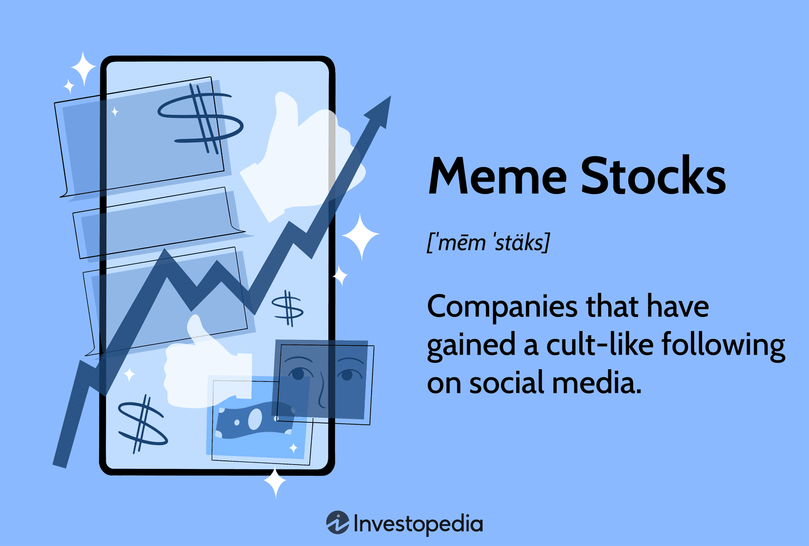

## Table of Contents

## What are meme stocks?

Meme stocks are stocks that become popular because of social media and online communities. People talk about these stocks a lot on the internet, especially on places like Reddit and Twitter. This talk can make the stock's price go up and down a lot, even if the company itself isn't doing anything special. 

These stocks often catch the attention of regular people who want to invest and make quick money. They are called "meme stocks" because they spread like memes, which are funny pictures or videos that go viral online. The most famous example is GameStop, where a group of people on Reddit decided to buy a lot of its stock, causing its price to skyrocket.

## How do meme stocks differ from traditional investments?

Meme stocks and traditional investments are different in a few big ways. Traditional investments are usually based on a company's actual value, like how much money it makes or how well it's doing in its industry. People who invest in traditional ways often look at these numbers and make careful choices based on them. They might buy stocks in big, stable companies that have been around for a long time and are expected to keep doing well.

On the other hand, meme stocks are driven by what people are saying and doing on the internet. Instead of looking at a company's financial health, people might buy meme stocks because they see others talking about them on social media. This can make the stock's price go up and down a lot, even if the company isn't doing anything different. Meme stocks are often riskier because their prices can change a lot based on what's popular online, not on the company's real value.

## What role do social media platforms play in the popularity of meme stocks?

Social media platforms are really important for making meme stocks popular. They help spread the word about these stocks quickly. People on social media can share posts, videos, and memes about certain stocks, making lots of other people interested in them. This can make more people want to buy the stock, which can push its price up. For example, if someone on Twitter or Reddit starts talking about a stock and it goes viral, more people might decide to invest in it just because it's getting a lot of attention.

The way social media works also means that the popularity of meme stocks can change fast. If a lot of people start talking about a stock, it can become a meme stock almost overnight. But if the talk dies down or turns negative, the stock's price can drop just as quickly. This makes meme stocks very unpredictable. Social media can create a kind of group excitement, where people feel like they're part of something big, and this can drive them to buy stocks without thinking too much about the risks.

## Can you explain the 'short squeeze' phenomenon related to meme stocks?

A 'short squeeze' happens when a lot of people have bet that a stock's price will go down. They do this by 'shorting' the stock, which means they borrow shares and sell them, hoping to buy them back later at a lower price to make a profit. But if the stock's price starts to go up instead, these people who shorted the stock start to lose money. If the price keeps going up, they might decide to buy the stock back to stop losing more money. This buying can push the stock's price up even more.

This is what happened with meme stocks like GameStop. A lot of people on social media, especially on Reddit, decided to buy the stock to make its price go up. They knew that many big investors had shorted GameStop's stock, betting that its price would fall. When the price started going up because of all the buying, these big investors had to buy back the stock to cut their losses. This buying made the price go up even more, creating a 'short squeeze'. It was like a big game of chicken, where the small investors on social media managed to make the big investors lose a lot of money.

## What are some examples of well-known meme stocks?

GameStop is probably the most famous meme stock. It's a company that sells video games. In early 2021, a lot of people on Reddit started talking about GameStop and decided to buy its stock. They wanted to make its price go up because they knew big investors were betting it would go down. This caused a huge short squeeze, where the stock's price went up a lot, and the big investors lost a lot of money. It showed how powerful social media can be in the stock market.

Another well-known meme stock is AMC Entertainment, which owns a lot of movie theaters. Like GameStop, AMC became popular on social media, and people started buying its stock to push the price up. This also led to a short squeeze. People on the internet were excited about making money and sticking it to the big investors. Both GameStop and AMC show how meme stocks can become very popular very quickly because of what people say and do online.

## What are the potential risks of investing in meme stocks?

Investing in meme stocks can be really risky. The main problem is that their prices can go up and down a lot, and it's hard to predict what will happen. This is because meme stocks are driven by what people say on social media, not by how well the company is doing. If a lot of people stop talking about a stock or start saying bad things about it, its price can drop quickly. This means you could lose a lot of money if you buy a meme stock and its price goes down.

Another risk is that you might get caught up in the excitement and make quick decisions without thinking about the risks. When you see a lot of people talking about a stock and its price going up, it's easy to want to jump in and buy some too. But this can lead to buying at a high price and then losing money if the price falls. It's important to remember that just because a stock is popular on the internet doesn't mean it's a good investment. Always think carefully before you invest in meme stocks.

## How can beginners start investing in meme stocks?

If you're new to investing and want to try meme stocks, the first thing you need to do is open a brokerage account. This is like a special bank account where you can buy and sell stocks. You can choose from many different brokers, like Robinhood, E*TRADE, or Charles Schwab. Once your account is set up, you'll need to add some money to it so you can start buying stocks. It's a good idea to only use money you can afford to lose, because meme stocks can be very risky.

After you have your account ready, you can start looking for meme stocks. These are often talked about a lot on social media, so you can check places like Reddit, Twitter, or even YouTube to see which stocks people are excited about. Once you find a stock you're interested in, you can buy it through your brokerage account. Remember, though, that meme stocks can go up and down a lot, so it's important to think carefully and not just follow the crowd. Always do some research on the company and understand that you might lose money if things don't go as planned.

## What strategies should investors use to manage risks when investing in meme stocks?

When you invest in meme stocks, it's really important to manage your risks carefully. One good strategy is to only use money you can afford to lose. Meme stocks can be very unpredictable because their prices can change a lot based on what people say online. If you only invest money you won't need for bills or other important things, you won't be in big trouble if you lose it. Another strategy is to not put all your money into just one meme stock. It's better to spread your money out over different stocks, so if one stock goes down, you won't lose everything.

It's also a good idea to set a plan for when to sell your stocks. Decide ahead of time at what price you'll sell to make a profit or cut your losses. This can help you avoid making quick decisions based on emotions. Also, keep an eye on what people are saying about the stock on social media, but don't just follow the crowd. Do your own research to understand the company behind the stock. By being careful and thinking things through, you can manage the risks of investing in meme stocks better.

## How do market regulations affect meme stocks?

Market regulations can have a big impact on meme stocks. These rules are made to keep the stock market fair and safe for everyone. For example, some regulations might limit how much a stock's price can go up or down in one day. This can affect meme stocks because they often see big price swings. Also, regulators might step in if they think people are doing things like spreading false information to make a stock's price go up or down. This can slow down the wild ride of meme stocks and protect people from getting tricked.

Another way regulations affect meme stocks is by making sure that everyone has the same information. The rules say that companies have to tell the public about important things that could affect their stock price. This helps stop people from using secret information to make money, which can be a problem with meme stocks. When regulators make sure everyone plays by the rules, it can make the market more stable and less risky for people who invest in meme stocks.

## What impact do meme stocks have on the broader financial market?

Meme stocks can shake things up in the broader financial market. When a lot of people start buying and selling meme stocks, it can make the whole market feel more unpredictable. Big investors might start to worry because they see these stocks moving a lot based on what people say online, not on how well the companies are doing. This can make other stocks go up and down more too, as people get nervous and start trading more. Sometimes, meme stocks can even make big investors lose a lot of money if they bet the wrong way on these stocks.

But meme stocks can also bring more people into the market. When regular people see others making money from meme stocks, they might want to start investing too. This can be good for the market because more people buying and selling stocks can make it more lively. But it can also be risky if a lot of new investors don't understand the dangers of meme stocks. Overall, meme stocks can make the market more exciting but also more unpredictable, and everyone needs to be careful.

## How can advanced investors analyze the volatility of meme stocks?

Advanced investors can analyze the [volatility](/wiki/volatility-trading-strategies) of meme stocks by looking at how much the stock's price changes over time. They can use tools like the stock's beta, which shows how much the stock moves compared to the whole market. A high beta means the stock is very volatile, which is common with meme stocks. They can also look at the stock's historical price data to see how much it has gone up and down in the past. This can give them an idea of what might happen in the future, although meme stocks can be hard to predict because they are so influenced by what people say online.

Another way advanced investors can analyze meme stock volatility is by using technical analysis. This means looking at charts and patterns to see if they can guess where the stock's price might go next. They might use things like moving averages, which smooth out price data over time, to see if the stock is trending up or down. They can also watch for big changes in trading [volume](/wiki/volume-trading-strategy), which can show when a lot of people are suddenly buying or selling the stock. By putting all this information together, advanced investors can get a better sense of how risky a meme stock might be and make smarter decisions about whether to buy or sell.

## What are the long-term investment prospects for meme stocks?

Meme stocks can be really exciting to invest in, but they might not be the best choice for long-term investing. These stocks often go up and down a lot because people on the internet talk about them a lot. This can make their prices change quickly, but it doesn't usually mean the company itself is doing better or worse. Over time, if the hype around a meme stock dies down, its price can drop a lot. This makes it hard to count on meme stocks to grow your money steadily over many years.

For long-term investors, it's usually better to look at a company's real value, like how much money it makes and how well it's doing in its industry. Meme stocks can be fun to play with if you want to try to make some quick money, but they are risky. If you're thinking about the future and want your investments to grow slowly but surely, you might want to stick with more traditional stocks that are based on solid company performance, not just what's popular online.

## References & Further Reading

[1]: Bergstra, J., Bardenet, R., Bengio, Y., & Kégl, B. (2011). ["Algorithms for Hyper-Parameter Optimization."](https://dl.acm.org/doi/10.5555/2986459.2986743) Advances in Neural Information Processing Systems 24. 

[2]: ["Advances in Financial Machine Learning"](https://www.amazon.com/Advances-Financial-Machine-Learning-Marcos/dp/1119482089) by Marcos Lopez de Prado

[3]: ["Evidence-Based Technical Analysis: Applying the Scientific Method and Statistical Inference to Trading Signals"](https://www.amazon.com/Evidence-Based-Technical-Analysis-Scientific-Statistical/dp/0470008741) by David Aronson

[4]: ["Machine Learning for Algorithmic Trading"](https://github.com/stefan-jansen/machine-learning-for-trading) by Stefan Jansen

[5]: ["Quantitative Trading: How to Build Your Own Algorithmic Trading Business"](https://www.amazon.com/Quantitative-Trading-Build-Algorithmic-Business/dp/1119800064) by Ernest P. Chan