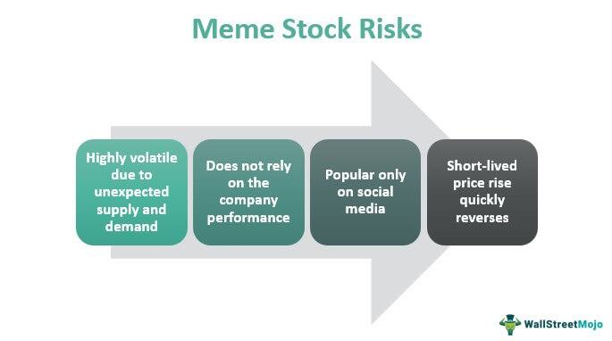

Understanding the financial markets has been a dynamic process influenced by an intricate mix of technological advancements and cultural shifts. Over time, stock market operations have been significantly transformed, particularly with the advent of digital technologies that have broadened access and understanding. Traditional investment strategies, which have long been the backbone of financial markets, are now intersecting with new trends, notably the rise of meme stocks and algorithmic trading.

The emergence of meme stocks marks a distinct shift driven largely by social media platforms and retail investor participation. Unlike conventional stocks, meme stocks gain rapid popularity primarily through online communities, leading to unexpected volatility in their market value. This phenomenon challenges traditional investment principles and prompts reevaluation of market behavior analyses which heavily relied on historical data and investor rationale.



Equally transformative is algorithmic trading, a technological breakthrough reshaping financial markets. Algorithms utilize vast amounts of data to execute trades at speeds and efficiencies far beyond human capability. This has not only increased market liquidity but also presented new challenges in terms of market stability and regulatory oversight.

This intersection between traditional and modern practices signifies a new frontier in the stock market landscape, affecting both seasoned investors and newcomers. How these elements blend affects investment stock market dynamics, presenting both challenges and opportunities for strategic investment decisions. 

Through this article, readers will gain insights into these evolving dynamics, understanding how traditional investment practices, meme stock phenomena, and algorithmic trading collectively influence modern investment strategies and market behaviors. This knowledge aims to prepare investors to make informed decisions in an ever-evolving financial environment.

## Table of Contents

## Traditional Investment and the Stock Market

Traditional investment in the stock market is founded on fundamental principles that have guided investors for decades, offering a framework through which individuals can engage the financial markets with a reasonable expectation of returns. Historically, the stock market has been a mechanism through which companies access capital and investors seek appreciation of wealth over time. Over the years, traditional investment strategies such as value investing, growth investing, and dividend investing have become cornerstones of investment portfolios, each with its own methodology and focus.

**Key Investment Strategies**

1. **Value Investing**: This strategy revolves around identifying and investing in stocks that are undervalued relative to their intrinsic value. Investors following this approach scrutinize financial statements and use valuation metrics such as the price-to-earnings (P/E) ratio, price-to-book (P/B) ratio, and dividend yield to identify stocks priced below their inherent worth. The expectation is that the market will eventually recognize the true value of these stocks, resulting in price appreciation. Pioneers like Benjamin Graham and Warren Buffett have popularized this method.

2. **Growth Investing**: Unlike value investing, growth investing focuses on companies expected to grow at an above-average rate compared to others. These companies often reinvest their earnings into expansion projects rather than paying dividends. Here, price-to-earnings growth (PEG) ratio is a crucial metric, helping investors assess whether a stock’s growth is reasonably priced. Though potentially riskier, growth stocks offer the possibility of substantial returns if a company meets expectations.

3. **Dividend Investing**: This strategy targets companies that pay regular dividends, providing investors with a steady income stream alongside potential capital gains. Favored by risk-averse investors, it emphasizes stability and long-term wealth creation. Metrics like dividend yield and payout ratio help assess a company’s ability to sustain its dividend payments.

**Market Analysis for Investment Decisions**

Investment decisions in traditional stock markets rely heavily on two types of analysis: fundamental and technical.

- **Fundamental Analysis**: This method involves evaluating a company's financial health, management quality, market position, and growth potential. It includes examining financial statements, earnings reports, industry conditions, and economic factors. The goal is to ascertain a stock's intrinsic value and compare it to its current market price to identify investment opportunities.

- **Technical Analysis**: This approach is based on the study of historical price movements and trading volumes to forecast future price dynamics. Technical analysts use charts and technical indicators, such as moving averages and Relative Strength Index (RSI), to identify patterns and make investment decisions. While it does not account for a company’s financial health, it helps investors capitalize on market trends and price actions.

**Stability and Reassurance for Long-term Investors**

Traditional investment practices provide stability and reassurance for long-term investors by focusing on fundamental strengths and financial metrics rather than short-term market noises. By leveraging well-established analytical tools and strategies, investors can build diversified portfolios that weather market [volatility](/wiki/volatility-trading-strategies), aiming for consistent returns over time. The principles of compounding and reinvestment further enhance the potential for wealth accumulation.

**Challenges in an Evolving Market Landscape**

Despite their advantages, traditional investors face challenges as the market evolves. The rapid digitalization of financial markets, proliferation of alternative assets, and influence of retail investors and social media introduce volatility and uncertainty. Such shifts can disrupt traditional price discovery mechanisms and challenge established valuation norms. Additionally, the integration of [artificial intelligence](/wiki/ai-artificial-intelligence) and big data analytics necessitates that traditional investors adapt their methods to incorporate new data sources and analytical tools. In this dynamic landscape, maintaining a balance between traditional wisdom and modern innovation becomes crucial to sustaining investment success. 

Overall, while fundamental investment principles remain a critical component of stock market dynamics, ongoing changes demand that traditional investors stay informed and flexible to integrate emerging tools and strategies in pursuit of their financial goals.

## The Rise of Meme Stocks

Meme stocks have emerged as a notable phenomenon in financial markets, characterized by rapid price increases and heightened volatility, primarily driven by social media activity and retail investor enthusiasm. These stocks are typically associated with companies that gain popularity through online platforms such as Reddit, Twitter, and TikTok, where users rally to drive investment based on viral memes and narratives, often detached from traditional financial metrics.

The genesis of meme stocks can be traced to early 2021, with GameStop (GME) serving as a seminal case study. A coordinated effort by retail investors on the subreddit "r/WallStreetBets" led to an unprecedented short squeeze, resulting in significant price surges and substantial losses for institutional short-sellers. This event not only highlighted the power of collective retail investing but also underscored vulnerabilities within established market structures.

Several factors contribute to the rise of meme stocks. Social media platforms act as amplifiers of sentiment, enabling rapid dissemination of investment ideas and creating a herd-like mentality among retail investors. These investors, often driven by narratives rather than fundamentals, participate extensively, motivated by the allure of quick gains and the democratization of trading facilitated by commission-free platforms like Robinhood.

While meme stocks present opportunities for substantial returns, they also come with considerable risks. The volatility associated with these stocks can lead to significant losses, especially for those unable to time their market entry and [exit](/wiki/exit-strategy) accurately. Moreover, the speculative nature and lack of adherence to traditional valuation metrics increase the potential for bubbles and sharp corrections.

The impact of meme stocks extends beyond individual investments, contributing to broader market turbulence. Their volatility challenges traditional risk management strategies and can lead to [liquidity](/wiki/liquidity-risk-premium) issues, margin calls, and increased market scrutiny from regulators.

In essence, meme stocks represent a paradigm shift in market dynamics, where cultural factors and community-driven [momentum](/wiki/momentum) disrupt conventional investment strategies. Their influence on market behavior underscores the need for investors to navigate these developments with caution, blending new strategies with traditional investment principles to manage risk effectively.

## Algorithmic Trading: A Technological Shift

Algorithmic trading refers to the use of computer algorithms to facilitate decision-making and trade execution in financial markets. It automates trading processes by executing orders based on pre-defined criteria, enabling rapid and precise operations without direct human intervention. This technology has revolutionized modern financial markets by expanding the capabilities of traders and investors, predominantly through increased speed, accuracy, and the ability to process vast amounts of data.

**Types of Algorithmic Trading Strategies**

Hedge funds and institutional investors primarily utilize several types of [algorithmic trading](/wiki/algorithmic-trading) strategies to enhance their trading efficacy. These strategies include:

1. **High-Frequency Trading (HFT):** Leveraging advanced technology to capitalize on minute price discrepancies, HFT involves executing a large number of orders at extremely high speeds. HFT typically seeks to exploit small bid-ask spreads and market inefficiencies.

2. **Market Making:** This strategy involves continuously quoting both buy and sell prices for a financial instrument, aiming to capture the spread over time. It provides liquidity to the market, potentially mitigating volatility.

3. **Statistical Arbitrage:** Utilizing mathematical models to identify and exploit pricing inefficiencies between related financial instruments, statistical arbitrage involves simultaneous buying and selling of assets to profit from their expected price convergence.

4. **Momentum Trading:** Algorithms detect strong trends in assets and execute trades in the direction of the trend. This strategy is based on the belief that prices tend to continue moving in their current trajectory.

5. **Mean Reversion:** This strategy assumes that asset prices will revert to their historical mean over time. Algorithms identify deviation from the mean and trade accordingly to capture profit once prices normalize.

**Data Utilization in Algorithmic Trading**

Algorithms leverage vast datasets to optimize trading outcomes and manage risk effectively. They employ statistical techniques, [machine learning](/wiki/machine-learning) models, and data mining to analyze historical data, chart patterns, and market signals. For instance, using time series analysis, algorithms can predict future price movements based on historical trends:

```python
import pandas as pd
import numpy as np
from statsmodels.tsa.arima.model import ARIMA

# Load the historical price data
data = pd.Series([...])

# Fit an ARIMA model
model = ARIMA(data, order=(5,1,0))
model_fit = model.fit()

# Make a forecast
forecast = model_fit.forecast(steps=5)
print(forecast)
```

This sample Python script demonstrates the use of an ARIMA model to forecast future price movements based on past data, a common technique in algo trading to anticipate trends and inform trading decisions.

**Advantages of Algorithmic Trading**

The primary advantages of algorithmic trading over traditional manual methods include:

- **Speed:** Algorithms can execute trades in milliseconds, significantly faster than human traders, which is critical in exploiting short-lived market opportunities.

- **Efficiency:** With the ability to process multiple indicators and signals in parallel, algorithmic systems make informed decisions swiftly, reducing transaction costs and slippage.

- **Consistency:** By eliminating human emotions from trading decisions, algorithms ensure disciplined adherence to strategy parameters, leading to more reliable trading outcomes.

**Ethical and Regulatory Challenges**

While algorithmic trading offers numerous benefits, it also poses ethical and regulatory challenges. The rapid execution of trades inherent to high-frequency trading can exacerbate market volatility, potentially leading to scenarios like the 2010 Flash Crash. Furthermore, the use of complex algorithms can obscure transparency, raising concerns regarding market fairness and integrity. Regulatory bodies, such as the U.S. Securities and Exchange Commission (SEC), emphasize the need for stringent oversight to mitigate risks related to market manipulation and systemic instability associated with algorithmic trading.

In summary, algorithmic trading represents a significant technological shift in the financial markets, offering enhanced speed, efficiency, and the capability to manage complex data-driven strategies. However, it also necessitates comprehensive regulatory frameworks to address the ethical implications and potential systemic risks arising from its widespread adoption.

## The Intersection of Meme Stocks and Algorithmic Trading

The integration of meme stocks into algorithmic trading represents a significant shift in the financial markets. Algorithmic trading systems, initially designed to execute trades based on pre-set rules and historical data, are now being adapted to account for the volatility and unpredictability often associated with meme stocks. These stocks, characterized by their rapid price movements influenced by social media trends, require algorithms to incorporate real-time data analysis and sentiment analysis from platforms like Twitter and Reddit. This adaptation is crucial as it allows algorithms to react quickly to sudden market changes driven by retail investors' sentiment.

Effective hybrid strategies have emerged by combining traditional investment principles with modern technological innovations. One approach is to integrate [fundamental analysis](/wiki/fundamental-analysis) with sentiment analysis algorithms, merging the classical evaluation of a stock's intrinsic value with the real-time pulse of the market gauged through social media activities. This blended strategy aims to provide a more comprehensive trading strategy that leverages both historical performance and current market sentiment.

Algorithmic trading's decision-making processes are increasingly impacted by the dynamics of meme stocks. Algorithms are now tasked to monitor social media platforms continuously, analyze patterns, and predict potential market movements. The volatility of meme stocks necessitates strategies that can assure liquidity and manage risk effectively, adapting to rapid changes without incurring significant losses. As a result, algorithms are becoming more complex, incorporating machine learning models that improve prediction capabilities and refine trading strategies.

Recent case studies highlight the capability of algorithmic trading systems to respond effectively to meme stock volatility. For instance, during the GameStop surge in early 2021, several hedge funds and trading platforms reported significant losses while others successfully mitigated risks by dynamically adjusting their trading algorithms to account for high volatility. These systems relied on real-time data ingestion and analysis, enabling them to buy or sell positions rapidly as the share price fluctuated, thus demonstrating the resilience and adaptiveness of modern trading algorithms.

Looking forward, the continuous rise of meme stocks and the expanding role of algorithmic trading propose a reshaping of the investment landscape. Future trends may see a greater emphasis on developing advanced predictive models that encompass a broader spectrum of data sources, including [alternative data](/wiki/best-alternative-data) like news articles, blogs, and even satellite imagery. Additionally, there could be a convergence of retail trading applications with algorithmic platforms, providing individual investors access to sophisticated tools traditionally reserved for institutional players. This democratization of technology could lead to more informed trading decisions and a more balanced market influenced by both institutional and retail traders.

In conclusion, the interplay between meme stocks and algorithmic trading is fostering new methods and strategies that reflect a more connected, data-driven approach to investing. This evolution suggests a future where market participants must be agile and well-informed, capable of leveraging technological tools to navigate an increasingly dynamic market landscape.

## Investment Strategies in the Era of Meme Stocks and Algo Trading

As the stock market evolves with the rise of meme stocks and algorithmic trading, investors are exploring new strategies to adapt traditional investment practices to this dynamic environment. Traditional investment strategies have long emphasized stability and long-term growth, predominantly through value investing, growth investing, and dividend investing. However, these strategies need to be reevaluated in light of the volatility induced by social media trends and high-frequency algorithmic trades.

Balancing risk and reward has become increasingly complex in a market where meme stocks can surge or plummet based on viral trends rather than underlying company fundamentals. Investors must exercise caution and remain vigilant to market signals that might signify speculative bubbles. Professional analysis using both quantitative and qualitative data to assess social sentiment and trading patterns can be instrumental in navigating this volatility.

Diversification and due diligence remain critical components of any robust investment portfolio. In the era of meme stocks and algorithmic trading, diversification is crucial to mitigate risks associated with the unpredictable nature of these stocks. A well-diversified portfolio that spans various sectors and asset classes can help buffer against the sudden movements of individual meme stocks. Due diligence, involving comprehensive research and analysis of the fundamental and technical aspects of potential investments, helps investors gain a thorough understanding of the risks involved.

Retail investors can leverage algorithmic tools to better inform their participation in the meme stock market. Many platforms provide access to advanced trading algorithms traditionally reserved for institutional investors. These tools can help analyze vast datasets, spot patterns, and execute trades at speeds far beyond human capability, thus optimizing trading outcomes. For example, traders might use Python to develop algorithms that identify trading signals based on real-time social media sentiment analysis:

```python
import requests
from vaderSentiment.vaderSentiment import SentimentIntensityAnalyzer

def get_social_sentiment(stock_ticker):
    # A hypothetical API call to fetch social media mentions related to the stock
    response = requests.get(f"https://api.socialmedia.com/{stock_ticker}")
    mentions = response.json()

    analyzer = SentimentIntensityAnalyzer()
    sentiment_score = sum(analyzer.polarity_scores(mention["text"])["compound"] for mention in mentions) / len(mentions)

    return sentiment_score

# Example usage
tsla_sentiment = get_social_sentiment("TSLA")
if tsla_sentiment > 0.5:
    print("Consider buying TSLA")
elif tsla_sentiment < -0.5:
    print("Consider selling TSLA")
```

Experts advise that investors remain adaptable and continuously update their strategies in response to the ever-changing landscape. Implementing automated stop-loss orders, keeping abreast of regulatory changes affecting algorithmic trading, and employing social media analytics are some of the tips suggested for navigating this era effectively. Additionally, maintaining a long-term perspective and not succumbing to the lure of quick, speculative gains can help protect against significant losses.

In conclusion, by merging traditional investment principles with modern innovations like algorithmic trading tools, investors can enhance their strategies to better configure the new challenges posed by meme stocks. This fusion underscores the importance of remaining vigilant, adaptable, and informed to capitalize on both the opportunities and manage threats inherent in this new financial era.

## Conclusion

The rapid evolution of the financial markets has transformed investment strategies, merging traditional approaches with novel concepts such as meme stocks and algorithmic trading. Throughout this discussion, key insights have emerged about how these distinct elements interplay to influence market behaviors and investment choices.

Traditional investment principles, grounded in strategies like value and growth investing, continue to offer a foundation of stability, especially for long-term investors. However, the introduction of meme stocks has challenged this status quo by injecting a new level of unpredictability and dynamic engagement influenced heavily by social media and retail investors. This shift has underscored the need for investors to remain agile and adaptive.

The advent of algorithmic trading has further revolutionized the landscape, bringing efficiency, speed, and data-driven decision-making to the forefront. While this technology offers significant advantages, it also raises ethical and regulatory concerns that must be addressed. The interaction between meme stock volatility and algorithmic systems has created a hybrid environment where traditional strategies must evolve to remain relevant.

As we look to the future, technological advancements and social dynamics are expected to continually reshape the stock market environment. Investors equipped with a robust understanding of both enduring and emergent market forces can make informed decisions, striking a balance between risk and opportunity. Successful integration of these diverse elements into a cohesive investment strategy will likely prove crucial in navigating the complexities of modern financial markets, ensuring adaptability and resilience amidst change.

## References & Further Reading

[1]: Bergstra, J., Bardenet, R., Bengio, Y., & Kégl, B. (2011). ["Algorithms for Hyper-Parameter Optimization."](https://dl.acm.org/doi/10.5555/2986459.2986743) Advances in Neural Information Processing Systems 24. 

[2]: ["Advances in Financial Machine Learning"](https://www.amazon.com/Advances-Financial-Machine-Learning-Marcos/dp/1119482089) by Marcos Lopez de Prado

[3]: ["Evidence-Based Technical Analysis: Applying the Scientific Method and Statistical Inference to Trading Signals"](https://www.amazon.com/Evidence-Based-Technical-Analysis-Scientific-Statistical/dp/0470008741) by David Aronson

[4]: ["Machine Learning for Algorithmic Trading"](https://github.com/stefan-jansen/machine-learning-for-trading) by Stefan Jansen

[5]: ["Quantitative Trading: How to Build Your Own Algorithmic Trading Business"](https://www.amazon.com/Quantitative-Trading-Build-Algorithmic-Business/dp/1119800064) by Ernest P. Chan