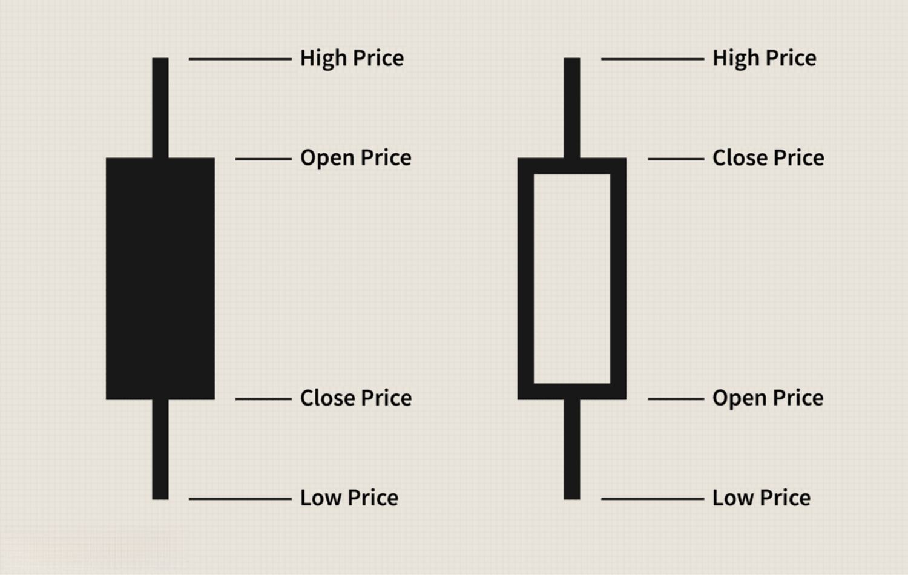

Memorial Day is a significant federal holiday in the United States, observed on the last Monday of May each year. This holiday commemorates the men and women who died while serving in the U.S. military, providing a moment of national reflection and gratitude. However, for traders and investors, Memorial Day carries additional implications that extend beyond its commemorative purpose. Understanding the trading schedule around Memorial Day is crucial, as it affects the operational dynamics of financial markets.

On this day of remembrance, all major U.S. stock exchanges, such as the New York Stock Exchange (NYSE) and NASDAQ, suspend operations, leading to a temporary halt in trading activities. This closure is particularly impactful for those engaged in algorithmic trading (also known as algo trading), where automated systems execute trades based on pre-programmed strategies. These systems rely on consistent market operations to function effectively, and any disruption, such as a market holiday, necessitates careful adjustment.



Market closures during Memorial Day present unique opportunities and challenges, especially for algorithmic traders who must navigate these disruptions while seeking to optimize performance. For instance, the cessation of trading activities can affect liquidity, pricing, and market volatility both in the days preceding and following the holiday. As such, traders must strategically adapt their algorithms to account for these variations, ensuring minimal disruption to trading strategies.

As we examine the trading landscape surrounding Memorial Day, we will explore its implications for algorithmic trading strategies. Analyzing market behavior during this period offers insights into potential strategies that traders can employ to capitalize on predictable shifts in market conditions. Understanding these dynamics will enable traders to better align their systems for enhanced performance.

## Table of Contents

## Understanding Memorial Day

Memorial Day is a national holiday in the United States dedicated to honoring the military personnel who have died in the performance of their military duties. Originally termed Decoration Day, the holiday traces its origins to the post-Civil War era when it was primarily commemorated by decorating the graves of fallen soldiers with flowers and flags. It was established as an occasion for the citizens to pay tribute to the sacrifices made by soldiers during one of the nation's most tumultuous periods.

Beyond its somber remembrance, Memorial Day has evolved to signal the unofficial start of summer in the United States. The holiday, observed on the last Monday of May each year, provides a long weekend that encourages a variety of outdoor and recreational activities, including family gatherings and parades. This social shift over time underscores the dual nature of the holiday, blending solemn commemoration with the joy of seasonal transition.

In the financial world, Memorial Day generates a noticeable pattern by causing a reduction in trading activity. As the holiday leads to a long weekend, traders often anticipate slacking market activity during this time. This expectation results in decreased trading volumes as investors and financial professionals adjust their schedules around the extended weekend. The anticipation of reduced market operations is a focal point for traders who prepare their portfolios accordingly, understanding the typical ebb and flow associated with national holidays like Memorial Day.

## Stock Market Operations on Memorial Day

Memorial Day is a designated nontrading day across all major U.S. stock exchanges, including the New York Stock Exchange (NYSE) and the NASDAQ. On this national holiday, financial markets cease their operations, which serves as a commemoration to military personnel who have lost their lives in service. Consequently, traders and investors must make strategic adjustments, as the absence of trading and halted services such as order processing require advanced planning.

Historically, the bond market diverges slightly from this schedule. It typically closes early, at around 2:00 PM Eastern Time, on the Friday before Memorial Day. This early closure is part of a tradition within the bond market, which often observes reduced hours preceding major holidays.

Planning is critical for traders and investors around Memorial Day. With all trading activities paused, any market-related tasks, including the execution and settlement of trades, need anticipation. Similar to other market holidays, this pause implies that trades executed on the last trading day before Memorial Day will experience a delay in settlement. This effect could impact the strategic adjustment of portfolios and risk management processes.

Automated order processing, a staple of modern trading environments, will also be placed on hold. This affects not only individual investors but institutional trading systems that rely on constant market availability. Traders should ensure that any open positions are adequately evaluated, and any necessary transactions are completed before the holiday closures. By anticipating the closure on Memorial Day, investors can better position their portfolios to accommodate these disruptions effectively.

## Implications for Algorithmic Trading

Algorithmic trading systems must be meticulously calibrated to handle the market closures and reduced volumes that occur around Memorial Day. These systems, which rely heavily on historical data for decision-making, are susceptible to distortions caused by shifts in trading patterns during holidays. For instance, the absence of trading on Memorial Day can lead to gaps in data that affect the performance of predictive models.

To address these challenges, algorithmic systems should be configured to pause or adjust operations during holiday periods. One effective strategy is incorporating a holiday calendar into the algorithm's operational logic, allowing it to automatically adapt to market closures. This prevents the execution of erroneous trades due to unavailable market data.

Moreover, algorithmic strategies should acknowledge the impact of reduced trading volumes immediately before and after Memorial Day. Lower volumes often lead to increased [volatility](/wiki/volatility-trading-strategies) and wider bid-ask spreads, which can affect execution prices. By incorporating mechanisms to recognize these conditions, such as volatility filters or [liquidity](/wiki/liquidity-risk-premium) metrics, algorithmic systems can optimize trading performance during these periods.

Additionally, [backtesting](/wiki/backtesting) with adjusted data sets that account for holiday effects is crucial for refining algorithmic strategies. This includes utilizing historical data that excludes holiday periods or adjusting models to simulate trading conditions typically observed around these times. By calibrating systems in this manner, traders can minimize risks and optimize returns associated with Memorial Day market dynamics.

In Python, for example, implementing a simple holiday-aware strategy might look something like this:

```python
import pandas as pd
from pandas.tseries.holiday import USFederalHolidayCalendar

# Load historical data
data = pd.read_csv('historical_data.csv', parse_dates=['Date'], index_col='Date')

# Define the calendar
calendar = USFederalHolidayCalendar()

# Filter out holidays
data_filtered = data[~data.index.isin(calendar.holidays())]

# Further processing or trading strategy implementation
```

By integrating these considerations into their systems, algorithmic traders can navigate the Memorial Day market closures and volumes effectively, maintaining robust trading performance even in holiday-affected periods.

## The Memorial Day Holiday Effect on Trading

Studies have consistently indicated that the Memorial Day holiday can have a notable impact on stock market returns, leading to what is often referred to as the Memorial Day holiday effect. This effect is characterized by above-average returns in the stock market following the holiday. It presents distinct opportunities for algorithmic traders, who can leverage these patterns to enhance their trading strategies.

Algorithmic trading systems are designed to execute trades based on pre-set criteria, often using historical data to forecast future market movements. By analyzing previous market trends, traders can pinpoint strategic times to enter or [exit](/wiki/exit-strategy) the market. The Memorial Day holiday effect offers one such opportunity. Historically, data suggests that stock indices, particularly the S&P 500 and Russell 2000, tend to perform well after this holiday. For instance, traders might observe a pattern of increased buying activity or bullish trends in the days preceding and following Memorial Day.

To capitalize on this effect, a common strategy is to make strategic buys just before the market closes for Memorial Day and to hold these positions for several days afterward. This approach aligns with observed post-holiday market behaviors that suggest a temporary increase in investor optimism or liquidity, resulting in short-term upticks in stock prices. Backtesting, a critical process in [algorithmic trading](/wiki/algorithmic-trading) whereby strategies are tested against historical data, has shown promising results for those following this approach. By running simulations using past data from indices like the S&P 500 and Russell 2000, traders can ascertain the potential profitability of trades executed around the Memorial Day period.

Python offers robust tools to implement backtesting and to analyze trading strategies efficiently. For instance, the `pandas` library can be used to handle stock data, while libraries such as `[backtrader](/wiki/backtrader)` or `zipline` provide a framework for implementing and testing algorithmic trading strategies. Below is a simplified example of how one might set up a backtest in Python:

```python
import backtrader as bt
import pandas as pd

# Assume data is a DataFrame with historical stock prices
data = pd.read_csv('historical_data.csv', index_col='Date', parse_dates=True)

# Convert DataFrame to Backtrader-friendly format
data_feed = bt.feeds.PandasData(dataname=data)

class MemorialDayStrategy(bt.Strategy):
    def __init__(self):
        self.order = None

    def next(self):
        if self.data.datetime.date().month == 5 and self.data.datetime.date().day in range(15, 30):
            if not self.position:
                self.order = self.buy()
        elif self.position and self.data.datetime.date().month == 6:
            self.order = self.sell()

if __name__ == '__main__':
    cerebro = bt.Cerebro()
    cerebro.addstrategy(MemorialDayStrategy)
    cerebro.adddata(data_feed)
    cerebro.run()
    cerebro.plot()
```

This example demonstrates a simple strategy where buys are made around Memorial Day and a hold is maintained until a certain condition is met in June. Although simplified, tailored strategies can be developed using more complex algorithms and additional data analysis, enhancing the potential for exploiting the holiday effect.

Overall, understanding the Memorial Day holiday effect and integrating it into trading systems is crucial for traders aiming to optimize returns during this seasonal period. With precise analysis and strategic implementation, the holiday-induced market patterns can be effectively leveraged to achieve robust outcomes in algorithmic trading.

## Strategy Adjustments for Memorial Day

To effectively navigate the trading landscape surrounding Memorial Day, strategic adjustments are essential for algorithmic traders. Given that U.S. stock exchanges such as the NYSE and NASDAQ are closed on Memorial Day, traders should consider placing trades on the preceding Friday. This approach allows traders to capitalize on any anticipated post-holiday market movements, ensuring that trades are set and strategized before the market closure.

Moreover, algorithmic models must be adjusted to reflect the shortened trading week that follows Memorial Day. This adjustment involves modifying trade execution strategies to accommodate reduced liquidity and potential market volatility. Here's an illustrative example of how traders might adjust their algorithms using Python:

```python
import datetime

def adjust_trading_schedule(start_date):
    trading_days = [start_date + datetime.timedelta(days=n) for n in range(7)]
    memorial_day_observed = start_date + datetime.timedelta(days=2)

    # Simulate market closure on Memorial Day
    trading_days = [day for day in trading_days if day.weekday() not in [5, 6] and day != memorial_day_observed]

    return trading_days

# Example usage
start_date = datetime.datetime(2024, 5, 24)  # Friday before Memorial Day
adjusted_schedule = adjust_trading_schedule(start_date)
print("Adjusted Trading Schedule:", adjusted_schedule)
```

Additionally, incorporating historical performance data from past Memorial Days can significantly enhance trading algorithms. By analyzing past trading volumes and price movements, traders can refine their strategies to predict and exploit post-holiday effects. This involves backtesting strategies using historical data sets to identify patterns and optimize decision rules.

Backtesting may involve computing average returns during the days immediately following Memorial Day. For example:

```python
import numpy as np

def calculate_average_return(stock_prices, days_after_holiday=3):
    returns = []
    for i in range(len(stock_prices) - days_after_holiday):
        post_holiday_return = (stock_prices[i + days_after_holiday] - stock_prices[i]) / stock_prices[i]
        returns.append(post_holiday_return)

    average_return = np.mean(returns)
    return average_return

# Example stock prices data
stock_prices = [100.0, 102.0, 101.0, 104.0, 107.0, 106.0]
avg_return = calculate_average_return(stock_prices)
print("Average Return After Memorial Day:", avg_return)
```

Through these strategic adjustments and data-driven insights, algorithmic traders can refine and optimize their systems to not only manage the challenges posed by Memorial Day market closures but also to exploit potential returns associated with the post-holiday period.

## Conclusion

Memorial Day presents a unique scenario for traders, particularly those utilizing algorithmic systems. Understanding the market closures associated with this holiday is crucial for traders to maximize their potential gains. The cessation of trading on U.S. stock exchanges over Memorial Day requires algorithmic systems to be paused or adjusted to manage risks appropriately. This calls for traders to thoroughly prepare and develop strategies that can adapt to the non-trading day and the unique market dynamics surrounding it.

Leveraging known market effects, such as the Memorial Day holiday effect, traders can strategically position themselves to exploit seasonal patterns. This involves monitoring historical performance data and adjusting trading algorithms to accommodate potential shifts in market behavior. By recognizing patterns of above-average returns post-Memorial Day, algorithmic trading strategies can be fine-tuned to optimize entry and exit points in the market.

Staying informed and adjusting trading strategies accordingly is essential for ensuring ongoing success in the algorithmic trading landscape. Traders should remain vigilant about market trends, continuously update their systems, and be proactive in addressing any anomalies that may arise from holiday-related interruptions. With careful planning and execution, traders can effectively exploit the market conditions influenced by this holiday and enhance their overall trading performance.

## References & Further Reading

[1]: ["Advances in Financial Machine Learning"](https://www.amazon.com/Advances-Financial-Machine-Learning-Marcos/dp/1119482089) by Marcos Lopez de Prado

[2]: ["Quantitative Trading: How to Build Your Own Algorithmic Trading Business"](https://books.google.com/books/about/Quantitative_Trading.html?id=j70yEAAAQBAJ) by Ernest P. Chan

[3]: ["Evidence-Based Technical Analysis: Applying the Scientific Method and Statistical Inference to Trading Signals"](https://www.amazon.com/Evidence-Based-Technical-Analysis-Scientific-Statistical/dp/0470008741) by David Aronson

[4]: ["Machine Learning for Algorithmic Trading"](https://github.com/PacktPublishing/Machine-Learning-for-Algorithmic-Trading-Second-Edition) by Stefan Jansen

[5]: Berd, Arthur M. "Understanding liquidity risk and liquidity risk premia in financial markets." Journal of Investment Strategies 8.1 (2019): 43-61.

[6]: Fama, Eugene F. "The behavior of stock-market prices." The journal of Business 38.1 (1965): 34-105.