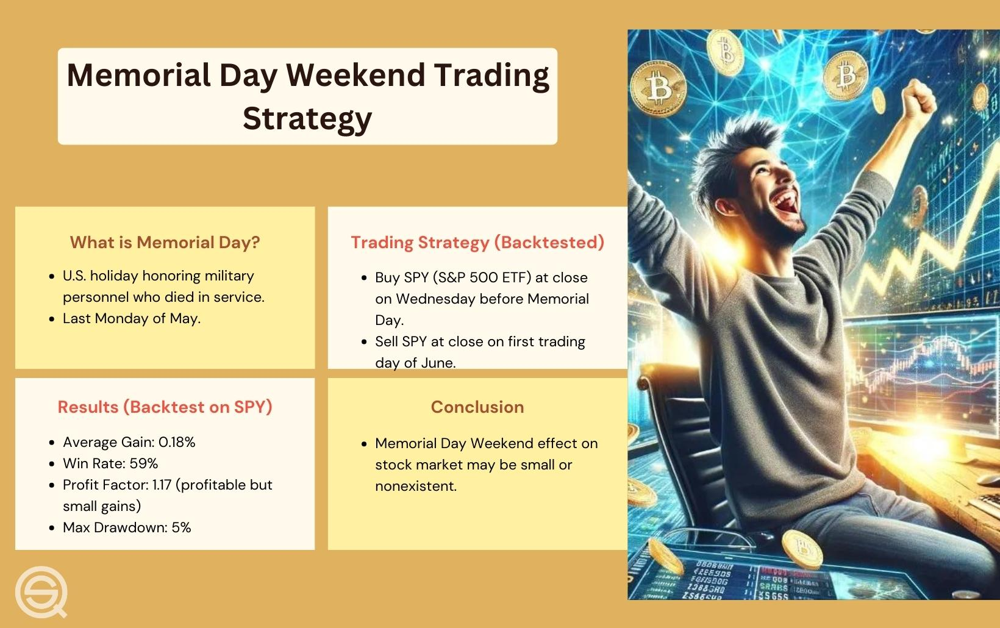

## Table of Contents

## What is the Memorial Day Effect in trading?

The Memorial Day Effect is a term used in trading to describe a pattern where the stock market tends to perform well in the days leading up to Memorial Day, which is observed on the last Monday of May in the United States. Traders and investors have noticed that stocks often rise during this period, possibly due to increased optimism and trading activity as the summer season begins.

This effect is not a guaranteed outcome every year, but it has been observed frequently enough to be considered a notable trend. Some traders might use this pattern to make investment decisions, buying stocks before Memorial Day in hopes of capitalizing on the upward trend. However, it's important to remember that past performance does not guarantee future results, and other factors can influence the market's behavior.

## How does the Memorial Day Effect impact stock market performance?

The Memorial Day Effect can make the stock market go up in the days before Memorial Day. This holiday is in late May in the U.S., and people often see the stock prices rise as summer starts. Traders and investors might feel more hopeful and trade more during this time, which can push stock prices higher.

But, the Memorial Day Effect doesn't happen every year. It's just a pattern that people have noticed sometimes. So, while some traders might buy stocks before Memorial Day hoping to make money, it's not a sure thing. Other things can change how the market acts, so it's important to be careful and not rely only on this effect.

## What are the historical trends associated with the Memorial Day Effect?

The Memorial Day Effect is when the stock market often goes up in the days before Memorial Day, which is at the end of May in the U.S. People have seen this happen a lot, and they think it might be because everyone is feeling good about the start of summer. This makes more people want to buy stocks, which can push the prices up.

But, this effect doesn't happen every year. It's just something that has been noticed sometimes. So, while some traders might try to use this pattern to make money by buying stocks before Memorial Day, it's not a sure thing. Other things can change how the market acts, so it's important to be careful and not rely only on this effect.

## Can the Memorial Day Effect be observed in other financial markets besides stocks?

The Memorial Day Effect is mostly talked about when it comes to the stock market, but some people think it might show up in other financial markets too. For example, in the bond market, there could be more trading and higher prices around Memorial Day because of the same hopeful feelings that affect stocks. The same thing might happen in the [forex](/wiki/forex-system) market, where people might trade more and push currency values up a bit.

But, it's important to know that the Memorial Day Effect is not something that happens every year in any market. It's just a pattern that some people have noticed sometimes. So, while it might be seen in other financial markets, it's not a sure thing. Other things can change how these markets act, so it's always good to be careful and not rely only on this effect.

## What are the psychological factors contributing to the Memorial Day Effect?

The Memorial Day Effect might happen because of how people feel around the start of summer. Memorial Day is a time when people start to think about vacations and having fun. This can make them feel more hopeful and happy. When people feel good, they might be more willing to take risks, like buying stocks. This extra hope and happiness can make more people want to trade, which can push stock prices up.

But, it's not just about feeling good. Memorial Day also marks the end of a school year and the beginning of summer break for many people. This can mean more time for people to think about investing. With more time on their hands, people might decide to put money into the stock market. This increase in trading activity can also help push stock prices higher around Memorial Day.

## How can traders prepare for the Memorial Day Effect?

Traders can prepare for the Memorial Day Effect by keeping an eye on how the stock market has acted in the days before Memorial Day in past years. They should look at old data to see if there's a pattern of stock prices going up around this time. By understanding this pattern, traders can decide if they want to buy stocks before Memorial Day, hoping to make money if the prices go up like they have in the past. But, they need to remember that this effect doesn't happen every year, so it's important not to rely on it too much.

Another way traders can get ready is by watching the news and other things that might affect the stock market around Memorial Day. Things like big news events or changes in the economy can change how the market acts. Traders should also think about their own feelings and not let the excitement of the start of summer make them take too many risks. By being careful and thinking about all these things, traders can make smarter choices about trading around Memorial Day.

## What are some common trading strategies used during the Memorial Day Effect?

One common trading strategy during the Memorial Day Effect is to buy stocks a few days before the holiday, hoping to sell them at a higher price as the market tends to rise. Traders might look at past years to see when the market started going up and try to buy at the right time. They might choose stocks that have gone up a lot in previous years around Memorial Day, thinking those stocks might do well again.

Another strategy is to keep an eye on the market and be ready to sell quickly if things don't go as expected. Since the Memorial Day Effect doesn't happen every year, it's smart to have a plan to cut losses if the market doesn't go up. Traders might set a price at which they'll sell their stocks to avoid losing too much money if the market goes down instead.

Some traders might also use options to take advantage of the Memorial Day Effect. They could buy call options on stocks they think will go up, which gives them the right to buy the stock at a certain price. This can be a way to make money if the stock price goes up without having to buy the stock itself. But options can be risky, so traders need to understand them well before using them.

## How reliable is the Memorial Day Effect as a trading indicator?

The Memorial Day Effect is not very reliable as a trading indicator. It's a pattern that some people have noticed where stock prices often go up in the days before Memorial Day. But this doesn't happen every year, so traders can't always count on it. It's more like a trend that has been seen sometimes, not something that always works. Because of this, it's risky to make big trading decisions based only on the Memorial Day Effect.

Traders should be careful and use other information too. They should look at what's happening in the economy, news events, and other things that can affect the stock market. While the Memorial Day Effect might help some traders make money, it's not a sure thing. It's better to use it as one part of a bigger plan, not the only reason to buy or sell stocks.

## Are there any notable exceptions or anomalies to the Memorial Day Effect?

Sometimes, the Memorial Day Effect doesn't happen at all. There have been years when the stock market didn't go up before Memorial Day. This can happen because of big news events, changes in the economy, or other things that make people worried about their money. For example, if there's a big problem in the world or the economy is doing badly, people might not feel hopeful and might not want to buy stocks, even if it's almost summer.

Another thing that can change the Memorial Day Effect is if the market has already been going up a lot before Memorial Day. If stock prices are already high, they might not go up much more just because of the holiday. Traders need to look at the bigger picture and not just rely on the Memorial Day Effect. It's important to think about all the things that can affect the stock market, not just one pattern that doesn't always work.

## How does the Memorial Day Effect compare to other seasonal market effects?

The Memorial Day Effect is one of many seasonal patterns that traders look at when they're trying to make money in the stock market. It's when stock prices often go up in the days before Memorial Day, which is at the end of May in the U.S. This is similar to other seasonal effects like the Santa Claus Rally, which happens around Christmas and New Year's, where the market often goes up too. Another one is the January Effect, where stocks can go up in the first few days of January. These effects all have to do with how people feel at certain times of the year, but they don't happen every year and can be affected by other things going on in the world.

The Memorial Day Effect is not as well-known or studied as some other seasonal effects. For example, the January Effect has been looked at a lot more because it's been around longer and more people know about it. The Memorial Day Effect might not be as strong or reliable as the January Effect or the Santa Claus Rally. But, like all these seasonal patterns, it's important for traders to remember that they're not sure things. Other big events or changes in the economy can make these effects not happen at all. So, while the Memorial Day Effect can be interesting to watch, it's just one small part of the bigger picture in the stock market.

## What role do macroeconomic factors play in enhancing or diminishing the Memorial Day Effect?

Macroeconomic factors can make the Memorial Day Effect stronger or weaker. Things like how the economy is doing overall, interest rates, and big news events can change how people feel about the stock market. If the economy is doing well and people are feeling hopeful, the Memorial Day Effect might be stronger because more people might want to buy stocks. But if there's bad news or the economy is not doing well, people might be scared to invest, and the Memorial Day Effect might not happen at all.

For example, if interest rates are low around Memorial Day, people might be more likely to borrow money to invest in stocks, which could make the Memorial Day Effect stronger. On the other hand, if there's a big problem in the world or the economy is going through a rough time, people might be too worried to buy stocks, even if it's almost summer. So, while the Memorial Day Effect is about how people feel at the start of summer, it can be affected a lot by what's going on in the bigger world of the economy.

## How can advanced traders use quantitative analysis to predict and capitalize on the Memorial Day Effect?

Advanced traders can use quantitative analysis to predict and capitalize on the Memorial Day Effect by looking at a lot of old data to see if there's a pattern of stock prices going up before Memorial Day. They can use math and computer programs to find out if this pattern is strong and happens often enough to be useful. By studying things like how much the stock market has gone up in past years around Memorial Day, traders can try to guess if it might happen again. They might also look at other numbers, like how many people are trading and what's happening in the economy, to make their guesses better.

Once they have this information, advanced traders can make plans to use the Memorial Day Effect to make money. They might decide to buy stocks a few days before Memorial Day if their numbers show that the market usually goes up then. They can also set up rules for when to sell, like if the market doesn't go up as expected or if it goes up a lot and they want to take their profits. By using quantitative analysis, traders can make smarter choices and try to make the most of the Memorial Day Effect, but they should always remember that it's not a sure thing and other big things can change how the market acts.

## References & Further Reading

[1]: ["Advances in Financial Machine Learning"](https://www.amazon.com/Advances-Financial-Machine-Learning-Marcos/dp/1119482089) by Marcos Lopez de Prado

[2]: ["Quantitative Trading: How to Build Your Own Algorithmic Trading Business"](https://books.google.com/books/about/Quantitative_Trading.html?id=j70yEAAAQBAJ) by Ernest P. Chan

[3]: ["Evidence-Based Technical Analysis: Applying the Scientific Method and Statistical Inference to Trading Signals"](https://www.amazon.com/Evidence-Based-Technical-Analysis-Scientific-Statistical/dp/0470008741) by David Aronson

[4]: ["Machine Learning for Algorithmic Trading"](https://github.com/PacktPublishing/Machine-Learning-for-Algorithmic-Trading-Second-Edition) by Stefan Jansen

[5]: Berd, Arthur M. "Understanding liquidity risk and liquidity risk premia in financial markets." Journal of Investment Strategies 8.1 (2019): 43-61.

[6]: Fama, Eugene F. "The behavior of stock-market prices." The journal of Business 38.1 (1965): 34-105.