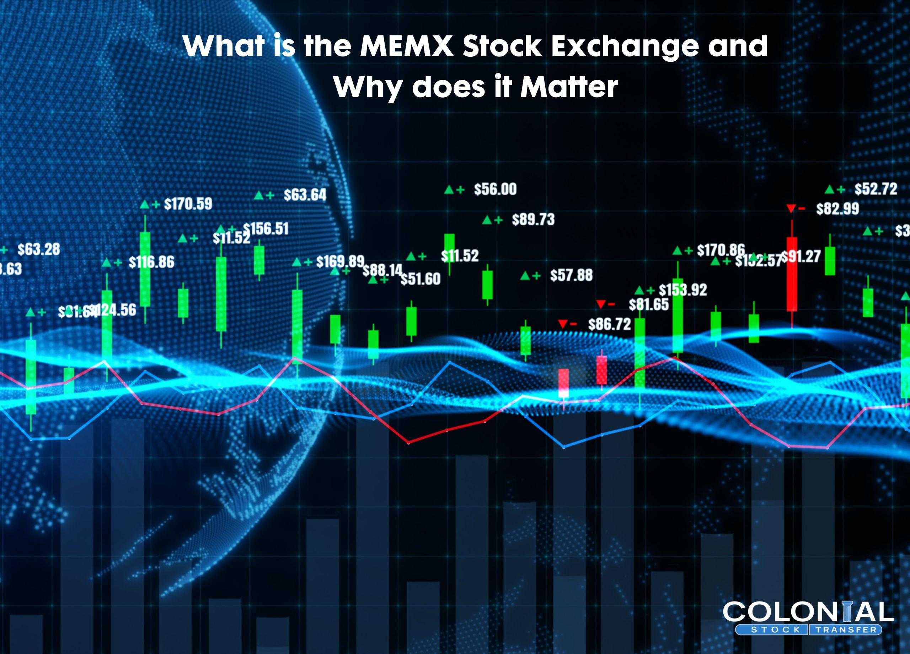

## Table of Contents

## What is MEMX?

MEMX, or the Members Exchange, is a stock exchange that started in 2020. It was created by a group of big financial companies who wanted to make trading easier and cheaper. MEMX works to lower the costs of trading and make the market more fair for everyone. It does this by using new technology and simple rules.

The main goal of MEMX is to help traders save money. It does this by charging lower fees than other exchanges. MEMX also wants to make the market more transparent, which means it's easier to see what's happening. This helps traders make better choices. Overall, MEMX aims to improve how the stock market works for everyone involved.

## When was MEMX founded?

MEMX, which stands for Members Exchange, was founded in 2020. A group of big financial companies came together to start it. They wanted to make trading easier and less expensive for everyone.

The main goal of MEMX is to help traders save money by charging lower fees than other exchanges. It also aims to make the market more fair and transparent. This means it's easier for traders to see what's happening and make better choices.

## Who are the founders of MEMX?

MEMX, or the Members Exchange, was started by a group of big financial companies. These companies wanted to make trading cheaper and easier for everyone. Some of the founders are big names like Charles Schwab, Citadel Securities, and Fidelity Investments. They all came together because they thought they could make the stock market better.

The main idea behind MEMX was to lower the costs of trading. They wanted to do this by charging less money than other exchanges. They also wanted to make the market more fair and clear. This means it would be easier for people to see what was happening in the market and make good choices. By working together, these companies hoped to change how the stock market works for the better.

## What is the primary purpose of MEMX?

MEMX, or the Members Exchange, was started to make trading easier and cheaper. A group of big financial companies like Charles Schwab, Citadel Securities, and Fidelity Investments came together to create it. They wanted to help traders save money by charging lower fees than other exchanges. This way, more people could trade without spending too much.

MEMX also wants to make the market more fair and clear. They use new technology and simple rules to do this. By making the market more transparent, it's easier for traders to see what's happening and make better choices. Overall, MEMX aims to improve how the stock market works for everyone involved.

## How does MEMX aim to improve the U.S. stock market?

MEMX, or the Members Exchange, wants to make the U.S. stock market better by making trading cheaper. It was started by big financial companies like Charles Schwab, Citadel Securities, and Fidelity Investments. They thought that by charging lower fees, more people could trade without spending too much money. This would help everyone save money and make trading easier for all kinds of traders, not just the big ones.

MEMX also wants to make the market more fair and clear. They use new technology and simple rules to help traders see what's happening in the market. When the market is transparent, it's easier for people to make good choices about buying and selling stocks. By doing these things, MEMX hopes to make the stock market work better for everyone, from small investors to big financial firms.

## What types of securities does MEMX trade?

MEMX, or the Members Exchange, trades different kinds of securities. The main ones are stocks, which are shares in companies that people can buy and sell. These stocks can come from big companies or smaller ones. MEMX also trades exchange-traded funds, or ETFs. ETFs are like baskets of stocks that you can trade like a single stock.

Another type of security that MEMX trades is options. Options give people the right to buy or sell a stock at a certain price before a specific date. They can be used to make money or to protect other investments. By trading these different types of securities, MEMX helps make the market easier and cheaper for everyone to use.

## How does MEMX's fee structure work?

MEMX has a fee structure that is meant to be simple and lower than other exchanges. When someone trades on MEMX, they pay a fee based on how much they trade and what kind of trading they do. For example, if you're buying or selling a lot of stocks, you might pay less per trade than someone who trades less often. This is called a tiered fee system, where the more you trade, the less you pay per trade.

MEMX also has different fees for different types of securities. For stocks and ETFs, the fees are usually very low compared to other exchanges. This helps traders save money. For options, the fees can be a bit different, but they are still set up to be competitive. By keeping fees low and simple, MEMX wants to make trading cheaper and easier for everyone, no matter how much or what they trade.

## What is the technology behind MEMX's trading platform?

MEMX uses new and fast technology to make trading quick and easy. The technology behind MEMX's trading platform is designed to handle a lot of trades very fast. This means that when someone wants to buy or sell a stock, it happens almost instantly. The platform uses special computers that can process trades very quickly, which helps keep everything running smoothly.

The technology also helps make the market more fair and clear. It does this by showing all the trades in real-time, so everyone can see what's happening. This makes it easier for traders to make good choices because they have all the information they need. By using this advanced technology, MEMX can offer lower fees and better service to its users.

## How does MEMX ensure fair and efficient trading?

MEMX ensures fair and efficient trading by using advanced technology that makes trades happen very quickly. This technology helps handle a lot of trades at once, so everyone can buy and sell stocks without waiting. By making the trading process fast, MEMX helps keep the market running smoothly. This means that when someone wants to trade, they can do it almost instantly, which is important for making good trading choices.

MEMX also makes the market fair by showing all trades in real-time. This means everyone can see what's happening in the market as it happens. When the market is transparent, traders can make better decisions because they have all the information they need. By using this technology and keeping fees low, MEMX helps make trading easier and more affordable for everyone, which is a big part of making the market fair and efficient.

## What are the membership requirements for joining MEMX?

To join MEMX, you need to be a member of the exchange. This means you have to apply and meet certain rules. Usually, you need to be a financial company or a trader who wants to trade a lot. MEMX wants members who will use the exchange a lot, so they look at how much you plan to trade. They also check if you follow the rules and have the right technology to trade on their platform.

Once you apply, MEMX will review your application. They will look at your trading history and make sure you can handle the technology they use. If everything looks good, they will accept you as a member. Being a member means you can trade on MEMX and take advantage of their low fees and fast trading system. It's all about making sure the market stays fair and works well for everyone.

## How does MEMX compare to other major stock exchanges like NYSE and NASDAQ?

MEMX is different from big stock exchanges like the NYSE and NASDAQ in a few ways. First, MEMX was started by a group of financial companies who wanted to make trading cheaper and easier. They charge lower fees than NYSE and NASDAQ, which helps traders save money. Also, MEMX uses new technology to make trades happen very fast. This means trading on MEMX can be quicker than on the other exchanges. MEMX also focuses on making the market more fair and clear by showing all trades in real-time.

NYSE and NASDAQ are older and bigger than MEMX. They have been around for a long time and have a lot of companies listed on them. NYSE and NASDAQ also offer more types of trading services, like different kinds of options and futures. These exchanges have a lot of history and trust behind them, which can make some traders feel more comfortable using them. However, their fees can be higher, and they might not be as fast as MEMX when it comes to trading. So, while NYSE and NASDAQ are well-known and offer a wide range of services, MEMX tries to stand out by being cheaper and faster.

## What are the future plans or expansions for MEMX?

MEMX wants to keep growing and making the stock market better. They plan to add more types of securities to trade, like new kinds of ETFs and options. This way, more people can use MEMX for different kinds of trading. They also want to make their technology even faster and better. By doing this, they can handle more trades and keep everything running smoothly. MEMX hopes to become a bigger part of the stock market and help more traders save money.

Another big plan for MEMX is to work with more financial companies and traders. They want to build a bigger community of members who use their platform. This will help them grow and offer even better services. MEMX also wants to keep their fees low and make the market more fair and clear. By doing these things, they hope to make trading easier and cheaper for everyone, no matter how much or what they trade.

## References & Further Reading

[1]: ["Advances in Financial Machine Learning"](https://www.amazon.com/Advances-Financial-Machine-Learning-Marcos/dp/1119482089) by Marcos Lopez de Prado

[2]: ["Evidence-Based Technical Analysis: Applying the Scientific Method and Statistical Inference to Trading Signals"](https://www.amazon.com/Evidence-Based-Technical-Analysis-Scientific-Statistical/dp/0470008741) by David Aronson

[3]: ["Machine Learning for Algorithmic Trading"](https://www.amazon.com/Machine-Learning-Algorithmic-Trading-alternative/dp/1839217715) by Stefan Jansen

[4]: ["Quantitative Trading: How to Build Your Own Algorithmic Trading Business"](https://www.amazon.com/Quantitative-Trading-Build-Algorithmic-Business/dp/1119800064) by Ernest P. Chan