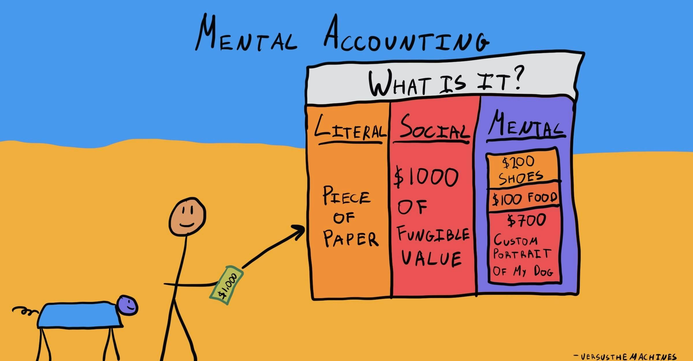

## Table of Contents

## What is mental accounting?

Mental accounting is a concept in behavioral economics that describes how people categorize and treat money differently based on its source or intended use. Instead of viewing all money as interchangeable, people often mentally separate their money into different "accounts" for things like bills, savings, and entertainment. This can lead to irrational financial decisions, like spending a tax refund more freely than regular income, even though both are essentially the same.

For example, someone might receive a $100 gift and decide to spend it on a luxury item, even if they have credit card debt with high interest. They treat the gift money as "fun money" and don't consider using it to pay off the debt, even though that would be the more financially responsible choice. Mental accounting can help explain why people make these kinds of decisions, and understanding it can help people make better financial choices.

## How does mental accounting affect personal financial decisions?

Mental accounting can make people do strange things with their money. They might put money into different groups in their head, like money for bills, money for fun, or money for saving. This can lead to choices that don't make sense. For example, someone might get a bonus at work and decide to spend it all on a vacation, even if they have debts to pay. They think of the bonus as "extra" money and don't want to use it for boring things like bills, even though paying off debt would be smarter.

This way of thinking can also stop people from saving money. If someone gets a raise, they might start spending more on things they don't need, instead of putting the extra money into savings. They see the raise as a reason to enjoy life more, not as a chance to save for the future. Mental accounting can trick people into making choices that feel good now but might hurt them later.

## What is a cognitive bias?

A cognitive bias is a kind of mistake that our brains make when we think. It's like a shortcut that can lead us to the wrong answer. These biases happen because our brains try to make quick decisions without thinking too hard, and sometimes that can make us see things in a way that's not quite right.

For example, one common cognitive bias is called confirmation bias. This is when we only pay attention to information that agrees with what we already believe, and we ignore anything that doesn't fit with our ideas. So, if someone thinks that dogs are better than cats, they'll notice all the stories about how great dogs are, but they might not see the stories about how awesome cats can be.

Cognitive biases can affect how we make choices, how we remember things, and how we see the world around us. They're a natural part of how our minds work, but knowing about them can help us make better decisions and understand other people better.

## Can you explain the relationship between mental accounting and cognitive bias?

Mental accounting and cognitive bias are closely related because mental accounting is a type of cognitive bias. When people use mental accounting, they are putting their money into different groups in their minds, like money for bills, money for fun, or money for saving. This way of thinking is a shortcut that our brains take, but it can lead to decisions that don't make a lot of sense. For example, someone might spend a tax refund on a luxury item instead of paying off a credit card, even though the smart choice would be to use the money to get rid of the debt. This happens because the brain sees the tax refund as "extra" money and wants to use it for something fun.

This kind of thinking is a cognitive bias because it's a mistake in how we think. Our brains are trying to make quick decisions without working too hard, and mental accounting is one way they do that. But this shortcut can lead to problems, like spending money in ways that aren't the best for our financial health. Understanding that mental accounting is a cognitive bias can help people see why they make certain choices and maybe make better decisions in the future. By knowing about these biases, people can try to think more carefully about their money and avoid some of the mistakes that come from mental accounting.

## What are some common examples of mental accounting in everyday life?

One common example of mental accounting is how people treat money they get from different places. Imagine someone gets a $100 gift from a friend. They might think of this money as "fun money" and decide to spend it on something like a new video game or a fancy dinner, even if they have bills to pay or credit card debt. They see the gift money as different from their regular money, so they use it in a way that feels good right away, not in a way that's good for their finances.

Another example is how people often treat money they save for different things. Let's say someone is saving up for a vacation. They might put money into a special "vacation fund" and feel really good about not touching it, even if they need to fix their car or pay for an unexpected bill. They see the vacation fund as off-limits, even though using some of that money for an important expense might be a smarter choice. This kind of thinking can lead to problems if they end up spending more on the car fix or the bill than they would have if they'd used some of their vacation savings.

## How can mental accounting lead to suboptimal financial outcomes?

Mental accounting can lead to bad financial choices because it makes people treat money differently based on where it comes from or what they plan to use it for. For example, someone might get a work bonus and decide to spend it all on a vacation, even if they have debts to pay. They see the bonus as "extra" money and want to use it for fun, not for boring things like bills. But this can be a mistake because paying off debt would save them money in the long run by avoiding interest charges.

This way of thinking can also stop people from saving money. If someone gets a raise, they might start spending more on things they don't need, instead of putting the extra money into savings. They think of the raise as a reason to enjoy life more, not as a chance to save for the future. Over time, this can mean they have less money saved up when they need it for important things like emergencies or retirement. Mental accounting tricks people into making choices that feel good now but might hurt them later.

## What are the psychological theories behind mental accounting?

Mental accounting is based on the idea that people have a natural way of organizing their money in their minds. This idea comes from a theory called prospect theory, which was created by psychologists Daniel Kahneman and Amos Tversky. Prospect theory says that people don't always make decisions based on pure logic. Instead, they think about gains and losses in a way that feels good to them. When it comes to money, people might put it into different mental buckets, like money for bills, money for fun, or money for saving. This helps them feel more in control, but it can lead to choices that aren't the best for their finances.

Another theory that helps explain mental accounting is the concept of framing. Framing means that how something is presented can change how people think about it. For example, if someone gets a tax refund, they might see it as "extra" money and spend it on something fun, even if they have debts. The way they frame the money in their minds affects how they use it. These psychological theories show that mental accounting is a way our brains try to make sense of money, but it can also lead to mistakes that cost us in the long run.

## How does the concept of mental accounting vary across different cultures?

Mental accounting can be different in different cultures because people from different places have different ways of thinking about money. In some cultures, people might be more likely to save money for the future and be very careful with it. They might see money as something to be respected and used wisely, so they put a lot of it into savings or investments. In other cultures, people might be more relaxed about money and see it as something to enjoy now. They might spend money on things that make them happy right away, like going out with friends or buying nice things.

These differences can affect how people use mental accounting. For example, in a culture where saving is important, people might have a strong "savings account" in their minds and be very strict about not touching that money. But in a culture where enjoying life now is more important, people might have a bigger "fun money" account and be more willing to spend money on things that make them happy right away. Understanding these cultural differences can help explain why people from different places make different choices with their money.

## What experimental evidence supports the theory of mental accounting?

One famous experiment that shows mental accounting was done by Richard Thaler. He asked people what they would do if they lost a $10 bill and then found a $10 bill on the same day. Most people said they would feel okay because they got the money back. But when he asked what they would do if they lost a $10 ticket to a concert and then found $10 on the street, many people said they would still be upset because they couldn't go to the concert. This shows that people treat money differently based on what it's for, even if it's the same amount.

Another study looked at how people spend money from different sources. Researchers found that people are more likely to spend money they get from a tax refund on things they want, like a new TV or a vacation, instead of using it to pay off debts or save for the future. They see the tax refund as "extra" money and want to use it for fun, even if it would be smarter to use it for something more important. These experiments show that mental accounting is real and can lead to choices that don't make a lot of sense.

## How can understanding mental accounting help in designing better financial products?

Understanding mental accounting can help people who make financial products design them in a way that helps people make better choices with their money. For example, if a bank knows that people see money from a tax refund as "extra" money, they could create a savings account that makes it easy to put that money away for the future. They could call it something like a "Tax Refund Savings Account" and make it simple to move the money into it. This way, people might be more likely to save their tax refund instead of spending it all on something they don't need.

Another way to use mental accounting is to help people pay off debts. If a credit card company knows that people see money for bills differently from money for fun, they could create a special payment plan that lets people use "extra" money, like bonuses or gifts, to pay down their debt faster. They could make it easy to set up automatic payments from these "extra" money accounts to the credit card. This could help people get out of debt quicker and save money on interest. By understanding how people think about money, financial products can be designed to help people make smarter choices.

## What are the advanced strategies to mitigate the effects of mental accounting and cognitive biases?

One advanced strategy to fight mental accounting and cognitive biases is to use something called "debiasing." This means trying to change how we think so we don't make the same mistakes over and over. For example, people can keep track of all their money in one place, instead of separating it into different mental accounts. This can help them see their money as one big pool and make better choices about how to use it. Another way to debias is to set up automatic savings plans that take money out of their paycheck before they even see it. This way, they don't have to think about whether to save or spend the money; it's already saved.

Another strategy is to use "nudges" to help people make better decisions. Nudges are little pushes that guide people toward good choices without forcing them. For example, a bank might send a text message reminding someone to put their tax refund into a savings account instead of spending it. Or a credit card company might show people how much interest they'll save if they use a bonus to pay off their debt. These nudges can help people see their money in a different way and make smarter choices. By understanding how mental accounting and cognitive biases work, people can use these strategies to improve their financial health.

## How do professionals in behavioral economics use mental accounting to influence policy and consumer behavior?

Professionals in behavioral economics use mental accounting to help shape policies and guide how people spend their money. They know that people often put their money into different mental buckets, like money for bills, money for fun, or money for saving. By understanding this, they can create policies that help people make better choices. For example, they might suggest that governments set up special savings accounts where people can easily put money from tax refunds. This way, people are more likely to save their tax refunds instead of spending them on things they don't need. These policies can help people build up their savings and be more financially secure.

Behavioral economists also use mental accounting to influence how companies design their products. They might advise companies to create features that help people use their money more wisely. For instance, a credit card company could offer a special payment plan that lets people use "extra" money, like bonuses or gifts, to pay off their debt faster. By making it easy to set up automatic payments from these "extra" money accounts, the company can help people get out of debt quicker and save money on interest. By understanding how people think about money, behavioral economists can help both governments and businesses create better policies and products that guide people toward smarter financial decisions.

## References & Further Reading

[1]: Thaler, R. H. (1999). ["Mental Accounting Matters."](https://onlinelibrary.wiley.com/doi/abs/10.1002/%28SICI%291099-0771%28199909%2912%3A3%3C183%3A%3AAID-BDM318%3E3.0.CO%3B2-F) Journal of Economic Perspectives, 13(1), 183-206.

[2]: Kahneman, D. (2011). ["Thinking, Fast and Slow."](https://link.springer.com/article/10.1007/s00362-013-0533-y) Farrar, Straus and Giroux.

[3]: Plous, S. (1993). ["The Psychology of Judgment and Decision Making."](https://archive.org/details/psychologyofjudg0000plou) McGraw-Hill.

[4]: Tetlock, P. E., & Gardner, D. (2015). ["Superforecasting: The Art and Science of Prediction."](https://psycnet.apa.org/record/2015-22864-000) Crown.

[5]: Barberis, N., & Thaler, R. (2003). ["A Survey of Behavioral Finance."](https://www.nber.org/papers/w9222) Handbook of the Economics of Finance, 1053-1128. 

[6]: Montier, J. (2012). ["Behavioural Investing: A Practitioner's Guide to Applying Behavioural Finance."](https://onlinelibrary.wiley.com/doi/book/10.1002/9781118673430) Wiley.

[7]: Pompian, M. M. (2011). ["Behavioral Finance and Wealth Management: How to Build Optimal Portfolios That Account for Investor Biases."](https://onlinelibrary.wiley.com/doi/book/10.1002/9781119202400) Wiley.