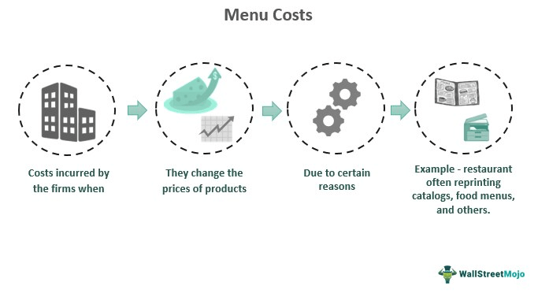

Price adjustments are an integral component of both microeconomic and macroeconomic frameworks, influencing factors from consumer spending habits to global trade balances. At their core, price adjustments are the modifications made to the prices of goods and services in response to shifts in supply and demand, production costs, and other economic forces. These alterations can have far-reaching implications, affecting the competitiveness of businesses, the purchasing power of consumers, and the overall economic equilibrium.

Central to the discussion of price adjustments is the concept of menu costs, which represent the transaction costs associated with changing prices. While seemingly trivial, these costs can result in significant price stickiness—situations where prices are slow to adjust despite changes in the underlying economic conditions. The reluctance or delay in changing prices due to menu costs can lead to inefficiencies and misalignments in the market, ultimately impacting economic stability and growth.



Economic theories, particularly those aligned with New Keynesian thought, provide a framework for understanding the effects of menu costs. These theories suggest that even minimal menu costs can create substantial barriers to price adjustments, resulting in a sluggish economic response to inflationary pressures or demand fluctuations. The implications of such price stickiness are pivotal for policymakers and economists seeking to promote stable economic environments.

In addition to traditional economic theories, recent advancements in algorithmic trading illustrate the practical application of these concepts in modern financial markets. Algorithmic trading utilizes sophisticated algorithms to execute trades at optimal conditions, reducing the influence of inherent menu costs by enabling rapid and dynamic price adjustments based on real-time data. This fusion of economic theory with technology not only optimizes trading strategies but also enhances market efficiency.

This article examines the connections between price adjustments, menu costs, economic theory, and algorithmic trading. By understanding these intertwined elements, businesses and policymakers can better navigate the complexities of economic dynamics, leveraging technological advancements to mitigate traditional challenges and foster economic growth and stability.

## Table of Contents

## Understanding Price Adjustments and Menu Costs

Price adjustments involve changing the prices of goods and services to align with economic conditions, such as inflation, shifts in consumer demand, or changes in production costs. These alterations are vital for maintaining the financial health of businesses and ensuring competitiveness within the market. However, the process of adjusting prices is not always straightforward due to various underlying factors, one of which is menu costs.

Menu costs refer to the expenses incurred by businesses when they change prices. These costs can impact a firm's decision to adjust prices, often leading to slower modifications than economic conditions might otherwise necessitate. Menu costs encompass several tangible and intangible expenses, including the physical effort and resources required to update price tags, reprint menus for a restaurant, or alter price lists for retail goods. In addition to these direct costs, there are also indirect implications, such as the potential for customer dissatisfaction or confusion when prices fluctuate frequently.

In microeconomic terms, menu costs contribute to price stickiness, where prices within an economy are slow to adjust to changes in supply and demand. This phenomenon can lead to temporary disequilibria in the market, as the discrepancy between existing and optimal prices may persist longer than expected. The concept of price stickiness is particularly relevant in industries like retail and hospitality, where the physical act of changing prices can be labor-intensive and costly.

By inhibiting price flexibility, menu costs can lead to suboptimal economic outcomes, influencing corporate strategies and consumer behavior. Businesses may choose to absorb changes in costs or market conditions instead of adjusting prices immediately, which can affect profit margins and overall economic efficiency. Understanding the relationship between price adjustments and menu costs is essential for businesses aiming to optimize pricing strategies and adapt to ever-changing economic environments.

## Economic Theory Behind Menu Costs

New Keynesian economic theory provides a robust framework for understanding the phenomenon of price stickiness, primarily attributed to menu costs. This theoretical perspective highlights how even negligible costs associated with changing prices can serve as a barrier to price adjustments, fostering economic rigidity. The core concept is that these menu costs, although seemingly minor, create enough friction to deter firms from altering prices frequently, thereby contributing to overall price stickiness in the economy.

Prominent economists Gregory Mankiw and the duo Sheshinski and Weiss have been pivotal in developing the foundational works that examine the implications of menu costs. Their research underscores the notion that these costs lead to a delay in price adjustments, even when economic conditions such as inflation would typically necessitate a change. For instance, if the cost of reprinting a menu or altering price tags outweighs the potential benefits gained from adjusting prices, firms may opt to maintain their current pricing, despite external economic pressures.

Within this framework, bounded rationality plays a significant role. It refers to the limitations in cognitive abilities, time, and resources that hinder decision-makers from pursuing the optimal [course](/wiki/best-algorithmic-trading-courses) of action. Firms, operating under bounded rationality, may choose to avoid frequent price changes due to the complexity and costs associated with such decisions, further solidifying price stickiness.

Nominal rigidity, another key component, refers to the resistance of certain financial elements to change despite substantial shifts in the broader economy. Prices tend to remain static in nominal terms, largely due to menu costs, escalation in expectations, or contracts that fix prices over a period. This rigidity is particularly prominent during periods of inflation, where one would expect prices to adjust more freely.

Consider the equation $\pi_t = \pi_{t-1} + \kappa \cdot (y_t - \bar{y}) + \epsilon_t$, where $\pi_t$ denotes the inflation rate at time $t$, $\kappa$ is a parameter indicating the sensitivity of inflation to output gaps, $y_t$ is the actual output, $\bar{y}$ is the potential output, and $\epsilon_t$ represents supply shocks. In the presence of menu costs, the adjustment of $\pi_t$ to changes in $(y_t - \bar{y})$ is often muted, exemplifying the lagging response of prices to economic dynamics.

Overall, the interaction of menu costs with bounded rationality and nominal rigidity creates an environment where firms are reluctant to adjust prices frequently, even in the face of inflationary pressures. Understanding these dynamics is crucial for interpreting the delay in economic adjustments and their broader implications on macroeconomic stability.

## Impact of Price Stickiness on the Economy

Price stickiness significantly influences macroeconomic stability by delaying adjustments that align with changing economic conditions. This inflexibility can result in macroeconomic fluctuations, altering the trajectory of economic growth and stability. When prices do not adjust promptly to reflect demand and supply changes, it hampers efficient resource allocation, leading to suboptimal outcomes such as unemployment and output gaps.

Industries characterized by high menu costs, such as retail and hospitality, exhibit noticeable price sensitivity. These sectors often face tangible and intangible costs when altering prices, such as reprinting labels or recalibrating digital pricing systems. This hesitancy to change prices quickly affects consumer spending patterns, as consumers may defer purchases in anticipation of future price changes or economic shifts. Consequently, this can drag on economic activity, reducing consumption, which is a vital component of gross domestic product (GDP).

The ripple effect of price stickiness extends throughout the supply chain. Suppliers might continue production based on outdated price signals, leading to inventory imbalances or resource wastage. Distributors could face margin pressures as they navigate between fixed supplier contracts and fluctuating market demands. Ultimately, consumers bear the consequences of price stickiness, as prices that remain unchanged during inflationary periods erode purchasing power, leading to decreased consumption and savings rates. This cascading effect emphasizes the extensive economic footprint of price stickiness, underscoring the importance of dynamic pricing mechanisms and responsive economic policies to mitigate its impact on economic stability.

## Algorithmic Trading and Economic Theory

Algorithmic trading is a sophisticated trading methodology that uses complex algorithms to execute orders with precision and efficiency. This approach is heavily underpinned by economic theories, which provide a framework for understanding and predicting market dynamics. Economic principles such as supply and demand dynamics, price elasticity, and market equilibrium play critical roles in shaping the strategies employed in [algorithmic trading](/wiki/algorithmic-trading).

Central to algorithmic trading is the use of mathematical models to forecast future price movements and to optimize trade execution. These models integrate historical data and real-time market signals to predict price trends and identify trading opportunities. For instance, a common strategy involves using statistical [arbitrage](/wiki/arbitrage) models, which rely on the concept of mean reversion—a theory that prices and returns eventually move back towards the mean or average level of the entire dataset. This strategy is based on the historical reliability of mean reversion as a foundational economic principle.

Moreover, algorithmic trading systems often utilize dynamic pricing models. These models adjust the pricing of assets in response to market conditions, thereby reducing the inherent menu costs associated with manual price updates. This capability is particularly significant in high-frequency trading environments where the speed of execution is critical. By rapidly updating prices based on real-time data inputs, algorithmic trading minimizes the delays and costs that traditionally accompany price adjustments.

To illustrate, consider a basic Python implementation of a moving average crossover strategy, which is a simple yet effective algorithmic trading strategy:

```python
import numpy as np
import pandas as pd

# Load historical market data
data = pd.read_csv('market_data.csv')
closing_prices = data['Close']

# Calculate short-term and long-term moving averages
short_window = 40
long_window = 100

signals = pd.DataFrame(index=data.index)
signals['signal'] = 0.0

signals['short_mavg'] = closing_prices.rolling(window=short_window, min_periods=1).mean()
signals['long_mavg'] = closing_prices.rolling(window=long_window, min_periods=1).mean()

# Generate buy/sell signals
signals['signal'][short_window:] = np.where(
    signals['short_mavg'][short_window:] > signals['long_mavg'][short_window:], 1.0, 0.0)

# Calculate trading orders
signals['positions'] = signals['signal'].diff()

print(signals.head())
```

This code snippet demonstrates how an algorithm can automate the process of generating buy and sell signals based on moving average crossovers, thus efficiently adjusting to market conditions.

In sum, algorithmic trading leverages economic theories to automate and refine trading strategies, thereby minimizing transactional inefficiencies associated with traditional menu costs. By employing advanced dynamic pricing and real-time adjustment capabilities, algorithmic traders enhance their responsiveness to market [volatility](/wiki/volatility-trading-strategies), positioning themselves to capitalize on transient market opportunities more effectively.

## Future Outlook and Strategies

Businesses are increasingly recognizing the importance of strategic pricing integrated with algorithmic tools to manage menu costs effectively. Traditionally, menu costs, the transaction costs associated with changing prices, have been a significant barrier to rapid price adjustments. However, advancements in digital technology are transforming this landscape.

Digital pricing strategies are emerging as powerful mechanisms to mitigate menu costs. Through dynamic pricing models, businesses can adjust prices in real time, responding swiftly to market demand and supply fluctuations. For example, e-commerce platforms employ algorithms that analyze consumer behavior, competitor pricing, and inventory levels to set optimal prices. This practice not only reduces the friction associated with traditional price changes but also enhances competitive positioning by targeting consumer segments more precisely.

The growing significance of algorithmic trading further illustrates the application of economic theory to practical financial operations. Algorithmic trading systems, powered by complex algorithms, execute trades at speeds and efficiencies that are impossible for humans. These systems can process vast amounts of financial data almost instantaneously, which allows them to detect and exploit price disparities across markets. As a result, they minimize the impacts of menu costs by ensuring prices accurately reflect real-time economic conditions.

As technology evolves, the integration of economic theory with algorithmic models is expected to become more seamless, promoting highly adaptive economic systems. This synthesis also holds potential for enhancing predictive accuracy, where [machine learning](/wiki/machine-learning) algorithms can be used to anticipate not only market trends but also consumer behavior patterns. In this context, businesses can develop more robust pricing strategies that consider both historical data and predictive insights to remain agile in dynamic marketplaces.

The intersection of digital pricing strategies and algorithmic trading provides a promising outlook for businesses aiming to optimize their pricing mechanisms while lowering menu costs. The continuous advancement in [artificial intelligence](/wiki/ai-artificial-intelligence) and big data analytics will likely propel these strategies further, offering more sophisticated tools for economic adaptation. As such, the future suggests a more integrated approach where economic theories and technological advancements coalesce to support sustainable economic growth and stability.

## Conclusion

The relationship between price adjustments, menu costs, and economic theories presents a multifaceted domain that is crucial for both theoretical exploration and practical application. Price adjustments, influenced by menu costs, are critical in understanding how businesses and markets respond to economic changes. Menu costs contribute to price stickiness, a phenomenon that can impede economic fluidity by making it difficult for prices to adjust swiftly to shifts in supply and demand. This rigidity can lead to inefficiencies and potential macroeconomic fluctuations, where markets are unable to respond promptly to external shocks or policy changes.

Algorithmic trading offers a technological intervention that can alleviate some of the challenges posed by traditional economic theories concerning price adjustments and menu costs. By harnessing advanced algorithms and real-time data processing, financial markets can achieve more fluid pricing mechanisms. These algorithms incorporate principles of economics to predict market trends and execute trades at optimal conditions, thus minimizing the delays associated with menu costs and enhancing overall market efficiency.

Understanding the dynamics between price adjustments, menu costs, and emerging technological solutions is essential for businesses aiming to optimize their pricing strategies and policymakers interested in crafting policies that enhance economic stability and growth. As technology continues to advance, the integration of economic theory with algorithmic trading is expected to evolve, further refining the mechanisms through which economic actors respond to market changes. This continuous development holds the promise of more adaptive economic systems, capable of nurturing sustainable growth and stability.

## References & Further Reading

[1]: Mankiw, N. G. (1985). ["Small Menu Costs and Large Business Cycles: A Macroeconomic Model of Monopoly."](https://scholar.harvard.edu/files/mankiw/files/small_menu_costs.pdf) The Quarterly Journal of Economics, 100(2), 529-537.

[2]: Sheshinski, E., & Weiss, Y. (1977). ["Inflation and Costs of Price Adjustment."](https://academic.oup.com/restud/article-abstract/44/2/287/1524017) Review of Economic Studies, 44(2), 287-303.

[3]: ["Price Stickiness and the Transmission of Monetary Policy: A Dynamic General Equilibrium Model."](https://www.investopedia.com/terms/p/price_stickiness.asp) by Lawrence J. Christiano, Martin Eichenbaum, & Charles L. Evans

[4]: ["Algorithmic Trading and DMA: An Introduction to Direct Access Trading Strategies"](https://www.semanticscholar.org/paper/Algorithmic-trading-%26-DMA-%3A-an-introduction-to-Johnson/aa5de1ab883d5e23b6651faa7c1807586d688e4b) by Barry Johnson

[5]: [Lopez de Prado, M. (2018). "Advances in Financial Machine Learning."](https://www.amazon.com/Advances-Financial-Machine-Learning-Marcos/dp/1119482089)