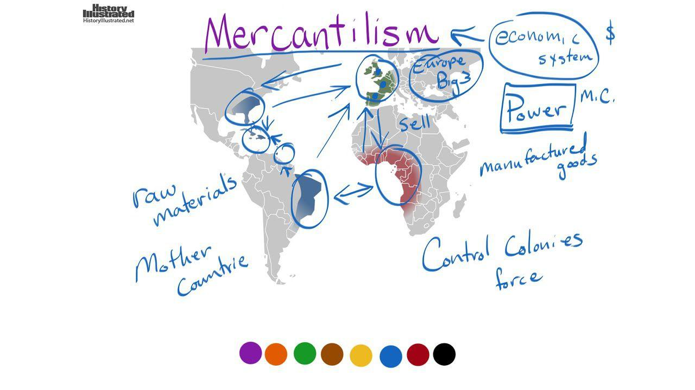

## Table of Contents

## What is mercantilism and how does it relate to British Colonial America?

Mercantilism is an economic idea that was popular in Europe from the 16th to the 18th centuries. It says that a country should try to export more than it imports to make more money. The goal is to have more gold and silver, which were seen as the main signs of wealth back then. Countries using mercantilism tried to control trade to make sure they got richer. They did this by setting up rules and taxes that helped their own businesses and hurt others.

In British Colonial America, mercantilism shaped how the colonies and Britain interacted. Britain used mercantilist ideas to control the economy of the colonies. They made laws like the Navigation Acts, which said that the colonies could only trade certain goods with Britain or other British colonies. This was supposed to make Britain richer by using the resources from the colonies. But it also caused tension because the colonies felt they were not treated fairly. This tension was one of the reasons that led to the American Revolution.

## What were the main goals of mercantilist policies in the British colonies?

The main goals of mercantilist policies in the British colonies were to make Britain richer and more powerful. Britain wanted to control the trade of the colonies to get more gold and silver. They did this by making sure the colonies sold their goods to Britain or other British colonies. This way, Britain could keep the wealth within its empire and not let it go to other countries. The colonies were seen as a source of raw materials like tobacco, sugar, and cotton, which Britain could use to make things and sell them for a profit.

These policies also aimed to keep other countries from getting the benefits of the colonies. Britain set up rules like the Navigation Acts to stop the colonies from trading with other nations. This was supposed to make Britain the only one to gain from the colonies' resources. But these strict rules made the colonists unhappy. They felt that Britain was using them just to get richer, and this led to a lot of tension. Over time, this tension grew and was one of the reasons that led to the American Revolution.

## How did the Navigation Acts contribute to mercantilism in the American colonies?

The Navigation Acts were laws made by Britain to control trade in the American colonies. These laws were a big part of mercantilism, which was all about making Britain richer by controlling trade. The Acts said that the colonies could only sell certain important goods, like tobacco and sugar, to Britain or other British colonies. This meant that Britain could get these goods cheaply and then sell them for more money to other countries. The goal was to keep the money and wealth within the British Empire and not let other countries benefit from the colonies.

These laws made the colonies very unhappy. The colonists felt that Britain was using them just to get richer. They had to sell their goods to Britain at low prices and could not trade with other countries that might pay more. This made life hard for the colonists and caused a lot of tension. Over time, this tension grew and was one of the reasons that led to the American Revolution. The Navigation Acts showed how Britain used mercantilism to control the colonies and keep the wealth for itself.

## What role did the colonies play in the British mercantile system?

In the British mercantile system, the colonies were very important. They were like a big farm and factory for Britain. The colonies gave Britain raw materials like tobacco, sugar, and cotton. Britain could then use these materials to make things and sell them for a lot of money. The colonies were not allowed to sell these important goods to other countries. They had to sell them only to Britain or other British colonies. This way, Britain could keep all the money and wealth within its own empire.

The colonies were also a big market for British goods. Britain would make things and then sell them to the colonists. This helped British businesses make more money. But the colonists were not happy with this system. They felt that Britain was using them just to get richer. The colonists had to sell their goods cheaply to Britain and could not trade with other countries that might pay more. This made life hard for the colonists and caused a lot of tension. Over time, this tension grew and was one of the reasons that led to the American Revolution.

## How did mercantilism affect the economy of British Colonial America?

Mercantilism had a big impact on the economy of British Colonial America. It made the colonies focus on sending raw materials like tobacco, sugar, and cotton to Britain. The colonies were not allowed to sell these goods to other countries. This was because Britain wanted to keep all the money and wealth within its own empire. The colonies had to sell their goods cheaply to Britain, which made life hard for the colonists. They felt that Britain was using them just to get richer.

The colonies were also a big market for British goods. Britain would make things and then sell them to the colonists. This helped British businesses make more money. But the colonists were not happy with this system. They could not trade with other countries that might pay more for their goods. This made the colonists feel trapped and unhappy. Over time, this tension grew and was one of the reasons that led to the American Revolution. The colonists wanted to be able to trade freely and not be controlled by Britain's mercantilist policies.

## What were the key industries in the colonies that were influenced by mercantilism?

The key industries in the colonies that were influenced by mercantilism were farming and trade. Farming was very important because the colonies grew crops like tobacco, sugar, and cotton. These were raw materials that Britain wanted. The colonies had to sell these crops to Britain or other British colonies at low prices. This was because Britain wanted to keep all the money and wealth within its empire. The farmers in the colonies were not happy because they could not sell their crops to other countries that might pay more.

Trade was another big industry that was influenced by mercantilism. The colonies could only trade certain goods with Britain or other British colonies. This was because of laws like the Navigation Acts. These laws made sure that Britain got the most benefit from the colonies' goods. The colonists were not happy with these rules. They felt that Britain was using them just to get richer. The colonists wanted to be able to trade freely and not be controlled by Britain's mercantilist policies. This tension over trade and farming was one of the reasons that led to the American Revolution.

## How did mercantilist policies impact the relationship between Britain and the American colonies?

Mercantilist policies made the relationship between Britain and the American colonies very tense. Britain wanted to get richer by controlling the colonies' trade. They made laws like the Navigation Acts to make sure the colonies sold their goods only to Britain or other British colonies. This way, Britain could keep all the money and wealth within its empire. But the colonists were not happy with these rules. They felt that Britain was using them just to get richer. The colonists had to sell their goods cheaply to Britain and could not trade with other countries that might pay more. This made life hard for the colonists and caused a lot of tension.

Over time, this tension grew and was one of the reasons that led to the American Revolution. The colonists wanted to be able to trade freely and not be controlled by Britain's mercantilist policies. They felt that Britain was not treating them fairly. The colonists started to think about breaking away from Britain and becoming their own country. The strict mercantilist rules made the colonists feel trapped and unhappy. This feeling of being used and controlled by Britain was a big reason why the American Revolution happened.

## What were the economic advantages and disadvantages of mercantilism for the colonies?

Mercantilism had some economic advantages for the colonies. One big advantage was that it created a stable market for their goods. The colonies could always sell their raw materials like tobacco, sugar, and cotton to Britain. This meant they had a steady income and did not have to worry about finding buyers. Also, being part of the British Empire gave the colonies some protection. They were safer from attacks by other countries because Britain's navy was strong. This safety helped the colonies grow and develop their economies.

But mercantilism also had many economic disadvantages for the colonies. The biggest problem was that the colonies had to sell their goods to Britain at low prices. This meant they could not make as much money as they might have if they were allowed to trade with other countries. The colonists felt that Britain was using them to get richer. They had to buy things from Britain, which were often more expensive than goods from other places. This made life harder for the colonists and slowed down their economic growth. Over time, these disadvantages caused a lot of anger and tension, which was one reason for the American Revolution.

## How did the colonists respond to mercantilist policies, and what were the outcomes?

The colonists did not like the mercantilist policies that Britain made. They felt that Britain was using them just to get richer. The colonists had to sell their goods to Britain at low prices and could not trade with other countries that might pay more. This made life hard for them. They also had to buy things from Britain, which were often more expensive than goods from other places. The colonists started to get very angry and unhappy about these rules. They wanted to be able to trade freely and not be controlled by Britain.

The colonists started to fight back against the mercantilist policies. They did things like smuggling goods to other countries to get better prices. They also held meetings and wrote letters to each other to talk about what they could do. Over time, their anger grew and they started to think about breaking away from Britain. This led to the American Revolution. The colonists fought a war to become their own country. After the war, they made new rules that let them trade freely with anyone they wanted. This helped their economy grow and made life better for them.

## Can you explain the concept of 'enumerated goods' in the context of mercantilism?

Enumerated goods were special items that the British colonies had to sell only to Britain or other British colonies. These goods were things like tobacco, sugar, and cotton. Britain made a list of these items and said that the colonies could not sell them to other countries. This was part of Britain's mercantilist plan to keep all the money and wealth within its empire. By controlling these goods, Britain could buy them cheaply from the colonies and then sell them for more money to other countries.

The colonists did not like the idea of enumerated goods. They felt that Britain was using them to get richer. The colonists had to sell their goods at low prices to Britain and could not trade with other countries that might pay more. This made life hard for the colonists and caused a lot of tension. Over time, this tension grew and was one of the reasons that led to the American Revolution. The colonists wanted to be able to trade freely and not be controlled by Britain's mercantilist rules.

## How did mercantilism contribute to the tensions leading to the American Revolution?

Mercantilism made the American colonies and Britain very unhappy with each other. Britain wanted to control the colonies' trade to get richer. They made laws like the Navigation Acts that said the colonies could only sell certain goods to Britain or other British colonies. The colonists had to sell their goods cheaply to Britain and could not trade with other countries that might pay more. This made the colonists feel like Britain was using them just to get richer. They were not happy with these rules and started to get angry.

Over time, this anger grew and caused a lot of tension between the colonies and Britain. The colonists wanted to be able to trade freely and not be controlled by Britain's mercantilist policies. They felt that Britain was not treating them fairly. The colonists started to talk about breaking away from Britain and becoming their own country. This feeling of being used and controlled by Britain was a big reason why the American Revolution happened. The colonists fought a war to be free from Britain's rules and to trade with whoever they wanted.

## What are some modern economic theories that critique or build upon the principles of mercantilism as applied in British Colonial America?

Modern economic theories like free trade and comparative advantage criticize the ideas of mercantilism that Britain used in the American colonies. Free trade says that countries should not have a lot of rules about who they can trade with. It says that if countries trade freely, everyone can get what they need at the best prices. This is different from mercantilism, which wanted to control trade to make one country richer. The idea of comparative advantage says that countries should focus on making things they are good at and trade with others for things they are not good at. This can help all countries grow their economies, not just one like Britain tried to do with the colonies.

Another modern theory is economic nationalism, which in some ways builds on mercantilism. Economic nationalism says that a country should protect its own businesses and workers, even if it means making rules about trade. This is like what Britain did with the Navigation Acts, which tried to keep money within the British Empire. But economic nationalism is not just about getting more gold and silver like mercantilism. It is also about making sure a country can take care of its people and be strong in the world. So, while it shares some ideas with mercantilism, it also looks at the bigger picture of a country's well-being.

## References & Further Reading

[1]: Heckscher, E. F. (1934). ["Mercantilism"](https://archive.org/details/mercantilism0000elif). George Allen & Unwin Ltd. 

[2]: Lopez de Prado, M. (2018). ["Advances in Financial Machine Learning"](https://www.amazon.com/Advances-Financial-Machine-Learning-Marcos/dp/1119482089). Wiley.

[3]: Friedman, M. (1955). ["The Colonial Background of the American Revolution"](https://archive.org/details/colonialbackgrou0000unse_i0d7). Prentice-Hall. 

[4]: Klug, A., Maurer, N. (2010). ["Mercantilism and Development: The East India Company and the Developing World"](https://www.nature.com/articles/s41594-018-0183-9). The Journal of Modern History, 82(2), 356-387.

[5]: Baten, J. (Ed.). (2016). ["A History of the Global Economy"](https://www.cambridge.org/highereducation/books/history-of-the-global-economy/99BA25553B6E1DBECAE815BA7FDBCD3A). Cambridge University Press.