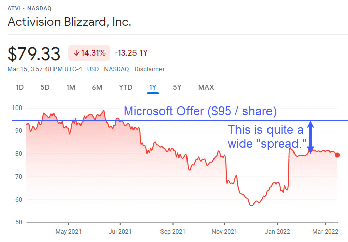

## Table of Contents

## What is merger arbitrage?

Merger arbitrage is a way to make money in the stock market by taking advantage of the time it takes for a merger or acquisition to happen. When one company decides to buy another, it usually offers to pay a certain price for each share of the target company. But, it can take months for the deal to be completed. During this time, the stock price of the target company might be lower than the price the buyer is offering. Investors who do merger arbitrage buy the target company's stock at the lower price and hope to sell it at the higher price once the merger is done.

This strategy can be profitable, but it also comes with risks. Sometimes, the merger might not happen at all. This could be because of regulatory issues, problems with getting enough shareholder votes, or other reasons. If the merger falls through, the stock price of the target company can drop a lot, and investors can lose money. Because of these risks, people who do merger arbitrage need to carefully study the chances of the merger going through and keep a close eye on any news or changes that could affect the deal.

## How does merger arbitrage work in the context of trade takeover stocks?

Merger arbitrage in the context of trade takeover stocks involves buying the stocks of a company that is being targeted for a takeover at a price lower than what the acquiring company has offered. When a company announces it wants to buy another company, it usually offers a price per share that's higher than the current market price. The idea behind merger arbitrage is to buy the target company's stock at the lower market price and then sell it at the higher takeover price once the deal is completed. This difference between the market price and the takeover price is what investors hope to profit from.

However, there are risks involved. Sometimes, the takeover might not happen. This could be due to regulatory issues, failure to get enough shareholder approval, or other complications. If the takeover falls through, the stock price of the target company can drop significantly, leading to losses for the investors. Because of these risks, people who engage in merger [arbitrage](/wiki/arbitrage) need to carefully assess the likelihood of the takeover going through and stay updated on any news or developments that could affect the deal.

## What are the basic steps to start practicing merger arbitrage?

To start practicing merger arbitrage, first you need to find out about companies that are going to be bought by other companies. You can do this by reading financial news, checking stock market websites, or using special tools that track mergers and acquisitions. Once you find a company that is being targeted for a takeover, you need to learn more about the deal. Look at the price the buyer is offering and compare it to the current price of the stock. If the stock price is lower than the offer, you might be able to make money by buying the stock now and selling it later at the higher price.

Next, you need to decide if the takeover is likely to happen. This means looking at things like whether the deal needs approval from the government or from the shareholders of the company being bought. You should also keep an eye on the news for anything that might change the chances of the deal going through. If you think the takeover will happen, you can buy the stock of the target company. But remember, there's a risk the deal might not happen, so you should only invest money you can afford to lose. Keep watching the situation until the deal is done or falls apart, and then decide whether to sell your stock or hold onto it.

## What are the key risks involved in merger arbitrage?

One big risk in merger arbitrage is that the deal might not happen. Sometimes, the government might not allow the merger because they think it's bad for competition. Other times, the shareholders of the company being bought might not agree to the deal. If the merger doesn't go through, the stock price of the target company can drop a lot, and you could lose money.

Another risk is that the deal might take longer than expected. This can be because of legal issues, problems with getting the right approvals, or other delays. If the deal takes a long time, you might have to wait a while before you can sell your stock at the higher price. During this time, the stock price might go up and down, which can be stressful.

Lastly, there's the risk of other unexpected things happening. For example, a new company might come in and offer to buy the target company for a different price. Or, something might happen in the market that makes people less interested in the stock. These surprises can change how much money you make or lose from your investment.

## How can one identify potential merger arbitrage opportunities?

To find good merger arbitrage opportunities, you need to keep an eye on the news and financial websites. These places often talk about companies that might be bought by others. Special tools and services can also help by tracking mergers and acquisitions. When you see a company that might be taken over, look at the price the buyer is offering and compare it to the current stock price. If the stock price is lower than the offer, you might be able to make money by buying the stock now and selling it later at the higher price.

Once you find a potential opportunity, you need to check if the takeover is likely to happen. Look at things like whether the deal needs approval from the government or from the shareholders of the company being bought. Also, keep watching the news for anything that might change the chances of the deal going through. If you think the takeover will happen, you can buy the stock of the target company. But remember, there's always a risk the deal might not happen, so be careful and only invest money you can afford to lose.

## What are the typical timelines for a merger arbitrage deal?

Merger arbitrage deals can take different amounts of time to finish. Usually, it takes a few months, but it can be quicker or longer. It depends on things like if the deal needs the government's okay or if the shareholders of the company being bought need to vote on it. Sometimes, there are legal problems or other delays that can make the process take longer.

When you're doing merger arbitrage, you need to be ready to wait. The time between when you buy the stock and when you can sell it at the higher price can be uncertain. If the deal takes longer than you thought, you might have to keep your money tied up in the stock for a while. But if everything goes smoothly, you might be able to make money in just a few months.

## How do regulatory factors affect merger arbitrage strategies?

Regulatory factors can have a big impact on merger arbitrage strategies. When a company wants to buy another company, they often need to get approval from the government. This is to make sure the deal won't hurt competition in the market. If the government doesn't like the deal, they might stop it from happening. This can be a big problem for investors doing merger arbitrage because if the deal falls through, the stock price of the target company can drop a lot, and they could lose money.

Because of these regulatory risks, people who do merger arbitrage need to keep a close eye on what the government is doing. They need to know if the deal needs approval and how likely it is to get it. Sometimes, the government might ask for changes to the deal before they approve it, which can delay things. Investors need to stay updated on any news or developments that could affect the deal's chances of going through. This helps them decide if it's still a good idea to invest in the target company's stock.

## What advanced techniques can be used to enhance merger arbitrage returns?

One advanced technique to boost merger arbitrage returns is to use options. Options are like bets on where a stock price will go. You can buy options that let you buy or sell the target company's stock at a certain price. If you think the merger will happen, you can buy options that let you buy the stock at a lower price than the offer. This can make your potential profit bigger. But options can also be risky because they can lose value quickly if the merger doesn't happen.

Another technique is to use leverage. This means borrowing money to buy more stock than you could with just your own money. If the merger goes through, you can make more money because you own more stock. But if the merger falls apart, you could lose more money too. So, it's important to be careful and only use leverage if you understand the risks.

A third way to improve returns is to diversify. Instead of putting all your money into one merger, you can spread it out over several different deals. This can help reduce the risk because if one deal falls through, you might still make money from the others. By looking at many different mergers and [picking](/wiki/asset-class-picking) the ones that seem most likely to happen, you can increase your chances of making a profit.

## How does market sentiment influence merger arbitrage outcomes?

Market sentiment can really affect how well merger arbitrage works out. When people feel good about the market, they might be more willing to buy stocks, including those of companies that are being taken over. This can push the stock price up closer to the price the buyer is offering, which might make the potential profit smaller for arbitrageurs. On the other hand, if people are feeling nervous about the market, they might sell their stocks, causing the price to drop even more below the offer price. This can make the potential profit bigger, but it also makes the risk higher because the deal might not happen if the market stays bad.

Also, market sentiment can change how likely it is for a merger to go through. If investors are feeling positive, they might be more likely to vote for the merger, making it easier for the deal to happen. But if the market sentiment is negative, shareholders might be more worried about the future and less likely to approve the deal. This can lead to the merger falling apart, which would be bad for anyone trying to make money from merger arbitrage. So, keeping an eye on how people feel about the market is important for figuring out the risks and rewards of merger arbitrage.

## What role does due diligence play in successful merger arbitrage?

Due diligence is super important for doing well in merger arbitrage. It means doing a lot of homework to learn everything you can about the merger. You need to check if the deal is likely to happen by looking at things like government rules, what shareholders think, and any problems that might come up. If you do your homework right, you can figure out if the merger is a good bet or if it's too risky. This helps you decide if you should put your money into the stock of the company being bought.

Not doing enough due diligence can lead to big losses. If you don't look closely at all the details, you might miss signs that the merger could fall apart. For example, if the government doesn't like the deal or if the shareholders say no, the stock price could drop a lot. By being thorough and keeping up with any news or changes, you can make smarter choices about which mergers to bet on. This way, you can try to make money while also being aware of the risks.

## How can one use financial modeling to assess the viability of a merger arbitrage opportunity?

Financial modeling can help you figure out if a merger arbitrage opportunity is worth taking. You can use models to guess what the stock price of the company being bought might do before the merger happens. These models look at things like how long the deal might take, what the chances are of it going through, and what might happen if it doesn't. By putting all this information into a model, you can see how much money you might make or lose. This helps you decide if the potential profit is big enough compared to the risk.

Using financial models also means you can try out different scenarios. For example, you can change the numbers to see what would happen if the merger takes longer than expected or if the stock price goes up or down a lot. This helps you understand how sensitive your investment is to different things that might happen. By playing around with the model, you can get a better idea of whether the merger arbitrage opportunity is a good one for you.

## What are some case studies of successful and failed merger arbitrage in trade takeover stocks?

One successful merger arbitrage case was when Pfizer wanted to buy Allergan in 2015. Pfizer offered to buy Allergan's stock at a higher price than it was trading at. People who did merger arbitrage bought Allergan's stock at the lower price and waited for the deal to go through. The deal looked good because it had a high chance of happening. But then, the U.S. government changed the rules on tax inversions, which made the deal too expensive for Pfizer. Even though the merger didn't happen, Allergan's stock price stayed high enough that many arbitrageurs still made money because they sold their stock before it dropped too much.

A failed merger arbitrage case was the proposed merger between Sprint and T-Mobile in 2014. When Sprint announced it wanted to buy T-Mobile, the stock price of T-Mobile went up but was still below the offer price. Arbitrageurs bought T-Mobile's stock hoping to sell it at the higher price once the merger was done. However, the deal faced a lot of problems, including worries about competition from the government. In the end, the merger didn't happen, and T-Mobile's stock price fell back down. Many investors who were betting on the merger lost money because they had to sell their stock at a lower price than they bought it.

## What are some advanced strategies and techniques?

Hedging strategies in merger arbitrage are essential to manage the risks associated with uncertainties in the completion of mergers and acquisitions. In merger arbitrage, traders often employ hedging to protect against deal failure, adverse market movements, and discrepancies in pricing, which can significantly impact potential profits.

### Hedging Strategies in Merger Arbitrage

One common approach is to use options contracts, which allow traders to secure the right to buy or sell stocks at predetermined prices. By purchasing put options, traders can mitigate the downside risk if a merger does not go through as planned.

Consider a scenario where an investor holds shares in a target company involved in a merger. To hedge this position, the investor might sell short the acquiring company’s stock. This hedge helps neutralize the impact of fluctuations in the acquiring company's share price, a strategy commonly referred to as going long-short.

### Utilizing Event-Driven and Risk Management Models

Event-driven models focus on predicting the outcomes of specific corporate events, such as mergers and acquisitions. These models analyze various factors, including regulatory approvals, competitive bids, and shareholder votes, to project probabilities of deal completion. Machine learning algorithms, such as decision trees or random forests, are increasingly used to evaluate these discrete outcomes based on historical deal data.

Risk management models, on the other hand, are designed to assess and control exposure to unforeseen risks. Value at Risk (VaR) models and stress testing scenarios may be used to estimate potential losses in extreme market conditions. By incorporating such methodologies, traders can better manage their risk profiles and allocate capital more efficiently.

### Exploration of Pricing Models and Risk Arbitrage Spreads

Pricing models in merger arbitrage often involve analyzing the difference between the current market price of a target company's share and the proposed acquisition price, known as the spread. This price differential reflects the market's perception of the risks and uncertainties associated with the merger's completion.

Incorporating quantitative models to assess these spreads can be advantageous. For example, a basic form of the spread can be expressed as:

$$
\text{Spread} = \left( \frac{\text{Offer Price} - \text{Current Price}}{\text{Current Price}} \right) \times 100
$$

Here, predicting the narrowing or widening of spreads involves statistical analysis and economic forecasting, factoring in market sentiment and corporate governance issues.

Python can also be employed to automate the monitoring and trading based on these spreads, allowing for real-time decision-making. Sample Python code for calculating spreads might look like this:

```python
def calculate_spread(offer_price, current_price):
    spread = ((offer_price - current_price) / current_price) * 100
    return spread

# Example usage:
offer = 50.00
current = 48.50
spread = calculate_spread(offer, current)
print(f"The spread is {spread:.2f}%")
```

Together, these advanced strategies and techniques in merger arbitrage offer a robust framework for traders to optimize their trading decisions while managing inherent risks effectively. As technology and data analytics continue to evolve, the precision and efficiency of merger arbitrage strategies are expected to continue advancing.

## References & Further Reading

[1]: Petitt, B. S., & Ferris, K. R. (2013). [**"Valuation for Mergers and Acquisitions."**](https://www.scirp.org/reference/referencespapers?referenceid=2363939) Pearson Education.

[2]: DePamphilis, D. (2019). [**"Mergers, Acquisitions, and Other Restructuring Activities: An Integrated Approach to Process, Tools, Cases, and Solutions."**](https://www.sciencedirect.com/book/9780128016091/mergers-acquisitions-and-other-restructuring-activities) Academic Press.

[3]: Bruner, R. F. (2004). [**"Applied Mergers and Acquisitions."**](https://papers.ssrn.com/sol3/papers.cfm?abstract_id=553561) Wiley Finance.

[4]: Koller, T., Goedhart, M., & Wessels, D. (2015). [**"Valuation: Measuring and Managing the Value of Companies."**](https://books.google.com/books/about/Valuation.html?id=fGXjDwAAQBAJ) McKinsey & Company.

[5]: Mitchel, M., & Pulvino, T. (2001). ["Characteristics of Risk and Return in Risk Arbitrage."](https://www.jstor.org/stable/pdf/2697819.pdf) The Review of Financial Studies, 15(2), 363-404.

[6]: Narang, R. K. (2013). [**"Inside the Black Box: A Simple Guide to Quantitative and High-Frequency Trading."**](https://onlinelibrary.wiley.com/doi/book/10.1002/9781118662717) Wiley Finance.

[7]: Poterba, J. M., & Summers, L. H. (1984). ["The Economic Effects of Dividend Taxation."](https://www.nber.org/papers/w1353) National Bureau of Economic Research Working Paper Series.