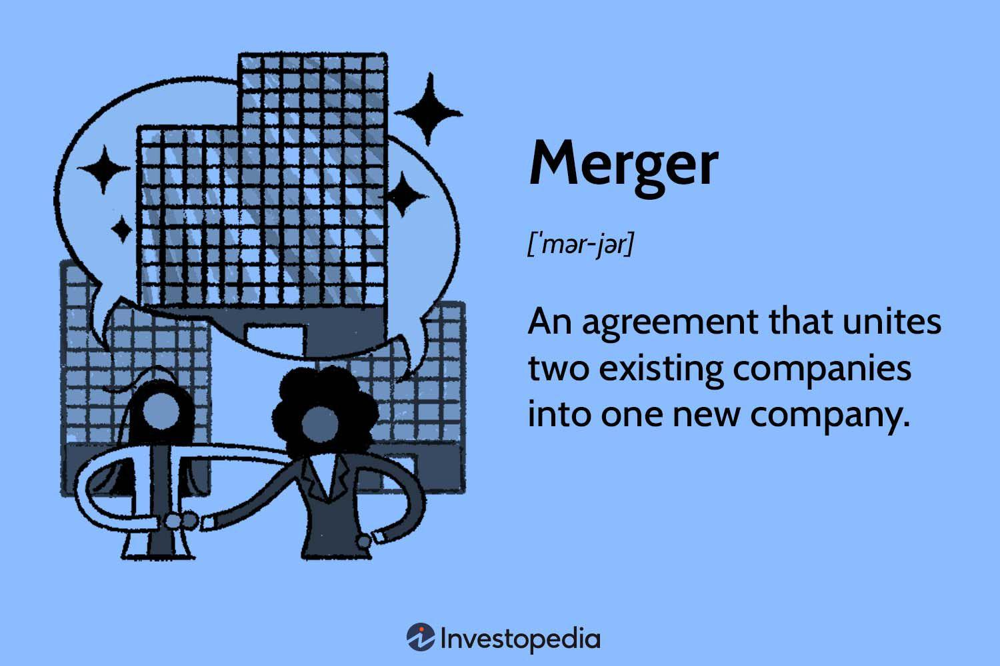

Corporate mergers are strategic decisions made by companies to combine their resources and operations, forming a single, more competitive entity. This process often entails a deep restructuring of business operations and can have far-reaching implications for companies, investors, and financial markets alike. The primary motivations behind corporate mergers can range from gaining market share and achieving economies of scale to diversifying products and reducing competition.

In recent years, algorithmic trading has become an integral part of the financial landscape. Utilizing sophisticated algorithms and high-speed data processing, algorithmic trading systems enable investors to execute trades with unprecedented efficiency and precision. These systems are not only crucial in routine trading activities but also hold substantial significance during corporate mergers. They allow investors and companies to navigate complex merger processes by swiftly capitalizing on the resulting market movements.



This article will explore the intricate dynamics of mergers, providing insights into corporate strategies and examining how algorithmic trading intersects with these high-level operations. We analyze the underlying motivations for mergers, the typical procedures undertaken during these transactions, and highlight the role that advanced trading algorithms play in exploiting market anomalies and achieving tactical advantages in the volatile environment surrounding mergers. Through a comprehensive understanding of both mergers and algorithmic trading, businesses and investors can better position themselves to realize potential benefits, while strategically mitigating inherent risks.

## Table of Contents

## Understanding Corporate Mergers

A merger occurs when two or more companies unite to form a single entity, typically involving an exchange of stocks among the companies involved. This process aims to combine their resources, operations, and markets, potentially leading to enhanced efficiencies and competitive advantages.

While the terms "mergers" and "acquisitions" (M&A) are often used interchangeably, there is a notable distinction between the two. Mergers are generally the result of a mutual agreement between the companies, with both entities typically possessing similar sizes and merging to consolidate their strengths. Conversely, acquisitions often occur when a larger company absorbs a smaller one, and they may not always be as amicable as mergers.

There are several strategic reasons for pursuing mergers. One primary motive is to increase market share. By combining, companies can access each other's customer bases, expand their reach, and enhance their competitive position. Another reason is achieving economies of scale, as larger companies can reduce costs per unit through increased production efficiency, optimizing supply chains, and leveraging fixed costs over a greater [volume](/wiki/volume-trading-strategy) of output.

Diversification of products or services is another driver. By merging with companies that offer complementary or additional products, firms can offer a broader range of services or products to their customers, mitigating risks associated with dependence on a single line of products. Furthermore, mergers can also help reduce competition by unifying two firms within the same industry, potentially leading to increased pricing power and bargaining strength in the market.

Before finalizing any merger, a comprehensive evaluation process takes place, encompassing legal, financial, and strategic assessments. Legally, the merging entities must ensure compliance with antitrust laws and other regulatory requirements to prevent the establishment of monopolies and protect consumer interests. Financially, due diligence is crucial, involving the analysis of each company's assets, liabilities, and future earnings potential to determine a fair valuation and the financial feasibility of the merger.

Strategically, companies evaluate whether the merger aligns with their long-term goals and whether the combined entity will offer a competitive advantage. Factors such as corporate culture compatibility, potential synergies, and leadership roles are considered to ensure the merger will effectively integrate operations and yield the desired outcomes.

These multifaceted evaluations aim to ensure that merging companies can smoothly transition into a single, well-functioning entity capable of capitalizing on the benefits a merger can provide.

## Trends in Business Mergers

Recent trends in the landscape of business mergers reveal a notable increase in cross-border mergers, driven by the forces of globalization and rapid technological advancements. Companies, aiming to maximize their global footprint and leverage new market opportunities, are increasingly seeking partnerships and integrations beyond their domestic borders. The ability to tap into different markets not only diversifies risks but also provides access to a broader customer base and unique technological innovations.

Digital transformation is becoming a central motive behind these strategic mergers, as corporations look to bolster their technological capabilities to remain competitive. By merging with or acquiring tech-savvy firms, traditional businesses can accelerate their transition to digital platforms, streamline operations, and innovate in their product and service offerings. In an era where digitalization is pivotal, the focus on acquiring not just tangible assets but also intellectual property and technological expertise has intensified.

However, as globalization facilitates the merging of companies across borders, regulatory scrutiny has intensified. Regulatory bodies worldwide are increasingly vigilant, ensuring that mergers do not stifle competition or create monopolistic scenarios, particularly in industries with rigorous competition laws. Adverse regulatory findings can lead to the imposition of stringent conditions or block desired mergers altogether, making it crucial for companies to strategically assess and address competition issues in advance.

Furthermore, environmental, social, and governance ([ESG](/wiki/esg-investing)) factors are becoming significant considerations in merger decisions. Stakeholders, including customers, investors, and regulators, are placing greater importance on sustainability and ethical practices. Companies are now required to demonstrate their commitment to ESG principles in merging scenarios, affecting how these transactions are structured and perceived in the market. This trend reflects a broader shift towards responsible business practices and the recognition of sustainability as a contributor to long-term financial and reputational success.

Overall, business mergers are being shaped by these multifaceted trends, with cross-border activities, digital ambitions, regulatory challenges, and sustainability considerations playing critical roles in defining the current and future merger landscape.

## Algorithmic Trading and Corporate Mergers

Algorithmic trading, commonly referred to as algo trading, is a sophisticated method of executing trades utilizing computer programs that follow a defined set of instructions or algorithms. These algorithms process trading decisions by analyzing a multitude of market variables, historical data, and other financial indicators. The efficiency and precision of algo trading are instrumental, particularly in the fast-paced landscape of corporate mergers.

During a merger, significant price disparities may arise between the stocks of the companies involved, presenting lucrative opportunities for traders employing algorithmic strategies. These strategies capitalize on the inefficiencies that might exist before, during, and after the merger announcement. For instance, if Company A is set to merge with Company B, and the market has yet to fully adjust to the perceived value of the newly formed entity, these discrepancies can be strategically exploited.

Arbitrage strategies, which seek to profit from such market inefficiencies, are particularly well-suited to [algorithmic trading](/wiki/algorithmic-trading). The speed and accuracy afforded by algorithms allow for the immediate execution of trades, a critical advantage in environments where milliseconds can determine the difference between profit and loss. The use of algorithms minimizes the latency typically associated with human decision-making processes, ensuring that traders can execute strategies with unparalleled efficiency.

In practical terms, an algorithm programmed for merger [arbitrage](/wiki/arbitrage) might be designed to buy the stock of Company B while simultaneously short-selling the stock of Company A, if market conditions suggest this will yield a favorable spread due to the proposed merger terms. Here’s a simplified Python representation of an arbitrage decision-making process:

```python
def merger_arbitrage(stock_A_price, stock_B_price, proposed_exchange_ratio, threshold=0.02):
    """Determine arbitrage opportunity based on stock prices and proposed exchange ratio."""
    expected_B_price = stock_A_price * proposed_exchange_ratio
    price_difference = expected_B_price - stock_B_price

    if price_difference / stock_B_price > threshold:
        return "Buy Stock B and Short Stock A"
    else:
        return "No arbitrage opportunity"

# Example usage
stock_A_price = 150  # current price of Company A stock
stock_B_price = 70   # current price of Company B stock
proposed_exchange_ratio = 0.5

decision = merger_arbitrage(stock_A_price, stock_B_price, proposed_exchange_ratio)
print(decision)
```

Ultimately, algorithms can rapidly process vast volumes of financial data, including real-time market feeds and news related to merger announcements. As soon as a merger is revealed, they adapt trading strategies almost instantaneously, offering traders a tactical edge. This ability to digest and act on information with precision is central to their utility in merger scenarios, where timely decision-making is paramount. 

By automating decisions, algorithms also mitigate emotional biases that may cloud human judgments, further enhancing the reliability and consistency of trading outcomes. As mergers remain a focal point of financial markets, the role of algorithmic trading in arbitrage and related activities is anticipated to grow, underscoring its significance in leveraging corporate transactions efficiently.

## Benefits and Risks of Mergers in Algo Trading

Mergers within the context of algorithmic trading present lucrative opportunities for traders seeking to exploit market inefficiencies. These inefficiencies often arise during periods of uncertainty, such as when merger announcements lead to price discrepancies between the stocks of the involved companies. Algorithmic trading capitalizes on these transient inefficiencies through strategies like merger arbitrage, offering the potential for substantial profits.

However, engaging in algorithmic trading during mergers also presents inherent risks. Deal failures, a significant risk [factor](/wiki/factor-investing), can occur due to a variety of reasons including regulatory challenges, market dynamics, or unforeseen financial difficulties. Such failures can lead to stark fluctuations in stock prices, causing potential losses for traders who have positioned themselves based on anticipated merger outcomes.

Algorithmic trading platforms enhance the ability to manage these risks effectively by providing real-time data analysis. Traders can use these tools to adjust their positions with precision, responding swiftly to new information and mitigating potential losses. This capability is essential in the highly dynamic environment of mergers, where information can change rapidly and require immediate action to preserve gains or minimize losses.

Moreover, successful navigation of merger trading environments requires robust risk management strategies. These strategies might include setting predefined stop-loss limits or using options to hedge positions. Firms need to build sophisticated models that account for the [volatility](/wiki/volatility-trading-strategies) and uncertainty associated with mergers, ensuring that algorithmic systems are equipped to handle unexpected events and market conditions.

To thrive in these environments, it is crucial for firms and traders to continuously evaluate and enhance their risk management frameworks, integrating both technological advancements and analytical insights to safeguard investments. A comprehensive approach to risk mitigation not only protects against potential downsides but also positions traders to exploit opportunities as they arise, maintaining a competitive edge in the fast-paced world of algorithmic trading during mergers.

## Case Studies and Real-world Examples

One notable example of merger arbitrage strategies using algorithmic trading can be seen in the series of large-scale acquisitions within the technology sector. These strategic maneuvers have often led to significant profit opportunities due to the volatility and market inefficiencies inherent in such mergers.

During a merger announcement between two tech giants, algorithmic trading systems can rapidly analyze the potential benefits and risks associated with the deal. For instance, when companies like Nvidia attempted to acquire Arm Holdings, algorithmic trading systems processed the news of the deal swiftly. These systems evaluated the merger's announcement by assessing factors such as regulatory challenges, market sentiment, and historical precedent.

Algorithms can adjust investment portfolios in real-time as they receive constant streams of market data and news updates. In these scenarios, traders typically employ merger arbitrage strategies, which involve buying the target company’s stock and shorting the acquiring company's stock. This strategy banks on the premise that the target company's stock price will rise to the offer price over time, while the acquirer's stock may drop slightly due to the premium paid or potential integration risks.

The success of such strategies hinges on evaluating merger probabilities accurately. This involves calculating the likelihood of the merger's completion, considering regulatory approvals, shareholder sentiments, and financial viability. Historical data analysis also plays a pivotal role, as algorithms can learn from past transactions that mirror the current scenario. They identify patterns and outcomes, offering a statistically backed prediction on the merger's possible trajectories.

For instance, using Python, traders might employ a logistic regression model to predict the probability of merger success through historical deal data:

```python
from sklearn.linear_model import LogisticRegression
import numpy as np

# Hypothetical data: historical features and outcomes (0 for failure, 1 for success)
features = np.array([[0.7, 0.3], [0.9, 0.2], [0.4, 0.8], [0.6, 0.6], [0.8, 0.4]])
outcomes = np.array([1, 1, 0, 1, 1])

# Create and train logistic regression model
model = LogisticRegression()
model.fit(features, outcomes)

# New deal features
new_deal = np.array([[0.65, 0.5]])

# Predict the probability of success
success_probability = model.predict_proba(new_deal)[0, 1]
print(f"Probability of merger success: {success_probability:.2f}")
```

Through advanced computing techniques and sophisticated algorithms, traders can make informed decisions and swiftly adapt their investment strategies in response to dynamic market conditions and merger developments. This agility enhances the potential for substantial returns in the fast-paced environment of corporate mergers and acquisitions, particularly within the tech industry.

## The Future of Mergers and Algo Trading

Emerging technologies such as [artificial intelligence](/wiki/ai-artificial-intelligence) (AI) and [machine learning](/wiki/machine-learning) are poised to significantly enhance the capabilities of algorithmic trading, particularly within the context of corporate mergers. AI and machine learning algorithms can process and analyze vast amounts of financial data at unprecedented speeds, enabling traders and analysts to identify patterns and opportunities that may not be evident through traditional analysis. This ability can greatly inform decisions during mergers by providing insights into market trends, valuation scenarios, and risk assessments.

As financial markets continue their evolution, the possible integration between algorithm-driven insights and strategic corporate decisions could become a game-changer for companies engaging in mergers. AI technologies could be utilized to forecast potential market movements based on past data and current market conditions, guiding companies towards more informed strategic decisions. For instance, machine learning models trained on historical merger and acquisition data can predict the success rate of proposed mergers, helping firms decide whether to proceed with or withdraw from a merger process.

Moreover, the convergence of traditional merger strategies with advanced trading technologies is expected to open new frontiers for investors. As AI and algorithmic trading systems improve, investors might benefit from more precise pricing models and enhanced risk management techniques. Such advancements could lead to more efficient markets, where price discovery is more accurate and the potential for arbitrage diminishes, ultimately benefiting all market participants through lower spreads and increased market efficiency.

In essence, the future of mergers intertwined with algorithmic trading represents a promising landscape where the synergies of AI and machine learning play a crucial role. These technologies provide the analytical backbone to support more strategic, data-driven decisions, fostering an environment where market opportunities are maximized, and risks are better mitigated. As these systems continue to mature, it is likely that their application across various facets of corporate finance will herald a new era of strategic integration and technological sophistication.

## Conclusion

Corporate mergers are strategic endeavors that enable companies to fortify their market presence, capitalize on synergies, and attain long-term growth objectives. These transactions can lead to significant competitive advantages and operational efficiencies. Simultaneously, algorithmic trading serves as a sophisticated tool that investors and traders can utilize to exploit the volatile environment that often accompanies mergers. By leveraging advanced algorithms, participants can identify and benefit from pricing discrepancies and market inefficiencies that arise from merger announcements and developments.

Nonetheless, both corporate mergers and algorithmic trading are not without their risks. Mergers can face regulatory hurdles, integration challenges, and market resistance, while algorithmic trading is susceptible to errors in code, unexpected market conditions, and systemic risks. To navigate these complexities successfully, strategic application of both mergers and algo trading is essential. This involves conducting meticulous due diligence, implementing robust risk management frameworks, and maintaining a flexible yet informed trading strategy.

Understanding and evaluating the dynamics of both market conditions and technological advancements are paramount for stakeholders aiming to excel in these interconnected domains. As financial landscapes evolve, the amalgamation of traditional business strategies with cutting-edge technological tools like algorithmic trading will open new avenues for financial optimization and growth. Embracing this synergy allows companies and investors to maximize their potential returns while managing associated risks effectively.

## References & Further Reading

[1]: Bergstra, J., Bardenet, R., Bengio, Y., & Kégl, B. (2011). ["Algorithms for Hyper-Parameter Optimization."](https://dl.acm.org/doi/10.5555/2986459.2986743) Advances in Neural Information Processing Systems 24.

[2]: ["Advances in Financial Machine Learning"](https://www.amazon.com/Advances-Financial-Machine-Learning-Marcos/dp/1119482089) by Marcos Lopez de Prado

[3]: ["Evidence-Based Technical Analysis: Applying the Scientific Method and Statistical Inference to Trading Signals"](https://www.amazon.com/Evidence-Based-Technical-Analysis-Scientific-Statistical/dp/0470008741) by David Aronson

[4]: ["Machine Learning for Algorithmic Trading"](https://github.com/stefan-jansen/machine-learning-for-trading) by Stefan Jansen

[5]: ["Quantitative Trading: How to Build Your Own Algorithmic Trading Business"](https://books.google.com/books/about/Quantitative_Trading.html?id=j70yEAAAQBAJ) by Ernest P. Chan

[6]: Brealey, R. A., Myers, S. C., & Allen, F. (2020). ["Principles of Corporate Finance."](https://www.mheducation.com/highered/product/principles-corporate-finance-brealey-myers/M9781264080946.html) McGraw-Hill Education.

[7]: Samii, L., Perold, A. F., & Meziane, M. (2000). ["Corporate Value of Using Algorithmic Trading in a Merger and Acquisition Context."](https://dash.harvard.edu/bitstream/handle/1/4153431/0021.pdf?sequence=1) Harvard Business School Case.

[8]: Hasbrouck, J. (2007). ["Empirical Market Microstructure: The Institutions, Economics, and Econometrics of Securities Trading."](https://searchworks.stanford.edu/view/6759272) Oxford University Press.