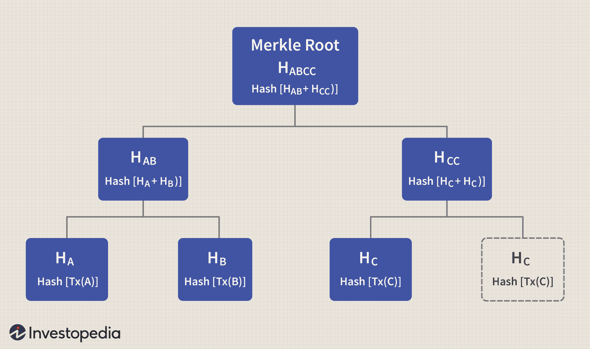

## Table of Contents

## What is a Merkle Root?

A Merkle Root is like a special code that comes from combining lots of smaller pieces of information. Imagine you have a bunch of leaves on a tree. Each leaf has a number written on it. You start pairing up the leaves and adding their numbers together to make new numbers on the branches above them. You keep doing this until you reach the top of the tree, where you have just one number left. That top number is the Merkle Root. It's a way to take a lot of data and turn it into one single, unique code.

In computer systems, especially in things like blockchain, the Merkle Root is very useful. It helps to quickly check if any piece of data has been changed. If even one tiny bit of the original data changes, the Merkle Root will be different. This makes it a great tool for keeping data safe and making sure it hasn't been messed with. So, the Merkle Root is not just a cool trick with numbers; it's a powerful way to protect and verify information.

## How is a Merkle Root used in blockchain technology?

In blockchain technology, a Merkle Root is used to efficiently and securely verify the contents of a block. Each block in a blockchain contains a list of transactions. These transactions are hashed and then combined in pairs, creating a tree-like structure called a Merkle Tree. The top of this tree, the Merkle Root, is a single hash that represents all the transactions in the block. By including the Merkle Root in the block header, the blockchain can quickly check if any transaction has been altered without needing to look at every single transaction.

This process is very helpful for keeping the blockchain safe and fast. If someone wants to check if a specific transaction is in a block, they don't need to download the whole block. They can just ask for a proof, called a Merkle Proof, which is a small set of hashes that can be used to verify the transaction's inclusion in the block. This makes it easier for nodes on the network to stay in sync and ensures that the data hasn't been tampered with, making the blockchain more secure and efficient.

## What is the structure of a Merkle Tree?

A Merkle Tree is like a special kind of tree where the leaves at the bottom are made from pieces of data, like transactions in a blockchain. Each piece of data is turned into a hash, which is a unique code. Then, these hashes are paired up and combined to make new hashes, which become the branches of the tree. This pairing and combining keeps happening until you reach the top, where you get one final hash called the Merkle Root. This root represents all the data at the bottom of the tree.

The tree structure is really helpful because it makes it easy to check if any part of the data has changed. If even one tiny bit of the original data changes, all the hashes above it in the tree will be different, all the way up to the Merkle Root. This means you can quickly see if anything has been messed with just by looking at the root. It's like having a special code that tells you if everything is still the same or if something has been changed.

## How is a Merkle Root calculated?

A Merkle Root is calculated by starting with all the pieces of data you want to combine, like transactions in a blockchain. Each piece of data is turned into a hash, which is like a unique code. Then, you start pairing up these hashes. You take the first two hashes and combine them to make a new hash. You do the same with the next two hashes, and so on, until you have paired up all the hashes at the bottom level of the tree.

Once you have these new hashes, you move up to the next level of the tree. You pair up the new hashes and combine them again to make even newer hashes. You keep doing this, moving up the tree, until you have just one hash left at the top. This final hash is the Merkle Root. It's a special code that represents all the original pieces of data, and it's used to check if any of that data has been changed.

## What are the benefits of using a Merkle Root in blockchain?

Using a Merkle Root in blockchain makes it easier to check if the data in a block has been changed. Each block has lots of transactions, and the Merkle Root is like a special code that comes from all those transactions. If someone changes even a tiny bit of a transaction, the Merkle Root will be different. This means you can quickly see if something has been messed with just by looking at the Merkle Root. It's like having a special tool that helps keep the blockchain safe and trustworthy.

Another benefit is that the Merkle Root makes it faster to verify transactions. If you want to check if a certain transaction is in a block, you don't need to download the whole block. You can just ask for a small proof, called a Merkle Proof, which is a few hashes that can show if the transaction is really in the block. This saves time and makes the blockchain more efficient. It's like having a quick way to make sure everything is correct without looking at every single piece of data.

## Can you explain the process of constructing a Merkle Tree?

To construct a Merkle Tree, you start with all the pieces of data you want to include, like transactions in a blockchain. Each piece of data is turned into a hash, which is a unique code. You then pair up these hashes. For example, if you have four hashes at the bottom level, you combine the first two hashes to make a new hash, and you do the same with the next two hashes. This new level of hashes becomes the next level up in the tree. If you have an odd number of hashes, you can duplicate the last hash to make an even number.

Once you have this new level of hashes, you keep going. You pair up the new hashes and combine them again to make even newer hashes. You keep doing this, moving up the tree, until you have just one hash left at the top. This final hash is called the Merkle Root. It's a special code that represents all the original pieces of data. If any of the original data changes, the Merkle Root will be different, which makes it a great tool for checking if the data has been tampered with.

This process of constructing a Merkle Tree is really helpful because it makes it easy to check if any part of the data has been changed. If even one tiny bit of the original data changes, all the hashes above it in the tree will be different, all the way up to the Merkle Root. This means you can quickly see if something has been messed with just by looking at the root. It's like having a special code that tells you if everything is still the same or if something has been changed.

## How does the Merkle Root enhance the security of a blockchain?

The Merkle Root helps keep a blockchain safe by making it easy to check if the data inside a block has been changed. Each block in a blockchain has lots of transactions, and the Merkle Root is a special code that comes from all those transactions. If someone tries to change even a tiny bit of a transaction, the Merkle Root will be different. This means you can quickly see if something has been messed with just by looking at the Merkle Root. It's like having a special tool that helps keep the blockchain trustworthy.

Another way the Merkle Root enhances security is by making it faster to verify transactions. If you want to check if a certain transaction is in a block, you don't need to download the whole block. You can just ask for a small proof, called a Merkle Proof, which is a few hashes that can show if the transaction is really in the block. This saves time and makes the blockchain more efficient. It's like having a quick way to make sure everything is correct without looking at every single piece of data.

## What is the role of Merkle Roots in blockchain synchronization?

Merkle Roots help make blockchain synchronization faster and easier. When nodes on a blockchain network need to sync up, they don't have to download the entire block of data. Instead, they can use the Merkle Root to quickly check if the data in a block has changed. The Merkle Root is like a special code that represents all the transactions in a block. If the Merkle Root matches what the node already has, it knows the block hasn't been changed, and it can trust the data without downloading everything.

This process also helps save space and bandwidth. If a node wants to verify a specific transaction, it can ask for a Merkle Proof, which is a small set of hashes that can prove the transaction is in the block. This way, nodes can stay in sync without needing to transfer large amounts of data. It's like having a quick way to check if everything is the same without looking at every single piece of data, making the blockchain network more efficient and secure.

## How do Merkle Roots help in verifying transactions?

Merkle Roots help in verifying transactions by making it easy to check if a transaction is part of a block. In a blockchain, each block has lots of transactions, and the Merkle Root is a special code that comes from all those transactions. If you want to check if a certain transaction is in a block, you don't need to look at every transaction. You can just ask for a small proof, called a Merkle Proof, which is a few hashes that can show if the transaction is really in the block. This makes it much faster and easier to verify transactions.

The Merkle Root also helps keep the blockchain safe. If someone tries to change even a tiny bit of a transaction, the Merkle Root will be different. This means you can quickly see if something has been messed with just by looking at the Merkle Root. It's like having a special tool that helps keep the blockchain trustworthy and secure, making sure that all the transactions are correct and haven't been changed.

## What are the differences between Merkle Trees and Patricia Trees in blockchain?

Merkle Trees and Patricia Trees are both used in blockchain to organize and verify data, but they work in different ways. A Merkle Tree is like a special tree where you start with lots of pieces of data at the bottom, like transactions. You turn each piece of data into a hash, which is a unique code. Then, you pair up these hashes and combine them to make new hashes, moving up the tree until you reach the top, where you have one final hash called the Merkle Root. This root represents all the data at the bottom and helps you quickly check if any data has been changed.

On the other hand, a Patricia Tree, also known as a trie, is used to store key-value pairs in a way that makes it easy to find and check data. In a Patricia Tree, each node can have multiple children, and the path from the root to a leaf node represents a key. This structure is great for quickly looking up data, like checking if a certain address has a balance in a blockchain. Unlike Merkle Trees, Patricia Trees are more about efficiently storing and retrieving data rather than verifying it, though they can be combined with Merkle Trees for both purposes in some blockchain systems.

## How can the efficiency of Merkle Root calculations be optimized?

To make Merkle Root calculations faster, you can use special tricks with computers. One way is to use something called parallel processing. This means using many parts of a computer at the same time to do different parts of the job. Instead of pairing up hashes one by one, you can pair up lots of hashes at the same time. This can make the whole process much quicker, especially when you have a lot of data to work with.

Another way to speed things up is by using something called caching. Caching is like keeping a copy of the work you've already done so you don't have to do it again. If you need to calculate the Merkle Root for the same set of data again, you can use the cached results instead of starting from scratch. This saves time and makes the whole system more efficient. By using these methods, you can make Merkle Root calculations faster and more efficient.

## What are some advanced applications of Merkle Roots in blockchain technology?

Merkle Roots are used in many smart ways in blockchain technology. One advanced use is in something called "light clients." These are special programs that don't need to download the whole blockchain to work. They can use Merkle Roots to check if the data they get from other nodes is correct. This makes it easier for people with less powerful computers to use blockchains, like Bitcoin or Ethereum, because they don't need to store all the data. It's like having a quick way to make sure everything is right without looking at every single piece of data.

Another cool use of Merkle Roots is in "state channels." State channels are a way to do many transactions off the main blockchain, which makes everything faster and cheaper. Merkle Roots help keep these transactions safe by making sure that the final state of the channel can be verified on the blockchain. If someone tries to cheat, the Merkle Root will show that something is wrong. This makes state channels a powerful tool for things like games or payments, where you want to do lots of actions quickly and securely.

## References & Further Reading

[1]: Merkle, R. C. (1988). ["A digital signature based on a conventional encryption function."](https://link.springer.com/chapter/10.1007/3-540-48184-2_32) In Advances in Cryptology — CRYPTO '87. Springer, Berlin, Heidelberg.

[2]: Narayanan, A., Bonneau, J., Felten, E., Miller, A., & Goldfeder, S. (2016). ["Bitcoin and Cryptocurrency Technologies: A Comprehensive Introduction."](https://press.princeton.edu/books/hardcover/9780691171692/bitcoin-and-cryptocurrency-technologies) Princeton University Press.

[3]: Nakamoto, S. (2008). ["Bitcoin: A Peer-to-Peer Electronic Cash System."](https://nakamotoinstitute.org/library/bitcoin/)

[4]: Wood, G. (2014). ["Ethereum: A Secure Decentralised Generalised Transaction Ledger."](https://ethereum.github.io/yellowpaper/paper.pdf) Ethereum Project Yellow Paper.

[5]: Buterin, V. (2014). ["Merkling in Ethereum."](https://blog.ethereum.org/2015/11/15/merkling-in-ethereum) Ethereum Foundation Blog.

[6]: Harvey, C. R., Ramachandran, A., & Santoro, J. (2021). ["DeFi and the Future of Finance."](https://papers.ssrn.com/sol3/papers.cfm?abstract_id=3711777) Wiley.

[7]: ["Mastering Bitcoin: Unlocking Digital Cryptocurrencies"](https://books.google.com/books/about/Mastering_Bitcoin.html?id=IXmrBQAAQBAJ) by Andreas M. Antonopoulos, O'Reilly Media.