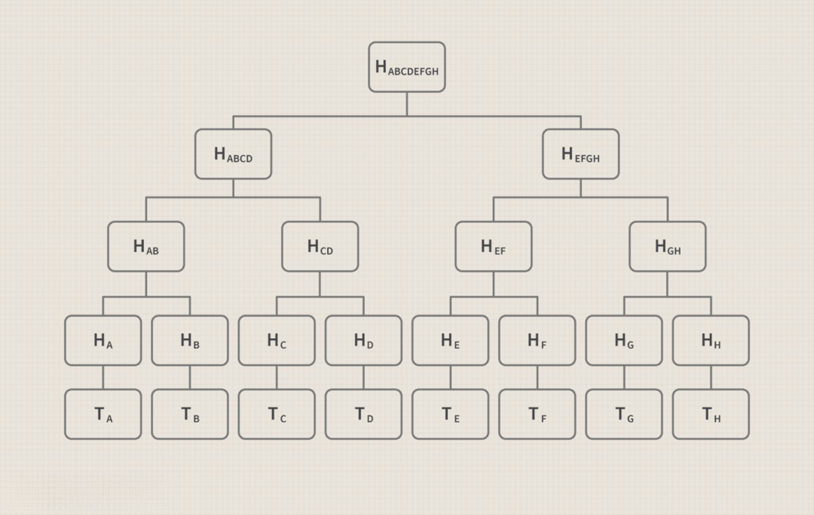

Blockchain technology has revolutionized the digital world, especially in how data is managed and verified. At the core of this revolution is the Merkle tree, a pivotal data structure that ensures efficient and secure data handling. By encoding data with hash functions, Merkle trees facilitate rapid and reliable data verification, making them indispensable in blockchain systems. This article explores the connection between blockchain technology, Merkle tree data structures, and algorithmic trading. For those engaged in cryptocurrency trading and blockchain technologies, comprehending these concepts is crucial. Our journey begins with an explanation of Merkle trees and their operation within blockchain systems, advancing towards their application in secure trading environments. Understanding the role of Merkle trees is essential for navigating the increasingly complex landscape of digital finance and trading.

## Table of Contents



## What is a Merkle Tree?

A Merkle tree, also referred to as a binary hash tree, is a fundamental data structure designed to efficiently verify data integrity. It organizes data hierarchically by employing cryptographic hash functions, which compresses data into a concise representation. At the lowest level of the Merkle tree, each leaf node represents a hash of a block of data. These leaf nodes are then paired to form a higher-level node, where a non-leaf node is a hash of its child nodes. This process of hashing and concatenating continues upward, culminating in a single hash at the top: the Merkle root.

The Merkle root is pivotal as it serves as a unique fingerprint for all the data underneath it. Any alteration to an individual data block would result in a different hash, causing a change in the Merkle root. As a result, even slight modifications in underlying data are detectable, ensuring robust verification.

One of the Merkle tree's key advantages is its capability for fast and secure verification in decentralized and peer-to-peer networks. Instead of needing to download an entire set of data to verify its accuracy, a user only requires a small number of hashes in the form of a "Merkle proof." This proof allows the user to confirm the inclusion and integrity of specific data blocks within the tree.

Merkle trees are prominently utilized in blockchain technologies like Bitcoin. In such systems, each block of the blockchain includes a Merkle tree, which encapsulates all the transaction data within that block. The use of Merkle trees in Bitcoin enhances the integrity and security of transactions by enabling simplified payment verification (SPV), which allows lightweight clients to verify transactions without needing the entire blockchain.

Essentially, the efficiency and security advantages provided by Merkle trees make them indispensable in blockchain systems, ensuring that data integrity is maintained with minimal computational and bandwidth resources.

## Role of Merkle Trees in Blockchain

In blockchain systems, Merkle trees play a fundamental role by enhancing the efficiency and security of data transmission across decentralized networks. These data structures allow users to verify data integrity and authenticity without the necessity to download an entire dataset, which is particularly useful in environments with limited bandwidth or computing resources. 

A Merkle tree works by aggregating transactions within a block; each transaction is hashed, and these hashes are recursively hashed together to form a single hash at the top known as the Merkle root. Every block in a blockchain contains such a Merkle tree, which serves to consolidate and secure all transaction hashes within that specific block. The Merkle root is stored in the block header, acting as a unique identifier or fingerprint for the data contained in the block.

This structure offers a significant enhancement to blockchain's integrity assurance mechanisms. By verifying the Merkle root, users can confirm that no data within a block has been altered. Should any alteration be attempted, it would require a change to the corresponding transaction hash and, consequently, the Merkle root itself, making tampering immediately detectable.

Moreover, Merkle trees facilitate scalable blockchain operations. By allowing the verification of individual transactions using Merkle proofs—a compact set of hashes needed to verify the presence of a transaction—it reduces the overhead traditionally involved in transaction validation. This lightweight verification process promotes scalability by significantly minimizing the computational and data retrieval costs associated with block verification.

In summary, Merkle trees are integral to blockchain's ability to maintain data precision and security while enabling verifiable and efficient operations across distributed networks.

## Blockchain Merkle Trees and Algorithmic Trading

Algorithmic trading is a sophisticated trading practice that utilizes advanced algorithms to make data-driven decisions in financial markets. This form of trading relies heavily on the accuracy and integrity of data to function optimally. Blockchain technology, with its inherent features of security and immutability, aligns perfectly with the needs of [algorithmic trading](/wiki/algorithmic-trading), making it a valuable asset in creating reliable trading systems.

At the heart of blockchain's security mechanism are Merkle trees, which play a pivotal role in enhancing the safety and validation processes of trading strategies. A Merkle tree, through its hierarchical tree structure made of hash values, allows for efficient verification of data integrity. By leveraging the Merkle tree structure, algorithmic trading systems can verify that the trade data has not been tampered with, ensuring the accuracy of the data being processed.

Merkle proofs, which are paths from a leaf node to the Merkle root, are instrumental in this verification process. They function by providing minimal information needed to check if a transaction is included in a block. This capability is critical for traders who depend on trust in automated systems; it ensures that the transactions have not been altered after being recorded on the blockchain, adding a layer of trust and reliability.

Moreover, the combination of blockchain and Merkle trees makes trading processes transparent and auditable. Each transaction recorded in a blockchain network is linked in a manner that is immutable and easily traceable, thereby reducing the risk of fraudulent activities. This transparency is attractive to both traders and regulators, as it provides a clear audit trail for each transaction, enhancing the integrity of the trading system.

In summary, the integration of blockchain technologies, specifically Merkle trees, into algorithmic trading platforms, offers significant improvements in the security and trustworthiness of these systems. This, in turn, enhances the overall robustness and reliability of algorithmic trading practices.

## Benefits of Using Merkle Trees in Trading

Merkle trees offer numerous advantages for trading systems by providing a robust mechanism for verifying trade data integrity. One of their primary benefits is the ability to verify data without accessing entire datasets. This feature is particularly advantageous in trading environments, where the swift verification of transactions is crucial. High-frequency trading, which involves executing a large number of orders in fractions of a second, especially benefits from Merkle trees due to their high-speed verification processes. The ability of Merkle trees to quickly authenticate transactions ensures that trades are processed efficiently and accurately.

Trust among stakeholders, including traders, brokers, and exchanges, is bolstered by the ability of Merkle trees to confirm that data has remained unaltered. When trade data integrity is assured, confidence in the automated systems underpinning these trades is naturally enhanced. This trust is crucial in algorithmic trading environments where stakeholders rely on the accuracy and reliability of the system to make split-second decisions.

The compactness of Merkle proofs is another significant advantage, allowing them to require less bandwidth. This makes them particularly efficient for network-based trading platforms, where bandwidth can be a limiting [factor](/wiki/factor-investing). The reduced bandwidth requirement ensures that data can be transmitted quickly and efficiently, further supporting high-speed trading activities.

In summary, Merkle trees play a vital role in establishing secure, reliable, and efficient automated trading systems. By offering a simple yet effective method for data verification, Merkle trees enhance the integrity and trustworthiness of trading operations, leading to more robust and efficient markets. As trading systems continue to evolve and the demands for speed and security increase, the role of Merkle trees is likely to become even more integral.

## Challenges and Considerations

Implementing Merkle trees in trading systems offers numerous advantages, yet it comes with its share of challenges and considerations that traders and developers need to address.

Firstly, managing large Merkle trees can be complex, particularly for real-time trading activities. In such environments, the efficient handling of data is critical as the complexity of Merkle tree operations can lead to increased latency and computational overhead. The mathematical operations involved in updating and verifying Merkle trees, such as hash function computations, can be demanding. For instance, updating a large Merkle tree requires recalculating hashes along the affected branches, which can be time-consuming if not optimized properly.

Integrating Merkle trees with existing trading algorithms also presents technical challenges. It requires seamless integration to ensure that the overall system performs efficiently without sacrificing the advantages Merkle trees offer, such as data verification. This may involve rewriting parts of the trading algorithms to accommodate the Merkle tree structure or employing intermediary layers that handle tree operations separately.

Security remains a paramount concern. As Merkle trees are a critical component in ensuring data integrity, any vulnerability in their integration could compromise the entire trading system. This requires implementing robust security measures to shield Merkle trees from potential attacks such as data breaches or hash collisions. Regular audits and updates to the cryptographic algorithms used in hashing are necessary to maintain security standards.

To address these challenges, optimizing the implementation of Merkle trees is essential. This can involve strategies such as minimizing the computational load by parallelizing hash calculations or using cache-optimized data structures. Another approach is to employ incremental updates where only necessary parts of the Merkle tree are modified, which reduces overhead. For Python enthusiasts, libraries such as hashlib can be employed to experiment with various efficient hashing techniques.

```python
import hashlib

def hash_function(data):
    return hashlib.sha256(data.encode('utf-8')).hexdigest()

# Example of hashing a data block, suitable for use in Merkle trees
data_block = "Sample Data Block"
hashed_data = hash_function(data_block)
print("Hashed Data:", hashed_data)
```

Strategically planning these implementations can ensure that the benefits of Merkle trees, like enhanced data verification and reduced trading risks, are fully leveraged, ultimately leading to more robust trading systems.

## Conclusion

The incorporation of Merkle trees within blockchain systems provides significant advantages for secure and efficient trading platforms. By enabling enhanced data verification and integrity, Merkle trees contribute to more dependable algorithmic trading practices. This is achieved through the compact and secure structure of Merkle trees, which allows for the efficient validation of trade data while minimizing the risk of tampering.

Understanding and effectively implementing Merkle tree structures can substantially enhance the robustness of trading platforms. By leveraging the inherent properties of Merkle trees, such as their ability to generate concise proofs of data integrity (Merkle proofs), trading systems can improve their transaction validation processes without incurring heavy computational or bandwidth costs. This leads to a more streamlined trading environment where data integrity is assured with minimal overhead.

As blockchain technology continues to advance, the role of Merkle trees is likely to expand, offering new and innovative mechanisms for trading systems. This evolution will further solidify the position of blockchain as a foundational technology in financial markets, enabling more transparent and auditable trading activities. Investors and developers are encouraged to explore these technologies to maintain a competitive edge in rapidly evolving financial landscapes. By doing so, they can harness the full potential of blockchain and Merkle tree structures to enhance the efficiency, security, and transparency of algorithmic trading systems.

## References & Further Reading

[1]: Ralph C. Merkle (1988). ["A Digital Signature Based on a Conventional Encryption Function."](https://link.springer.com/chapter/10.1007/3-540-48184-2_32) Lecture Notes in Computer Science, 293-297.

[2]: Nakamoto, S. (2008). ["Bitcoin: A Peer-to-Peer Electronic Cash System."](https://nakamotoinstitute.org/library/bitcoin/)

[3]: Antonopoulos, A. M. (2017). ["Mastering Bitcoin: Programming the Open Blockchain."](https://github.com/bitcoinbook/bitcoinbook) O'Reilly Media.

[4]: Narayanan, A., Bonneau, J., Felten, E., Miller, A., & Goldfeder, S. (2016). ["Bitcoin and Cryptocurrency Technologies: A Comprehensive Introduction."](https://press.princeton.edu/books/hardcover/9780691171692/bitcoin-and-cryptocurrency-technologies) Princeton University Press.

[5]: Tapscott, D., & Tapscott, A. (2016). ["Blockchain Revolution: How the Technology Behind Bitcoin Is Changing Money, Business, and the World."](https://dl.acm.org/doi/10.5555/3051781) Penguin.