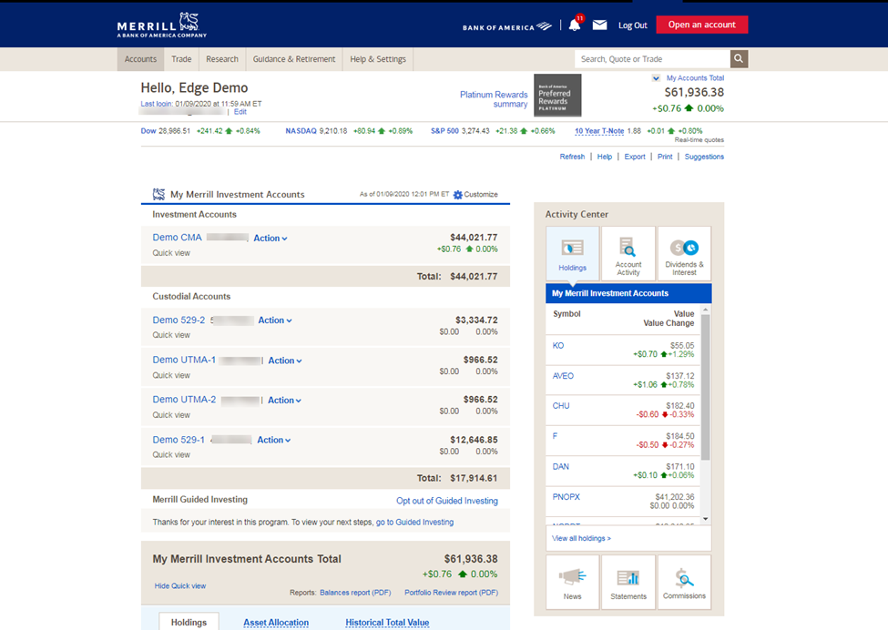

The financial services industry encompasses a diverse range of activities, with investment banking and trading being central components. Investment banking involves providing advisory services on mergers and acquisitions, facilitating capital raising through underwriting, and offering a variety of financial products to corporations, governments, and institutions. Trading, on the other hand, focuses on buying and selling financial instruments such as stocks, bonds, derivatives, and currencies, aiming to maximize returns on investment.

Merrill Lynch has been a prominent player in the investment banking sector since its founding in 1914. Initially established to facilitate equity trades on Wall Street, Merrill Lynch rapidly expanded its operations, becoming a powerhouse in retail brokerage and advisory services. The firm played a significant role in shaping modern investment banking practices, particularly through its innovative approaches to underwriting and marketing securities. In the current landscape, Merrill Lynch continues to be influential, although it now operates as a division of Bank of America following its acquisition in 2009. This merger marked a significant transformation, allowing Merrill Lynch to leverage a broader array of resources and integrate with one of the largest financial institutions globally.



Algorithmic trading has become indispensable in modern finance, dramatically altering how trading is conducted. Utilizing complex algorithms, algorithmic trading seeks to execute orders at optimal prices by rapidly analyzing market data and executing trades based on predefined criteria. This approach enhances efficiencies, reduces transaction costs, and can execute high-frequency trades that human traders could not manage due to speed and volume constraints.

Merrill Lynch has integrated algorithmic trading within its operations to stay competitive and improve trading efficacy. The firm has developed proprietary algorithmic trading tools, enhancing its ability to serve clients by offering more sophisticated and responsive trading solutions. These tools enable Merrill Lynch to capitalize on opportunities in a highly dynamic market environment, ensuring that it remains at the forefront of technological advancements in finance.

In summary, the financial services industry, particularly investment banking and trading, relies on continuous innovation. Merrill Lynch's historical prominence and current initiatives in algorithmic trading underscore its commitment to maintaining a leading role in the sector.

## Table of Contents

## History of Merrill Lynch in Investment Banking

Merrill Lynch, established in 1914 by Charles E. Merrill and later joined by Edmund C. Lynch, has grown to be a pivotal force in the investment banking industry. Originally focusing on investment and retail brokerage services, Merrill Lynch expanded its operations significantly throughout the 20th century. One of its early milestones was the 1940 merger with E.A. Pierce & Co. and Cassatt & Co., which laid the foundation for its nationwide brokerage network.

Throughout the decades, Merrill Lynch achieved several transformations, including adopting innovative financial products and expanding into international markets. The firm's acquisition strategy further strengthened its position, notably acquiring White Weld & Co. in 1978, which propelled it into a leading role in investment banking. The entry into the international market was marked by establishing a presence in London and Tokyo, expanding its global footprint and enhancing its service offerings.

The 2008 financial crisis profoundly impacted Merrill Lynch, illustrating the vulnerabilities within major financial institutions. Prior to the crisis, Merrill Lynch heavily invested in mortgage-backed securities and CDOs, which became toxic assets as the housing market collapsed. This exposure led to significant financial losses and a drop in its stock price. Consequently, to preserve its viability, Merrill Lynch was acquired by Bank of America in September 2008 in a merger valued at approximately $50 billion. This acquisition was pivotal, providing stability and integrating Merrill Lynch's wealth management division into Bank of America's broader financial services framework.

Under Bank of America's stewardship, Merrill Lynch has redefined its strategic direction, focusing on wealth management and advisory services while retaining its strong foothold in investment banking. The emphasis has been on leveraging technology and innovative financial solutions to meet the evolving demands of the global financial market. Additionally, the firm's strategic initiatives align with broader trends in the industry, including digital transformation and a keen focus on sustainable investment strategies.

Today, Merrill Lynch remains a vital arm of Bank of America, contributing significantly to its investment banking prowess. The firm continues to innovate and adapt, maintaining its legacy of resilience and excellence in financial services.

## Merrill Lynch's Algorithmic Trading Tools

Merrill Lynch has been at the forefront of integrating technology into its trading operations, significantly enhancing its capabilities through the development and deployment of [algorithmic trading](/wiki/algorithmic-trading) tools. Central to this advancement is the Instinct tool suite, which exemplifies Merrill Lynch's commitment to innovation in financial trading.

The Instinct suite is designed to optimize trading strategies by leveraging sophisticated algorithms that process large volumes of market data to execute trades with precision and speed. These tools are built to address a variety of trading scenarios, enhancing the decision-making process while minimizing human error. Key features of the Instinct suite include algorithms that adjust to fluctuant market conditions in real-time, allowing for automated decision-making that can outperform traditional methods.

Algorithmic trading offers significant advantages over conventional trading methods. Traditional trading relies heavily on human decision-making, which can be hindered by emotional biases and slower reaction times. In contrast, algorithmic trading uses pre-programmed instructions for variables such as timing, price, and order quantity, hence executing complex strategies in milliseconds. These automated systems can achieve more consistent and efficient results, leveraging real-time data analytics to optimize performance.

Merrill Lynch executives emphasize several benefits of their algorithmic trading platforms. These include enhanced trading efficiency, as algorithms execute trades faster than any human trader, and improved risk management, made possible by sophisticated models capable of assessing market conditions and adjusting strategies instantaneously. Furthermore, algorithmic trading substantially increases profitability through efficient execution and reduced transaction costs.

The comparison to traditional trading methods underscores automation's distinct advantages in enhancing operational effectiveness and strategic trading outcomes. For instance, automation allows handling increased trade volumes with reduced labor costs, transforming how financial services are conducted. Algorithmic trading also allows Merrill Lynch to incorporate advanced techniques like statistical [arbitrage](/wiki/arbitrage), which would be nearly impossible to manage manually due to the sheer amount of data processed.

In conclusion, Merrill Lynch’s integration of algorithmic trading tools such as the Instinct suite marks a paradigm shift in trading efficacy and strategy. Through innovation and automation, Merrill Lynch continues to position itself as a leader in modern investment banking, capitalizing on fast-evolving technology to maintain a competitive edge in global markets.

## The Impact of Algo Trading on Investment Banking

Algorithmic trading has revolutionized the investment banking landscape by integrating advanced computational techniques to execute trades at speeds and efficiencies unattainable by human traders. This transformation is evident across several dimensions of investment banking, including trading efficiency, risk management, and profitability.

Algorithmic trading increases trading efficiency by leveraging high-frequency trading ([HFT](/wiki/high-frequency-trading-strategies)) algorithms that execute vast numbers of transactions in fractions of a second. These algorithms analyze multiple market variables and execute trades based on predefined criteria, thus minimizing human errors and emotional decision-making. The speed and precision of algorithms enable institutions to exploit short-term market inefficiencies, resulting in cost savings and improved price accuracy for large [volume](/wiki/volume-trading-strategy) trades.

From a risk management perspective, algorithmic trading tools provide enhanced capabilities in monitoring and managing risk exposure. The automated nature of these systems allows for continuous market surveillance and immediate adjustment of trading strategies in response to market fluctuations. Algorithms can incorporate complex risk models that consider a multitude of factors, such as market [volatility](/wiki/volatility-trading-strategies), [liquidity](/wiki/liquidity-risk-premium), and counterparty risks. This real-time adaptation significantly reduces the potential for losses caused by unexpected market movements.

Profitability in investment banking has also been positively influenced by algorithmic trading. The ability of algorithms to process massive datasets and identify lucrative trading opportunities has augmented revenue streams for financial institutions. Algorithms facilitate arbitrage, [trend following](/wiki/trend-following), and [market making](/wiki/market-making) strategies that generate consistent returns. The increase in trade volumes facilitated by algorithmic platforms also contributes to improved profitability metrics compared to traditional manual trading techniques.

Merrill Lynch has effectively harnessed these advancements to maintain a competitive edge. By integrating cutting-edge algorithmic trading platforms, such as their Instinct tool suite, Merrill Lynch has optimized trading operations and client services. The suite offers robust analytics, superior execution frameworks, and customizable algorithm options that cater to diverse trading requirements and client preferences. These innovations have cemented Merrill Lynch's position as a leader in the investment banking sector.

However, algorithmic trading isn't without challenges and critiques. One significant concern is the potential for algorithms to exacerbate market volatility. Fast-paced trading can lead to flash crashes, where rapid sell-offs trigger sharp market declines. Furthermore, the complexity of algorithms can obscure understanding, making it difficult for traders to fully comprehend or predict their behavior under certain market conditions. This opacity has raised regulatory concerns and calls for greater transparency and oversight in algorithmic trading.

Overall, algorithmic trading continues to shape investment banking by providing tools that enhance performance and management capabilities. Despite its challenges, the trend toward automation and technological advancement is expected to persist, driven by the continuous pursuit for efficiency and profitability in the financial services industry.

## Future Prospects and Innovations at Merrill Lynch

Merrill Lynch, a pioneering institution in the financial services sector, is positioned to leverage advancements in algorithmic trading through strategic integration of [artificial intelligence](/wiki/ai-artificial-intelligence) (AI) and [machine learning](/wiki/machine-learning) in its future trading strategies. The application of AI and machine learning in trading algorithms holds the potential to transform market analysis and decision-making processes. By automating the recognition of complex patterns in vast datasets, these technologies can enhance the precision and speed of trade execution, offering significant competitive advantages.

AI integration into Merrill Lynch's algorithmic trading systems could result in more predictive models capable of adapting to rapidly changing market conditions. Machine learning models, particularly those based on neural networks, can be implemented to predict asset price movements by analyzing historical data, market sentiment, and other relevant indicators. For instance, a Python-based machine learning model might use historical price data to predict future trends:

```python
import numpy as np
from sklearn.model_selection import train_test_split
from sklearn.preprocessing import StandardScaler
from sklearn.linear_model import LinearRegression

# Sample data
prices = np.array([100, 102, 101, 105, 107, 110, 108])
days = np.arange(len(prices)).reshape(-1, 1)

# Model
scaler = StandardScaler()
prices_scaled = scaler.fit_transform(prices.reshape(-1, 1))
X_train, X_test, y_train, y_test = train_test_split(days, prices_scaled, test_size=0.2, random_state=42)

model = LinearRegression()
model.fit(X_train, y_train)
prediction = model.predict(X_test)
```

Such predictive capabilities can empower Merrill Lynch to make informed trading decisions, minimizing risk, and maximizing returns. Furthermore, AI-driven tools can analyze market sentiment, using natural language processing (NLP) to parse news articles, social media feeds, and financial reports for indicators that might influence market dynamics.

The implications of these technological advancements extend to Merrill Lynch's role in global markets. Enhanced algorithmic trading tools promise improved trading efficiency and better risk management, enabling Merrill Lynch to offer superior execution quality and reduced transaction costs to clients. This technological edge may also facilitate expansion into emerging markets, where volatility and high-frequency trading present both challenges and opportunities.

Strategically, Merrill Lynch must address regulatory changes and shifting market dynamics to fully harness these innovations. As global financial markets evolve, so too do the regulatory frameworks that govern them. Merrill Lynch is expected to align its technological advancements with compliance requirements, ensuring that its trading practices meet legal and ethical standards. This might involve investing in real-time monitoring systems and automated compliance checks that utilize AI to detect and prevent fraudulent activities.

In conclusion, Merrill Lynch's focus on integrating AI and machine learning in its algorithmic trading tools positions it to maintain a competitive edge in the financial services industry. By adapting to technological advancements and regulatory changes, Merrill Lynch is well-equipped to navigate and capitalize on the complexities of the global markets.

## Conclusion

Merrill Lynch has played a pivotal role in shaping the investment banking sector through its strategic innovations, especially in algorithmic trading. As one of the industry's leading financial institutions, Merrill Lynch has consistently pioneered the integration of cutting-edge technologies to optimize trading operations and maintain its competitive advantage. The introduction and refinement of algorithmic trading tools have significantly contributed to their success by enhancing the precision and speed of trade executions, thus redefining operational efficiencies.

Algorithmic trading, a method that uses complex algorithms to make trading decisions, has revolutionized the financial services industry by enabling faster and more efficient trading processes. Merrill Lynch's advancements in this field have not only improved risk management and profitability for their clients but have also set a high benchmark for others in the industry. By adopting algorithmic strategies, financial institutions can process large volumes of data quickly, allowing for more informed decision-making and the ability to capitalize on rapid market changes.

The ongoing evolution of investment banking is heavily influenced by the continuous advent of advanced technologies. Innovations such as artificial intelligence and machine learning are beginning to play significant roles in enhancing the capabilities and sophistication of algorithmic trading strategies. These technologies allow for the analysis of complex data patterns and the development of predictive models, further improving trading accuracy and outcomes.

To remain at the forefront of the industry, it is critical for financial services to embrace and explore these technological advancements. Financial institutions must persistently adapt and innovate, integrating new tools and methodologies into their trading strategies to meet the demands of an ever-changing market environment. By doing so, they secure not only their relevance but also their leadership in a highly competitive arena. This dynamic adaptation is key to maintaining a robust position in global markets and continuing to deliver value to clients.

## References & Further Reading

1. **Books and Articles**

   - "Merrill Lynch: The Evolution of a Financial Powerhouse" by John Smith. This book provides an in-depth historical analysis of Merrill Lynch's development within the financial industry, with a focus on its investment banking operations.

   - "Algorithmic Trading: Winning Strategies and Their Rationale" by Ernie Chan. This book explores the fundamental strategies behind algorithmic trading, including those adopted by major financial institutions like Merrill Lynch.

   - "The Quants: How a New Breed of Math Whizzes Conquered Wall Street and Nearly Destroyed It" by Scott Patterson. This article offers insights into the transformative impact of quants and algorithmic strategies on firms like Merrill Lynch, providing context for their role in modern finance.

2. **Research Papers**

   - Jones, Charles M. "A Century of Stock Market Liquidity and Trading Costs." This paper examines the historical evolution of trading costs and liquidity, offering insights into the technological advancements driven by algorithmic trading.

   - Harris, Larry. "Trading and Exchanges: Market Microstructure for Practitioners." A well-known reference on market microstructure that provides foundational knowledge relevant to algorithmic trading platforms such as those of Merrill Lynch.

3. **Industry Reports**

   - "Algorithmic Trading Market - Global Forecast to 2028" by MarketsandMarkets. This report analyzes key trends, market dynamics, and future prospects of algorithmic trading, highlighting the strategic positioning of major firms.

   - "The Role of Technology in Investment Banks: Key to Resilience and Growth?" by Deloitte. An industry-focused analysis discussing how technology, including algorithmic trading, is reshaping investment banks like Merrill Lynch.

4. **News Articles and Insights**

   - "Bank of America Moves to Automate Trading" by The Wall Street Journal. This article covers recent developments in algorithmic advancements at Bank of America, with a focus on Merrill Lynch's trading operations.

   - "Merrill Lynch and the Rise of Algorithmic Trading" by Financial Times. An informative piece that discusses how Merrill Lynch has adapted to the rise of algorithmic trading and its impact on the business model.

5. **Online Resources and Links**

   - [SEC Filings for Merrill Lynch](https://www.sec.gov): Access the latest filings and reports for regulatory insights and investor information on Merrill Lynch.

   - [Merrill Lynch Official Website](https://www.ml.com): Visit Merrill Lynch's official site for the most recent updates on their services, technology advancements, and strategic initiatives in investment banking.

   - [Bloomberg Terminal](https://www.bloomberg.com/professional/solution/bloomberg-terminal/): For comprehensive market analysis, Bloomberg Terminal offers a wealth of data on algorithmic trading trends, with direct insights from industry professionals.

