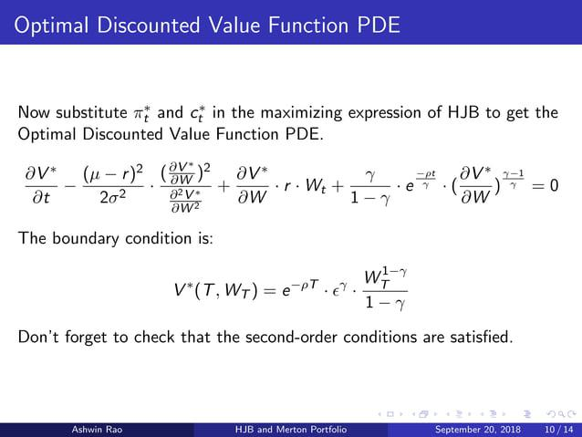

Merton's portfolio problem is a foundational model in financial economics that addresses optimal consumption and investment strategies over time. In the context of algorithmic trading, it serves as a pivotal framework used to enhance the development and execution of quantitative trading strategies. The problem, which was first articulated by Robert C. Merton, examines the decision-making process of an investor who maximizes utility from consumption and terminal wealth within a continuous-time setting.

At its core, Merton's problem focuses on two primary decisions that an investor faces in a stochastic market environment: determining the optimal proportion of wealth to consume versus the amount to invest in risky assets. The goal is to maximize expected utility over a given time horizon, which is often expressed by a utility function $U(C, W)$, where $C$ stands for consumption and $W$ represents wealth.



The significance of Merton's portfolio problem in quantitative finance is profound. It lays the groundwork for the construction of dynamic trading strategies that are sensitive to changing market conditions. By determining optimal asset allocation and consumption policies, Merton's framework helps traders and finance professionals construct portfolios that aim to achieve desirable risk-return profiles. Within algorithmic trading, this translates to the development of algorithms that systematically adjust portfolio weights based on real-time market data to adhere to optimality conditions derived from Merton’s formulation.

Foundational to Merton's problem are the concepts of optimal consumption and portfolio choice. Optimal consumption entails determining the rate at which an investor consumes his or her wealth over time to maximize utility. Portfolio choice, on the other hand, involves selecting the optimal mix of assets within the investment universe to maximize expected utility from wealth. The continuous-time aspect of the model allows for a more nuanced understanding of risk and return trade-offs compared to static, one-period models.

By leveraging mathematical models and computational techniques, algorithmic traders can utilize the principles of Merton's portfolio problem to optimize trading strategies, balancing risks and returns in a sophisticated manner. The application of these concepts not only aids in maximizing returns but also in managing the inherent risks present in financial markets, exemplifying the critical role of Merton's problem in quantitative finance and algorithmic trading.

## Table of Contents

## Background and Historical Context

Robert C. Merton’s portfolio problem emerges from the quest to optimize consumption and investment over an individual’s lifetime. Originating in the late 1960s, this problem laid the groundwork for a new analytical approach to continuous-time finance, revolutionizing how financial decisions are modeled and impacted under uncertainty. Merton's work is situated within the framework of continuous-time stochastic models, which allow investors to dynamically adjust their portfolios by continuously deciding on asset allocation and consumption rates.

At its core, the problem utilizes stochastic calculus to characterize how an investor should allocate wealth between a risk-free asset and a risky asset to maximize utility over a given time horizon. The investor's objective is to maximize the expected utility of consumption over a lifetime, subject to a budget constraint. Formally, the problem can be expressed using the Hamilton-Jacobi-Bellman (HJB) equation within the dynamic programming framework. In a continuous-time setting, the wealth process $W(t)$ is modeled by the stochastic differential equation:

$$
dW(t) = \left[rW(t) + \pi(t)(\mu - r)\right]dt + \pi(t)\sigma dB(t),
$$

where $\pi(t)$ represents the amount invested in the risky asset at time $t$, $\mu$ and $\sigma$ are the expected return and volatility of the risky asset, $r$ is the risk-free rate, and $B(t)$ is a standard Brownian motion.

Merton’s analytical solutions to this problem rested on assumptions about market completeness and the ability to trade continuously. The resulting optimal policy differs significantly from discrete-time models by allowing constant rebalancing without incurring transaction costs.

Historically, Merton's groundbreaking contributions to continuous-time finance had profound implications for modern portfolio theory and financial economics. They introduced a rigorous method to derive optimal strategies and value functions in financial settings characterized by uncertainty. This work was pivotal in enriching the Black-Scholes-Merton option pricing model and laid the foundations for more complex derivatives and financial engineering products. Moreover, it sparked a wave of research into lifecycle investing, retirement planning, and wealth management strategies.

In summary, Merton's work has deeply influenced financial theory by providing a mathematical foundation that integrates consumption and portfolio decisions into a cohesive strategy. His contributions continue to underpin modern quantitative finance and inspire ongoing innovations in [algorithmic trading](/wiki/algorithmic-trading) and asset management.

## Mathematical Formulation

Merton's portfolio problem is a fundamental concept in continuous-time finance, involving the optimization of portfolio choices to maximize an investor's utility over a given time horizon. It is mathematically formulated using the framework of stochastic calculus and is typically expressed through a set of equations that optimize both consumption and investment strategies.

At the heart of Merton's problem is the maximization of utility, a measure of satisfaction or preference that an investor derives from consumption and wealth. The utility function, typically expressed as $U(c(t), W(t))$, represents the utility derived from consumption $c(t)$ and wealth $W(t)$ at time $t$. The goal is to choose a control strategy that maximizes the expected utility over the investor's lifetime.

Merton's mathematical formulation involves key state variables, such as:
- $W(t)$: the wealth at time $t$
- $c(t)$: the consumption rate at time $t$
- $\pi(t)$: the proportion of wealth invested in risky assets at time $t$
- $r$: the risk-free interest rate

The wealth dynamics are described by the stochastic differential equation (SDE):
$$
dW(t) = [W(t)r + \pi(t)(\mu - r)W(t) - c(t)]dt + \pi(t)W(t)\sigma dZ(t)
$$
where:
- $\mu$ is the expected return of the risky asset
- $\sigma$ is the volatility of the risky asset
- $dZ(t)$ is a standard Wiener process

The problem involves maximizing the expected utility of consumption and terminal wealth:
$$
\max \mathbb{E} \left[ \int_0^T e^{-\rho t} U(c(t)) \, dt + e^{-\rho T} U(W(T)) \right]
$$
subject to the wealth dynamics and constraints on $c(t)$ and $\pi(t)$.

Partial differential equations (PDEs) come into play as a method for solving Merton's problem. By utilizing the Hamilton-Jacobi-Bellman (HJB) equation, one derives a PDE that characterizes the value function representing the optimal utility achievable from any given starting point. The HJB equation for Merton's problem is given by:
$$
0 = \max_{c, \pi} \left\{ U(c) + V_t + V_W [W(t)r + \pi(t)(\mu - r)W(t) - c] + \frac{1}{2} \pi(t)^2 \sigma^2 W(t)^2 V_{WW} \right\}
$$
where $V(t, W)$ is the value function dependent on time and wealth, and $V_t, V_W, V_{WW}$ are its partial derivatives.

Solving this nonlinear PDE allows the determination of the optimal consumption $c^*(t)$ and investment $\pi^*(t)$ strategies, ensuring that wealth is allocated dynamically to achieve maximum utility over time. These computations form the basis for deriving efficient portfolios and consumption choices under uncertainty, providing strategic insights into optimal asset allocation and risk management.

## Applications in Algorithmic Trading

Merton's portfolio problem significantly influences algorithmic trading strategies by providing a theoretical foundation for dynamic asset allocation and consumption decisions. This problem leverages mathematical models to optimize the trade-off between risk and return over an investment horizon, informing the construction of automated trading algorithms.

In algorithmic trading, Merton's solutions are implemented to refine asset allocation strategies dynamically. Theoretical insights from the problem guide traders in adjusting the proportion of risky and risk-free assets in a portfolio, leveraging the constant monitoring capabilities of algorithmic systems. These models continuously assess market conditions, allowing for real-time rebalancing to maximize expected utility from consumption and terminal wealth.

A core element of Merton's model is the maximization of expected utility, typically expressed in continuous time as:

$$
\max_{c(t), \pi(t)} \mathbb{E} \left[ \int_{0}^{T} e^{-\rho t} u(c(t)) dt + e^{-\rho T} u(W(T)) \right]
$$

where $c(t)$ represents consumption at time $t$, $\pi(t)$ represents the portfolio strategy, $\rho$ is the subjective discount rate, and $W(T)$ is the wealth at terminal time $T$.

Algorithmic trading frameworks employ stochastic control techniques to derive optimal policies for $c(t)$ and $\pi(t)$. For instance, trading algorithms can simulate various market scenarios using these equations and adjust strategies in response to asset price movements or changes in [volatility](/wiki/volatility-trading-strategies). Python, with its robust libraries such as NumPy and SciPy, is often used for simulating scenarios and optimizing complex models.

```python
import numpy as np
from scipy.optimize import minimize

# Utility function: CRRA utility
def utility(c, gamma):
    if gamma == 1:
        return np.log(c)
    else:
        return (c ** (1 - gamma)) / (1 - gamma)

# Optimization example considering budget constraints
def objective(x, W0, Rf, mu, sigma, gamma):
    # Portfolio weights
    pi = x[0]
    c = x[1]
    W1 = W0 * (1 + Rf + pi * (mu - Rf))
    return -utility(c, gamma)  # Negative for minimization

# Initial parameters
W0 = 1  # Initial wealth
Rf = 0.01  # Risk-free rate
mu = 0.05  # Expected return of risky asset
sigma = 0.2  # Volatility of risky asset
gamma = 3  # Risk aversion coefficient

# Initial guess for optimization [portfolio weight, consumption]
x0 = [0.5, 0.05]

# Solving for optimal consumption and portfolio weight
result = minimize(objective, x0, args=(W0, Rf, mu, sigma, gamma), bounds=[(0,1), (0, W0)])
optimal_portfolio_weight = result.x[0]
optimal_consumption = result.x[1]
```

This Python snippet showcases a simplified optimization of consumption and portfolio weights given initial wealth, risk-free rate, and expected returns of risky assets.

By evaluating the portfolio in various states using algorithms inspired by Merton's framework, traders can achieve an optimized asset allocation that continually responds to evolving market conditions. Merton's problem aids in understanding the interplay between risk preferences, market dynamics, and temporal shifts, fostering algorithmic strategies that consistently target utility maximization rather than mere profit generation. This strategy is pertinent for longevity and sustainability in algorithmic trading systems, where adaptability and precision are crucial.

## Challenges and Limitations

Merton's portfolio problem, while foundational in theoretical finance, encounters several challenges when applied to real-world scenarios. One primary complexity lies in transitioning from Merton's idealized continuous-time model to the discrete-time nature of actual trading environments. Continuous models assume constant access to trading opportunities and information, represented by stochastic differential equations, which are not always aligned with the episodic nature of market operations where trades occur at specific intervals.

A key computational challenge is solving the Hamilton-Jacobi-Bellman (HJB) equation, central to Merton's framework. The equation requires sophisticated techniques for resolving optimal consumption and portfolio choices, often relying on partial differential equations (PDEs). In practice, solving these equations requires significant computational power and resources. The computational load increases with the complexity of the asset class involved or the need to adjust dynamically to new market information.

Another issue is the sensitivity of Merton's model to input parameters and market dynamics. Parameters such as expected returns, volatilities, and risk aversions directly influence the outputs of optimal asset allocation. Small changes in these parameters can lead to substantial differences in suggested portfolio constructions. Moreover, market conditions such as [liquidity](/wiki/liquidity-risk-premium) constraints, transaction costs, and non-tradeable income sources introduce additional layers of complexity that Merton's classical model does not thoroughly address.

Furthermore, the assumption of constant model parameters over time, as implicated in Merton's elegant but simplified continuous-time framework, fails to reflect the often volatile and rapidly changing landscape of financial markets. The static nature of certain variables presents a challenge in accurately modeling scenarios that feature regime switches or stochastic volatility.

Addressing these challenges often requires numerical simulations and advanced computational techniques like Monte Carlo simulations or finite difference methods, which approximate solutions to the otherwise analytically intractable equations. However, these methods come at the cost of increased computational time and may still suffer from approximation errors.

Overall, while Merton's theoretical insights provide a valuable framework for understanding optimal consumption and investment strategies, their direct application in a discrete and dynamic market setting can be fraught with challenges that necessitate adaptations and computational innovations.

## Numerical Approaches and Technological Advances

Merton's portfolio problem, a fundamental component of continuous-time finance, requires sophisticated numerical methods for its resolution due to the inherent complexity of its stochastic control framework. One prominent approach is the use of Monte Carlo simulations. These simulations estimate the distribution of potential outcomes by considering a wide range of random variables that affect asset prices and consumption decisions. Monte Carlo simulations are particularly beneficial in capturing the stochastic nature of financial markets, as they allow for the modeling of numerous scenarios reflecting different market conditions. The iterative process involves simulating a large number of random paths for the underlying asset prices and using these to solve the optimal control problem numerically.

Advancements in computational power have drastically improved the efficiency and accuracy of such simulations. High-performance computing systems can now execute thousands of simulations in parallel, significantly reducing computation time and enabling more complex models to be run. Additionally, the integration of [machine learning](/wiki/machine-learning) techniques has opened new avenues for optimizing portfolio strategies derived from Merton's framework. Machine learning algorithms can analyze vast data sets to identify patterns and adaptively fine-tune trading strategies in response to dynamic market conditions.

Artificial intelligence (AI) further enhances the application of Merton's theory in algorithmic trading by providing tools for pattern recognition, anomaly detection, and predictive modeling. AI-driven algorithms can process continuous market data streams and make real-time portfolio adjustments to stay aligned with the optimal consumption and investment path dictated by Merton's model. This adaptability to rapidly changing market dynamics is essential for maintaining competitive edge in trading environments.

AI models such as deep [reinforcement learning](/wiki/reinforcement-learning) are particularly promising, as they can be designed to learn optimal investment strategies by interacting with simulated market environments. These models adjust strategies based on rewards obtained for successful trading actions, gradually improving their performance. For instance, a deep reinforcement learning algorithm can simulate a decision-making process that reconciles Merton's optimal control principles with the complexities of high-frequency trading.

Overall, the combination of advanced computational techniques and AI represents a significant leap forward in solving Merton's portfolio problem. These innovations not only deepen the understanding of optimal portfolio allocation and consumption strategies but also enhance the practical application of these strategies in sophisticated, algorithm-driven trading platforms.

## Case Studies and Practical Examples

Merton's portfolio problem has been utilized in algorithmic trading to guide the development of strategies that dynamically adjust to market conditions. This section highlights practical applications where firms have applied Merton's framework, examining both successes and challenges faced. The following real-world scenarios illustrate how Merton's theory influences asset allocation and trading strategies across different asset classes and market conditions.

One significant example is the application of Merton's framework in hedge funds employing automated trading algorithms. These hedge funds often utilize Merton’s concepts to optimize the balance between risky and risk-free assets, aiming to maximize expected utility over time. By leveraging continuous-time models, these funds can dynamically adjust their portfolios in reaction to stochastic market movements. The computational tools used enable the constant recalibration of asset weights to reflect real-time market data.

For instance, consider a [hedge fund](/wiki/hedge-fund-trading-strategies) specializing in equities and fixed income securities. Utilizing Merton's theory, the fund devises algorithms that solve the utility maximization problem to optimize the proportion of capital allocated to stocks versus bonds. The objective is to maximize the logarithmic utility of consumption, which can be expressed as:

$$
\max \mathbb{E} \left[\int_0^T e^{-\rho t} \log C(t) \, dt\right],
$$

where $C(t)$ represents the consumption at time $t$, $\rho$ is the subjective discount rate, and $T$ is the investment horizon. By solving this optimization problem, the hedge fund can determine the ideal allocation under various scenarios and market conditions.

Challenges arise due to the discrete nature of actual trading environments, as opposed to the continuous-time assumptions in Merton's original models. Real-world implementation demands adapting such models to handle transaction costs, liquidity constraints, and other frictions. Additionally, parameter sensitivity regarding inputs like expected returns, volatility, and correlation matrices can significantly impact the robustness of the algorithms. As a result, firms often conduct extensive [backtesting](/wiki/backtesting) and stress testing to ensure strategies remain viable across different market conditions.

Moreover, firms exploring commodities or emerging markets face unique challenges, as these asset classes often exhibit higher volatility and lower liquidity. Merton's framework can nevertheless guide the adaptive rebalancing of such portfolios, though special attention must be paid to the estimated parameters' robustness and the underlying market assumptions' validity.

Technological advances also enhance the practical application of Merton's theory. Emerging firms incorporate machine learning techniques alongside Merton’s models to better forecast market dynamics and refine their trading algorithms. Machine learning aids in dealing with high-dimensional data and nonlinear relationships, potentially improving the precision of asset allocation decisions over time.

In conclusion, while Merton’s portfolio problem provides a solid theoretical foundation for developing advanced trading strategies, its practical application requires careful consideration of market-specific challenges. The effectiveness of these strategies hinges on an accurate representation of market conditions, robust parameter estimation, and integration with modern computational advancements like machine learning. Through these adaptations, firms continue to explore the full potential of Merton's insights in the ever-evolving field of algorithmic trading.

## Conclusion

Merton's portfolio problem continues to hold significant relevance in the modern financial landscape, providing foundational insights for optimizing trading strategies and asset allocations. Originating from Robert C. Merton's exploration of optimal consumption and investment decisions in a continuous-time framework, this problem has become a cornerstone for quantitative finance. It serves as a guide for algorithmic trading, where the maximization of utility from consumption and portfolio choice remains a central theme.

Merton's work laid the groundwork for developing strategies that balance the risk and return profiles of portfolios through dynamic asset allocation, impacting how institutions approach investment decisions. The introduction of continuous-time stochastic models and partial differential equations to solve these problems has expanded the theoretical toolkit available to economists and financial engineers, enabling sophisticated modeling of market dynamics and investor behavior.

Looking ahead, continued advancements in computational technology and data science, such as machine learning and [artificial intelligence](/wiki/ai-artificial-intelligence), offer immense opportunity to refine and extend Merton's framework. These technologies can handle large datasets and complex calculations, overcoming some traditional hurdles of Merton’s model, such as computational intensity and sensitivity to input parameters. The integration of real-time data analytics and algorithmic refinement holds promise for enhancing the model's applicability in diverse market conditions, leading to more adaptive and resilient trading strategies.

Future research could explore the integration of behavioral finance principles into Merton's model, addressing real-world deviations from rational decision-making. Additionally, the exploration of new asset classes and the ever-evolving nature of global markets necessitate ongoing adaptation of Merton's theories to remain relevant and effective. This continuous evolution ensures that Merton's portfolio problem remains a dynamic and integral component of the financial industry's effort to harness mathematical rigor for strategic decision-making.

## References & Further Reading

[1]: Merton, R. C. (1971). ["Optimum Consumption and Portfolio Rules in a Continuous-Time Model."](https://www.sciencedirect.com/science/article/pii/002205317190038X) Journal of Economic Theory, 3(4), 373-413.

[2]: Karatzas, I., & Shreve, S. E. (1998). ["Methods of Mathematical Finance."](https://link.springer.com/book/10.1007/978-1-4939-6845-9) Springer.

[3]: Campbell, J. Y., Lo, A. W., & MacKinlay, A. C. (1997). ["The Econometrics of Financial Markets."](https://press.princeton.edu/books/hardcover/9780691043012/the-econometrics-of-financial-markets) Princeton University Press.

[4]: Shiryaev, A. N. (1999). ["Essentials of Stochastic Finance: Facts, Models, Theory."](https://archive.org/details/essentialsofstoc0000shir) World Scientific.

[5]: Hull, J. C. (2018). ["Options, Futures, and Other Derivatives."](https://www.semanticscholar.org/paper/Options%2C-Futures%2C-and-Other-Derivatives-Hull/89bdee500c8623864fc9eb7a471546aa713acc44) Pearson.

[6]: Glasserman, P. (2004). ["Monte Carlo Methods in Financial Engineering."](https://link.springer.com/book/10.1007/978-0-387-21617-1) Springer.

[7]: Lopez de Prado, M. (2018). ["Advances in Financial Machine Learning."](https://www.amazon.com/Advances-Financial-Machine-Learning-Marcos/dp/1119482089) Wiley.

[8]: Shreve, S. E. (2005). ["Stochastic Calculus for Finance II: Continuous-Time Models."](https://link.springer.com/book/9780387401010) Springer.

[9]: Lea, T., & Kazemi, H. (2017). ["Hedge Fund Analysis: An In-Depth Guide to Evaluating Return Potential and Assessing Risks."](https://www.oreilly.com/library/view/hedge-fund-analysis/9781118237564/) Wiley.