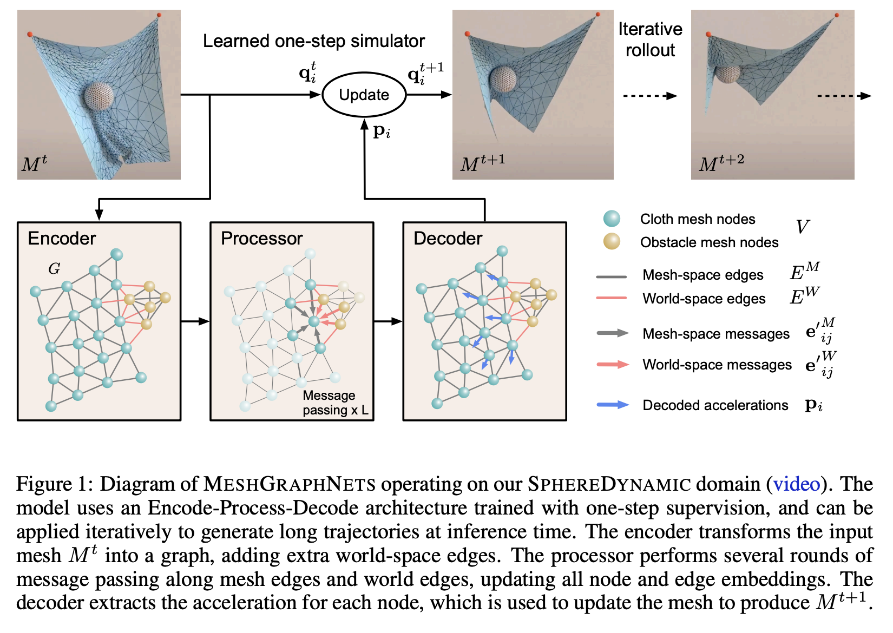

## Table of Contents

## What is a mesh-based simulation model in the context of machine learning?

A mesh-based simulation model in machine learning is a way to represent and analyze complex systems using a network of interconnected points, called a mesh. Imagine a fishing net, where the knots are the points and the strings connecting them are the links. In machine learning, this mesh can be used to model things like how heat spreads in a material, how fluids move, or even how a disease might spread through a population. Each point in the mesh can represent a small part of the system, and the connections between points help simulate how changes in one part affect the others.

These models are particularly useful because they can handle complex shapes and interactions that are hard to capture with simpler models. For example, in predicting weather patterns, a mesh-based model can simulate how air moves over mountains or through valleys. By breaking down the system into smaller, manageable parts, machine learning algorithms can learn from the data collected at each point in the mesh. This allows for more accurate predictions and simulations, which can be crucial in fields like engineering, medicine, and environmental science.

## How does MeshGraphNet utilize mesh-based models for simulations?

MeshGraphNet is a type of machine learning model that uses mesh-based simulations to understand and predict how things change over time. It works by creating a mesh, which is like a net where each point (or node) represents a small part of the system being studied. For example, if you're looking at how heat spreads through a metal, each node could represent a tiny piece of that metal. The connections between these nodes help the model see how heat moves from one piece to another. MeshGraphNet learns from data collected at these nodes, figuring out patterns and making predictions based on what it sees.

What makes MeshGraphNet special is how it uses graphs, which are just another way of saying "networks," to handle the data. It turns the mesh into a graph where each node and connection has information attached to it. By looking at this graph, MeshGraphNet can learn how different parts of the system affect each other. This is really helpful for simulations because it can handle complex shapes and movements that other models might struggle with. For instance, it can be used to predict how air flows around an airplane or how a disease might spread through a city, making it a powerful tool for scientists and engineers.

## What are the basic components of a mesh in mesh-based simulation models?

A mesh in mesh-based simulation models is like a net made up of points and lines. The points are called nodes, and they represent small parts of the thing you're studying, like pieces of a material or spots in a city. The lines connecting these nodes are called edges, and they show how the nodes are linked together. Think of it like a map where cities are nodes and roads are edges.

Each node in the mesh can hold information about its part of the system. For example, in a weather simulation, a node might have data about temperature and humidity at that spot. The edges help the model understand how changes at one node can affect others, like how heat might move from a warmer node to a cooler one. By looking at all this data together, the model can make predictions about how the whole system will behave over time.

## Can you explain the process of creating a mesh for simulation purposes?

Creating a mesh for simulation starts with defining the space you want to study. Imagine you're looking at a piece of metal to see how heat spreads through it. You would draw a simple shape around the metal, like a square or a rectangle, to represent the area you're interested in. Next, you divide this shape into smaller parts, called elements. These elements can be simple shapes like triangles or squares. The more elements you use, the more detailed your mesh will be, but it also means more work for your computer.

Once you have your elements, you place nodes at their corners or along their edges. These nodes are like tiny dots that mark important spots in your mesh. Each node can hold information about its part of the space, like temperature or pressure. You then connect these nodes with edges to show how they're related. For example, if you're studying how air flows around a car, you'd connect nodes to show how air moves from one part to another. The final mesh is a network of nodes and edges that your simulation can use to make predictions about how the whole system will behave.

In practice, creating a mesh often involves using special software that helps you draw the shape and divide it into elements. These tools let you adjust the size and shape of the elements to fit your needs. For instance, you might want smaller elements in areas where you expect big changes, like near the edges of the metal where heat might escape faster. Once your mesh is ready, you can run your simulation to see how things change over time, helping you understand and predict the behavior of complex systems.

## What advantages do mesh-based simulation models offer over traditional methods?

Mesh-based simulation models offer several advantages over traditional methods. One big advantage is that they can handle complex shapes and movements better. Traditional models might struggle with things like how air flows around a car or how heat spreads through a weirdly shaped piece of metal. But with a mesh, you can break down these complex shapes into smaller, manageable parts. This makes it easier to see how different parts of the system affect each other, leading to more accurate predictions.

Another advantage is that mesh-based models are more flexible. You can change the size and shape of the elements in the mesh to focus on areas where big changes are happening. For example, if you're studying how a disease spreads in a city, you can use smaller elements in crowded areas where the disease might spread faster. This flexibility helps you get more detailed and accurate results without needing a lot more computer power. Overall, mesh-based models are a powerful tool for understanding and predicting how complex systems behave.

## How does MeshGraphNet integrate machine learning to improve simulation accuracy?

MeshGraphNet uses [machine learning](/wiki/machine-learning) to make simulations more accurate by turning the mesh into a graph. Think of a graph like a map with cities and roads. In MeshGraphNet, the cities are the nodes of the mesh, and the roads are the connections between them. Each node and connection has information attached to it, like temperature or speed. By looking at this graph, MeshGraphNet can learn how changes in one part of the system affect other parts. This helps the model understand complex patterns and make better predictions about how things will change over time.

For example, if you're studying how heat spreads through a metal, MeshGraphNet can learn from the data at each node how heat moves from warmer to cooler spots. It uses this information to predict how heat will spread in the future. By continuously learning from the data, MeshGraphNet can improve its predictions, making the simulation more accurate. This is especially helpful for complex systems where traditional methods might not capture all the details.

## What types of problems can be effectively simulated using mesh-based models?

Mesh-based models are great for simulating things like how heat moves through a material or how air flows around an object. Imagine you're trying to figure out how heat spreads through a piece of metal. With a mesh, you can break down the metal into tiny parts and see how heat travels from one part to another. This is really useful for engineers who need to design things that can handle heat well, like car engines or computer chips. Mesh-based models can also help predict how air moves around a car or an airplane, which is important for making them more efficient and safe.

Another area where mesh-based models shine is in understanding how diseases spread through a population. By using a mesh to represent different areas of a city or a country, scientists can track how a disease moves from one place to another. This can help them figure out where to focus their efforts to stop the spread. Mesh-based models are also used in environmental science to simulate how pollutants spread through water or air, which is crucial for protecting our environment. Overall, these models are powerful tools for tackling complex problems in many different fields.

## What are the challenges faced when implementing mesh-based simulation models?

One challenge with mesh-based simulation models is that they can be very complex and take a lot of computer power. When you break down a system into many small parts, you need a lot of data and calculations to make the simulation work. This can make the computer slow down or even crash if it's not powerful enough. Also, creating a good mesh can be hard. You have to decide how big or small to make the parts of the mesh, and this can affect how accurate your simulation is. If the parts are too big, you might miss important details, but if they're too small, it can take too long to run the simulation.

Another challenge is that mesh-based models can be hard to set up and use. You need special software to create and manage the mesh, and learning how to use this software can take time. Sometimes, you might need to change the mesh as you learn more about the system you're studying, which can be tricky. Also, these models can be sensitive to small changes. If you make a small mistake in setting up the mesh, it can lead to big errors in your simulation results. This means you have to be very careful and check your work a lot to make sure everything is right.

## How can mesh-based models be optimized for performance in machine learning applications?

One way to make mesh-based models work better in machine learning is to use smarter ways to create and manage the mesh. You can start by making the mesh less detailed in areas where not much is happening, and more detailed where big changes are expected. This saves computer power because you're not wasting time on parts that don't need it. Another trick is to use special math methods to solve the equations faster. For example, you can use something called the "finite element method" to break down the problem into smaller, easier pieces. By doing this, you can get results quicker without losing too much accuracy.

Another important way to improve performance is to use machine learning to help with the simulation. You can train a model to predict how the system will behave based on past data. This can make the simulation run faster because the model can guess what will happen next without having to calculate everything from scratch. Also, you can use techniques like "parallel computing" to make the simulation run on multiple computers at the same time. This can speed things up a lot, especially for big and complex systems. By combining these strategies, you can make mesh-based models more efficient and useful for solving real-world problems.

## What advanced techniques can be used to enhance the predictive capabilities of MeshGraphNet?

One advanced technique to boost MeshGraphNet's predictive power is to use more data to train it. The more examples MeshGraphNet sees, the better it can understand how different parts of a system affect each other. For instance, if you're predicting how heat spreads through a metal, you can give MeshGraphNet data from many different experiments with different shapes and sizes of metal. This helps it learn patterns and make more accurate predictions. Another way to improve MeshGraphNet is by using a technique called "transfer learning." This means you can start with a model that's already good at predicting something similar, and then fine-tune it for your specific problem. This can save time and make your predictions even better.

Another technique is to use something called "ensemble methods." This means you can combine the predictions from several different MeshGraphNet models to get a more accurate overall prediction. Imagine you're trying to guess how a disease will spread through a city. If you have three different MeshGraphNet models, each trained on slightly different data, you can average their predictions to get a better guess. Additionally, you can use "graph neural networks" to make MeshGraphNet even smarter. These networks are really good at understanding how things are connected in a mesh, which can help MeshGraphNet predict how changes in one part of the system will affect other parts. By using these advanced techniques, MeshGraphNet can become a powerful tool for making accurate predictions in all sorts of complex systems.

## How does MeshGraphNet handle complex geometries and dynamic simulations?

MeshGraphNet is great at dealing with complex shapes and things that move around a lot. It does this by using a mesh, which is like a net made of tiny points and lines. Each point in the mesh can represent a small piece of the shape you're studying, like a piece of metal or a part of a city. The lines connecting these points show how they're related to each other. When you have a weird shape, like a twisted piece of metal, MeshGraphNet can break it down into these small parts and still understand how heat or something else might move through it. This makes it really good at handling shapes that are hard to deal with using simpler methods.

For things that are moving and changing, MeshGraphNet can keep track of how the mesh changes over time. Imagine you're looking at how air flows around a car as it speeds up. MeshGraphNet can update the mesh to show how the air moves differently as the car goes faster. It does this by learning from the data at each point in the mesh, figuring out patterns, and then making predictions about how things will change next. By using graphs, which are just networks of points and lines, MeshGraphNet can understand these complex and changing systems really well. This makes it a powerful tool for simulations where things are always moving and changing.

## What future developments are expected in the field of mesh-based simulation models and machine learning?

In the future, mesh-based simulation models and machine learning are expected to become even more powerful and easier to use. One big change might be that these models will get better at handling even more complex shapes and movements. Scientists and engineers might use new kinds of machine learning, like [deep learning](/wiki/deep-learning), to make these models learn faster and make better predictions. This could mean that MeshGraphNet, for example, could predict how heat spreads through a twisted piece of metal even more accurately. Another exciting development could be that these models will work better on regular computers, so more people can use them without needing super expensive machines.

Another area where we might see big improvements is in how these models can work together with other technologies. For example, mesh-based models could be combined with virtual reality to let engineers see and interact with their simulations in 3D. This could help them understand and fix problems faster. Also, these models might start using data from the internet, like weather data or traffic information, to make even better predictions about things like how a disease might spread through a city. By using all this data, mesh-based models could become super helpful tools for solving real-world problems in many different fields.

## References & Further Reading

[1]: Pfaff, F. (2012). ["Principles of Computational Fluid Dynamics"](https://link.springer.com/book/10.1007/978-3-642-05146-3). Springer Series in Computational Mathematics.

[2]: Bridson, R. (2015). ["Fluid Simulation for Computer Graphics"](https://www.taylorfrancis.com/books/mono/10.1201/9781315266008/fluid-simulation-computer-graphics-robert-bridson). CRC Press.

[3]: Aluru, N. (2015). ["Handbook of Meshfree Methods Applications in Fluids, Structures, and Electromagnetics"](https://scholar.google.com/citations?user=sACU-OUAAAAJ&hl=en). Springer.

[4]: Guibas, L. J., & Eppstein, D. (1995). ["Discrete and Computational Geometry"](https://ics.uci.edu/~eppstein/pubs/a-guibas.html). Cambridge University Press.

[5]: Kato, J., & Kotake, T. (1992). ["Methodology of Mesh Generation"](https://www.scirp.org/reference/referencespapers?referenceid=1409791). CRC Press.