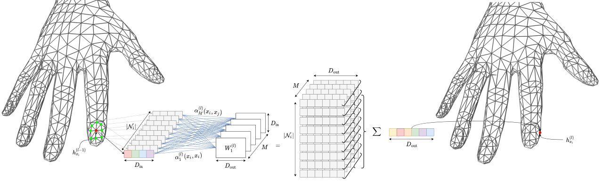

## Table of Contents

## What is Mesh in the context of machine learning?

In the context of machine learning, a mesh refers to a grid or network of points that are used to represent data in a structured way. Imagine you have a piece of cloth with lots of tiny holes in it; each hole can be thought of as a point in the mesh. In machine learning, this mesh can be used to visualize and process data, especially when dealing with complex models or high-dimensional spaces. For example, in image processing, a mesh can help in understanding how different parts of an image relate to each other spatially.

Meshes are particularly useful in techniques like neural networks, where they can help in creating and optimizing models. For instance, in a convolutional neural network, a mesh can represent the layers of the network, showing how data flows from one layer to the next. This structured approach can make it easier to see patterns and relationships in the data, which is crucial for training accurate models. Overall, meshes provide a way to break down complex data into manageable parts, making it easier for machine learning algorithms to process and learn from it.

## How does Mesh differ from traditional neural networks?

Mesh and traditional neural networks differ mainly in how they organize and process data. In a traditional neural network, data flows through layers of interconnected nodes or neurons. Each layer processes the data and passes it to the next layer until the final output is produced. This structure is good for tasks like classification or regression where the input data is relatively straightforward. However, traditional neural networks can struggle with data that has complex spatial relationships or high dimensionality.

Mesh, on the other hand, uses a grid-like structure to represent data, which is particularly useful for tasks involving spatial data, such as image or 3D object processing. In a mesh, each point or node in the grid can be connected to its neighbors, allowing the model to capture local relationships and patterns more effectively. This makes mesh-based models better suited for tasks like image segmentation or object recognition, where understanding the spatial arrangement of data is crucial. By using a mesh, the model can better handle the intricacies of spatial data, leading to more accurate and detailed results.

## What are the basic components of a Mesh architecture?

A Mesh architecture in [machine learning](/wiki/machine-learning) is made up of a grid of points, called nodes, that are connected to each other. These nodes can represent different pieces of data, like pixels in an image. The connections between the nodes allow the model to understand how different parts of the data relate to each other. Each node can have features or values that describe the data at that point. For example, in an image, a node might have values for red, green, and blue color intensities.

The way these nodes are connected can vary depending on the specific task. In some cases, each node might be connected to its immediate neighbors, forming a regular grid. In other cases, the connections might be more complex, allowing the model to capture long-range relationships in the data. The connections between nodes are often represented by weights, which the model learns during training. These weights help the model understand which connections are important for making predictions or understanding the data. By adjusting these weights, the model can improve its performance over time.

## Can you explain the concept of Mesh nodes and their function?

Mesh nodes are like little points on a grid that help a computer understand data, especially when it comes to things like pictures or 3D shapes. Each node can hold information about a specific part of the data. For example, if you're looking at an image, each node might represent a pixel and hold values for colors like red, green, and blue. These nodes are connected to each other, kind of like how dots in a connect-the-dots picture are linked. This helps the computer see how different parts of the data relate to each other, making it easier to understand patterns and relationships.

The connections between the nodes are really important. They let the computer know which parts of the data are close to each other and how they affect each other. These connections can be simple, like each node only talking to its neighbors, or more complex, where nodes can communicate over longer distances. During training, the computer learns how strong these connections should be. It does this by changing the weights of the connections, which are like scores that tell the computer how important each connection is. By adjusting these weights, the computer gets better at understanding and processing the data, which helps it make more accurate predictions or decisions.

## How does data flow through a Mesh network?

In a Mesh network, data flows through a grid of connected points called nodes. Each node can hold information about a small piece of the data, like a pixel in an image. When data enters the Mesh, it starts at these nodes. The nodes are connected to each other, and the data moves from one node to another through these connections. The connections between the nodes help the computer understand how different parts of the data relate to each other. For example, in an image, the nodes might be connected in a way that shows which pixels are next to each other.

As the data flows through the Mesh, it gets processed at each node. The connections between the nodes have weights, which are like scores that tell the computer how important each connection is. During training, the computer adjusts these weights to make the Mesh better at understanding the data. The data moves through the Mesh in a way that allows the computer to see patterns and relationships. This helps the Mesh make predictions or decisions based on the data it has processed. By the time the data reaches the end of the Mesh, it has been transformed and analyzed, ready for the computer to use it for tasks like image recognition or object detection.

## What are the advantages of using Mesh for machine learning tasks?

Using Mesh in machine learning is great because it helps the computer understand data that has a lot of parts that are related to each other, like pictures or 3D shapes. Imagine you have a picture of a cat. With Mesh, the computer can see how the different pixels in the picture connect to each other, making it easier to recognize the cat's shape and features. This is really helpful for tasks like recognizing objects in images or understanding how different parts of a 3D model fit together. By using Mesh, the computer can process these complex relationships more accurately, leading to better results in tasks like image segmentation or object detection.

Another advantage of Mesh is that it can handle data with many dimensions, which is something traditional neural networks might struggle with. In a Mesh, each point, or node, can be connected to its neighbors, allowing the computer to see patterns and connections over long distances in the data. This makes it easier for the computer to learn from the data and make predictions. For example, in a medical image, Mesh can help the computer understand how different parts of the image relate to each other, which can be crucial for diagnosing diseases. Overall, Mesh makes it easier for the computer to process and learn from complex data, improving the accuracy and effectiveness of machine learning models.

## What types of problems are best suited for Mesh machine learning?

Mesh machine learning is really good for problems that involve understanding how different parts of data are connected, like in pictures or 3D models. Imagine you have a photo of a dog. With Mesh, the computer can see how the pixels that make up the dog's fur are related to each other, making it easier to recognize the whole dog. This is super helpful for tasks like figuring out what objects are in an image or understanding the shape of a 3D object. By using Mesh, the computer can better understand these complex relationships, leading to more accurate results in tasks like image segmentation or object detection.

Another type of problem where Mesh shines is when you're dealing with data that has a lot of dimensions. Traditional neural networks can struggle with this, but Mesh can handle it well. In a Mesh, each point, or node, can be connected to its neighbors, allowing the computer to see patterns and connections over long distances in the data. This is really useful in fields like medicine, where you might need to understand how different parts of a medical image relate to each other to diagnose a disease. Overall, Mesh makes it easier for the computer to process and learn from complex data, improving the accuracy and effectiveness of machine learning models.

## How can Mesh be implemented in a practical machine learning project?

To implement Mesh in a practical machine learning project, you start by setting up a grid of points, or nodes, that represent your data. For example, if you're working on an image recognition project, each node could represent a pixel in the image. You then connect these nodes to each other to create a network that shows how different parts of the image relate to each other. This can be done using a programming language like Python with libraries like PyTorch or TensorFlow, which have tools for creating and working with Mesh structures. Once your Mesh is set up, you need to train it by feeding it data and adjusting the weights of the connections between nodes. This helps the Mesh learn to recognize patterns and relationships in the data, improving its ability to make accurate predictions or decisions.

In a real project, let's say you're trying to detect objects in photos. You would use the Mesh to process the image data, allowing the computer to understand how different pixels are connected and form shapes. This can be particularly useful for tasks like identifying where a car is in a picture. By training the Mesh on many images of cars, it learns to recognize the patterns that make up a car, even if the car is in different positions or lighting conditions. Over time, as the Mesh gets better at understanding these patterns, it becomes more accurate at detecting cars in new photos. This approach can be applied to many other types of data and tasks, making Mesh a versatile tool in machine learning projects.

## What are the current limitations or challenges of using Mesh in machine learning?

One of the main challenges of using Mesh in machine learning is that it can be computationally intensive. Because Mesh involves a lot of nodes and connections, processing all this data can take a lot of time and require powerful computers. This can make it hard to use Mesh for projects where you need quick results or if you don't have access to high-end hardware. Another limitation is that setting up and training a Mesh can be more complicated than using traditional neural networks. You need to carefully design the connections between nodes and make sure the Mesh is structured in a way that helps it learn from the data effectively. This can be tricky and might require a lot of trial and error to get right.

Another challenge is that Mesh might not be the best choice for all types of data. While it's great for understanding spatial relationships in images or 3D models, it might not be as effective for simpler data like numbers or text. In these cases, traditional neural networks might be easier to use and just as effective. Additionally, interpreting the results from a Mesh can be more difficult because of its complex structure. Understanding how the Mesh makes its predictions or decisions can be challenging, which can make it harder to explain or trust the results. Despite these challenges, Mesh remains a powerful tool for certain types of machine learning tasks, especially those involving complex spatial data.

## How does Mesh handle scalability and performance compared to other machine learning models?

Mesh can be a bit tricky when it comes to scaling up and keeping performance high. Because Mesh uses a lot of nodes and connections to understand data, it can take a lot of computer power to process everything. This means that if you want to use Mesh for big projects with a lot of data, you might need really powerful computers or more time to get results. Compared to simpler models like traditional neural networks, Mesh might not be as fast or easy to scale up. But, if you have the right hardware and time, Mesh can do a great job at understanding complex data, like pictures or 3D shapes.

On the other hand, Mesh can be really good at handling certain types of data that other models might struggle with. For example, if you're working with images or 3D models, Mesh can help the computer see how different parts of the data are connected, which can lead to more accurate results. This makes Mesh a powerful tool for tasks like image recognition or object detection, even if it takes more time and resources. So, while Mesh might not be the best choice for every project, especially those that need quick results or have limited computing power, it can be a great option when you need to understand complex spatial relationships in your data.

## What are some advanced techniques used to optimize Mesh networks?

One advanced technique to optimize Mesh networks is called pruning. Pruning involves removing connections between nodes that aren't very important. This helps make the Mesh smaller and faster to process, without losing much accuracy. Imagine you have a big connect-the-dots picture. If you remove some of the lines that don't really change the overall shape, the picture still looks the same, but it's simpler to draw. By using pruning, you can make your Mesh more efficient and easier to work with, especially when dealing with large amounts of data.

Another technique is called quantization. Quantization means changing the weights of the connections in the Mesh to use fewer bits. This makes the Mesh use less memory and be faster to process. Think of it like using a simpler code to describe something. If you use fewer numbers to represent the weights, the computer can handle the Mesh more quickly. This is really helpful when you want to use Mesh on devices with limited memory or processing power, like smartphones or small computers. By using quantization, you can make your Mesh work better on different types of hardware.

## Can you discuss any recent developments or research trends in Mesh machine learning?

Recent developments in Mesh machine learning have focused on improving its efficiency and applicability to new types of data. One exciting trend is the use of Mesh for processing point cloud data, which is common in 3D scanning and autonomous driving. Researchers are working on ways to make Mesh networks better at understanding these complex, unstructured data sets. For example, they're developing new algorithms that can handle the irregular connections in point clouds more effectively. This could lead to better performance in tasks like 3D object recognition and scene understanding, making Mesh even more useful in real-world applications.

Another trend is the integration of Mesh with other machine learning techniques, like graph neural networks. By combining Mesh with graph neural networks, researchers are trying to create models that can capture both spatial and relational information in data. This hybrid approach could be particularly useful for tasks that involve understanding complex networks, such as social media analysis or molecular structure prediction. These advancements show that Mesh is not just a standalone tool but can be part of a larger, more versatile machine learning ecosystem, opening up new possibilities for solving challenging problems.