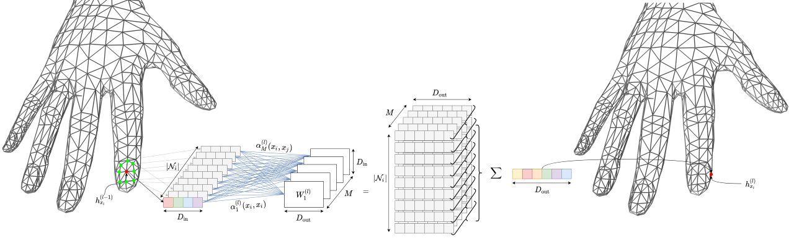

## Table of Contents

## What is meshing in the context of machine learning?

In the context of machine learning, meshing refers to the process of creating a grid or mesh of points in a space where data exists. This is often used in techniques like finite element methods or in the visualization and analysis of high-dimensional data. Imagine you have a set of data points scattered in a space. Meshing helps by connecting these points in a structured way, like drawing lines between dots to form a net. This net, or mesh, can then be used to understand the relationships between the data points more clearly and to make predictions or simulations based on this structured representation.

Meshing is particularly useful in fields like computer vision and computational fluid dynamics, where understanding the spatial relationships between data points is crucial. For example, in image processing, meshing can help in segmenting an image into different regions based on pixel values. By creating a mesh, algorithms can better analyze the continuity and changes across the image, which can improve the accuracy of tasks like object recognition or image enhancement. Overall, meshing transforms raw, unstructured data into a format that is easier for machine learning models to process and interpret, thereby enhancing the performance and efficiency of these models.

## How does meshing contribute to 3D reconstruction?

Meshing plays a key role in 3D reconstruction by turning a collection of data points into a solid 3D model. Imagine you have a bunch of dots in space from a 3D scanner. These dots, called point clouds, don't give you a complete picture by themselves. Meshing connects these dots with lines and surfaces, creating a mesh that looks like a net. This net helps to fill in the gaps between the dots, making it easier to see the full shape of an object. By doing this, meshing helps to create a detailed and accurate 3D model that can be used in various applications, like virtual reality or computer-aided design.

The process of meshing in 3D reconstruction involves several steps. First, the algorithm identifies which points are close to each other. Then, it starts connecting these points to form triangles or other shapes. These shapes are the basic building blocks of the mesh. The quality of the mesh depends on how well these shapes fit together. A good mesh will have smooth surfaces and accurately represent the original object. This is important because a high-quality mesh leads to better 3D models, which are crucial for applications that require precise representations, like medical imaging or architectural modeling.

## What are the basic principles behind meshing algorithms?

Meshing algorithms work by connecting points in space to create a network of shapes, usually triangles or quadrilaterals. The main goal is to make sure these shapes fit together well, without gaps or overlaps. To do this, the algorithm first looks at how close the points are to each other. It then decides which points to connect, trying to make the shapes as even and smooth as possible. This process is important because a good mesh helps to accurately represent the shape of an object, which is crucial for things like 3D printing or computer simulations.

Another key principle is to balance the trade-off between the quality of the mesh and the time it takes to create it. A very detailed mesh might look great but could take a long time to make. On the other hand, a quick mesh might not be as accurate. Meshing algorithms often use mathematical formulas to decide how to connect the points in a way that's both fast and accurate. For example, they might use a formula like $$ \text{quality} = \frac{4\sqrt{3} \times \text{area}}{\text{circumradius}^2} $$ to measure the quality of a triangle. By adjusting how they connect the points, the algorithms can create a mesh that's good enough for the job without taking too long.

## Can you explain the difference between voxel-based and mesh-based representations?

Voxel-based representations are like 3D versions of pixels. Imagine a 3D space divided into tiny cubes, where each cube, or voxel, can have a different color or value. This is useful for things like medical imaging, where you want to see the inside of a body in 3D. Voxels are easy to work with because they're regular and simple, but they can use a lot of memory, especially for detailed models. Think of it like building a 3D model out of Lego blocks - it's straightforward but can get very big very quickly.

Mesh-based representations, on the other hand, are more like connecting dots to make a net. Instead of using cubes, you use points and connect them with lines to make shapes, usually triangles or quadrilaterals. This is great for 3D models that need to look smooth and realistic, like in video games or movies. Meshes can be more efficient than voxels because they don't need as many points to represent the same shape. However, creating a good mesh can be tricky and might take more time and math to get right. It's like drawing a 3D object with a wireframe - it can be more complex to set up but looks more natural in the end.

## What is NICE-SLAM and how does it use meshing in its approach?

NICE-SLAM, which stands for Neural Implicit Continuous Encoding for Simultaneous Localization and Mapping, is a method used in robotics to help machines understand and map their surroundings in real-time. It uses neural networks to create a smooth and continuous representation of the environment, which is different from traditional methods that might use discrete points or voxels. NICE-SLAM is particularly good at making detailed and accurate 3D maps, which is important for robots that need to move around safely and efficiently.

In NICE-SLAM, meshing plays a key role in turning the continuous neural representation into a usable 3D model. The process starts with the [neural network](/wiki/neural-network) learning how to represent the environment as a smooth surface. Then, meshing algorithms come in to connect points on this surface, creating a mesh of triangles that forms a detailed 3D model. This mesh helps the robot understand the shape and layout of the space around it, making it easier to navigate and avoid obstacles. By using meshing, NICE-SLAM can create high-quality 3D maps that are both accurate and efficient.

## How does NeuralRecon utilize meshing for 3D scene reconstruction?

NeuralRecon is a method that helps create 3D models of scenes using neural networks. It works by taking a bunch of pictures from different angles and figuring out how to put them together to make a 3D model. The neural network learns to understand the shapes and details in the pictures and then uses this information to create a smooth 3D surface. This surface is important because it helps to make the 3D model look realistic and detailed.

Meshing is a big part of how NeuralRecon turns the neural network's output into a 3D model. After the neural network figures out the 3D surface, meshing algorithms come in to connect points on this surface. They create a net of triangles that covers the whole surface, making it look like a 3D model. This mesh helps to show the shape of the scene accurately, which is important for things like virtual reality or computer games where you need the 3D model to look just right.

## What are the challenges faced when implementing meshing techniques in machine learning?

One of the main challenges in implementing meshing techniques in [machine learning](/wiki/machine-learning) is dealing with the complexity of data. When you have a lot of data points, figuring out how to connect them into a good mesh can be really hard. It's like trying to draw a perfect net over a bunch of scattered dots. The algorithm has to decide which dots to connect and how to make the shapes fit together well. This can take a lot of time and computing power, especially if you want a very detailed and accurate mesh. Another issue is that if the data points are not evenly spread out, it can be tough to create a smooth mesh. The algorithm might struggle to fill in gaps or avoid overlapping shapes, which can make the final 3D model look less realistic.

Another challenge is balancing the quality of the mesh with how fast it can be created. A really detailed mesh might look great, but it could take a long time to make. On the other hand, a quick mesh might not be as accurate. This trade-off can be tricky to manage. Meshing algorithms often use math formulas to measure the quality of the shapes they create. For example, they might use $$ \text{quality} = \frac{4\sqrt{3} \times \text{area}}{\text{circumradius}^2} $$ to check how good a triangle is. By tweaking how they connect the points, the algorithms can find a balance that works well enough for the job without taking too long. This balance is important because in machine learning, you often need to process data quickly and efficiently.

## How do you evaluate the quality of a mesh generated by a machine learning model?

Evaluating the quality of a mesh generated by a machine learning model involves looking at how well the mesh represents the original data. One way to do this is by checking the shapes in the mesh. A good mesh will have shapes that are even and smooth, without any gaps or overlaps. For example, if the mesh is made of triangles, you can use a formula like $$ \text{quality} = \frac{4\sqrt{3} \times \text{area}}{\text{circumradius}^2} $$ to measure how good each triangle is. The closer the quality value is to 1, the better the triangle fits into the mesh. This helps to make sure the 3D model looks realistic and accurate.

Another important thing to consider is how the mesh handles the data points. If the points are spread out unevenly, the mesh might have trouble connecting them in a way that looks smooth. You want to see if the mesh can fill in gaps and avoid making shapes that are too stretched or squished. This is important because a high-quality mesh will help the machine learning model understand the shape of the object better, which can improve tasks like 3D reconstruction or simulation. By looking at these factors, you can tell if the mesh is good enough for the job it needs to do.

## What advancements have been made in meshing techniques with the advent of deep learning?

With the advent of [deep learning](/wiki/deep-learning), meshing techniques have seen significant advancements, particularly in how they handle complex and high-dimensional data. Deep learning models, such as neural networks, can learn to create meshes that are more accurate and detailed than traditional methods. For example, techniques like NeuralRecon and NICE-SLAM use neural networks to understand the 3D structure of scenes from images, and then meshing algorithms convert this understanding into a detailed 3D model. These methods can handle the challenges of unevenly distributed data points better, creating smoother and more realistic meshes. By using deep learning, the process of meshing becomes more automated and efficient, reducing the need for manual adjustments and improving the overall quality of the 3D models.

One key advancement is the use of neural implicit representations, which allow for a continuous and smooth representation of 3D spaces. This is different from traditional methods that use discrete points or voxels. Neural networks can learn to represent these spaces in a way that is easier to mesh, leading to higher quality 3D reconstructions. For instance, the quality of a triangle in a mesh can be measured using a formula like $$ \text{quality} = \frac{4\sqrt{3} \times \text{area}}{\text{circumradius}^2} $$. With deep learning, the algorithms can optimize this quality metric more effectively, ensuring that the resulting mesh is as good as possible. These advancements have made meshing more accessible and useful in fields like computer vision, robotics, and virtual reality, where accurate 3D models are crucial.

## How can meshing be optimized for real-time applications in machine learning?

To optimize meshing for real-time applications in machine learning, it's important to balance speed and quality. Traditional meshing can be slow because it needs to connect lots of points carefully to make a good mesh. But in real-time applications, like robots moving around or virtual reality games, you can't wait too long. So, one way to speed things up is to use simpler meshing algorithms that create a basic mesh quickly. These algorithms might not make the mesh as detailed, but they can do the job fast enough for real-time use. Another way is to use deep learning to help with meshing. Deep learning can learn how to make good meshes faster by using neural networks to predict where to connect points. This can make the meshing process quicker and still keep the mesh quality pretty good.

For example, in real-time 3D reconstruction, you might use a formula like $$ \text{quality} = \frac{4\sqrt{3} \times \text{area}}{\text{circumradius}^2} $$ to check how good the triangles in the mesh are. But in real-time, you might not have time to check every triangle so carefully. Instead, you could use a simpler check or let the neural network handle it. This way, you can still get a good enough mesh without slowing down the application. By using these tricks, meshing can be fast enough for real-time machine learning tasks, making things like robots moving around or virtual reality more smooth and realistic.

## What are the future research directions for meshing in machine learning?

Future research in meshing for machine learning will likely focus on making meshing even faster and more accurate. One big area will be using deep learning to make better meshes. Deep learning can learn from lots of data to figure out the best way to connect points into a mesh. This can make the meshing process quicker and the meshes more detailed. Researchers might also look at new ways to measure how good a mesh is, like using a formula like $$ \text{quality} = \frac{4\sqrt{3} \times \text{area}}{\text{circumradius}^2} $$ to check the triangles in the mesh. By finding better ways to check mesh quality, we can make sure the 3D models are as realistic as possible.

Another important direction will be making meshing work well with other machine learning tasks. For example, meshing could help with things like understanding images or making robots move around. Researchers might try to combine meshing with other deep learning methods to make these tasks easier and more accurate. This could mean using meshing to help robots see and understand the world around them in real-time. By working on these ideas, meshing can become a bigger part of machine learning, helping to solve more problems in areas like virtual reality, medical imaging, and robotics.

## Can you discuss any state-of-the-art meshing techniques beyond NICE-SLAM and NeuralRecon?

One state-of-the-art meshing technique beyond NICE-SLAM and NeuralRecon is Point2Mesh, which uses a neural network to directly predict the mesh from a set of 3D points. This method is particularly good at creating smooth surfaces and detailed 3D models from point clouds. Point2Mesh works by iteratively refining the mesh, starting with a rough shape and gradually improving it. This approach can handle complex shapes and is useful for applications like 3D modeling and computer graphics, where high-quality meshes are important. By using deep learning, Point2Mesh can create meshes that are both accurate and efficient, making it a powerful tool for 3D reconstruction.

Another advanced technique is Deep Marching Cubes, which combines traditional meshing methods with deep learning. Deep Marching Cubes uses a neural network to predict the density of a 3D space and then applies the Marching Cubes algorithm to create a mesh from this density field. This method is good at producing high-quality meshes from volumetric data, which is useful in medical imaging and scientific visualization. The neural network helps to make the mesh more accurate and detailed than traditional methods alone. By using a formula like $$ \text{quality} = \frac{4\sqrt{3} \times \text{area}}{\text{circumradius}^2} $$, researchers can check the quality of the triangles in the mesh and make sure they fit together well. Deep Marching Cubes is a promising approach for creating detailed 3D models quickly and accurately.

## References & Further Reading

[1]: Botsch, M., Kobbelt, L., Pauly, M., Alliez, P., & Lévy, B. (2010). ["Polygon Mesh Processing."](https://www.taylorfrancis.com/books/mono/10.1201/b10688/polygon-mesh-processing-mario-botsch-pierre-alliez-bruno-levy-leif-kobbelt-mark-pauly) CRC Press.

[2]: Kazhdan, M., Bolitho, M., & Hoppe, H. (2006). ["Poisson Surface Reconstruction."](https://dl.acm.org/doi/10.5555/1281957.1281965) Proceedings of the Fourth Eurographics Symposium on Geometry Processing.

[3]: Zienkiewicz, O. C., & Taylor, R. L. (2000). ["The Finite Element Method Set."](https://www.sciencedirect.com/book/9780750664318/the-finite-element-method-set) Butterworth-Heinemann.

[4]: Curless, B., & Levoy, M. (1996). ["A Volumetric Method for Building Complex Models from Range Images."](https://dl.acm.org/doi/10.1145/237170.237269) Proceedings of the 23rd Annual Conference on Computer Graphics and Interactive Techniques.

[5]: Li, J., & Zhang, Z. (2022). ["NeuralRecon: Real-Time Coherent 3D Reconstruction from Monocular Video."](https://arxiv.org/abs/2104.00681) arXiv preprint arXiv:2104.00783.

[6]: Zhong, Y., & Li, Y. (2021). ["Point2Mesh: A Neural Network Approach for Point Cloud to Mesh Reconstruction."](https://github.com/Colin97/Point2Mesh) Proceedings of the IEEE/CVF Conference on Computer Vision and Pattern Recognition (CVPR).

[7]: Mescheder, L., Oechsle, M., Niemeyer, M., Nowozin, S., & Geiger, A. (2019). ["Occupancy Networks: Learning 3D Reconstruction in Function Space."](https://arxiv.org/abs/1812.03828) Proceedings of the IEEE/CVF Conference on Computer Vision and Pattern Recognition (CVPR).

[8]: Lorensen, W. E., & Cline, H. E. (1987). ["Marching Cubes: A High Resolution 3D Surface Construction Algorithm."](https://dl.acm.org/doi/10.1145/37402.37422) ACM SIGGRAPH Computer Graphics.