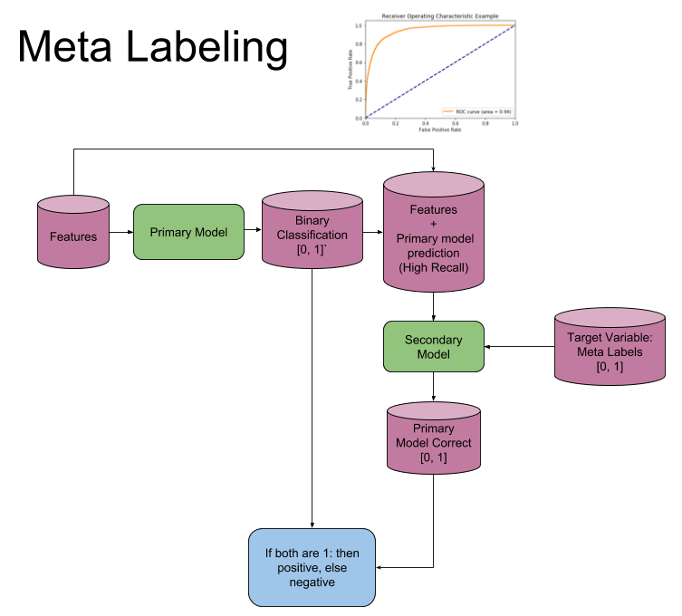

## Table of Contents

## What is meta-labeling?

Meta-labeling is a way to organize and understand big sets of data better. It means adding extra labels or tags to data that already has labels. These extra labels help to see patterns and connections that might be hard to notice at first. For example, if you have a bunch of pictures labeled as "dog" or "cat," meta-labeling could add labels like "indoor" or "outdoor" to show where the pictures were taken.

This method is useful in many areas, like science, business, and technology. In science, meta-labeling can help researchers sort through lots of data to find important information faster. In business, it can help companies understand their customers better by looking at different ways to group their data. In technology, especially in artificial intelligence, meta-labeling can improve how machines learn from data, making them smarter and more useful.

## How does meta-labeling differ from traditional labeling?

Meta-labeling is different from traditional labeling because it adds more layers of information to data that's already been labeled. Traditional labeling is like putting a single tag on something, like calling a picture a "dog." It's simple and direct. But meta-labeling goes further by adding more tags to that same picture, like "outdoor" or "playing," to give more details about what's in the picture and the context around it.

This extra information from meta-labeling helps us understand and use data in new ways. With traditional labeling, you might know you have a lot of dog pictures, but with meta-labeling, you can see patterns like most dogs are photographed outdoors or during playtime. This deeper understanding can be really helpful in fields like research, where scientists need to sort through huge amounts of data, or in business, where understanding customer behavior in detail can lead to better products and services.

## What are the basic steps involved in the meta-labeling process?

The first step in meta-labeling is to start with data that already has basic labels. For example, you might have a set of pictures labeled as "dog" or "cat." Next, you need to think about what extra information could be useful. This might be things like where the picture was taken, what the animal is doing, or the time of day. You then go through the data and add these new labels, making sure they are accurate and helpful.

After adding the new labels, the next step is to check and organize them. You need to make sure the new labels make sense and are consistent across all the data. This might involve going back and fixing any mistakes or adding more labels if needed. Once everything is labeled correctly, you can start using the data in new ways. The extra labels help you see patterns and connections that were hard to see before, making the data more useful for things like research or business decisions.

## What tools or software are commonly used for meta-labeling?

There are many tools and software that people use for meta-labeling. Some popular ones include LabelImg, which is good for adding labels to images, and CVAT (Computer Vision Annotation Tool), which lets you add different types of labels to videos and images. These tools have easy-to-use interfaces that help you add and manage labels quickly. Another tool, Prodigy, is great for [machine learning](/wiki/machine-learning) projects because it helps you add labels and also uses what you've labeled to suggest new labels.

Besides these, there are also general data management platforms like Google Cloud's Data Labeling Service and Amazon SageMaker Ground Truth. These platforms are useful because they can handle big sets of data and work well with other tools in the cloud. They let you add labels and also use machine learning to help with the labeling process, making it faster and more accurate. No matter which tool you choose, the goal is to make the process of adding and managing labels easier and more effective.

## Can you explain the benefits of using meta-labeling in data management?

Using meta-labeling in data management helps a lot because it adds more details to the data. When you have basic labels like "dog" or "cat" on pictures, meta-labeling can add more labels like "outdoor" or "playing." This extra information makes it easier to see patterns and connections that you might miss with just basic labels. For example, if you're a scientist studying animal behavior, meta-labeling can help you quickly find all the pictures of dogs playing outside, which can speed up your research.

Meta-labeling also makes data more useful for businesses. Companies can use it to understand their customers better. If a store has data on what people buy, meta-labeling can add labels like "time of day" or "season." This can show the store when people are more likely to buy certain things, helping them plan better. In technology, especially in [artificial intelligence](/wiki/ai-artificial-intelligence), meta-labeling helps machines learn from data more effectively. This can make AI systems smarter and more helpful in things like recognizing speech or understanding images.

## What industries or fields benefit most from meta-labeling?

Meta-labeling is really helpful in science, especially in fields like biology and medicine. Scientists use it to sort through huge amounts of data quickly. For example, if they are studying diseases, meta-labeling can help them find patterns in patient data, like which symptoms are common in certain groups of people. This can speed up research and help find new treatments faster.

In business, meta-labeling is also very useful. Companies can use it to understand their customers better. For instance, a store might use meta-labeling to see when people are more likely to buy certain products, like during holidays or at certain times of the day. This helps businesses plan their sales and marketing strategies better, leading to more sales and happier customers.

In technology, especially in artificial intelligence, meta-labeling helps machines learn from data more effectively. For example, in image recognition, adding meta-labels like "indoor" or "outdoor" to pictures can help AI systems understand images better. This makes AI tools smarter and more useful in everyday tasks, like recognizing speech or sorting through large sets of data.

## How does meta-labeling impact data quality and accuracy?

Meta-labeling can make data better and more accurate. When you add extra labels to data, you give more details about it. This can help you find mistakes or missing information that you might miss with just basic labels. For example, if you have pictures labeled as "dog," adding labels like "indoor" or "outdoor" can help you see if any pictures are labeled wrong. This makes the data more reliable because you can fix errors and make sure the labels are right.

But, meta-labeling can also make things harder if it's not done well. If the extra labels are not clear or are added in a messy way, it can make the data confusing. It's important to check and organize the new labels carefully. If you do it right, meta-labeling can make your data much better. But if you don't, it might make the data less accurate and harder to use.

## What are some common challenges faced when implementing meta-labeling?

One common challenge with meta-labeling is making sure the new labels are accurate and consistent. When you add more labels to data, it's easy to make mistakes or use labels that are not clear. This can make the data confusing and less useful. To avoid this, you need to check the labels carefully and make sure everyone adding labels understands what they mean. It takes time and effort to do this right, but it's important for the data to be reliable.

Another challenge is managing a lot of new labels. When you add many different labels, it can get hard to keep track of them all. This can slow down the process of using the data because you have to sort through so many labels. It's helpful to use tools that can help organize and manage the labels, but you still need to be careful and make sure the tools are working well. If you don't manage the labels well, it can make the data harder to use and less accurate.

## How can meta-labeling be integrated into existing data systems?

To integrate meta-labeling into existing data systems, you first need to choose the right tools that work well with your current system. These tools should be able to handle adding new labels to data that already has basic labels. For example, if you are using a system like Google Cloud or Amazon Web Services, you can use their data labeling services to add meta-labels. It's important to make sure these tools can work smoothly with your existing data without causing problems. You might need to train your team on how to use these new tools and make sure everyone understands the new labels and how to apply them correctly.

Once you have the right tools and your team is ready, you can start adding meta-labels to your data. This means going through your data and adding extra details that can help you see new patterns and connections. For example, if you have a database of customer purchases, you might add labels like "time of day" or "season" to see when people are more likely to buy certain things. It's important to keep checking the new labels to make sure they are accurate and useful. Over time, as you get better at meta-labeling, it can make your data more valuable and help you make better decisions.

## What advanced techniques can be applied to enhance meta-labeling?

One advanced technique to enhance meta-labeling is using machine learning. Machine learning can help by looking at the data and suggesting new labels based on patterns it finds. This can make the process of adding meta-labels faster and more accurate. For example, if you have a lot of pictures labeled as "dog," a machine learning model can suggest adding labels like "outdoor" or "playing" based on what it sees in the pictures. This helps because it can find details that might be hard for people to notice, especially when dealing with a lot of data.

Another technique is using crowdsourcing. This means getting help from a lot of people to add meta-labels to the data. By having many people work on the same data, you can make sure the labels are correct and consistent. It's like having a big team that can work together to make the data better. This can be really helpful when you have a lot of data and need to add labels quickly. Both machine learning and crowdsourcing can make meta-labeling easier and more effective, leading to better data and more useful insights.

## How does meta-labeling contribute to machine learning and AI model performance?

Meta-labeling helps machine learning and AI models work better by giving them more details about the data. When you add extra labels to data, like saying a picture of a dog is also "outdoor" or "playing," the AI can learn more about what it's seeing. This extra information helps the AI understand patterns and connections that it might miss with just basic labels. For example, if an AI is learning to recognize dogs, knowing if they are usually outside or playing can help it tell the difference between dogs and other animals more accurately.

Using meta-labeling also makes AI models more useful in real life. When an AI has more detailed information, it can make better decisions and predictions. For instance, in a self-driving car, knowing if a dog is playing in the road can help the car decide how to react safely. By adding these extra labels, the AI can learn from the data more effectively, making it smarter and more helpful in everyday tasks like understanding speech or sorting through large sets of data.

## What future developments or trends can we expect in the field of meta-labeling?

In the future, we might see more use of AI and machine learning to make meta-labeling easier and better. These technologies can look at big sets of data and suggest new labels that people might not think of. This can make the process faster and more accurate, helping us understand our data in new ways. For example, AI could help doctors find patterns in patient data by adding labels like "high risk" or "low risk" based on many different details.

Another trend could be using crowdsourcing more often for meta-labeling. This means getting help from lots of people to add labels to data. By working together, people can make sure the labels are correct and useful. This can be really helpful for big projects where you need to label a lot of data quickly. As more people get involved, we might see new ways of organizing and using data that we haven't thought of yet.

## References & Further Reading

[1]: Bergstra, J., Bardenet, R., Bengio, Y., & Kégl, B. (2011). ["Algorithms for Hyper-Parameter Optimization."](https://papers.nips.cc/paper/4443-algorithms-for-hyper-parameter-optimization) Advances in Neural Information Processing Systems 24.

[2]: ["Advances in Financial Machine Learning"](https://resources.caih.jhu.edu/textbooks/Resources/_pdfs/Advances_In_Financial_Machine_Learning.pdf) by Marcos Lopez de Prado

[3]: ["Evidence-Based Technical Analysis: Applying the Scientific Method and Statistical Inference to Trading Signals"](https://www.amazon.com/Evidence-Based-Technical-Analysis-Scientific-Statistical/dp/0470008741) by David Aronson

[4]: ["Machine Learning for Algorithmic Trading"](https://github.com/stefan-jansen/machine-learning-for-trading) by Stefan Jansen

[5]: ["Quantitative Trading: How to Build Your Own Algorithmic Trading Business"](https://books.google.com/books/about/Quantitative_Trading.html?id=j70yEAAAQBAJ) by Ernest P. Chan