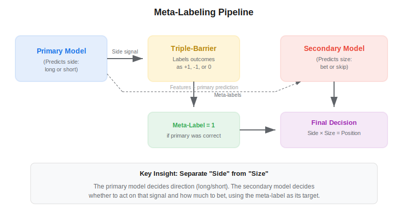
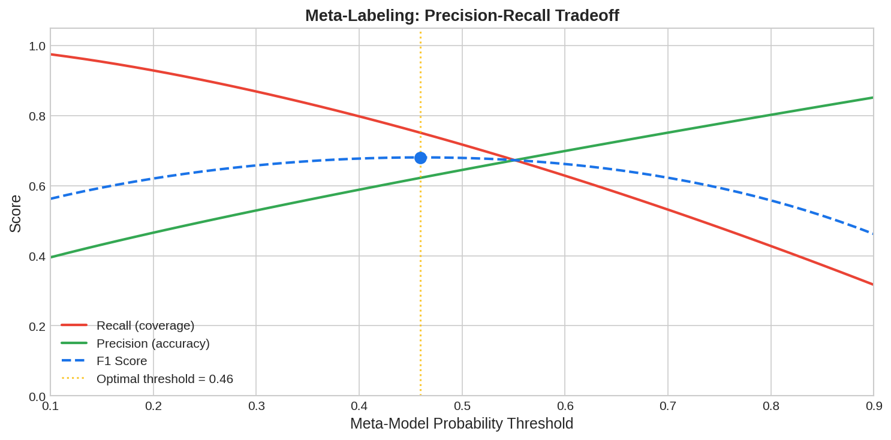

Meta-labeling is a machine learning framework introduced by Marcos Lopez de Prado in *Advances in Financial Machine Learning* (2018) that decouples the problem of **predicting trade direction** (the side) from **predicting trade success** (the size). Instead of asking one model to do everything, meta-labeling uses a primary model to generate directional signals and a secondary model to decide whether to act on each signal and how aggressively to size the position.

## What Is Meta-Labeling?

In traditional approaches, a single classifier is trained to predict labels like `{buy, sell, hold}`. This conflates two fundamentally different tasks: deciding *which direction* to trade and deciding *whether a given signal is worth acting on*. Meta-labeling separates these tasks into a two-stage pipeline:

1. **Primary model** — any signal generator (moving-average crossover, momentum score, fundamental model) that outputs a directional view: long or short.
2. **Secondary model** — a classifier trained on **meta-labels** that learns whether the primary model's signal will be profitable.

The meta-label for each event is binary:

$$y_{\text{meta}} = \begin{cases} 1 & \text{if the primary model's signal was correct (profitable trade)} \\ 0 & \text{if the primary model's signal was wrong (losing trade)} \end{cases}$$

The final trading decision combines both outputs: only trade when the primary model has a directional view *and* the secondary model predicts the signal will succeed.



## How Meta-Labeling Works

### Step 1: Generate Primary Signals

The primary model produces timestamps with a directional signal. For example, a simple trend-following rule based on a moving-average crossover:

```python
import pandas as pd
import numpy as np

def primary_model(close, fast=20, slow=50):
    """Simple MA crossover: +1 for long, -1 for short."""
    ma_fast = close.rolling(fast).mean()
    ma_slow = close.rolling(slow).mean()
    signal = pd.Series(0, index=close.index)
    signal[ma_fast > ma_slow] = 1
    signal[ma_fast < ma_slow] = -1
    return signal.dropna()
```

### Step 2: Label Using the Triple-Barrier Method

Each primary signal event is labeled using the [triple-barrier method](https://paperswithbacktest.com/wiki/triple-barrier-method). If the primary said "long" and the price hit the upper barrier first, that's a correct signal (meta-label = 1). If the price hit the lower barrier, the signal was wrong (meta-label = 0).

### Step 3: Train the Secondary Model

The secondary model takes features (market data, indicators, volatility measures) **plus the primary model's prediction** as inputs, and is trained to predict the meta-label. A random forest or gradient-boosted classifier works well:

```python
from sklearn.ensemble import RandomForestClassifier
from sklearn.model_selection import cross_val_score

def train_meta_model(features, meta_labels):
    """
    Train a secondary model on meta-labels.

    Parameters
    ----------
    features : pd.DataFrame
        Market features + primary model prediction column.
    meta_labels : pd.Series
        Binary labels: 1 = primary signal correct, 0 = incorrect.

    Returns
    -------
    RandomForestClassifier
        Fitted meta-model.
    """
    clf = RandomForestClassifier(
        n_estimators=500,
        max_depth=5,
        min_samples_leaf=10,
        class_weight="balanced_subsample",
        random_state=42,
        n_jobs=-1,
    )
    # Use purged k-fold in production — standard CV shown for simplicity
    scores = cross_val_score(clf, features, meta_labels, cv=5, scoring="f1")
    print(f"Meta-model F1: {scores.mean():.3f} +/- {scores.std():.3f}")
    clf.fit(features, meta_labels)
    return clf
```

### Step 4: Combine Side and Size

At inference time, multiply the primary model's directional signal by the secondary model's predicted probability:

$$\text{position\_size} = \text{side} \times p(\text{meta-label} = 1)$$

A probability threshold controls how selective the strategy is. Higher thresholds improve precision (fewer but better trades) at the cost of recall (missed opportunities).



## Why Meta-Labeling Improves Performance

The key advantage is that meta-labeling converts a hard multi-class problem into a simpler binary classification. The secondary model doesn't need to understand market dynamics from scratch — it only needs to learn which *conditions* make the primary model's existing signals profitable. This typically yields:

| Metric | Without Meta-Labeling | With Meta-Labeling |
|---|---|---|
| Precision | Low (many false positives) | Higher (filters bad signals) |
| Recall | High (takes every signal) | Lower (skips uncertain signals) |
| F1 Score | Moderate | Improved |
| Sharpe Ratio | Baseline | Higher (better risk-adjusted returns) |

The secondary model acts as a quality filter — it learns the market conditions under which the primary model tends to succeed and blocks signals during adverse regimes.

## Bet Sizing from Probabilities

The predicted probability from the meta-model can be used for continuous position sizing rather than binary bet/no-bet decisions. Common approaches include:

- **Linear sizing:** position size proportional to $p(\text{meta} = 1) - 0.5$, scaled to a maximum leverage.
- **Kelly criterion:** optimal bet fraction $f^* = \frac{p \cdot b - q}{b}$ where $p$ is the meta-probability, $q = 1-p$, and $b$ is the win/loss ratio. See [Kelly criterion](https://paperswithbacktest.com/wiki/kelly-criterion-position-sizing) for details.
- **Sigmoid mapping:** $\text{size} = \frac{2}{1 + e^{-\alpha(p - 0.5)}} - 1$ for smoother transitions.

## Limitations and Risks

Meta-labeling is not a silver bullet. The secondary model can overfit to training conditions, especially when the feature space includes highly adaptive indicators. It also inherits any biases from the primary model — if the primary generates systematically bad signals in certain regimes, the meta-model may not have enough positive examples to learn from. Proper validation using [purged k-fold cross-validation](https://paperswithbacktest.com/wiki/purged-k-fold-cross-validation) or [CPCV](https://paperswithbacktest.com/wiki/combinatorial-purged-cross-validation-cpcv) is essential to avoid leakage.

## Conclusion

Meta-labeling is one of the most practical innovations in Lopez de Prado's AFML framework. By separating "what to trade" from "whether to trade," it lets you improve strategy performance without replacing your signal generator. The secondary model learns to filter and size positions intelligently, acting as a risk overlay. Combined with proper [entropy-based features](https://paperswithbacktest.com/wiki/entropy-features) and robust cross-validation, meta-labeling bridges the gap between a promising research signal and a deployable trading strategy.

---

**Explore further on PapersWithBacktest:**
- Browse [backtested ML-driven strategies](https://paperswithbacktest.com/strategies) with Python code and performance metrics
- Access [clean historical market data](https://paperswithbacktest.com/datasets) for equities, crypto, and futures
- Take the [algo trading course](https://paperswithbacktest.com/course) — 60+ video lessons and notebooks
- Related wiki pages: [Triple-Barrier Method](https://paperswithbacktest.com/wiki/triple-barrier-method) · [Purged K-Fold Cross-Validation](https://paperswithbacktest.com/wiki/purged-k-fold-cross-validation) · [CUSUM Filter](https://paperswithbacktest.com/wiki/cusum-filter)
