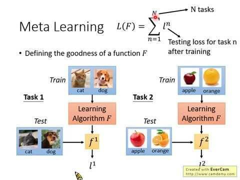

## Table of Contents

## What is meta-learning and how does it differ from traditional machine learning?

Meta-learning, also known as "learning to learn," is a type of machine learning where the goal is to improve the learning process itself. Instead of training a model to perform a specific task, meta-learning focuses on developing models that can quickly adapt to new tasks with minimal data. This is particularly useful in scenarios where data is scarce or when a model needs to perform well on a variety of tasks. For example, a meta-learning algorithm might be used to quickly learn how to classify different types of images even if it has only seen a few examples of each type.

Traditional machine learning, on the other hand, typically involves training a model on a large dataset to perform a single, specific task. For instance, a traditional machine learning model might be trained on thousands of images to recognize cats and dogs. The model learns to identify patterns and features specific to the task at hand. Unlike meta-learning, traditional machine learning does not focus on the ability to adapt quickly to new tasks. Instead, if a new task arises, the model would usually need to be retrained from scratch with a new dataset specific to that task.

## What are some common applications of meta-learning algorithms?

Meta-learning algorithms are used in many areas where quick learning from limited data is important. One common application is in few-shot learning, where a model needs to recognize new objects or categories after seeing just a few examples. For instance, in image classification, a meta-learning algorithm can be trained to identify new types of animals or objects with only a handful of images. This is very useful in fields like healthcare, where doctors might need to quickly identify rare diseases from limited patient data.

Another application of meta-learning is in [reinforcement learning](/wiki/reinforcement-learning), where an agent needs to adapt to new environments or tasks quickly. In robotics, for example, a robot might need to learn new tasks like [picking](/wiki/asset-class-picking) up different objects or navigating new terrains. Meta-learning helps the robot to use its past experiences to learn these new tasks faster. This ability to adapt quickly is crucial for robots that work in changing environments, like warehouses or homes.

Meta-learning also plays a role in natural language processing. For instance, in language translation, a meta-learning algorithm can help a model to quickly adapt to new languages or dialects with limited training data. This is particularly helpful for less common languages where large datasets are not available. By learning how to learn from a variety of languages, the model can improve its performance on new languages much faster than traditional methods.

## Can you explain the basic concept behind Model-Agnostic Meta-Learning (MAML)?

Model-Agnostic Meta-Learning (MAML) is a popular meta-learning approach that aims to train a model so it can quickly adapt to new tasks with just a few examples. The basic idea behind MAML is to find a good starting point for model parameters that can be fine-tuned easily for any new task. Imagine you're learning to ride different types of bikes. Instead of starting from scratch each time, MAML helps you find a way to stand and balance that works well for all bikes, so you only need a little practice to ride a new one.

In MAML, the training process involves two main steps. First, the model is trained on a variety of tasks, and for each task, it takes a few steps to update its parameters. Then, these updated parameters are used to calculate how well the model would perform on new, unseen tasks. The goal is to adjust the initial parameters so that after a few updates, the model performs well on any new task. Mathematically, if $$\theta$$ represents the model's initial parameters, and $$\theta_i'$$ are the parameters after a few updates on task $$i$$, MAML aims to minimize the loss across many tasks: $$\sum_i L_i(\theta_i')$$, where $$L_i$$ is the loss function for task $$i$$. This way, MAML learns to learn, making it easier to adapt to new tasks quickly.

## How does Meta-Reinforcement Learning (MeRL) work and where is it typically applied?

Meta-Reinforcement Learning (MeRL) is a type of meta-learning that focuses on teaching an agent how to learn new tasks quickly in reinforcement learning environments. In traditional reinforcement learning, an agent learns by trial and error to maximize a reward in a specific environment. MeRL, on the other hand, trains the agent on a variety of tasks so it can quickly adapt to new ones. The idea is to find a good starting point for the agent's policy that can be fine-tuned with just a few examples of a new task. This is useful when the agent needs to learn new skills or adapt to changing environments without starting from scratch each time.

MeRL is typically applied in areas like robotics and game playing. In robotics, for example, a robot might need to learn how to pick up different objects or navigate new terrains. By using MeRL, the robot can use its experience from past tasks to quickly learn these new skills. In game playing, MeRL can help an AI agent adapt to new game levels or rules without needing to relearn everything. This makes the agent more versatile and able to handle a wider range of scenarios efficiently.

## What is the purpose of the Meta-Evaluation and Non-Deterministic (MEND) algorithm?

The Meta-Evaluation and Non-Deterministic (MEND) algorithm is designed to improve the performance of meta-learning models by addressing the challenges of evaluation and non-determinism. In meta-learning, it's important to know how well a model can adapt to new tasks. MEND helps by creating a better way to evaluate these models, making sure the results are reliable even when randomness plays a part in the learning process.

MEND works by running the meta-learning process multiple times with different random seeds. This helps to understand how much the results can change due to randomness. By doing this, MEND can give a more accurate picture of how well a meta-learning model will perform on new tasks, making it a useful tool for researchers and developers working on meta-learning algorithms.

## How does the Online Convex Dual (OCD) approach contribute to meta-learning?

The Online Convex Dual (OCD) approach helps meta-learning by making it easier for models to learn from new tasks quickly. In meta-learning, a model needs to adapt to new tasks with just a few examples. OCD does this by solving a dual problem, which is a way to make the learning process smoother and faster. It uses an online learning method, which means it can update the model as new data comes in, without needing to start over. This is helpful because it allows the model to keep getting better as it sees more tasks.

OCD works by turning the original problem into a simpler one that can be solved step-by-step. It uses the idea of convex optimization, which is a way to find the best solution in a smooth and efficient manner. By doing this, OCD helps the model find a good starting point that can be easily adjusted for new tasks. This makes the model more flexible and able to learn from a variety of tasks quickly. Overall, OCD contributes to meta-learning by making the learning process more efficient and adaptable.

## What is meta-augmentation and how does it enhance the learning process?

Meta-augmentation is a technique used in meta-learning to make the learning process better. It involves changing the training data in smart ways to help the model learn faster and perform better on new tasks. Imagine you're learning to recognize different animals. Instead of just showing you pictures of animals, meta-augmentation might show you the same animal in different lighting, angles, or even slightly changed versions. This helps you understand the animal better, no matter how it looks in a new picture.

By using meta-augmentation, the model gets to see a wider variety of examples, which makes it more flexible and ready for new tasks. For example, if a model is trained to recognize cats, meta-augmentation might show it cats in different poses, colors, or backgrounds. This way, when the model sees a new cat, it can recognize it more easily, even if it looks a bit different from the cats it saw during training. This technique helps the model adapt quickly and perform well on tasks it hasn't seen before, making the whole learning process more effective.

## Can you describe the key principles of Knowledge-Intensive Processes (KIP) in meta-learning?

Knowledge-Intensive Processes (KIP) in meta-learning focus on using past experiences and knowledge to make learning new tasks easier and faster. In KIP, the idea is to store and reuse knowledge gained from previous tasks so that when a new task comes up, the model can start with a good understanding. This is like learning math: if you already know how to add and subtract, it's easier to learn multiplication and division. By keeping track of what was learned before, KIP helps the model adapt quickly to new situations without starting from scratch.

In practice, KIP uses techniques like memory networks or knowledge bases to store and access this past knowledge. For example, if a model has learned to classify different types of dogs, it can use that knowledge to help classify cats more easily. This makes the learning process more efficient because the model doesn't have to learn everything anew. Instead, it can build on what it already knows, making it better at handling a variety of tasks with just a few examples.

## What are the challenges faced when implementing meta-learning algorithms in real-world scenarios?

Implementing meta-learning algorithms in real-world scenarios can be tricky because they need a lot of different tasks to learn from. Imagine you're trying to teach a robot to do many different jobs. If the robot only sees a few types of tasks, it won't learn how to adapt well to new ones. This means that to make meta-learning work well, you need a big variety of tasks, which can be hard to find or create in real life. Also, meta-learning algorithms can be complex and need a lot of computing power, which can be expensive and time-consuming.

Another challenge is that meta-learning often relies on having good starting points for new tasks. If the initial knowledge or model isn't good enough, it can be hard for the algorithm to adapt quickly. This is like trying to learn a new language when you don't know any similar languages; it's much harder. Additionally, evaluating how well a meta-learning model is doing can be tricky because the performance can change a lot depending on the random elements in the learning process. This makes it hard to know if the model is really learning to learn or if it's just getting lucky with certain tasks.

## How do meta-learning algorithms adapt to new tasks with limited data?

Meta-learning algorithms are really good at learning new tasks even when they only have a little bit of data. They do this by using what they've learned from other tasks to help them out. Imagine you're trying to learn how to play different board games. If you've played a lot of games before, you can use what you know about strategy and rules to quickly pick up a new game, even if you've only played it a few times. Meta-learning algorithms work the same way. They look at a lot of different tasks and find patterns that help them start with a good guess for the new task. This way, they can adapt quickly without needing a lot of new data.

One popular way meta-learning algorithms do this is by finding a good starting point for their parameters. This is called Model-Agnostic Meta-Learning (MAML). In MAML, the algorithm trains on many tasks and figures out how to update its parameters so that it can do well on new tasks after just a few adjustments. If $$\theta$$ represents the initial parameters, and $$\theta_i'$$ are the parameters after a few updates on task $$i$$, MAML aims to minimize the loss across many tasks: $$\sum_i L_i(\theta_i')$$, where $$L_i$$ is the loss function for task $$i$$. By doing this, MAML learns to learn, making it easier to adapt to new tasks quickly.

## What are the latest advancements in meta-learning algorithms and their potential impact on AI?

Recent advancements in meta-learning algorithms have focused on making them more efficient and adaptable. One notable advancement is the development of more sophisticated few-shot learning techniques, which allow models to learn new tasks from just a few examples. For instance, researchers have improved algorithms like Model-Agnostic Meta-Learning (MAML) by incorporating techniques like Reptile, which simplifies the optimization process and reduces the computational burden. These improvements help meta-learning models adapt to new tasks even faster and with less data, making them more practical for real-world applications.

The potential impact of these advancements on AI is significant. As meta-learning algorithms become more efficient, they can be applied to a broader range of tasks, from healthcare to robotics, where quick adaptation to new situations is crucial. This means AI systems can become more versatile and capable of handling unexpected scenarios, leading to more robust and intelligent applications. For example, in healthcare, a meta-learning model could quickly learn to diagnose new diseases from limited patient data, potentially saving lives by providing timely and accurate medical insights.

## How can one evaluate the performance of different meta-learning algorithms across various domains?

Evaluating the performance of different meta-learning algorithms across various domains involves looking at how well they can adapt to new tasks with limited data. One common way to do this is by using a set of benchmark tasks. These tasks are designed to test the algorithm's ability to learn quickly and effectively. For example, if you're testing a meta-learning algorithm in image classification, you might use a set of different image datasets to see how well the algorithm can classify new images after seeing only a few examples. The performance is usually measured using metrics like accuracy, which tells you how often the algorithm gets the right answer, or loss, which tells you how far off its predictions are from the correct answers.

Another important aspect of evaluation is understanding how the algorithm performs across different types of tasks. This can be tricky because what works well for one type of task, like image classification, might not work as well for another type, like natural language processing. To handle this, researchers often use a variety of tasks from different domains to get a more complete picture of the algorithm's capabilities. They might calculate an average performance across all tasks or look at how the algorithm performs on each task separately. By doing this, they can see if the algorithm is truly learning to learn or if it's just good at a specific type of task.