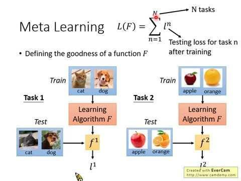

## Table of Contents

## What is meta-learning in the context of machine learning?

Meta-learning, often called "learning to learn," is a type of machine learning where the goal is to improve the learning process itself. Instead of focusing on a single task, meta-learning aims to make models better at learning new tasks quickly and efficiently. Imagine you're learning a new language; meta-learning would be like figuring out the best strategies and techniques that help you learn any new language faster, rather than just focusing on learning one specific language.

In practice, meta-learning can involve training a model on a variety of tasks so it can adapt to new, unseen tasks with minimal data. For example, a meta-learning algorithm might be trained on many different image classification tasks. When faced with a new image classification task, the model can quickly adapt what it has learned from previous tasks to perform well on the new one. This approach is particularly useful in scenarios where data is scarce or when rapid adaptation to new situations is needed, making meta-learning a powerful tool in the field of machine learning.

## How does meta-learning differ from traditional machine learning approaches?

Meta-learning and traditional machine learning approaches differ mainly in their goals and how they handle new tasks. Traditional machine learning focuses on training a model to perform well on a specific task, like recognizing cats in photos. The model learns from a large dataset related to that task and then applies what it learned to new, similar data. If you want to teach the model to recognize dogs instead, you'd have to start over with a new dataset and retrain the model from scratch.

On the other hand, meta-learning aims to make the learning process itself more efficient. It's about training a model to quickly adapt to new tasks using what it learned from previous ones. For example, if a meta-learning model was trained on recognizing cats, dogs, and birds, it could use that experience to learn how to recognize horses much faster than a traditional model would. This ability to learn to learn makes meta-learning very useful when you need to handle many different tasks or when you don't have a lot of data for each new task.

## What are the main types of meta-learning algorithms?

The main types of meta-learning algorithms can be grouped into three categories: optimization-based, model-based, and metric-based approaches. Optimization-based meta-learning focuses on learning how to optimize the learning process itself. It often involves learning an initializer or an update rule that can quickly adapt to new tasks. For example, Model-Agnostic Meta-Learning (MAML) learns an initial set of model parameters that can be fine-tuned with just a few gradient steps on new tasks.

Model-based meta-learning involves designing models that can learn new tasks quickly by leveraging their architecture. These models often include components like memory or attention mechanisms that help them adapt to new data. An example of this type is the use of recurrent neural networks (RNNs) to learn a sequence of tasks, where the model's internal state helps it quickly adjust to new tasks.

Metric-based meta-learning focuses on learning a similarity metric that can be used to compare new data points to learned examples. This approach is often used in few-shot learning scenarios, where the model must classify new data based on just a few examples. A popular example of this type is the Prototypical Networks, which learn to represent each class as a prototype and classify new instances based on their distance to these prototypes.

## Can you explain the concept of 'learning to learn' in meta-learning?

The concept of 'learning to learn' in meta-learning is about making a machine smarter at figuring out new things quickly. Imagine you're learning how to play different musical instruments. Traditional learning would mean you start from scratch with each new instrument. But with meta-learning, you'd learn strategies and techniques that help you pick up any new instrument faster. In [machine learning](/wiki/machine-learning), this means training a model on many tasks so it can use what it learned to adapt to new tasks more efficiently. The model doesn't just learn one specific thing; it learns how to learn new things.

For example, if a meta-learning model has been trained on tasks like recognizing cats, dogs, and birds, it can use that experience to learn how to recognize horses much faster than a traditional model would. This ability to adapt quickly is very useful when you have to deal with many different tasks or when you don't have a lot of data for each new task. By learning to learn, the model becomes better at figuring out the best ways to approach and solve new problems, making it more versatile and efficient.

## What are some common applications of meta-learning in real-world scenarios?

Meta-learning is used in many real-world scenarios where quick adaptation to new tasks is important. One common application is in the field of robotics, where robots need to learn new tasks quickly. For example, a robot trained with meta-learning can learn to pick up new objects it has never seen before much faster than a robot trained with traditional methods. This is because the robot uses what it learned from [picking](/wiki/asset-class-picking) up other objects to figure out how to handle the new ones.

Another application is in healthcare, where meta-learning helps with diagnosing diseases. Doctors often see new cases that might not fit perfectly with what they've seen before. A meta-learning model can be trained on a variety of medical data and then quickly adapt to diagnose new, rare diseases with just a few examples. This makes it easier to provide accurate diagnoses even when data is limited.

Meta-learning is also useful in personalized learning systems. For example, an educational app can use meta-learning to adapt its teaching methods to each student's learning style. By learning from how different students respond to various teaching techniques, the app can quickly figure out the best way to teach new material to a new student. This makes learning more efficient and tailored to each individual.

## How does meta-learning help in improving the efficiency of machine learning models?

Meta-learning helps make machine learning models more efficient by teaching them how to learn new things quickly. Imagine you're learning to play different sports. Instead of starting from scratch each time, meta-learning is like figuring out the best ways to learn any new sport faster. In machine learning, this means the model learns from a bunch of different tasks. When it faces a new task, it can use what it learned before to get good at the new task faster. This is really helpful when you don't have a lot of data for the new task or when you need to switch between different tasks quickly.

For example, if a model was trained to recognize different animals like cats, dogs, and birds, it can use that experience to learn how to recognize horses much faster than a regular model would. This is because the meta-learning model has learned strategies that help it adapt to new tasks. So, instead of needing a lot of data and time to learn each new thing, the model can do it with just a little bit of data and in less time. This makes the whole learning process more efficient and saves a lot of effort and resources.

## What is the role of few-shot learning in meta-learning?

Few-shot learning is a big part of meta-learning. It's all about teaching a model to learn new things with just a few examples. Imagine you're trying to teach a friend to recognize different types of fruits. With few-shot learning, you'd show them just a few pictures of each fruit, and they'd be able to identify new fruits quickly. In meta-learning, the model uses what it learned from other tasks to do this. So, if it was trained on recognizing cats, dogs, and birds, it can use that knowledge to learn about horses with just a few horse pictures.

This ability to learn from just a few examples makes meta-learning really useful in real life. Often, we don't have a lot of data for every new thing we want to teach a machine. For example, in medicine, doctors might see rare diseases that don't have a lot of data. A meta-learning model can use few-shot learning to quickly figure out how to diagnose these diseases with just a few examples. This makes the model more flexible and efficient, helping it adapt to new situations without needing tons of data.

## How do meta-learning algorithms adapt to new tasks quickly?

Meta-learning algorithms adapt to new tasks quickly by using what they learned from previous tasks. Imagine you're learning to play different sports. Instead of starting from scratch each time, you use the skills you learned from other sports to pick up the new one faster. In meta-learning, the model is trained on a bunch of different tasks. When it faces a new task, it uses the knowledge and strategies it gained from those previous tasks to learn the new one with just a few examples. This makes the model really good at figuring out new things quickly, even when there isn't a lot of data available.

For example, if a meta-learning model was trained to recognize different animals like cats, dogs, and birds, it can use that experience to learn how to recognize horses much faster than a regular model would. The model doesn't just learn one specific thing; it learns how to learn new things. This is really helpful in real life because we often need machines to adapt to new situations without having tons of data. By learning to learn, the model becomes more flexible and efficient, making it easier to handle new tasks quickly.

## What are the challenges faced in implementing meta-learning systems?

Implementing meta-learning systems can be tricky because they need a lot of different tasks to learn from. Imagine trying to learn how to play every sport in the world; you'd need to play a lot of different sports to get good at learning new ones. In meta-learning, the model needs to be trained on many different tasks, which can be hard to find and organize. Also, these tasks need to be similar enough so the model can use what it learns from one task to help with another. If the tasks are too different, the model might not be able to learn how to learn new things well.

Another challenge is that meta-learning can be really complex and need a lot of computer power. The models often have to learn not just one thing, but how to learn many things at once. This means they can be bigger and need more time to train than regular models. Plus, figuring out the best way to set up and train these models can be tough. You have to decide things like how to split the data, how to update the model, and how to make sure it's learning the right way to learn. All of this can make meta-learning systems hard to build and use in real life.

## Can you discuss some of the latest advancements in meta-learning research?

Recent advancements in meta-learning research have focused on improving how models learn from just a few examples. One exciting development is in the area of few-shot learning, where researchers have been working on making models even better at adapting to new tasks with minimal data. For example, new techniques like Reptile, an optimization-based meta-learning algorithm, have been developed to simplify the learning process. Reptile works by taking small steps towards the average of the gradients from different tasks, which helps the model learn a good starting point for new tasks. This makes it easier for the model to adapt quickly when faced with new challenges.

Another area of progress is in model-based meta-learning, where researchers are designing models that can learn new tasks more efficiently. A notable advancement here is the use of neural processes, which combine the strengths of neural networks and Gaussian processes to better handle uncertainty in learning new tasks. These models can learn to predict and adapt to new data points more effectively by incorporating a memory mechanism that helps them remember and utilize past experiences. This approach has shown promising results in scenarios where data is scarce, making it a valuable tool for applications like robotics and personalized medicine.

## How does meta-learning contribute to the development of more generalized AI systems?

Meta-learning helps make AI systems better at handling new things they haven't seen before. Imagine you're learning to play different sports. Instead of starting from scratch each time, meta-learning is like figuring out the best ways to learn any new sport faster. In AI, this means the system learns from a bunch of different tasks. When it faces a new task, it can use what it learned before to get good at the new task quickly. This makes the AI more flexible and able to work on many different problems without needing a lot of data for each one.

One big way meta-learning helps with this is through few-shot learning. This is when the AI can learn new things with just a few examples. For example, if an AI was trained to recognize different animals like cats, dogs, and birds, it can use that experience to learn how to recognize horses much faster than a regular AI would. This ability to learn from just a few examples makes the AI more useful in real life because we often don't have a lot of data for every new thing we want to teach it. By learning to learn, the AI becomes better at figuring out new problems, making it more generalized and efficient.

## What future directions are researchers exploring in the field of meta-learning?

Researchers are exploring ways to make meta-learning even better at handling new tasks with very little data. One exciting direction is improving few-shot learning, where the goal is to teach AI to learn new things from just a few examples. For instance, they're working on new algorithms like Reptile, which helps the AI find a good starting point for learning new tasks quickly. This makes it easier for the AI to adapt when it faces new challenges, making it more useful in real-world situations where data is often limited.

Another direction researchers are looking into is making meta-learning models more efficient and less resource-intensive. They're trying to figure out how to train these models faster and with less computer power. This involves designing new architectures and learning strategies that can handle the complexity of meta-learning without needing huge amounts of data and processing time. By making meta-learning more accessible and easier to implement, researchers hope to see it used in more areas, like robotics, healthcare, and personalized learning systems.

Overall, the future of meta-learning looks promising as researchers continue to push the boundaries of what AI can do. They're working on making AI systems that can learn to learn more effectively, adapt to new situations quickly, and do so with minimal resources. This could lead to smarter, more flexible AI that can handle a wider range of tasks and make a bigger impact in our daily lives.

## References & Further Reading

[1]: Finn, C., Abbeel, P., & Levine, S. (2017). ["Model-Agnostic Meta-Learning for Fast Adaptation of Deep Networks."](https://arxiv.org/abs/1703.03400) Proceedings of the 34th International Conference on Machine Learning.

[2]: Snell, J., Swersky, K., & Zemel, R. (2017). ["Prototypical Networks for Few-shot Learning."](https://arxiv.org/abs/1703.05175) Advances in Neural Information Processing Systems.

[3]: Ravi, S., & Larochelle, H. (2017). ["Optimization as a Model for Few-Shot Learning."](https://openreview.net/pdf?id=rJY0-Kcll) International Conference on Learning Representations.

[4]: Santoro, A., Bartunov, S., Botvinick, M., Wierstra, D., & Lillicrap, T. (2016). ["Meta-Learning with Memory-Augmented Neural Networks."](http://proceedings.mlr.press/v48/santoro16.html) Proceedings of the 33rd International Conference on Machine Learning.

[5]: Rusu, A. A., Rao, D., Sygnowski, J., Vinyals, O., Pascanu, R., Osindero, S., & Hadsell, R. (2019). ["Meta-Learning with Latent Embedding Optimization."](https://arxiv.org/abs/1807.05960) International Conference on Learning Representations.

[6]: Nichol, A., Achiam, J., & Schulman, J. (2018). ["On First-Order Meta-Learning Algorithms (Reptile)."](https://arxiv.org/abs/1803.02999) arxiv preprint.

[7]: Kim, H., Mnih, A. V., Schwarz, J., Garnelo, M., Eslami, S. M. A., Rosenbaum, D., & Teh, Y. W. (2018). ["Attentive Neural Processes."](https://arxiv.org/abs/1901.05761) Proceedings of the 36th International Conference on Machine Learning.