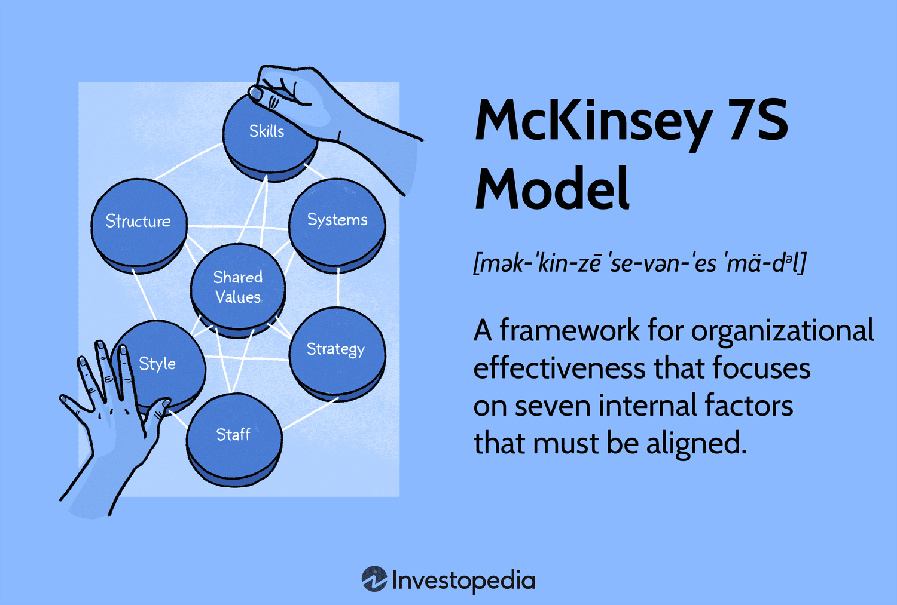

Algorithmic trading has revolutionized financial markets by allowing market participants to leverage computational power for gaining a competitive edge. This approach involves the use of computer algorithms to automate trading strategies, enabling rapid execution and enhanced precision in decision-making. With the advancements in technology, algorithmic trading has evolved to incorporate complex data analytics and machine learning techniques, further enhancing its effectiveness.

This article presents the concept of a meta-strategy paradigm—a novel framework that enhances algorithmic trading through strategic integration and optimization. Unlike traditional algorithmic strategies that rely on a single method, the meta-strategy paradigm advocates for the combination of multiple strategies, technical indicators, and data-driven approaches to refine trading models. This comprehensive framework not only improves decision-making processes but also emphasizes dynamic adaptation and strategic layering, allowing traders to respond effectively to shifting market conditions.



By understanding and implementing the meta-strategy paradigm, traders can optimize their algorithms for increased profitability and reduced risk. This approach reduces vulnerabilities associated with relying on a single strategy and amplifies the potential to capture profitable trading opportunities by diversifying risk across various market scenarios. Furthermore, the integration of advanced data techniques and machine learning models enhances the predictive accuracy of trading systems, focusing only on high-probability trading signals and filtering out noise.

The aim of this article is to offer a comprehensive guide for traders seeking to enhance their algorithmic strategies using this advanced methodology. By exploring the core components of the meta-strategy paradigm and understanding its benefits and challenges, traders and investors can potentially gain a substantial edge in market competition, ensuring robust and adaptable trading performance in diverse market environments.

## Table of Contents

## Understanding the Meta-Strategy Paradigm

The meta-strategy paradigm in [algorithmic trading](/wiki/algorithmic-trading) is an advanced framework that employs a combination of diverse strategic approaches to enhance trading outcomes. Unlike traditional single-strategy models that may falter under varying market conditions, this paradigm leverages the integration of multiple trading strategies, creating a dynamic system that can adapt to fluctuating market environments.

At its core, the meta-strategy paradigm builds upon the foundational concept of using various strategies concurrently, aiming to achieve superior performance across diverse market scenarios. This multifaceted approach is particularly effective in addressing the different characteristics and behaviors observed in financial markets, such as trend-following in bullish conditions or mean-reversion during market corrections.

Adaptability is a crucial feature of the meta-strategy paradigm. Trading systems need to adjust to market shifts efficiently, and this is accomplished by integrating strategies that are designed to function optimally under specific conditions. For example, [momentum](/wiki/momentum) strategies can be combined with [volatility](/wiki/volatility-trading-strategies) [breakout](/wiki/breakout-trading) strategies to capture price movements during periods of high market activity, while range-bound strategies might be employed in more stable phases.

By adopting a meta-strategy, traders significantly reduce the vulnerabilities associated with relying solely on a single trading tactic. This approach distributes risk across a spectrum of strategies, consequently diminishing the impact of any one strategy's underperformance. This diversification not only mitigates risk but also enhances the likelihood of seizing profitable trading signals, as multiple strategies can identify different opportunities based on their unique parameters.

The multi-layered nature of the meta-strategy paradigm amplifies its effectiveness. It enables the layering of strategies in a manner that maximizes the extraction of value from market data, capitalizing on various signals that might otherwise be overlooked by a single-strategy approach. This comprehensive strategy framework ensures that trading algorithms are not just reactive to market stimuli but are proactive in anticipating shifts and trends.

In conclusion, the meta-strategy paradigm represents a sophisticated evolution in algorithmic trading models, providing traders with a robust mechanism to optimize their decision-making processes. By implementing a strategic blend of diversified trading approaches, traders can improve both their risk management capabilities and profit potential.

## Core Components of Meta-Strategy Paradigm

The meta-strategy paradigm in algorithmic trading relies on the integration of various core components, which collectively enhance the robustness and performance of trading systems. One pivotal element is the use of technical indicators such as the Relative Strength Index (RSI), Exponential Moving Averages (EMAs), and the Moving Average Convergence Divergence (MACD). These indicators are essential for generating trading signals by capturing market trends and momentum. However, their effectiveness hinges on dynamic adjustments tailored to prevailing market conditions. For instance, the RSI is typically used with a 14-day period, but this can be fine-tuned based on volatility or specific trading strategies.

In addition to technical indicators, statistical methods play a crucial role in enhancing the predictive accuracy of trading models. Techniques like the Triple Barrier Method and meta-labelling are designed to refine predictions by filtering out noise from genuine signals. The Triple Barrier Method, for example, applies barriers to assess the outcome of trades based on predefined profit-taking, stop-loss, and time expiration levels. Meta-labelling involves the reclassification of trading signals using additional information, thereby improving the decision-making process by leveraging ensemble methods.

The incorporation of [machine learning](/wiki/machine-learning) and [artificial intelligence](/wiki/ai-artificial-intelligence) (AI) further boosts the sophistication and adaptability of trading algorithms. Machine learning models can identify intricate patterns in large datasets, which are often indiscernible through traditional analysis. Algorithms such as Random Forests, Gradient Boosting Machines, and neural networks can be trained to optimize prediction accuracy and react to market dynamics more efficiently. Integrating AI allows for continuous learning and adaptation, ensuring that trading strategies remain effective over time.

A rigorous framework for [backtesting](/wiki/backtesting) and data preprocessing constitutes another critical component of the meta-strategy paradigm. Backtesting involves simulating trading strategies on historical data to evaluate their performance before application in live markets. It helps in assessing the viability and risk associated with strategies under various market conditions. Rigorous data preprocessing, including cleaning, normalization, and feature selection, is paramount to ensuring that the input data fed to trading models is accurate and relevant. Here is a simple example of a backtesting setup using Python:

```python
import pandas as pd

# Load historical data
data = pd.read_csv('historical_data.csv')

# Calculate EMA
data['EMA'] = data['Close'].ewm(span=20, adjust=False).mean()

# Define a simple strategy: Buy when price is above EMA
data['Signal'] = 0  # 0 for hold, 1 for buy
data.loc[data['Close'] > data['EMA'], 'Signal'] = 1

# Backtest
data['Strategy_Returns'] = data['Signal'].shift(1) * data['Returns']
cumulative_returns = (data['Strategy_Returns'] + 1).cumprod()
``` 

By mastering these components, traders can construct a robust framework capable of optimizing trading decisions, thereby enhancing profitability while mitigating risk.

## Benefits of a Meta-Strategy Paradigm

The meta-strategy paradigm offers a comprehensive strategic framework that significantly enhances trading performance by integrating and optimizing diverse trading strategies. This approach allows for heightened precision in forecasting market movements by deploying a variety of strategy inputs. By leveraging different strategies, traders can tailor their approach to suit various market conditions, thereby improving risk management capabilities. This is particularly useful in volatile markets where single-strategy models may falter. 

One of the significant benefits of employing a meta-strategy paradigm is its enhanced ability to filter out false signals, enabling traders to focus exclusively on high-probability trading opportunities. This process involves the strategic layering of multiple technical indicators and statistical methods. For example, a combination of Moving Average Convergence Divergence (MACD) and Relative Strength Index (RSI) can provide a more nuanced signal, reducing the likelihood of acting on false positives.

Moreover, the potential for increased returns is substantial due to the optimized decision-making that this paradigm facilitates. The strategic flexibility inherent in a meta-strategy allows for the dynamic adaptation of trading models, ensuring that they remain aligned with evolving market conditions. By continuously refining strategies based on real-time data and algorithm performance, traders can maximize profitability.

The paradigm’s utility is further highlighted by its adaptability, which includes integrating machine learning models to identify patterns that traditional methods might overlook. This can be particularly effective in algorithmic adjustments or dynamic risk assessment, adapting based on the evolving statistical landscape of the market. Such adaptability ensures that trading systems are not static, thus providing a robust shield against market unpredictability.

In sum, the benefits of a meta-strategy paradigm encompass precision in market forecasting, improved risk management, enhanced signal accuracy, and the potential for greater returns. Each benefit contributes to an overall improvement in trading efficiency and profitability, marking the paradigm as an invaluable approach in modern algorithmic trading.

## Challenges and Considerations

The implementation of a meta-strategy approach in algorithmic trading, while offering numerous benefits, presents several challenges and considerations. One primary challenge is the complexity involved in the integration and execution of multiple strategies. Developing a cohesive framework requires advanced computational resources and technical expertise. The computational demand increases significantly as the number of strategies and market variables incorporated into a meta-strategy model grows. High-performance computing resources are often necessary to manage this complexity effectively, allowing for the simultaneous processing and analysis of large datasets generated by various strategies.

Another critical consideration is the necessity for continuous monitoring and adjustment of strategies. Market conditions are dynamic and can change rapidly, necessitating constant adaptation of the trading model to maintain optimal performance. This requires robust systems for real-time data analysis and decision-making, ensuring that strategies are updated promptly and correctly in response to market fluctuations.

The risk of overfitting models to historical data poses a significant threat to the effectiveness of a meta-strategy approach. Overfitting occurs when a model is excessively tailored to historical data, capturing noise rather than the underlying market patterns. This can lead to suboptimal results when the model is applied to live markets, as the trading signals generated may not reflect actual market conditions. Hence, rigorous validation techniques, such as walk-forward analysis, are essential to mitigate this risk and ensure the generalizability of the trading strategy.

Lastly, trader discretion and judgment remain vital components in aligning strategies with market conditions and overall trading objectives. Despite the automation and sophistication of algorithmic models, human intervention is often required to interpret nuanced market signals and make strategic decisions that align with broader economic trends and individual risk tolerance levels. Thus, a successful meta-strategy approach must balance automated processes with human oversight, ensuring that algorithmic models complement rather than replace human expertise in trading decision-making.

## Conclusion

The meta-strategy paradigm represents a significant advancement in algorithmic trading, providing a robust framework that enhances the development and efficacy of trading models. By effectively integrating multiple trading strategies with advanced data techniques, this paradigm enables traders to achieve higher precision in their market activities. For instance, combining strategies that use technical indicators such as Moving Averages (MA) and Relative Strength Index (RSI) with machine learning algorithms allows for a comprehensive analysis that yields more accurate trading signals.

Traders who wish to implement the meta-strategy paradigm must possess a profound understanding of financial markets and computational methods. This knowledge is crucial for tailoring models that can adapt to diverse market conditions and capitalizing on strategic opportunities. Moreover, familiarity with various statistical approaches, such as the Triple Barrier Method or meta-labeling, can significantly improve the predictive accuracy of trading decisions.

Looking ahead, future advancements in computational technologies and analytical techniques may further enhance the strategic flexibility and performance of algorithmic trading systems. The integration of artificial intelligence and machine learning continues to evolve, offering new possibilities for increasing adaptability and efficiency in responding to real-time market data.

Traders and investors who adopt the meta-strategy paradigm are likely to gain a substantial competitive edge. The ability to synthesize multiple strategies, coupled with the use of sophisticated data processing methods, positions these practitioners to navigate complex market environments with improved decision-making capabilities. This strategic advantage might result not only in increased profitability but also in reduced risk exposure, thereby solidifying their standing in the highly competitive landscape of modern financial markets.

## Further Readings

"Advances in Financial Machine Learning" by Marcos Lopez de Prado is a pivotal resource for foundational concepts related to the meta-strategy paradigm in algorithmic trading. The book investigates into advanced statistical and machine learning techniques that enhance trading strategies by emphasizing the automation and accuracy of predictive models. [Lopez de Prado, M. (2018). *Advances in Financial Machine Learning*. Wiley.]

Studies focusing on algorithmic trading strategies using technical indicators and machine learning approaches are increasingly significant. These studies explore the integration of traditional indicators, such as the Relative Strength Index (RSI), Exponential Moving Averages (EMAs), and the Moving Average Convergence Divergence (MACD), with machine learning algorithms to optimize signal generation and decision-making processes.

Research on multi-indicator analysis serves as a crucial reference for enhancing trading efficiency. Implementing a combination of indicators provides a more comprehensive market overview and increases the robustness of trading signals. This research often examines the effectiveness of blending traditional and [alternative data](/wiki/best-alternative-data) sources for a superior strategic insight.

Articles that explore AI integration in trading systems focus on increasing the dynamic adaptability of algorithms. With AI's capacity to learn and adjust in real-time, trading strategies can become more responsive to market changes, thereby reducing latency in signal execution and improving the overall performance of the trading system.

Industry reports on algorithmic trading trends provide expert insights into future innovations, highlighting the rapid technological advancements transforming the trading landscape. These reports often cover breakthroughs in computational finance, adaptation to regulatory changes, and the increasing role of big data analytics in devising sophisticated trading strategies.

## References & Further Reading

[1]: Bergstra, J., Bardenet, R., Bengio, Y., & Kégl, B. (2011). ["Algorithms for Hyper-Parameter Optimization."](https://papers.nips.cc/paper/4443-algorithms-for-hyper-parameter-optimization) Advances in Neural Information Processing Systems 24.

[2]: ["Advances in Financial Machine Learning"](https://www.amazon.com/Advances-Financial-Machine-Learning-Marcos/dp/1119482089) by Marcos Lopez de Prado

[3]: ["Evidence-Based Technical Analysis: Applying the Scientific Method and Statistical Inference to Trading Signals"](https://www.amazon.com/Evidence-Based-Technical-Analysis-Scientific-Statistical/dp/0470008741) by David Aronson

[4]: ["Machine Learning for Algorithmic Trading"](https://github.com/PacktPublishing/Machine-Learning-for-Algorithmic-Trading-Second-Edition) by Stefan Jansen

[5]: ["Quantitative Trading: How to Build Your Own Algorithmic Trading Business"](https://books.google.com/books/about/Quantitative_Trading.html?id=j70yEAAAQBAJ) by Ernest P. Chan