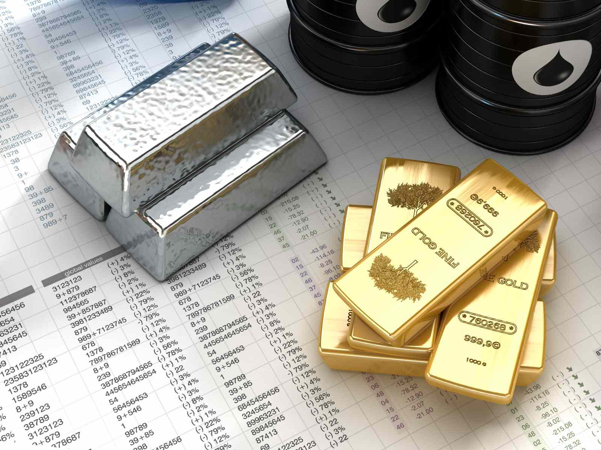

The commodities investment landscape has undergone significant transformations with the advent of algorithmic trading. This technological advancement has become a pivotal component in modern trading strategies, particularly within the metals market. Algorithmic trading employs sophisticated computational models to automate trading decisions, thereby introducing new dynamics in investment strategies.

In the metals market, algorithmic trading facilitates enhanced precision and speed, enabling traders to execute transactions within milliseconds. This is particularly advantageous in the metals sector, where timing and market fluctuations play critical roles. By processing vast amounts of data, algorithmic systems allow for real-time decision-making, reducing the likelihood of human error and emotional bias in trading decisions.



Algorithmic trading reshapes how investors approach the metals commodities market. Advanced algorithms analyze historical and current market data to identify patterns and trends, which inform strategic trading decisions. As a result, traders can exploit market inefficiencies, capitalize on arbitrage opportunities, and ensure liquidity provision, which were previously challenging using traditional trading methods.

The objective of this article is to explore the benefits, challenges, and overall impact of algorithmic trading on metals trading. Algorithmic systems offer considerable advantages, such as cost-effectiveness and the ability to backtest strategies using historical data, optimizing future performance. However, they also present challenges, such as the risk of market volatility and the need for constant algorithmic adjustments to align with evolving market conditions.

As algorithmic trading continues to develop, its role in metals trading is expected to expand further, offering new opportunities and challenges for investors. Understanding the integration of technology and strategic investment is crucial for those aiming to thrive in the evolving landscape of metals commodities investment.

## Table of Contents

## Overview of the Metals Market in Commodities

Metals are vital components within the commodities market, with their importance spanning across both industrial and financial sectors. They are broadly classified into two categories: base metals and precious metals. 

Base metals, including copper, nickel, and aluminum, are fundamental to various industrial applications due to their physical and chemical properties. Copper, for instance, is highly conductive and is widely used in electrical wiring, plumbing, and telecommunications infrastructure. Nickel is essential in producing stainless steel and other corrosion-resistant alloys, while aluminum is valued for its lightweight and malleable characteristics, making it relevant in the automotive and aerospace industries. 

On the other hand, precious metals such as gold and silver have distinct roles beyond industrial applications. These metals are traditionally regarded as safe-haven assets, serving as investment hedges against economic instability and inflation. Gold, in particular, has a longstanding history as a store of value and a medium of exchange, while silver, albeit less valued per unit weight than gold, also holds industrial significance in electronics and solar panel manufacturing.

The demand for metals is influenced by both their industrial uses and the interest of investors seeking to capitalize on or hedge against economic shifts. As industrial demand often correlates with the global economic cycle, fluctuations in the economy can significantly impact metal prices and their market dynamics. 

Understanding the metals market requires closely monitoring supply and demand dynamics alongside price fluctuations. Supply can be affected by factors such as mining output, geopolitical events, and technological advancements in extraction methods. Demand, on the other hand, is not only linked to direct industrial use but also speculative investment driven by market sentiment and macroeconomic indicators.

This dynamic interplay of factors necessitates a comprehensive grasp of global economic activities and their impacts on the metals market. As metals continue to be integral to both industrial development and financial investment strategies, their market remains a crucial area of focus for investors and industry stakeholders alike.

 to Algorithmic Trading

Algorithmic trading utilizes sophisticated algorithms to automate the trading process based on predetermined rules. These algorithms analyze vast volumes of market data, identify trading opportunities, and execute trades at speeds that far exceed human capabilities. This automation allows for high-frequency trading, which is characterized by a large number of orders executed in fractions of a second. The speed and efficiency of [algorithmic trading](/wiki/algorithmic-trading) provide a significant competitive edge in markets where timing is crucial.

One of the primary advantages of algorithmic trading is its ability to operate with precision and accuracy. Algorithms follow strict rules and predefined criteria, reducing the risk of human error and emotional decision-making that can affect traditional trading methods. This objectivity is particularly beneficial in managing complex trading strategies where consistency is critical.

Technological advancements have played a pivotal role in making algorithmic trading more accessible across various market segments, including metals. Enhanced computing power and the development of sophisticated software platforms facilitate the processing of large datasets in real time. Such capabilities allow trading algorithms to quickly adapt to market changes and provide traders with precise insights and actionable signals.

Moreover, algorithmic trading systems are designed to handle numerous trades simultaneously across different markets and instruments. This multi-threaded approach ensures that traders can efficiently capture [arbitrage](/wiki/arbitrage) opportunities and react to market trends as they arise. Given the complexities involved, the implementation of algorithmic trading requires not only a robust technological infrastructure but also a deep understanding of mathematical models and financial markets.

In summary, algorithmic trading leverages complex algorithms to enhance trading efficiency through speed, accuracy, and objective decision-making. Its increasing prevalence in the metals market underscores the transformative impact of technology on investment strategies, offering both challenges and opportunities for market participants.

## Benefits of Algorithmic Trading in the Metals Market

Algorithmic trading significantly enhances efficiency by executing trades within milliseconds. This rapid execution allows traders to capitalize on fleeting market inefficiencies, which are often too rapid for manual trading. Algorithms can quickly identify price discrepancies across different markets, enabling the implementation of arbitrage strategies wherein a trader can buy a metal in one market and sell it in another at a higher price. This capability of high-speed trading leads to improved market [liquidity](/wiki/liquidity-risk-premium), as algorithms provide continuous buy and sell orders, narrowing the bid-ask spread and stabilizing prices.

Moreover, algorithmic trading allows for the use of sophisticated trading strategies that incorporate multiple variables and conditions, far beyond human capabilities. It enables the development of rule-based systems that are free from emotional biases, ensuring consistent trading behavior. This consistency is critical for risk management, as it prevents erratic trading decisions during volatile market conditions. By utilizing algorithms, traders can enforce stop-loss orders, adjust position sizes, and adhere to predefined risk parameters automatically.

The integration of [backtesting](/wiki/backtesting) is another significant benefit of algorithmic trading. Traders can simulate their strategies on historical data to evaluate performance, identify strengths and weaknesses, and refine their algorithms before deploying them in live markets. This process of optimization helps in fine-tuning parameters to improve future trading outcomes and enhances the overall robustness of trading systems against various market scenarios.

Additionally, algorithmic trading reduces transaction costs compared to traditional trading methods. Automated systems often require lower fees due to their high order [volume](/wiki/volume-trading-strategy) and frequency. This cost efficiency, along with the reduced need for a large human workforce to manage trades, contributes to a more economical approach to investing in metals commodities. By minimizing overhead costs and maximizing trading precision, algorithmic trading presents a formidable advantage for investors in the metals market.

## Technological Requirements for Effective Algo Trading

For effective algorithmic trading, especially in the metals market, certain technological prerequisites must be met. High-speed computing systems form the backbone of such operations. These systems are tasked with processing vast amounts of market data efficiently, an essential requirement given the sheer volume of data generated in real-time markets. They utilize advanced processors and multi-threading techniques to ensure computational tasks are executed without delays.

Low latency infrastructure is crucial to mitigate any delays in executing trade orders. Latency, the time it takes for information to travel from one point to another, can significantly impact trading outcomes. Reducing latency ensures that trade decisions are acted upon almost instantaneously. This involves optimizing network components—ranging from the use of direct market access to co-locating servers physically close to exchange data centers, thus reducing the time taken for data transmission.

Access to real-time market data is indispensable for algorithmic trading. Algorithms rely on current market conditions to make informed trading decisions. Therefore, acquiring data feeds that deliver streaming quotes, volumes, and [order book](/wiki/order-book-trading-strategies) information with minimal delay is imperative. Integrating these data streams into trading algorithms allows for timely and optimal trade executions.

Sophisticated software platforms are essential to support complex algorithmic functions. These platforms offer tools for developing, testing, and deploying trading algorithms. They enable the application of strategies by providing features like backtesting, which is the practice of testing a strategy on historical data to assess its viability before applying it to live markets. Platforms often include modules for [machine learning](/wiki/machine-learning), statistical analysis, and risk management, allowing traders to construct and refine algorithms that can adapt to market conditions dynamically.

Secure and reliable data storage solutions are necessary to safeguard historical pricing data and algorithm configurations. Storing these datasets requires robust database management systems that ensure data integrity, security, and quick retrieval. This data is not only vital for developing and refining algorithms but also essential for compliance with regulatory requirements which often mandate keeping detailed trading records. Advanced encryption techniques and redundancy systems are employed to protect data against unauthorized access and loss.

In summary, the technological framework for effective algo trading encompasses high-speed computing and low latency systems, real-time data access, advanced software platforms, and secure data storage solutions. Together, these elements support the rapid and efficient execution of trades in the metals market, leveraging computational power to maximize trading strategy outcomes.

## Challenges and Risks Associated with Algo Trading

Algorithmic trading in the commodities market, particularly in metals, presents various challenges and risks that can have significant implications for investors and overall market stability. One primary concern is market [volatility](/wiki/volatility-trading-strategies). Algorithms operating on pre-defined criteria can exacerbate market fluctuations, potentially leading to substantial financial losses if not carefully managed. For instance, during periods of heightened market volatility, rapid price swings can trigger a cascade of algorithmic buy or sell orders, thus amplifying the volatility.

Another critical risk is the occurrence of flash crashes. These are abrupt, deep market falls triggered almost entirely by algorithmic trading mechanisms. While typically short-lived, flash crashes can cause sudden liquidity disappearance and severe price distortions, threatening market stability. The May 6, 2010 flash crash is a notable example, where the U.S. stock market experienced a sudden drop, primarily attributed to high-frequency trading algorithms.

Algorithmic strategies also necessitate ongoing monitoring and adjustments to align with ever-changing market conditions. The rigid nature of algorithms, when combined with dynamic market variables, can lead to suboptimal trade execution if the algorithms are not continuously updated. This aspect demands significant resources and expertise from traders to ensure that algorithmic models remain effective and adaptive over time.

Technical glitches present another layer of risk in algorithmic trading. Software bugs or hardware malfunctions can lead to unintended trading actions or order execution failures, potentially resulting in financial losses or missed trading opportunities. This highlights the importance of robust technology infrastructure and comprehensive testing to minimize such risks.

Regulatory challenges are increasingly prominent as trading authorities around the world scrutinize automated trading systems. Regulatory bodies are concerned about the systemic risks algorithmic trading might pose, leading to the introduction of regulations that impose restrictions or requirements on algorithmic trading activities. Compliance with these evolving regulations requires traders to be vigilant and proactive in adjusting their strategies and systems accordingly.

In summary, while algorithmic trading offers efficiency and advanced strategy execution in the metals market, these potential challenges and risks necessitate rigorous management and adaptive strategies to ensure that these systems operate reliably and in compliance with regulatory standards.

## Implementing Algo Trading in Commodities Investment

Implementing algorithmic trading in commodities investment, particularly in the metals market, requires a nuanced understanding of both market dynamics and technological systems. Investors must integrate knowledge of how metals markets function with the intricacies of algorithmic design and execution.

Acquiring programming skills can significantly enhance the development of robust and efficient algorithms. For those without a technical background, collaboration with technical experts can be invaluable. Programming languages such as Python are often used in developing trading algorithms due to their extensive libraries and ease of use. Algorithms are formulated based on predefined criteria derived from detailed market analysis and quantitative models. An example of a simple moving average crossover strategy in Python might look as follows:

```python
import pandas as pd

def moving_average_strategy(data, short_window, long_window):
    signals = pd.DataFrame(index=data.index)
    signals['price'] = data['Close']
    signals['short_mavg'] = data['Close'].rolling(window=short_window, min_periods=1, center=False).mean()
    signals['long_mavg'] = data['Close'].rolling(window=long_window, min_periods=1, center=False).mean()
    signals['signal'] = 0.0
    signals['signal'][short_window:] = np.where(signals['short_mavg'][short_window:] > signals['long_mavg'][short_window:], 1.0, 0.0) 
    signals['positions'] = signals['signal'].diff()
    return signals
```

Backtesting is a vital aspect of algorithmic trading implementation, enabling traders to validate and refine strategies with historical data before they are applied in real-time trading environments. During backtesting, the performance of a strategy is assessed across diverse market scenarios to ensure its robustness and expected profitability.

Risk management is another cornerstone for implementing algorithmic trading systems. Establishing a strong risk management framework helps mitigate potential losses that may arise from unexpected market movements or system failures. Techniques such as diversification, stop-loss orders, and position sizing are integral components of such a framework, each playing a role in preserving capital.

Continuous learning and adaptation are prerequisites as algorithmic trading technology and market conditions advance rapidly. Investors and traders need to keep abreast of innovative developments in machine learning, big data analytics, and other technological advances that could influence trading strategies and market behavior. Regularly updating and adjusting algorithms to align with changing market conditions is essential for maintaining a competitive edge.

Combining these elements effectively allows investors to harness the potential of algorithmic trading. By balancing technological skill with market expertise, investors can navigate the complexities of the commodities market more effectively.

## Future Trends in Algorithmic Trading for Metals

Algorithmic trading in the metals market is poised for significant advancements, largely driven by emerging technologies such as [artificial intelligence](/wiki/ai-artificial-intelligence) (AI) and machine learning (ML). These technologies are expected to enhance trading capabilities by enabling more sophisticated, data-driven strategies.

Artificial intelligence and machine learning offer the potential to process vast datasets and identify intricate patterns that can predict metal price movements. For instance, ML models can analyze historical pricing data, macroeconomic indicators, and even social media sentiments to forecast future trends. This predictive modeling capability allows traders to make informed decisions, improving both efficiency and profitability.

The exploitation of big data analytics is another transformative trend. By leveraging big data, traders can create complex models that consider multiple variables simultaneously. This can include supply chain disruptions, changes in consumer demand, and geopolitical events, which all influence metal prices. The use of big data supports algorithms in adapting to real-time changes, thus providing a competitive edge in the fast-paced trading environment.

Given the current global emphasis on environmental sustainability, trading algorithms are beginning to incorporate ecological considerations. This shift is particularly relevant for the metals market, where environmental impacts can be significant. Algorithms may now include parameters related to carbon footprint, sustainability certifications, or adherence to environmental regulations. This not only aids in responsible investing but also aligns trading practices with evolving regulatory and consumer expectations.

Blockchain technology promises to revolutionize the tracking and trading of metal commodities by ensuring secure, transparent, and immutable transaction records. The decentralized nature of blockchain provides an additional layer of trust and traceability in transactions, which is especially relevant in commodities trading where provenance and authenticity are critical. This technology is expected to reduce fraud, streamline operations, and enhance market integrity.

The increasing adoption of these technologies by institutional investors is likely to reshape market practices. As larger institutions implement AI, ML, and blockchain in their trading strategies, the entire market ecosystem will adapt, potentially leading to more standardized and transparent trading processes. Furthermore, as these institutions prioritize technological integration, smaller firms may be incentivized to adopt similar systems to remain competitive.

These trends underscore the transformative impact of technology in algorithmic trading for metals, promising substantial advancements in strategy development, operational efficiency, and market sustainability. As these technologies continue to evolve, they will undoubtedly redefine trading landscapes and offer new opportunities for innovation.

## Conclusion

Algorithmic trading has emerged as a transformative force in the commodities metals market by seamlessly integrating advanced technology with strategic investment. By automating trade execution and leveraging sophisticated algorithms, this approach offers significant advantages, such as increased trading efficiency and the capability to process vast amounts of market data swiftly. The ability to backtest trading strategies using historical data permits more accurate and optimized trading decisions, potentially leading to higher returns.

However, the adoption of algorithmic trading is not without its challenges and risks. Market volatility poses a continuous threat, where improperly managed algorithms can lead to substantial losses. Events such as flash crashes highlight the need for robust risk management strategies and constant monitoring of automated systems. Regulatory scrutiny also adds complexity, necessitating adherence to evolving compliance standards. Hence, investors must be thoroughly informed and prepared to successfully implement and manage algorithmic trading systems in the metals market.

Looking to the future, the landscape of algorithmic trading in metals is poised for further transformation. Emerging technologies, including artificial intelligence and machine learning, promise to enhance the predictive capabilities of trading algorithms. Big data analytics will likely play a crucial role in modeling price movements, providing investors with deeper insights. Environmental sustainability may also influence trading strategies, aligning investments with broader societal goals. As these advances unfold, the market is expected to evolve, attracting increased interest from institutional investors.

Crucially, mastering the balance between technological prowess and market expertise remains the cornerstone of successful investments in metals commodities. As technology continues to reshape trading practices, investors equipped with the right blend of technical and market knowledge will be best positioned to capitalize on the opportunities presented by algorithmic trading.

## References & Further Reading

[1]: Bergstra, J., Bardenet, R., Bengio, Y., & Kégl, B. (2011). ["Algorithms for Hyper-Parameter Optimization."](https://dl.acm.org/doi/10.5555/2986459.2986743) Advances in Neural Information Processing Systems 24.

[2]: ["Advances in Financial Machine Learning"](https://www.amazon.com/Advances-Financial-Machine-Learning-Marcos/dp/1119482089) by Marcos Lopez de Prado

[3]: ["Evidence-Based Technical Analysis: Applying the Scientific Method and Statistical Inference to Trading Signals"](https://www.amazon.com/Evidence-Based-Technical-Analysis-Scientific-Statistical/dp/0470008741) by David Aronson

[4]: ["Machine Learning for Algorithmic Trading"](https://github.com/stefan-jansen/machine-learning-for-trading) by Stefan Jansen

[5]: ["Quantitative Trading: How to Build Your Own Algorithmic Trading Business"](https://www.amazon.com/Quantitative-Trading-Build-Algorithmic-Business/dp/1119800064) by Ernest P. Chan