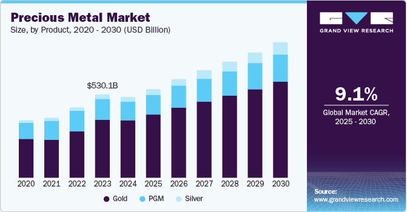

## Table of Contents

## What are the basic types of metals commonly traded in the market?

Metals that are commonly traded in the market can be divided into two main types: ferrous and non-ferrous metals. Ferrous metals contain iron and are known for their strength and durability. The most commonly traded ferrous metal is steel, which is used in construction, manufacturing, and many other industries. Another important ferrous metal is iron ore, which is the raw material used to make steel.

Non-ferrous metals do not contain iron and are valued for their properties like conductivity, malleability, and resistance to corrosion. Some of the most commonly traded non-ferrous metals include aluminum, copper, and zinc. Aluminum is lightweight and widely used in transportation and packaging. Copper is an excellent conductor of electricity and is essential in electrical wiring and electronics. Zinc is often used to galvanize steel, protecting it from rust.

In addition to these, precious metals like gold, silver, and platinum are also actively traded. These metals are valued not only for their industrial uses but also for their role in jewelry and as investments. Gold, for example, is seen as a safe-haven investment and is used in electronics due to its conductivity. Silver is used in photography, electronics, and solar panels, while platinum is crucial in catalytic converters for vehicles.

## How does the metals market function and what are its key components?

The metals market works like a big store where people buy and sell different kinds of metals. It's a place where companies that need metals for making things like cars or buildings can find what they need. On the other side, there are companies that mine or produce metals and want to sell them. The market helps these two groups meet and do business. Prices in the metals market go up and down based on how much people want the metals and how much is available. If a lot of people want a certain metal and there's not much of it, the price will go up. If there's a lot of a metal and not many people want it, the price will go down.

The key parts of the metals market include the physical market and the futures market. In the physical market, people buy and sell actual pieces of metal. This can happen at big trading places or through deals made over the phone or online. The futures market is different because people are buying and selling contracts that promise to deliver metal at a future date. This helps companies plan ahead and protect themselves from big changes in prices. Both parts of the market are important because they help keep the supply of metals steady and make sure that prices are fair for everyone involved.

## What are the main factors that influence metal prices?

Metal prices go up and down because of many things. One big thing is how much people want the metal. If lots of people want it, like when the economy is growing and people are building more things, the price will go up. Another thing is how much metal is available. If there's not much metal because it's hard to find or mine, the price will go up. Also, if it costs more to get the metal out of the ground, like if fuel prices go up, the price of the metal will go up too.

Other things that can change metal prices are what's happening in the world. For example, if there's a big problem in a country that makes a lot of a certain metal, like a war or a natural disaster, it can make it harder to get that metal and the price will go up. The value of money can also affect metal prices. If the money in one country gets weaker, it can make metals from that country cheaper for people in other countries. Finally, what people think might happen in the future can change prices now. If people think the price of a metal will go up later, they might buy it now and make the price go up right away.

## What are the differences between investing in physical metals versus metal ETFs?

Investing in physical metals means buying actual pieces of metal, like gold bars or silver coins. You can hold them in your hand or keep them in a safe place. The good thing about this is that you own the metal directly, so you don't have to worry about a company going out of business. But, it can be hard to sell quickly, and you need a safe place to store it. Also, you might have to pay for insurance to protect your investment.

Investing in metal ETFs, or exchange-traded funds, is different because you're not buying the actual metal. Instead, you're buying shares in a fund that owns the metal or tracks its price. This makes it easier to buy and sell because you can do it through a stock market. It's also easier to keep track of because you can see the value of your investment on your computer or phone. But, you have to trust the company that runs the [ETF](/wiki/etf-trading-strategies), and you might have to pay fees to own the shares.

Both ways of investing have their good and bad points. Physical metals give you a sense of owning something real, but they can be harder to manage. Metal ETFs are easier to buy and sell, but they come with some risks and costs. It's important to think about what you want and what you're comfortable with before deciding how to invest in metals.

## How can beginners start investing in the metals market?

For beginners wanting to start investing in the metals market, the first step is to learn about the different types of metals you can invest in, like gold, silver, copper, and more. You need to understand what makes their prices go up and down, like how much people want them and how much is available. It's also good to think about how much risk you're okay with and how long you want to keep your investment. Once you have a basic understanding, you can start looking at different ways to invest, like buying physical metals or investing in ETFs.

After deciding which metal you want to invest in, you need to choose how you want to do it. If you want to buy physical metals, you can go to a dealer or buy online. Make sure to check if the dealer is trustworthy and think about where you'll keep your metals safe. If you choose ETFs, you'll need to open an account with a broker that lets you trade ETFs. This is easier because you can buy and sell them like stocks. Remember, it's always a good idea to start small and learn as you go, so you can make better choices as you get more experience.

## What are the risks associated with investing in metals?

Investing in metals can be risky because the prices can go up and down a lot. Things like how much people want the metal, how much is available, and what's happening in the world can make the price change quickly. If you buy a metal and the price goes down, you might lose money. Also, if you invest in physical metals, you have to worry about keeping them safe. If they get stolen or damaged, you could lose your investment.

Another risk is that it can be hard to sell your metals quickly. If you need money fast and you have physical metals, it might take time to find someone to buy them. With ETFs, you can sell them more easily, but you still have to think about the fees you might have to pay and the risk that the company running the ETF might have problems. It's important to think about these risks and decide if investing in metals is right for you.

## How do global economic conditions affect the metals market?

Global economic conditions have a big impact on the metals market. When the world economy is doing well, people and companies build more things like houses, cars, and factories. This means they need more metals, like steel and copper, so the demand goes up and the prices go up too. But if the economy is not doing well, people might not be building as much, so they don't need as many metals. This can make the prices go down because there's less demand.

Another way global economic conditions affect the metals market is through the value of money. If a country's money gets weaker compared to other countries' money, it can make their metals cheaper for people in other countries to buy. This can increase demand and push prices up. Also, things like wars, natural disasters, or big changes in government policies can mess with how much metal is available or how much it costs to get it out of the ground, which can also change the prices in the metals market.

## What role do futures and options play in metals market investment?

Futures and options are important tools for people who invest in the metals market. Futures are contracts where you agree to buy or sell a certain amount of metal at a set price on a future date. This helps people plan ahead. If you think the price of a metal will go up, you can buy a futures contract now and sell the metal later at a higher price. If you think the price will go down, you can sell a futures contract now and buy the metal later at a lower price. This can protect you from big changes in the price of metals.

Options are a bit different. They give you the right, but not the obligation, to buy or sell a metal at a certain price before a certain date. This means you can decide if you want to go through with the deal or not. Options can be used to make money if you think the price of a metal will change a lot, or they can be used to protect your investments from big price swings. Both futures and options help investors manage risk and make smarter decisions in the metals market.

## How can investors use technical analysis to make decisions in the metals market?

Investors can use technical analysis to make decisions in the metals market by looking at past price and [volume](/wiki/volume-trading-strategy) data to find patterns and trends. They use charts and graphs to see how the price of a metal has moved over time. By studying these charts, investors can spot patterns like "support" and "resistance" levels, which are prices where the metal often stops going down or up. They also look at things like moving averages, which help smooth out price data to see the overall direction of the market. If a metal's price is above its moving average, it might be a good time to buy because it could keep going up. If it's below, it might be a good time to sell because it could keep going down.

Technical analysis also involves using indicators like the Relative Strength Index (RSI) and the Moving Average Convergence Divergence (MACD). The RSI helps investors see if a metal is overbought or oversold, which can signal if the price might change soon. If the RSI is over 70, the metal might be overbought and due for a price drop. If it's under 30, it might be oversold and due for a price increase. The MACD helps show the [momentum](/wiki/momentum) of the metal's price, helping investors see if the trend is getting stronger or weaker. By using these tools and looking at the patterns in the charts, investors can make better guesses about where the price of a metal might go next and decide when to buy or sell.

## What are some advanced strategies for hedging in the metals market?

Hedging in the metals market means trying to protect your investment from big price changes. One advanced strategy is using options spreads. This means you buy and sell different options on the same metal at the same time. For example, you might buy a call option that lets you buy the metal at a certain price and sell another call option at a higher price. This can help you make money if the price goes up a little, but it also limits how much you could lose if the price goes down a lot. It's like betting on a small move in the price while protecting yourself from a big move.

Another strategy is using futures contracts to hedge. You can sell futures contracts if you think the price of the metal will go down, or buy them if you think it will go up. This can help you lock in a price now for a future date, which can be really helpful if you're a company that uses a lot of metal and wants to know what you'll have to pay. You can also use a strategy called "stacking hedges," where you set up multiple futures contracts at different times. This means you can keep adjusting your hedge as the market changes, which can help you stay protected no matter what happens to the price of the metal.

## How do geopolitical events impact metal prices and investment strategies?

Geopolitical events, like wars, trade disagreements, or changes in government, can really shake up the metals market. When there's a problem in a country that makes a lot of a certain metal, it can be harder to get that metal. This can make the price go up because there's less of it to go around. For example, if there's a war in a big copper-producing country, the price of copper might go up because it's harder to mine and ship it. Also, if countries put up trade barriers, like tariffs, it can make metals more expensive to move from one place to another, which can also push up prices.

Investors need to pay attention to these events and change their strategies to deal with them. If they think a geopolitical event might make metal prices go up, they might buy more of that metal now to sell later at a higher price. Or, if they're worried about prices going down because of a big change in a metal-producing country, they might sell their metal or use futures and options to protect themselves from losing money. Keeping an eye on the news and understanding how different events can affect the supply and demand of metals can help investors make smarter choices and manage their risks better.

## What are the long-term trends and forecasts for the metals market?

The metals market is expected to grow over the long term because more people around the world are building things and using technology. As countries like China and India keep growing their economies, they will need more metals like steel for buildings and copper for electricity. Also, the move to green energy, like solar panels and electric cars, will use a lot of metals like lithium and cobalt. This means the demand for these metals will probably go up, which could push their prices higher.

But there are also some challenges that could affect the metals market in the future. One big problem is that mining for metals can harm the environment, so there might be new rules that make it harder and more expensive to get metals out of the ground. Also, if there's a big economic slowdown or a new financial crisis, people might not build as much, and the demand for metals could go down. Investors need to think about these things and maybe look for metals that are important for new technologies or that can be mined in a more earth-friendly way.

## References & Further Reading

[1]: Bergstra, J., Bardenet, R., Bengio, Y., & Kégl, B. (2011). ["Algorithms for Hyper-Parameter Optimization."](https://dl.acm.org/doi/10.5555/2986459.2986743) Advances in Neural Information Processing Systems 24.

[2]: ["Advances in Financial Machine Learning"](https://www.amazon.com/Advances-Financial-Machine-Learning-Marcos/dp/1119482089) by Marcos Lopez de Prado

[3]: ["Evidence-Based Technical Analysis: Applying the Scientific Method and Statistical Inference to Trading Signals"](https://www.amazon.com/Evidence-Based-Technical-Analysis-Scientific-Statistical/dp/0470008741) by David Aronson

[4]: ["Machine Learning for Algorithmic Trading"](https://github.com/stefan-jansen/machine-learning-for-trading) by Stefan Jansen

[5]: ["Quantitative Trading: How to Build Your Own Algorithmic Trading Business"](https://www.amazon.com/Quantitative-Trading-Build-Algorithmic-Business/dp/1119800064) by Ernest P. Chan