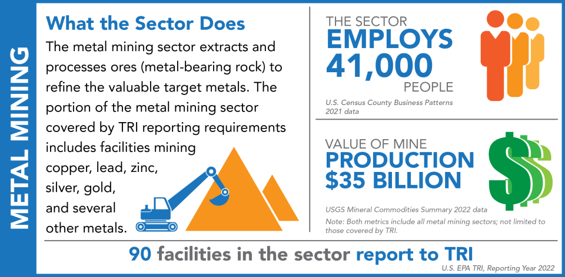

## Table of Contents

## What is the metals and mining sector?

The metals and mining sector is an industry that focuses on finding, taking out, and preparing metals and minerals from the earth. This includes things like gold, silver, copper, iron, and many other materials that are used in making things like cars, buildings, and electronics. Companies in this sector explore the earth to find where these valuable resources are, then they dig them out and process them so they can be used in different industries.

This sector is very important because it provides the raw materials that are needed for many other industries to work. Without metals and minerals, it would be hard to make many of the things we use every day. The metals and mining sector also has a big impact on the economy and can create many jobs. However, it can also be hard on the environment, so companies need to be careful and follow rules to make sure they do not harm nature too much.

## What are the primary types of metals mined in this sector?

The metals and mining sector focuses on digging out different types of metals from the earth. Some of the main metals they mine are iron ore, which is used to make steel for buildings and cars, and copper, which is important for making wires and electronics. Gold and silver are also big in this sector because people use them for jewelry and money, but they are also used in technology.

Another important metal is aluminum, which is light and strong, so it's used in things like airplanes and cans. Nickel is another metal that gets mined a lot because it's used in making stainless steel and batteries. Zinc is also common in the mining sector; it's used to coat other metals to stop them from rusting.

These metals are essential for many things we use every day. The mining sector works hard to find and get these metals out of the ground so they can be turned into useful products. Each metal has its own special uses, and together they help make our world work.

## How does the mining process work for different metals?

The mining process starts with finding where the metals are in the earth. People use special tools and machines to look for signs of metals in rocks and soil. Once they find a good spot, they start digging. For some metals like gold and silver, miners might use a method called open-pit mining, where they dig a big hole in the ground to get to the metal. For other metals like copper and iron, they might use underground mining, where they dig tunnels to reach the metal deep in the earth.

After the miners get the rocks that have the metals, they need to separate the metal from the rock. This is called processing. They crush the rocks into smaller pieces and use chemicals or heat to pull out the metal. For example, to get iron from iron ore, they heat the ore in a furnace until the iron melts and can be collected. For gold, they might use a chemical called cyanide to separate the gold from the rock. Once the metal is separated, it gets cleaned and turned into shapes like bars or sheets that can be used to make things.

Different metals might need different ways of mining and processing, but the basic steps are the same: find the metal, dig it out, and separate it from the rock. Each step can be hard and needs special tools and knowledge. But when it's done right, we get the metals we need for everyday things like cars, buildings, and electronics.

## What are the major global regions for metal mining?

Some of the biggest places for mining metals are in countries like Australia, Canada, and the United States. Australia is known for mining a lot of iron ore, which is used to make steel. Canada has big mines for nickel and copper, which are important for making batteries and wires. The United States also has many mines, especially for gold and silver, which are used in jewelry and technology.

Another important region is Latin America, with countries like Chile and Peru being big in mining. Chile is the world's top producer of copper, which is used in many things like electronics and cars. Peru mines a lot of silver and copper too. These countries have a lot of the metals the world needs, so they play a big role in the global metal market.

Asia and Africa are also major regions for metal mining. China is a huge player, mining lots of different metals like iron, aluminum, and copper. They use these metals to make things for their own country and to sell to other countries. In Africa, countries like South Africa mine a lot of gold and platinum, which are used in jewelry and cars. These regions are important because they help supply the world with the metals we need every day.

## What are the economic impacts of the metals and mining sector on local and global economies?

The metals and mining sector has a big impact on both local and global economies. Locally, mining can create a lot of jobs for people in the area where the mine is. This means more money for families and more spending in local shops and businesses. Mining can also bring in money for the local government through taxes and fees, which can be used to build schools, roads, and other important things. However, mining can also cause problems like pollution and damage to the land, which can hurt the local economy if it's not managed well.

On a global scale, the metals and mining sector is very important because it supplies the raw materials that many industries need. For example, cars, buildings, and electronics all need metals like iron, copper, and aluminum. If there's a problem with mining in one part of the world, it can affect the price and availability of these metals everywhere, which can impact the global economy. Countries that have a lot of metal mines, like Australia and Chile, can earn a lot of money by selling these metals to other countries, which helps their own economies grow. But if the price of metals goes down, it can hurt these countries' economies too.

## How do environmental regulations affect the metals and mining industry?

Environmental regulations have a big impact on the metals and mining industry. These rules are made to protect the environment and make sure that mining companies do not harm nature too much. For example, they might have to use special methods to reduce pollution or clean up the land after they finish mining. This can make mining more expensive because companies have to spend money on new technology and follow strict rules. Sometimes, these regulations can even stop mining projects from happening if they are too harmful to the environment.

On the other hand, following environmental regulations can also help mining companies in the long run. By taking care of the environment, they can build a good reputation and avoid fines or legal problems. This can make it easier for them to get permission for new projects and keep their business running smoothly. Plus, more and more people care about the environment, so companies that follow the rules might find it easier to sell their metals to customers who want to buy from responsible companies.

## What are the key technological advancements impacting metal extraction and processing?

New technology is changing how we get metals out of the ground and make them ready to use. One big change is using machines that can dig deeper and faster, like big drills and diggers. These machines help miners find and take out metals more easily. Another important technology is called automation, where machines do a lot of the work without people. This can make mining safer and more efficient because machines can work in places that are hard or dangerous for people.

Another key advancement is in how we process metals after they are mined. New methods like bioleaching use special bacteria to help pull metals out of rocks. This can be better for the environment than using harsh chemicals. Also, new ways of refining metals, like using less energy or recycling more, are helping to make the process cleaner and cheaper. These technologies are making it easier to get the metals we need while also being kinder to the planet.

## What are the major challenges faced by the metals and mining sector?

The metals and mining sector faces many challenges that can make their work harder. One big challenge is the cost of mining. It can be very expensive to find metals, dig them out, and process them. Prices for things like fuel and equipment can go up, making it even more costly. Another challenge is the rules they have to follow. Governments make laws to protect the environment and workers, and these rules can make mining more difficult and expensive. Sometimes, these laws can stop mining projects from happening if they might harm nature too much.

Another major challenge is the impact on the environment. Mining can cause pollution and damage to the land, water, and air. Companies have to work hard to reduce this harm, but it's not always easy. They need to use new technology and methods to mine in a way that is kinder to the planet. Also, the demand for metals can change. If fewer people want to buy metals, the prices can go down, which can hurt mining companies. They have to plan carefully to make sure they can keep making money even when the market changes.

## How does the demand for metals correlate with industrial and technological development?

The demand for metals goes up when industries and technology grow. As more people want cars, buildings, and electronics, they need more metals like iron, copper, and aluminum. These metals are important parts of many things we use every day. When new technology comes out, like better batteries or stronger materials, it can make the demand for certain metals even higher. For example, electric cars need more copper and lithium than regular cars, so as more people buy electric cars, the demand for these metals grows.

But the demand for metals can also change because of other things. Sometimes, new ways of making things can use less metal or use different materials instead. This can make the demand for some metals go down. Also, when the economy is not doing well, people might not buy as many cars or build as many buildings, so they don't need as many metals. The metals and mining sector has to watch these changes carefully and plan ahead to make sure they can keep up with what people need.

## What are the investment opportunities and risks within the metals and mining sector?

Investing in the metals and mining sector can offer good chances to make money. When the demand for metals like gold, copper, and iron goes up, the prices can go up too. This means that if you buy shares in a mining company or invest in metal funds, you might see your money grow. Also, new mining projects can be a good investment if they find a lot of valuable metals. Some investors like to put their money in mining because it can help spread out their investments and not put all their money in one place.

But there are also risks when you invest in this sector. The prices of metals can go down if fewer people want to buy them or if there is too much metal available. This can make mining companies lose money, which means your investment could lose value too. Mining projects can also be risky because they might not find as much metal as they hoped, or they might run into problems with the environment or the law. These challenges can make it hard for mining companies to make money, so it's important to think carefully about the risks before you invest.

## How do geopolitical factors influence the metals and mining industry?

Geopolitical factors can have a big impact on the metals and mining industry. When countries have problems with each other, it can affect where metals come from and how much they cost. For example, if two countries that trade a lot of metals start fighting, they might stop trading, which can make it hard for companies to get the metals they need. Also, some countries have a lot of important metals, so if they change their rules about mining or exporting, it can change the global supply and prices of metals.

Another way geopolitical factors influence the industry is through government policies and regulations. Different countries have different rules about how mining can be done and how metals can be sold. If a country decides to make stricter rules to protect the environment or to keep more of their metals for themselves, it can make it harder for mining companies to work there. This can lead to changes in where companies choose to mine and how much metal they can produce, which affects the whole industry.

## What future trends are expected to shape the metals and mining sector?

In the future, the metals and mining sector will be shaped by a few big trends. One trend is the growing demand for metals used in green technology, like electric cars and solar panels. As more people want to use clean energy, they will need more metals like lithium, cobalt, and copper. This means mining companies will focus more on finding and digging out these metals. Another trend is using new technology to make mining safer and better for the environment. More mining will be done by machines and computers, which can help reduce accidents and pollution. Companies will also use new ways to recycle metals, so we can use them again instead of always digging up new ones.

Another important trend is how governments and people care more about the environment. This will lead to stricter rules about mining, which can make it harder and more expensive for companies to work. But it will also push them to find new ways to mine that do less harm to nature. Also, the way we use metals might change as new materials and technologies come out. Some new materials might use less metal or different kinds of metal, which can change what metals are most important to mine. All these trends will shape the future of the metals and mining sector, making it different from how it is now.

## References & Further Reading

[1]: De Marchi, B., Funtowicz, S., & Ravetz, J. R. (1993). ["The Uncertainty and Management of Mining: Lessons from Two Case Studies."](https://www.sciencedirect.com/science/article/pii/001632879390022L) Journal of Environmental Planning and Management, 36(2), 193-208.

[2]: Chan, E. (2009). ["Quantitative Trading: How to Build Your Own Algorithmic Trading Business."](https://github.com/ftvision/quant_trading_echan_book) Wiley.

[3]: Lopez de Prado, M. (2018). ["Advances in Financial Machine Learning."](https://www.amazon.com/Advances-Financial-Machine-Learning-Marcos/dp/1119482089) Wiley.

[4]: Jansen, S. (2018). ["Machine Learning for Algorithmic Trading."](https://github.com/stefan-jansen/machine-learning-for-trading) Packt Publishing.

[5]: Hackmann, N. (2016). ["Algorithmic Trading in the Metals Market: A Look at Strategies and Their Application."](https://www.researchgate.net/publication/378548435_Algorithmic_Trading_and_AI_A_Review_of_Strategies_and_Market_Impact) Social Science Research Network.

[6]: Aronson, D. (2006). ["Evidence-Based Technical Analysis: Applying the Scientific Method and Statistical Inference to Trading Signals."](https://www.amazon.com/Evidence-Based-Technical-Analysis-Scientific-Statistical/dp/0470008741) Wiley.

[7]: National Research Council (1999). ["Hardrock Mining on Federal Lands."](https://nap.nationalacademies.org/catalog/9682/hardrock-mining-on-federal-lands) Washington, DC: The National Academies Press.