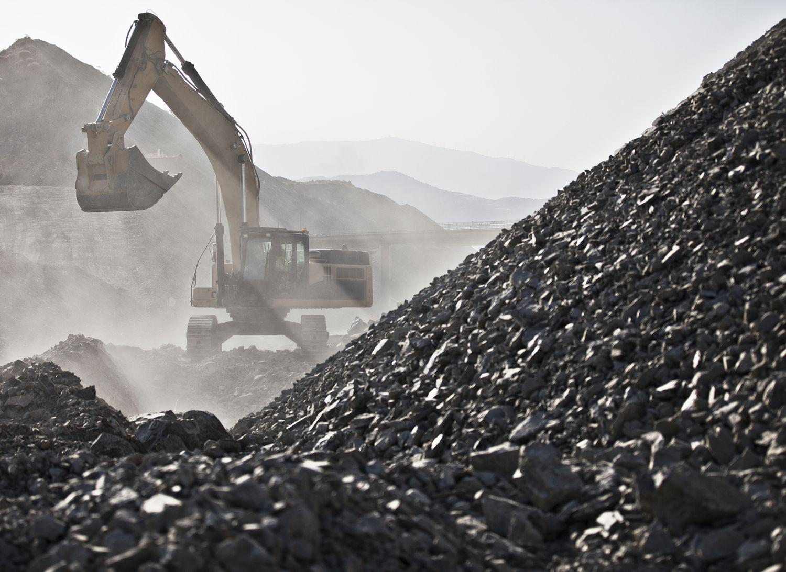

The mining sector plays a crucial role in the global economy, underpinning various industries by providing essential raw materials that drive technological development and economic growth. Comprising several categories such as industrial minerals, energy minerals, and the prominent sector of metals, the mining industry is multifaceted. This article primarily focuses on metals, a category that includes vital elements such as gold, silver, copper, and platinum. These metals are indispensable not only for manufacturing and construction but also for advancing areas like electronics, jewelry, and renewable energy technologies.

In an era where financial markets have become increasingly sophisticated, algorithmic trading has emerged as a transformative force. Algorithmic trading involves the use of complex algorithms to automate trading decisions, optimizing the execution of trades in financial markets. This technological advancement offers a competitive advantage through enhanced speed, precision, and the ability to analyze large datasets in real-timе. In the context of the mining sector, algorithmic trading finds its relevance in trading metals and commodities, providing deeper market insights and facilitating more efficient allocation of these critical resources.

The objective of this article is to provide a comprehensive overview of the intersection between metals mining and algorithmic trading. By exploring how technological innovations in trading are influencing metals markets, this article aims to illuminate the potential opportunities and challenges that lie at this crucial juncture. The discussion highlights the importance of these developments and calls attention to the growing need for investment in technologies that enhance both the trading and mining sectors.

## Table of Contents

## The Mining Sector: A Brief Overview

The mining sector plays a crucial role in the global economy by providing essential raw materials for numerous industries. The primary activities within this sector are exploration, extraction, and processing. During the exploration phase, geologists and engineers identify potential mineral reserves, employing techniques such as geophysical surveys, geochemical analysis, and drilling. The extraction phase involves the removal of ore from the earth, utilizing various methods like surface mining, underground mining, and borehole mining, depending on the location and type of the mineral deposit.

Key metals in mining include gold, silver, copper, and platinum. Gold is highly valued for its malleability, conductivity, and resistance to corrosion, making it essential in electronics, jewelry, and finance. Silver, known for its conductivity and antibactericidal properties, is used extensively in electronics, photography, and medicine. Copper's excellent conductivity and ductility make it indispensable in electrical wiring, plumbing, and telecommunications. Platinum, a rare and dense metal, is critical in automotive catalytic converters, electronics, and jewelry due to its catalytic properties and resistance to wear and tarnish.

These metals hold substantial economic and industrial importance. The demand for gold and silver significantly impacts global financial markets, while copper is considered an economic indicator due to its widespread use in industrial production. Platinum's market extends to automotive and various high-tech industries. Collectively, these metals maintain continuous industrial development and innovation, facilitating technological advancements and contributing to economic stability.

However, mining activities pose environmental challenges, requiring stringent regulations and sustainable practices. The extraction and processing of minerals can lead to habitat disruption, soil erosion, water contamination, and air pollution. To mitigate these impacts, regulatory frameworks have been established at both national and international levels. These include environmental assessments, land rehabilitation mandates, and waste management guidelines. The mining industry also adopts technologies to reduce its environmental footprint, such as water recycling systems, dust suppression techniques, and the implementation of cleaner production methods.

By balancing economic benefits with environmental stewardship, the mining sector continues to evolve, adapting to increasing demands for sustainable and responsible resource extraction.

## Technological Advancements in Mining

Technological advancements are significantly transforming mining practices, enhancing both efficiency and safety protocols. One of the critical areas of transformation is automation, which involves the use of autonomous vehicles and equipment that contribute to increased productivity and reduced human error. Automation technologies in mining include self-driving trucks and automated drilling systems, which operate with minimal human intervention. These technologies not only increase operational efficiency but also improve safety by minimizing worker exposure to hazardous conditions.

Data analytics plays an integral role in the modernization of mining operations. By leveraging large datasets, mining companies can optimize processes such as ore extraction and equipment maintenance. Predictive analytics helps in forecasting equipment failures, thus reducing downtime and maintenance costs. Advanced algorithms analyze historical and real-time data, providing insights that drive decision-making processes for maximizing resource extraction and minimizing waste.

Remote sensing and 3D modeling are two innovative technologies revolutionizing exploration and extraction processes in mining. Remote sensing technology utilizes satellite or aerial imagery to detect mineral deposits and assess environmental conditions over large areas, providing a cost-effective and efficient alternative to traditional survey methods. This non-invasive technique aids in preliminary assessments, helping to narrow down potential sites for detailed exploration.

3D modeling, on the other hand, provides a detailed visualization of ore bodies and the surrounding geology, allowing for precise mapping and planning. These models are created using data from various sources, such as drilling samples and geological surveys, and are used to simulate mining operations, assess resource volumes, and optimize mine design. This technology enables mining engineers to anticipate potential issues and plan extraction activities more effectively.

The integration of these technologies contributes to increased operational efficiency by reducing the time and cost associated with exploration, optimizing resource extraction, and minimizing environmental impact. Safety in mining operations is enhanced through automated systems that minimize human exposure to dangerous environments, while predictive analytics provide foresight into potential failures, improving maintenance and operational planning. As a result, the modern mining industry continues to evolve, embracing innovative solutions that facilitate sustainable and safe mining practices.

## Algorithmic Trading: An Introduction

Algorithmic trading refers to the use of computer algorithms to execute trades in financial markets. These algorithms are predefined sets of rules or instructions that allow for the automatic buying and selling of financial instruments, often at speeds and frequencies that would be challenging for human traders to achieve. This type of trading plays a significant role in modern financial markets, enhancing the capabilities of traders by leveraging computational power and sophisticated mathematical models.

Central to [algorithmic trading](/wiki/algorithmic-trading) are its key components: algorithms, data sets, and trading strategies. Algorithms are coded instructions that determine the ideal timing, pricing, and [volume](/wiki/volume-trading-strategy) of trades to maximize returns and mitigate risks. These instructions rely heavily on historical data and real-time market information, making data sets a crucial component. Data sets may include market prices, historical trends, economic indicators, and other relevant metrics. Trading strategies are the specific methodologies or rules that guide the decision-making process within an algorithm, such as [trend following](/wiki/trend-following), [arbitrage](/wiki/arbitrage), or [market making](/wiki/market-making).

One of the core benefits of algorithmic trading is speed. Algorithms can process a vast array of information and execute trades in milliseconds, allowing traders to capitalize on fleeting opportunities that may exist only briefly in the market. This speed enables the exploitation of short-lived price inefficiencies and supports high-frequency trading, a subset of algorithmic trading that involves placing a large number of small orders at rapid speeds.

Precision is another advantage conferred, as algorithms can execute trades based on precise criteria without being swayed by human emotions or errors. This reduces the likelihood of mistakes common in manual trading and ensures that transactions occur at optimal times and prices. Additionally, algorithmic trading facilitates the execution of complex trading strategies that might be difficult to manage manually due to their intricate nature or the sheer volume of trades.

In summary, algorithmic trading utilizes advanced computer algorithms, extensive data sets, and strategically designed trading strategies to enhance trading efficiency and effectiveness in financial markets. Its ability to offer high-speed, high-precision, and systematic trading has transformed many markets, including those dealing with metals and other commodities.

## The Role of Algo Trading in Metal Markets

Algorithmic trading, or algo trading, is increasingly prevalent in commodities markets, especially metals such as gold, silver, and copper. This form of trading leverages computer algorithms to execute orders based on pre-defined criteria at speeds and frequencies that are impossible for human traders to achieve. In metals markets, algo trading strategies like trend following and mean reversion are particularly influential.

Trend following is a fundamental strategy where traders capitalize on market [momentum](/wiki/momentum). The premise is straightforward: buy when prices trend upwards and sell when they trend downwards. Algorithms analyze historical price data to identify these trends and execute trades when specific conditions are met. For instance, if the 50-day moving average of copper prices surpasses the 200-day moving average, an algorithm might initiate a buy order. The use of moving averages, combined with other indicators like Relative Strength Index (RSI), aids in crafting robust trend-following strategies.

Mean reversion is another common strategy employed in metal markets. It operates on the assumption that prices will revert to their historical average over time. Algorithms scan for price deviations from the mean, executing trades when metals like gold or silver significantly deviate from their average value. A simple example of a mean reversion strategy could involve calculating the z-score of a metal's price to identify significant deviations from the norm, prompting a corrective trade.

Algorithmic trading offers substantial advantages in metal markets, primarily in enhancing [liquidity](/wiki/liquidity-risk-premium) and market efficiency. By executing trades at high speed, algorithms inject substantial liquidity into the markets, facilitating smoother transactions and reducing bid-ask spreads. This increased liquidity benefits all market participants by enabling quicker entry and [exit](/wiki/exit-strategy) from trades without large price impacts. Moreover, algo trading enhances market efficiency by rapidly assimilating information into prices, ensuring they reflect the latest market data and news.

An additional benefit is the reduction of emotional bias in trading decisions. Algorithms adhere strictly to predefined rules, eliminating impulsive decisions driven by fear or greed. This can lead to more consistent and objective trading outcomes. Furthermore, the precision and speed of algo trading minimize transaction costs, as algorithms can quickly capitalize on small price discrepancies.

In summary, algorithmic trading plays a pivotal role in the metal markets, with strategies like trend following and mean reversion providing structured approaches to trading. The advantages, including improved liquidity, market efficiency, and reduced transaction costs, make it a vital tool for market participants seeking to navigate the complexities of the metals sector.

## Challenges and Risks in Algo Trading for Metals

Algorithmic trading, especially in the metals markets, presents a range of challenges and risks that must be carefully managed. One significant challenge is the inherent complexity in implementing algorithmic strategies designed to trade metals. Metals markets can be highly volatile due to geopolitical events, supply chain disruptions, and varying economic conditions. This [volatility](/wiki/volatility-trading-strategies) demands sophisticated models that can adapt to rapid changes in market conditions.

High-frequency trading ([HFT](/wiki/high-frequency-trading-strategies)), a subset of algorithmic trading, introduces additional risks, notably those related to market volatility. HFT relies on executing a large number of trades in fractions of a second, aiming to capitalize on small price discrepancies. However, such rapid trading can exacerbate market volatility, potentially leading to events like "flash crashes," where prices plummet and recover in a very short timeframe. The speed and frequency of trades can also result in increased transaction costs, particularly if not executed with precision.

Further, the intricate nature of algorithms can result in unforeseen interactions and feedback loops, where the algorithms of different traders react to each other in unpredictable ways. For instance, one algorithm's action could trigger a sequence of responses from other algorithms, amplifying a minor market movement into a more significant distortion.

Regulatory considerations are another critical aspect that affects algorithmic trading in metals. Financial markets are subject to stringent regulations to ensure fairness, transparency, and stability. Algorithmic traders within the metals market must adhere to compliance requirements set forth by entities such as the U.S. Securities and Exchange Commission (SEC) or the Commodity Futures Trading Commission (CFTC). These regulations mandate thorough testing of algorithms under numerous scenarios to prevent market manipulation and ensure fair trading practices.

Compliance also involves maintaining detailed records of trades and algorithms' decision-making processes to facilitate audits and reviews by regulatory bodies. Failure to comply with these regulatory requirements can result in significant fines, legal implications, and reputational damage. Additionally, as regulations evolve, traders must continually update their systems to remain compliant, which can be resource-intensive.

Overall, while algorithmic trading holds significant potential for enhancing market efficiency and liquidity in metals markets, it carries with it substantial challenges and risks that practitioners must navigate carefully. The intersection of high volatility, compliance demands, and the technical complexities of trading systems creates an environment where only the most robustly designed algorithms are likely to succeed.

## Case Studies and Success Stories

### Case Studies and Success Stories

Algorithmic trading has seen substantial adoption and success in the metals sector, offering a glimpse into the future of trading technologies. Various case studies demonstrate the profound impact algorithmic trading has had on market behavior, pricing mechanisms, and overall efficiencies in metal markets.

One notable example involves J.P. Morgan, a prominent financial institution that has successfully implemented algorithmic trading strategies in metal markets. The bank employs sophisticated algorithms to optimize trading in gold, silver, copper, and other key metals. By leveraging high-frequency trading and [machine learning](/wiki/machine-learning) algorithms, J.P. Morgan has enhanced its ability to predict market trends and make informed trading decisions with high precision. The increased efficacy of these strategies has not only improved liquidity but also contributed to more stable pricing in these markets.

Another successful case is that of the commodity trading firm Trafigura, which has integrated algorithmic trading into its operations for base and precious metals. Trafigura uses a combination of trend-following and mean-reversion strategies to capitalize on short-term price movements and volatility. Their algorithmic systems process vast amounts of historical and real-time data to identify trading opportunities that human traders may overlook. This shift has resulted in enhanced market efficiency and profitability for the firm, proving the effectiveness of algorithmic solutions in metals trading.

Moreover, platforms like Xetra, an electronic trading platform operated by Deutsche Börse, have facilitated the integration of algorithmic trading in the metals market. Xetra's advanced technological infrastructure supports high-frequency trading and provides traders with real-time data and analytics tools necessary for executing algorithmic strategies. The platform has significantly contributed to the seamless execution of trades, offering a competitive edge to market participants who employ automated trading strategies.

The impact of algorithmic trading on market behavior is profound. By increasing liquidity and enabling more participants to access the market with minimal friction, algorithmic trading has enhanced market efficiency. The pricing of metals becomes more reflective of real-time supply and demand dynamics, reducing large price swings and bringing stability to the market. Additionally, algorithmic trading provides improved price discovery, narrowing bid-ask spreads and allowing for more transparent market operations.

In summary, the case studies of entities like J.P. Morgan, Trafigura, and platforms such as Xetra, highlight the transformative role of algorithmic trading in the metals sector. These examples underscore how advanced trading technologies contribute to market stability, efficiency, and profitability, paving the way for continued innovation and adoption in the trading of metals.

## Future Trends and Opportunities

The integration of algorithmic trading with the metals mining industry is poised for significant advancements in the coming years. As technology continues to evolve, several trends and opportunities present themselves for stakeholders in this sector.

Technological advancements, particularly in [artificial intelligence](/wiki/ai-artificial-intelligence) (AI) and machine learning (ML), are expected to drive future developments. These technologies can enhance predictive analytics, enabling more accurate forecasting of metal supply, demand, and pricing patterns. For example, AI algorithms can process vast datasets from diverse sources such as geological surveys, market reports, and historical price data to identify patterns and trends that human analysts might overlook. Improved predictive capabilities can enable mining companies to optimize their production schedules and supply chain logistics, thereby reducing costs and increasing profitability.

Blockchain technology offers another significant opportunity. By creating a transparent and immutable ledger, blockchain can improve the traceability of metal commodities from mine to market. This transparency is particularly valuable for precious metals like gold and platinum, where provenance is crucial for regulatory and ethical considerations. Moreover, blockchain can facilitate more efficient trading processes by automating settlement and reducing the risk of fraud, thereby enhancing the market's overall efficiency.

Quantum computing is an emerging technology with potential applications in both algorithmic trading and mineral exploration. Quantum algorithms could solve complex optimization problems faster than classical computers, enabling more efficient resource allocation in trading strategies and exploration activities. While still in its nascent stages, the promise of quantum computing could lead to breakthroughs in identifying new mineral deposits and devising optimal trading strategies.

For investors and businesses, these technological advancements create numerous opportunities. Investment in tech-driven startups focusing on AI, ML, and blockchain solutions for the mining industry could yield substantial returns. Additionally, partnerships between mining companies and technology firms can foster innovation and create new business models that leverage data-driven decision-making.

Environmental, social, and governance ([ESG](/wiki/esg-investing)) factors are increasingly critical in investment decisions, and technology can play a vital role in enhancing ESG compliance in mining. Advanced analytics can identify and mitigate environmental impacts, such as carbon emissions and water usage, allowing companies to fulfill regulatory requirements and meet investor expectations for sustainability.

In conclusion, the integration of algorithmic trading with the metals mining industry is set for transformative growth, driven by technological advancements and evolving market dynamics. Stakeholders who adapt to these shifts will find significant opportunities for growth and innovation in this sector.

## Conclusion

The convergence of the mining sector and algorithmic trading has been pivotal in reshaping how commodities, especially metals, are traded in today's global markets. The mining sector continues to be a cornerstone of the global economy, providing essential metals such as gold, silver, copper, and platinum. These metals play critical roles not only in industrial applications but also in financial settings as part of diverse investment portfolios. With the ongoing technological revolution, the mining industry has seen substantial transformations in its operations, embracing automation, data analytics, and other innovations to enhance productivity and environmental sustainability.

Algorithmic trading, with its capacity for speed and precision, is revolutionizing the trading landscape. In metal markets, it offers significant advantages, including increased liquidity and improved market efficiency. By leveraging sophisticated algorithms, trading strategies can swiftly respond to market trends and capitalize on profit opportunities that traditional trading might miss. Despite challenges such as market volatility and regulatory hurdles, algorithmic trading remains an invaluable tool for minimizing risks and enhancing market dynamics.

As these two sectors continue to intersect, the synergy between technology-driven mining operations and advanced trading strategies presents numerous opportunities for innovation and growth. The continuous advancements in technology, including machine learning and AI, hold the promise of further optimizing both mining and trading processes, creating new avenues for investors and businesses alike.

Given the rapid developments and the potential for substantial returns, it is crucial for stakeholders to invest in technologies that bridge the mining and trading industries. This investment not only fosters economic growth but also encourages sustainable practices in resource extraction and management. The path forward lies in harnessing these technological advancements to craft a more efficient, responsive, and environmentally conscious industry landscape.

## References & Further Reading

[1]: De Marchi, B., Funtowicz, S., & Ravetz, J. R. (1993). ["The Uncertainty and Management of Mining: Lessons from Two Case Studies."](https://www.sciencedirect.com/science/article/pii/001632879390022L) Journal of Environmental Planning and Management, 36(2), 193-208.

[2]: Chan, E. (2009). ["Quantitative Trading: How to Build Your Own Algorithmic Trading Business."](https://github.com/ftvision/quant_trading_echan_book) Wiley.

[3]: Lopez de Prado, M. (2018). ["Advances in Financial Machine Learning."](https://www.amazon.com/Advances-Financial-Machine-Learning-Marcos/dp/1119482089) Wiley.

[4]: Jansen, S. (2018). ["Machine Learning for Algorithmic Trading."](https://github.com/stefan-jansen/machine-learning-for-trading) Packt Publishing.

[5]: Hackmann, N. (2016). ["Algorithmic Trading in the Metals Market: A Look at Strategies and Their Application."](https://www.researchgate.net/publication/378548435_Algorithmic_Trading_and_AI_A_Review_of_Strategies_and_Market_Impact) Social Science Research Network.

[6]: Aronson, D. (2006). ["Evidence-Based Technical Analysis: Applying the Scientific Method and Statistical Inference to Trading Signals."](https://www.amazon.com/Evidence-Based-Technical-Analysis-Scientific-Statistical/dp/0470008741) Wiley.

[7]: National Research Council (1999). ["Hardrock Mining on Federal Lands."](https://nap.nationalacademies.org/catalog/9682/hardrock-mining-on-federal-lands) Washington, DC: The National Academies Press.