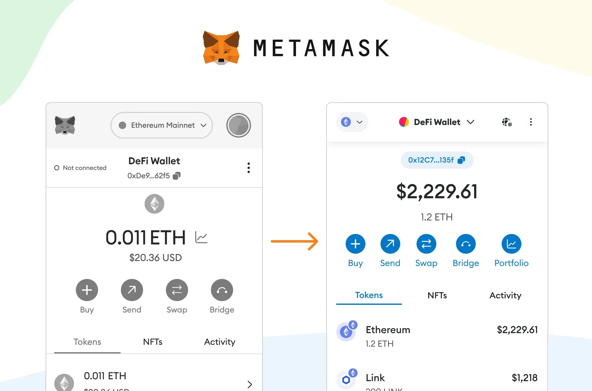

## Table of Contents

## What is MetaMask and what is its primary function?

MetaMask is a digital wallet that helps you manage your cryptocurrencies and interact with blockchain applications. It's like a special app that you can use on your computer or phone to keep your digital money safe and to do things like buying, selling, or trading it.

The main thing MetaMask does is let you connect to the Ethereum blockchain. This means you can use it to send and receive Ethereum and other tokens that work on the Ethereum network. It also lets you use decentralized apps, which are like websites or games that run on the blockchain, without needing to trust a middleman.

## How do I set up a MetaMask wallet for the first time?

To set up a MetaMask wallet for the first time, start by going to the MetaMask website and clicking on the "Download" button. You can choose to download it as a browser extension for browsers like Chrome, Firefox, or Brave, or as a mobile app for your phone. Once you've downloaded it, click on "Get Started" and then select "Create a New Wallet." You'll need to create a strong password to keep your wallet safe. Make sure to remember this password because you'll need it every time you want to use your wallet.

After setting your password, MetaMask will give you a set of 12 special words called a "seed phrase." This seed phrase is very important because it's like a secret key to your wallet. Write these words down on a piece of paper and keep it in a safe place. Do not share these words with anyone and never store them on your computer or phone where someone might find them. Once you've written down your seed phrase, MetaMask will ask you to confirm it by clicking the words in the right order. After you've done that, your wallet is ready to use! You can now send and receive Ethereum and other tokens, and use it to connect to different apps on the blockchain.

## What are the system requirements for using MetaMask?

To use MetaMask, you need a computer or a smartphone that meets some basic requirements. For a computer, you need a fairly recent version of a web browser like Chrome, Firefox, or Brave. Your computer should also have enough space and memory to run the browser smoothly. On a smartphone, you can use MetaMask if you have an iPhone with iOS 12 or later, or an Android device with Android 8 or later. Make sure your phone has enough storage space and a good internet connection.

MetaMask works best when your device is up to date and has a strong internet connection. This helps the wallet to connect to the Ethereum blockchain quickly and securely. If your device is old or slow, or if your internet is not good, you might have trouble using MetaMask properly. So, keeping your device updated and having a reliable internet connection is important for a smooth experience with MetaMask.

## Can MetaMask be used on mobile devices, and if so, how?

Yes, you can use MetaMask on your mobile phone. It works on iPhones with iOS 12 or later, and on Android phones with Android 8 or later. To start, go to your phone's app store, search for "MetaMask," and download the app. Once it's installed, open the app and tap on "Get Started." Then, choose "Create a New Wallet" and set a strong password. Remember this password because you'll need it every time you use your wallet.

After setting your password, MetaMask will show you a special set of 12 words called a "seed phrase." This is very important because it's like a secret key to your wallet. Write these words down on paper and keep them safe. Don't tell anyone these words and never save them on your phone. Once you've written them down, MetaMask will ask you to confirm the seed phrase by tapping the words in the right order. After that, your wallet is ready to use. You can now send and receive Ethereum and other tokens, and use it to connect to different apps on the blockchain, all from your phone.

## How does MetaMask ensure the security of my cryptocurrency?

MetaMask keeps your [cryptocurrency](/wiki/cryptocurrency) safe in a few important ways. First, it uses a strong password that you set up when you create your wallet. This password is like a lock on your wallet, and only you know it. So, no one else can get into your wallet without knowing this password. Second, MetaMask gives you a special set of 12 words called a "seed phrase." This seed phrase is like a secret key that can unlock your wallet if you ever lose your password. It's very important to write down these words and keep them safe, because if someone else finds them, they could get into your wallet.

Another way MetaMask helps keep your cryptocurrency secure is by letting you use it without giving out your personal information. When you use MetaMask to connect to apps on the blockchain, you don't have to tell them your real name or other private details. This makes it harder for anyone to steal your money. Also, MetaMask works with the Ethereum blockchain, which is very secure because it uses special math problems to keep transactions safe. So, as long as you keep your password and seed phrase secret, and use MetaMask carefully, your cryptocurrency should stay safe.

## What are the fees associated with using MetaMask?

When you use MetaMask, you have to pay fees for sending and receiving cryptocurrency. These fees are called "gas fees" because they help keep the Ethereum network running smoothly. The amount you pay depends on how busy the network is and how quickly you want your transaction to happen. If the network is very busy, the fees can be higher. You can choose how much you want to pay, but if you pick a lower fee, your transaction might take longer to go through.

Besides gas fees, there are no other fees that MetaMask charges you directly. However, if you use MetaMask to buy or swap cryptocurrencies on other platforms, those platforms might charge their own fees. It's a good idea to check what fees you might have to pay before you do anything with your cryptocurrency. This way, you can make sure you're not surprised by any extra costs.

## How can I add custom tokens to my MetaMask wallet?

To add custom tokens to your MetaMask wallet, first open your MetaMask app or extension and make sure you're logged in. Click on the "Add Token" button, usually found near the top of the screen. You'll see a search bar where you can type in the name or the address of the token you want to add. If the token is popular, it might show up in the search results. If it's not there, you'll need to know the token's contract address, which is a long string of letters and numbers. You can usually find this on the token's official website or on a blockchain explorer like Etherscan.

Once you have the contract address, type it into the "Token Contract Address" field. MetaMask will automatically fill in the token's symbol and how many decimal places it uses. Double-check that all the information is correct, then click "Next" and then "Add Tokens." The custom token will now show up in your MetaMask wallet, and you can see your balance and send or receive it just like with any other token. Remember, always make sure you're adding tokens from trusted sources to avoid scams.

## What is the process for sending and receiving cryptocurrencies with MetaMask?

To send cryptocurrency with MetaMask, first open your MetaMask wallet and make sure you're logged in. Click on the "Send" button and enter the amount of cryptocurrency you want to send. Then, you need to enter the recipient's Ethereum address, which is a long string of letters and numbers. You can copy and paste this address to make sure it's correct. After that, you'll see an option to set the gas fee, which is how much you'll pay for the transaction. You can choose a higher fee if you want the transaction to happen faster, or a lower fee if you're okay with waiting longer. Once everything looks good, click "Next" and then "Confirm" to send the cryptocurrency.

To receive cryptocurrency with MetaMask, open your wallet and click on the "Account" button, which will show you your Ethereum address. This address is like your digital mailbox where people can send you cryptocurrency. You can copy this address and share it with the person who wants to send you money. They'll use this address to send you cryptocurrency, just like you would use someone's address to send them a letter. Once the sender confirms the transaction, you'll see the cryptocurrency appear in your MetaMask wallet. Remember to always double-check the address you share to make sure you receive the cryptocurrency correctly.

## How does MetaMask interact with decentralized applications (dApps)?

MetaMask helps you use decentralized applications, or dApps, which are like special websites or apps that run on the blockchain. When you want to use a dApp, you open it in your web browser or on your phone. Then, you click a button that says something like "Connect Wallet" or "Log in with MetaMask." This lets the dApp know that you're using MetaMask, and it asks you to approve the connection. Once you say yes, the dApp can see your Ethereum address, but it can't see how much money you have or do anything without your permission.

After you're connected, you can use the dApp to do things like play games, trade tokens, or join a community. Whenever you want to do something that costs money, like sending tokens or buying something in a game, MetaMask will pop up and ask you to confirm the action. It will show you how much it will cost in gas fees and let you decide if you want to go ahead. This way, you always know what you're agreeing to, and you stay in control of your cryptocurrency while using dApps.

## What are the advanced features of MetaMask, such as hardware wallet integration?

MetaMask has some cool advanced features that can make it even better for keeping your cryptocurrency safe. One of these is the ability to connect to a hardware wallet. A hardware wallet is like a special USB drive that you can use to store your cryptocurrency offline, which makes it super secure. With MetaMask, you can link your hardware wallet to your account, so you can use the safety of the hardware wallet while still enjoying the ease of using MetaMask to connect to dApps and send or receive tokens. This way, you don't have to worry about someone hacking into your computer or phone to steal your money.

Another advanced feature of MetaMask is the ability to use different Ethereum networks, not just the main one. This is helpful if you want to try out new projects or test things without using real money. You can switch between networks easily in the MetaMask settings. Also, MetaMask lets you use special tools called "SNAPs" that can add extra functions to your wallet, like connecting to different blockchains or using new types of tokens. These features make MetaMask a powerful tool for anyone who wants to do more with their cryptocurrency.

## How can I troubleshoot common issues with MetaMask?

If you're having trouble with MetaMask, the first thing to check is your internet connection. Make sure it's working well because MetaMask needs a good connection to talk to the Ethereum blockchain. If your internet is okay, try refreshing the page or restarting your browser or app. Sometimes, that can fix small problems. If you're still having issues, you might need to clear your browser's cache and cookies. This can help if something is stuck or not working right. Also, make sure you're using the latest version of MetaMask and your browser or phone's software, as updates can fix bugs and improve how things work.

If you're seeing error messages or if MetaMask isn't letting you do what you want, it could be because of high network traffic or gas fees. The Ethereum network can get busy, and that can slow things down or make transactions more expensive. You can try lowering your gas fee to see if that helps, but remember it might take longer for your transaction to go through. If you're locked out of your wallet or can't remember your password, don't panic. You can use your seed phrase to recover your wallet. Just be very careful with that seed phrase and never share it with anyone. If you're still stuck, you can visit the MetaMask support page or forums where other users and the MetaMask team can help you out.

## What are the future developments and updates planned for MetaMask?

MetaMask is always working on new things to make it better for users. One big thing they're focusing on is making it easier to use different blockchains, not just Ethereum. This means you might be able to use MetaMask with other types of cryptocurrencies and decentralized apps in the future. They're also looking at ways to make transactions faster and cheaper, which would be great for everyone. Another cool thing they're working on is adding more tools and features, like SNAPs, which can help you do even more with your wallet.

They're also thinking about how to make MetaMask safer and easier to use. This includes better ways to recover your wallet if you lose your password, and making sure that your private information stays private. MetaMask wants to keep up with new technology and make sure it's always one of the best tools for managing your cryptocurrency. So, keep an eye out for updates because they're always trying to make things better for their users.

## References & Further Reading

[1]: Ethereum. (n.d.). ["Ethereum Whitepaper."](https://ethereum.org/en/whitepaper/) Ethereum Foundation.

[2]: Senno, R. (2020). ["The Basics of Blockchain Technology, Cryptocurrencies, and Digital Wallets."](https://academy.binance.com/en/start-here) Investopedia.

[3]: Antonopoulos, A. M., & Wood, G. (2018). ["Mastering Ethereum: Building Smart Contracts and DApps."](https://www.amazon.com/Mastering-Ethereum-Building-Smart-Contracts/dp/1491971940) O'Reilly Media.

[4]: Johnson, J. (2020). ["Algorithmic Trading: A Practitioner's Guide."](https://books.google.com/books/about/Algorithmic_Trading.html?id=doGXzQEACAAJ) Wiley.

[5]: Kharif, O. (2021). ["Decentralized Finance: Risks and Opportunities."](https://www.arx.cfa/en/research/2021/06/soc150621-examining-the-rise-of-decentralised-finance) Bloomberg.

[6]: Boneh, D., & Shoup, V. (2020). ["A Graduate Course in Applied Cryptography."](https://toc.cryptobook.us/) Draft Version 0.5.

[7]: Simpson, C. (2021). ["Crypto Trading with MetaMask: Beginner's Guide."](https://www.finder.com/cryptocurrency/trading) Cointelegraph.

[8]: Wood, G. (2014). ["Ethereum: A Secure Decentralised Generalised Transaction Ledger."](https://ethereum.github.io/yellowpaper/paper.pdf) Ethereum Project Yellow Paper.