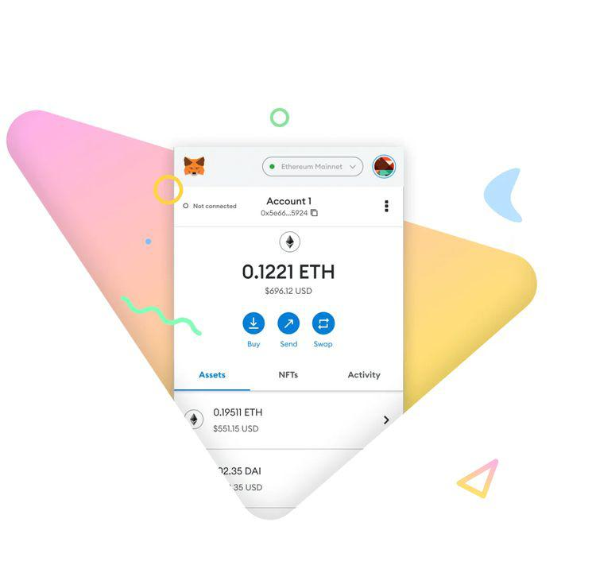

Blockchain technology, since its inception, has emerged as a groundbreaking innovation with the potential to transform a multitude of industries. At its core, blockchain is a decentralized ledger that ensures transactions are secure, transparent, and immutable. This revolutionary framework has been widely adopted in sectors such as finance, supply chain, healthcare, and more, dramatically altering how data is stored and managed.

Cryptocurrencies, digital or virtual currencies that leverage cryptography for secure financial transactions, are built upon blockchain technology. The decentralized nature of blockchain allows cryptocurrencies to function without the need for a central regulatory authority, thus fostering a new era of digital finance. Within this interconnected ecosystem of blockchain and cryptocurrencies, wallets play a critical role, with MetaMask standing out as one of the most recognized digital wallets.

MetaMask is a popular cryptocurrency wallet that allows users to manage their digital assets efficiently. It serves as a bridge enabling users to interact with the Ethereum blockchain and other supported networks. Through its user-friendly interface, MetaMask facilitates seamless transactions, decentralized finance (DeFi) involvement, and non-fungible token (NFT) management, thereby enhancing the user experience in the blockchain ecosystem.

Amidst the rapid expansion of the cryptocurrency market, algorithmic trading has gained significant traction. This method leverages computer programs to execute trades at high speeds and frequencies, based on pre-defined criteria. With the growing complexity and dynamism of cryptocurrency markets, algorithmic trading is becoming a vital tool for traders seeking to optimize performance and returns.

The purpose of this article is to examine the confluence of MetaMask, blockchain technology, cryptocurrency wallets, and algorithmic trading. It focuses on how MetaMask, as a pivotal wallet, supports and enhances crypto trading, particularly for those utilizing algorithmic strategies. By exploring these intersections, the article highlights the modernization of financial operations through technological advancements and the crucial role MetaMask plays in this evolutionary journey.

## Table of Contents

## Understanding Blockchain and Cryptocurrency Wallets

Blockchain technology, first conceptualized through Bitcoin by Satoshi Nakamoto in 2008, serves as a decentralized and secure digital ledger system. At its core, blockchain enhances security by using cryptographic and hashing mechanisms, which ensure data integrity and indisputable transaction records. This secure structure is complemented by transparency, as every participant or node in the blockchain network maintains a copy of the entire blockchain ledger. This aspect diminishes the chances of data manipulation, thereby boosting trust among users. Additionally, the decentralization inherent in blockchain eliminates the need for a central controlling authority. Instead, control is distributed across the network, ensuring resilience against fraud and single points of failure.

Cryptocurrency wallets function as essential tools in the blockchain ecosystem, providing an interface for users to manage and safeguard their digital assets. Unlike traditional wallets that store physical currency, [cryptocurrency](/wiki/cryptocurrency) wallets store cryptographic keys essential for accessing and managing one's cryptocurrency holdings on the blockchain. These wallets can be hardware-based, offering physical devices for key management, or software-based, providing applications accessible from computers or mobile devices. The primary role of these wallets is to secure the private keys, which are crucial for authorizing crypto transactions, thereby ensuring that digital assets remain in the rightful owner's control.

MetaMask stands out as a prominent software-based cryptocurrency wallet designed to facilitate seamless interaction with the Ethereum blockchain and other blockchains compatible with the Ethereum Virtual Machine (EVM). Known for its user-friendly interface, MetaMask is available as a browser extension and mobile app, making it widely accessible to users. One of its key features includes supporting decentralized finance (DeFi) activities and enabling smooth transactions within decentralized applications (DApps). Beyond basic transaction capabilities, MetaMask allows users to manage non-fungible tokens (NFTs) effectively. A pivotal aspect of MetaMask's utility is the recently introduced MetaMask Snaps, extending its ecosystem compatibility and functionality through modular customizations.

The importance of secure wallets like MetaMask within blockchain transactions and crypto investments cannot be overstated. Secure wallets act as the first line of defense against unauthorized access to one's digital assets, helping prevent significant financial losses. With increasing cases of cyber threats targeting crypto holders, the security features of wallets such as encryption, password protection, and biometric access become crucial pillars ensuring asset safety. In the dynamic field of crypto investments, the reliability of the wallets used directly influences transaction confidence, risk management, and the potential for achieving desired financial outcomes.

## MetaMask: Features and Utility

MetaMask is widely recognized for its versatility as a cryptocurrency wallet, offering an array of features that cater to its extensive user base. A key aspect of MetaMask is its compatibility with multiple blockchains, including Ethereum and non-Ethereum Virtual Machine (EVM) chains. This compatibility ensures that users can interact with a wide range of digital assets and participate in diverse blockchain networks, providing a seamless experience across different ecosystems.

MetaMask plays a significant role in the Decentralized Finance (DeFi) landscape, where it serves as a gateway for users to access various financial services without intermediaries. Through its integration with DeFi platforms, MetaMask enables users to engage in activities such as lending, borrowing, and staking. Additionally, it supports Non-Fungible Token (NFT) management, allowing users to store, trade, and view NFTs directly within the wallet. DApp (Decentralized Application) interaction is another cornerstone feature, enabling users to connect with a wide array of blockchain-based applications for purposes ranging from gaming to governance.

The introduction of MetaMask Snaps marks a significant enhancement in the utility and capability of the wallet. Snaps are third-party modifications that extend MetaMask's functionality, allowing developers to create and implement new features. This includes support for additional blockchains, custom transaction logic, or enhanced privacy protocols. By enabling such modular enhancements, MetaMask Snaps provide a flexible and dynamic way for the wallet to adapt to the evolving needs of its users, driving innovation within the decentralized ecosystem.

Examples of MetaMask enhancing user experiences can be seen in its streamlined process for blockchain transactions. Through its intuitive interface and robust security measures, users can efficiently manage their digital assets and execute transactions with confidence. MetaMask's browser extension and mobile app offer user-friendly access to wallet functionalities, facilitating ease of use across devices and ensuring that users can transact with minimal friction.

## Algorithmic Trading in the Cryptocurrency Market

Algorithmic trading refers to the use of computer algorithms to automate the process of buying and selling financial instruments, based on pre-defined strategies. This form of trading has gained substantial traction in the cryptocurrency market owing to its ability to process large volumes of data and execute trades at speeds unattainable by human traders. In the context of cryptocurrencies, [algorithmic trading](/wiki/algorithmic-trading) can be utilized to capitalize on market inefficiencies, [arbitrage](/wiki/arbitrage) opportunities, and other trading strategies that rely on quantitative data analysis.

The primary advantages of algorithmic trading in the cryptocurrency domain include enhanced efficiency, minimized errors, and the potential for achieving higher returns. By automating the trading process, algorithms can operate continuously without human fatigue, swiftly responding to market changes and executing trades based on predefined criteria. This reduces the likelihood of errors typically associated with manual trading, such as miscalculations or emotional decision-making. Furthermore, algorithms can analyze and process market data at speeds far quicker than humans, potentially uncovering profitable trading opportunities that might otherwise be missed.

Despite these benefits, algorithmic trading in the cryptocurrency market faces several challenges, chief among them being market [volatility](/wiki/volatility-trading-strategies) and associated risks. Cryptocurrencies are known for their erratic price swings, which can lead to significant losses if an algorithm is not designed to account for such fluctuations. Additionally, the inherent risks of the cryptocurrency market, such as regulatory changes and security threats, can impact trading strategies and outcomes.

Cryptocurrency wallets like MetaMask play a vital role in facilitating seamless transactions for algo traders. MetaMask simplifies the process of managing digital assets and executing trades by providing a user-friendly interface and robust security features. For algorithmic traders, its ability to interact with decentralized applications (DApps) and decentralized finance (DeFi) services is particularly beneficial, as it allows for the integration of automated trading strategies with wider blockchain ecosystems. This integration ensures that trades are executed securely and efficiently, aligning with the high-speed and data-driven nature of algorithmic trading. 

MetaMask's compatibility with multiple blockchain networks also aids algo traders by providing access to a diverse array of digital assets and markets, enabling more versatile trading strategies. Such capabilities make MetaMask a valuable tool for algorithmic traders looking to navigate the complexities and dynamics of the cryptocurrency market.

## Integrating MetaMask with Algorithmic Trading Strategies

Integrating MetaMask with algorithmic trading setups offers several advantages that facilitate streamlined trading operations in the cryptocurrency market. MetaMask provides a flexible and robust interface for traders who employ algorithmic strategies, accommodating various needs from asset management to transactional efficiency.

MetaMask's cross-chain compatibility is one of its key features benefiting algorithmic trading. Initially designed to support the Ethereum blockchain, MetaMask has expanded its reach to include non-Ethereum Virtual Machine (EVM) chains. This broad compatibility allows algorithmic traders to diversify their portfolios across multiple blockchains, deploying algorithms that can interact with a wider range of digital assets. Diversification helps mitigate risks associated with trading on a single blockchain, potentially increasing the robustness of trading strategies against market volatility.

Additionally, MetaMask offers security features that are vital for the safe management of trading assets. Private keys are stored securely within the MetaMask wallet, preventing unauthorized access and ensuring that only the trader can authorize transactions. Furthermore, MetaMask provides functionalities like hardware wallet integration, which adds an extra layer of security by keeping private keys offline, thus protecting them from online threats such as hacking or phishing attacks.

One example of MetaMask's integration into algorithmic trading is its use in DeFi protocols. For instance, traders can use MetaMask to interact with decentralized exchanges (DEXs) where algorithms can automatically execute trades based on pre-defined criteria. By leveraging MetaMask's API, developers can create bots that access [liquidity](/wiki/liquidity-risk-premium) pools across multiple chains, perform arbitrage, or automatic rebalancing of portfolios. These bots use MetaMask to sign transactions, ensuring that each trade is secure and authorized by the wallet owner.

In addition, MetaMask's ability to integrate with various decentralized applications (DApps) enhances its utility in algorithmic trading. Developers can build custom trading platforms or utilize existing ones, where MetaMask acts as the authentication gateway, facilitating seamless communication between the trader's wallet and the trading platform. This setup not only simplifies the trading process but also enhances trust, as the user's data and assets remain in their control throughout the transaction lifecycle.

In summary, MetaMask's cross-chain compatibility, robust security features, and integration with DeFi and DApps make it a valuable tool for enhancing and streamlining algorithmic trading strategies. It allows traders to efficiently manage diversified asset portfolios while maintaining security and control over their digital assets.

## Advantages and Risks of Using MetaMask in Algo Trading

MetaMask offers several advantages for algorithmic trading, particularly in accessing decentralized applications (DApps) and decentralized finance (DeFi) services. As an interface between users and blockchains, MetaMask provides a convenient way to engage with a wide variety of services, including borrowing, lending, and yield farming, which are integral to many trading strategies. For algo traders, the ability to tap into these services programmatically can enhance trading strategies and future-proof investments.

MetaMask also facilitates the swift execution of transactions, crucial for trading environments where speed can significantly impact profitability. By leveraging the Ethereum blockchain and others, MetaMask allows for near-instantaneous transactions, aiding traders in capitalizing on market opportunities efficiently. This speed is complemented by the platform's commitment to security, ensuring encrypted transactions and safeguarding private keys, a vital aspect given the high stakes involved in financial trading.

However, there are inherent risks associated with using MetaMask in such a context. Security threats, including phishing attacks, and vulnerabilities within smart contracts pose significant risks. Additionally, technical glitches within the MetaMask browser extension or mobile application can lead to transaction failures or unexpected costs. Such risks necessitate caution and underscore the importance of robust security measures.

To mitigate these risks, users can adopt several practices. Regular updates of the MetaMask application help ensure that any security patches are applied promptly. Additionally, employing hardware wallets in conjunction with MetaMask can add an extra layer of security, as private keys remain offline, reducing exposure to online threats. Users should also exercise vigilance by verifying DApp authenticity and endpoints before engaging in transactions.

Moreover, backing up seed phrases and utilizing secure internet connections can further protect against unauthorized access. For those involved in algorithmic trading, establishing secure, automated routines that include periodic security audits can help identify vulnerabilities early. By prioritizing these safety protocols, algo traders can make the most of MetaMask's capabilities while minimizing associated risks.

## The Future of Blockchain, MetaMask, and Algo Trading

The future of blockchain technology presents a dynamic landscape brimming with potential advancements and transformations. As blockchain continues to evolve, its application across various sectors is poised for expansion, driven by innovations in decentralized finance (DeFi), non-fungible tokens (NFTs), and beyond. This evolution will inevitably influence the trajectory of digital wallets, such as MetaMask, and their integration with new blockchain features.

MetaMask, a leading cryptocurrency wallet, is expected to adapt and expand alongside blockchain innovations. With ongoing advancements in blockchain interoperability, MetaMask is likely to enhance its compatibility with a broader array of blockchains, including non-Ethereum Virtual Machine (EVM) compatible chains. This could facilitate more seamless and diversified digital asset management across multiple platforms. Moreover, as blockchain technologies integrate privacy-preserving techniques and scalability solutions, MetaMask might incorporate features like zero-knowledge proofs and layer-2 solutions to improve user experience by ensuring transactions that are faster, cheaper, and private.

Algorithmic trading in the cryptocurrency market is another area poised for significant evolution as technologies advance. The adoption of [artificial intelligence](/wiki/ai-artificial-intelligence) (AI) and [machine learning](/wiki/machine-learning) (ML) in developing more sophisticated trading algorithms can increase the efficiency and accuracy of trading strategies. Digital wallets like MetaMask play a crucial role here by offering streamlined transaction processes. As MetaMask evolves, it could provide enhanced APIs and developer tools, enabling algorithmic traders to execute trades more efficiently across various DeFi platforms and decentralized exchanges (DEXs).

Looking forward, several challenges and opportunities will define the interplay between blockchain, MetaMask, and algorithmic trading. Key challenges include maintaining security against increasingly sophisticated cyber threats and ensuring scalability to handle a growing number of transactions. Another significant challenge involves regulatory scrutiny as governments worldwide navigate the balance between innovation and oversight.

Conversely, opportunities abound with the growth of decentralized finance, which is poised to offer traders a myriad of new financial instruments and products, potentially increasing liquidity and market participation. The continuous improvement and integration of wallet functionalities, alongside blockchain's innovation, could streamline complex trading operations, making advanced strategies accessible to broader audiences.

In conclusion, the combined progression of blockchain technology, MetaMask, and algorithmic trading strategies heralds a future rich with potential advancements and challenges. This evolving technological synergy promises to enhance the efficiency, security, and accessibility of digital asset management and trading, providing a robust framework for the decentralized finance landscape of tomorrow.

## Conclusion

This article has explored the significant convergence of blockchain technology, MetaMask, and algorithmic trading within the cryptocurrency market. Blockchain, with its core principles of decentralization, transparency, and security, has emerged as a transformative technology across various sectors. Cryptocurrency wallets, particularly MetaMask, play an essential role in managing and safeguarding digital assets, thereby facilitating seamless interactions within the blockchain ecosystem. MetaMask's user-focused features and compatibility across multiple blockchains underscore its pivotal role in elevating user experience and enhancing transactional security.

Algorithmic trading represents a sophisticated approach to crypto trading due to its potential efficiency and ability to minimize human errors. MetaMask's integration in this domain ensures that traders benefit from secure and rapid transaction capabilities. By supporting diverse blockchain interactions, MetaMask provides a robust platform for implementing advanced trading strategies.

Looking ahead, the ongoing evolution of blockchain technology and cryptocurrency tools like MetaMask promises to further enrich the landscape of trading operations. As technology continues to advance, new possibilities will emerge for more refined algorithmic trading strategies and enhanced digital wallet functionalities. It remains crucial for both enthusiasts and traders to stay informed of these dynamic developments and approach them with cautious optimism, understanding both the immense opportunities and inherent risks involved.

## FAQs

**How does MetaMask enhance algo trading?**

MetaMask plays a crucial role in algorithmic trading by providing a bridge between traders and decentralized finance (DeFi) services. It enhances algo trading by offering real-time access to cryptocurrency exchanges and DApps, where automated trading strategies can be executed. The wallet’s compatibility with blockchain networks allows algorithmic traders to quickly move funds and leverage market opportunities. MetaMask’s integration with Web3.js or other blockchain libraries enables developers to create scripts that can interact with smart contracts, facilitating seamless execution of trading algorithms.

**What are the security measures when using MetaMask in trading activities?**

When using MetaMask for trading, it is critical to implement robust security measures. Users should enable two-[factor](/wiki/factor-investing) authentication (2FA) where possible and use strong, unique passwords for their accounts. It is also recommended to backup the seed phrase securely to prevent loss of access. Regularly updating the MetaMask extension ensures that you have the latest security patches. For algorithmic traders, isolating the trading environment on secure devices and networks reduces exposure to potential security threats.

**What are the cost implications of using MetaMask features?**

Using MetaMask primarily involves transaction fees, commonly known as gas fees. These are incurred when executing transactions on the Ethereum network or other compatible blockchains. The fees can vary based on network congestion and the complexity of operations like smart contract interactions. For algorithmic traders, minimizing these costs is critical for optimizing profitability. During times of high network demand, fees may increase significantly, thus impacting the cost efficiency of trading strategies. However, MetaMask doesn’t charge any additional fees for using its wallet services.

**What is MetaMask’s compatibility with various cryptocurrencies and platforms?**

MetaMask is widely compatible with Ethereum-based tokens and blockchains that support the Ethereum Virtual Machine (EVM), such as Binance Smart Chain, Polygon, and Avalanche. Recent updates have also expanded its capabilities to non-EVM chains, enhancing its utility in multi-chain trading strategies. MetaMask supports a range of cryptocurrencies, primarily those adhering to ERC-20, ERC-721, and other Ethereum token standards. Additionally, MetaMask’s customizable network settings allow users to connect to custom RPC networks, broadening its compatibility scope even further. This flexibility makes MetaMask an indispensable tool for traders who require access to diverse blockchain ecosystems.

## References & Further Reading

[1]: Ethereum. (n.d.). ["Ethereum Whitepaper."](https://ethereum.org/en/whitepaper/) Ethereum Foundation.

[2]: Senno, R. (2020). ["The Basics of Blockchain Technology, Cryptocurrencies, and Digital Wallets."](https://academy.binance.com/en/start-here) Investopedia.

[3]: Antonopoulos, A. M., & Wood, G. (2018). ["Mastering Ethereum: Building Smart Contracts and DApps."](https://www.amazon.com/Mastering-Ethereum-Building-Smart-Contracts/dp/1491971940) O'Reilly Media.

[4]: Johnson, J. (2020). ["Algorithmic Trading: A Practitioner's Guide."](https://books.google.com/books/about/Algorithmic_Trading.html?id=doGXzQEACAAJ) Wiley.

[5]: Kharif, O. (2021). ["Decentralized Finance: Risks and Opportunities."](https://www.arx.cfa/en/research/2021/06/soc150621-examining-the-rise-of-decentralised-finance) Bloomberg.

[6]: Boneh, D., & Shoup, V. (2020). ["A Graduate Course in Applied Cryptography."](https://toc.cryptobook.us/) Draft Version 0.5.

[7]: Simpson, C. (2021). ["Crypto Trading with MetaMask: Beginner's Guide."](https://www.finder.com/cryptocurrency/trading) Cointelegraph.

[8]: Wood, G. (2014). ["Ethereum: A Secure Decentralised Generalised Transaction Ledger."](https://ethereum.github.io/yellowpaper/paper.pdf) Ethereum Project Yellow Paper.