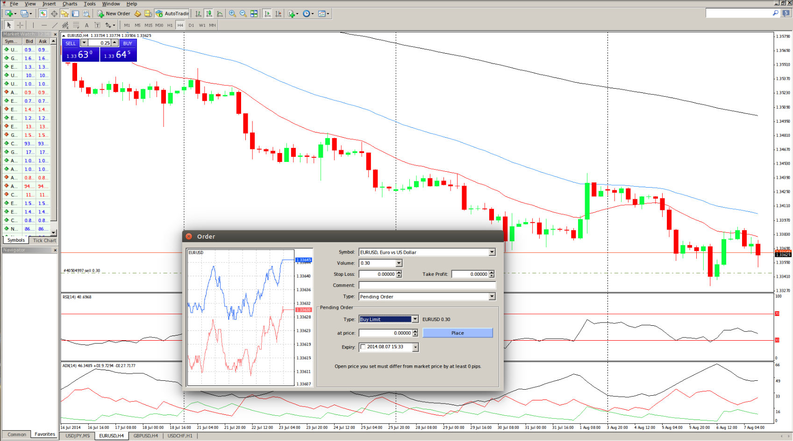

## Table of Contents

## What is meta-order execution?

Meta-order execution is when a big investor wants to buy or sell a lot of stocks, but they don't do it all at once. Instead, they break it up into smaller orders and do them over time. This helps them get a better price and not move the market too much. Imagine you want to buy a lot of candy at a store. If you buy it all at once, the price might go up. But if you buy a little bit each day, you can get a better deal and not make the price go up as much.

This strategy is used by big investors like hedge funds and pension funds. They use special computer programs to decide how to split up their big order into smaller ones. These programs look at things like the current price of the stock, how much the stock is being traded, and other market conditions. By doing this, they can buy or sell their stocks without causing big changes in the market price. It's like trying to fill a bucket with water without making waves in the pond.

## Why is meta-order execution important in trading?

Meta-order execution is important in trading because it helps big investors buy or sell a lot of stocks without messing up the market. When someone wants to trade a huge amount of stocks all at once, it can make the price go up or down a lot. This is bad because it can hurt other people who are trading too. By breaking up the big order into smaller pieces and spreading them out over time, the big investor can get a better price and not cause big changes in the market.

This strategy also helps big investors keep their plans secret. If they put in a huge order all at once, everyone can see what they are doing and might try to copy them or do the opposite. By using meta-order execution, they can hide what they are doing and keep other traders guessing. This gives them an advantage and helps them make more money. It's like playing a game of chess where you want to keep your moves secret until the last moment.

## What are the basic components of a meta-order?

A meta-order is like a big shopping list for stocks. The first part of a meta-order is the total amount of stocks you want to buy or sell. This is the big number that you want to break up into smaller pieces. The second part is the time frame. This is how long you want to take to buy or sell all the stocks. You might want to do it all in one day, or you might want to spread it out over a few days or even weeks.

The third part of a meta-order is the strategy. This is the plan for how you are going to break up the big order into smaller ones. You might decide to buy or sell a little bit every hour, or you might wait for the price to go up or down a bit before you make your next move. The last part is the execution. This is when you actually put in the smaller orders and start buying or selling the stocks. You use special computer programs to help you do this in the best way possible.

## How does meta-order execution differ from regular order execution?

Meta-order execution is different from regular order execution because it's used when someone wants to buy or sell a lot of stocks. In regular order execution, you just put in one order for all the stocks you want. But with meta-order execution, you break up the big order into smaller ones and do them over time. This helps you get a better price and not move the market too much.

For example, if you want to buy 10,000 shares of a company, regular order execution would mean you put in one order for all 10,000 shares at once. But with meta-order execution, you might buy 1,000 shares every hour for 10 hours. This way, you don't cause a big change in the price of the stock, and you can get a better deal. It's like trying to fill a bucket with water without making waves in the pond.

## What are the common strategies used in meta-order execution?

One common strategy in meta-order execution is called time slicing. This is when you break up your big order into smaller pieces and spread them out over time. You might decide to buy or sell a little bit every hour, or you might wait for the price to go up or down a bit before you make your next move. This helps you get a better price and not move the market too much. It's like trying to fill a bucket with water without making waves in the pond.

Another strategy is called [volume](/wiki/volume-trading-strategy) slicing. This is when you break up your big order based on how much the stock is being traded. If a lot of people are trading the stock, you might buy or sell more at once. But if not many people are trading, you might buy or sell less. This way, you can hide what you are doing and not cause big changes in the market price. It's like trying to sneak into a room without anyone noticing.

A third strategy is called adaptive execution. This is when you use special computer programs to decide how to break up your big order. These programs look at things like the current price of the stock, how much the stock is being traded, and other market conditions. They can change your plan on the fly to get the best price and not move the market too much. It's like having a smart friend who helps you make the best decisions.

## How do market conditions affect meta-order execution?

Market conditions can really change how a big investor does meta-order execution. If the market is busy with a lot of people buying and selling, a big investor might decide to buy or sell more stocks at once. This is because there are so many trades happening that their big order won't stand out as much. But if the market is quiet with not many people trading, the investor might go slower and buy or sell less at a time. This way, they don't cause big changes in the price of the stock and can get a better deal.

Special computer programs also help big investors adjust their meta-order execution based on what's happening in the market. These programs look at things like the current price of the stock, how much the stock is being traded, and other market conditions. If the price of the stock is going up, the program might tell the investor to buy more quickly. But if the price is going down, the program might say to wait a bit. This helps the investor get the best price and not move the market too much.

## What are the risks associated with meta-order execution?

One risk of meta-order execution is that the market might move against the big investor. Even if they break up their big order into smaller pieces and spread them out over time, the price of the stock can still go up or down a lot. If the price goes the wrong way, the investor might end up paying more or getting less than they wanted. It's like trying to catch a ball that keeps moving around.

Another risk is that other traders might figure out what the big investor is doing. Even if they try to hide their big order by breaking it up into smaller ones, smart traders might still notice the pattern. If they see that someone is buying or selling a lot of a certain stock over time, they might try to copy the big investor or do the opposite. This can make it harder for the big investor to get a good price and can mess up their plan. It's like trying to keep a secret, but someone finds out anyway.

## How can technology improve meta-order execution?

Technology can make meta-order execution better by using smart computer programs that look at a lot of information very quickly. These programs can see what's happening in the market, like the price of the stock and how much it's being traded. They use this information to decide the best way to break up the big order into smaller ones and when to buy or sell them. This helps the big investor get a better price and not move the market too much. It's like having a super smart friend who helps you make the best decisions.

Another way technology helps is by keeping the big investor's plan a secret. The computer programs can change the way the big order is broken up and when it's done, so other traders can't figure out what's going on. This makes it harder for other people to copy the big investor or do the opposite. By using technology, the big investor can hide what they are doing and keep their advantage in the market. It's like playing a game of hide and seek where you're really good at hiding.

## What metrics are used to evaluate the performance of meta-order execution?

When big investors use meta-order execution, they look at certain numbers to see how well they did. One important number is the average price they paid or got for the stock. They compare this to the price when they started their big order. If the average price is better than they expected, they know they did a good job breaking up the big order into smaller pieces and spreading them out over time. Another number they look at is how much the price of the stock moved while they were buying or selling. If the price didn't move much, it means they did a good job not messing up the market.

Another way to check how well meta-order execution worked is by looking at how much of the big order they were able to complete. If they managed to buy or sell all the stocks they wanted without causing big changes in the market, that's a good sign. They also look at how long it took to finish the big order. If they could do it quickly without moving the market too much, that's another good result. By keeping an eye on these numbers, big investors can see if their strategy of breaking up the big order into smaller ones and spreading them out over time is working well.

## How do regulatory requirements impact meta-order execution?

Regulatory requirements can change how big investors do meta-order execution. Rules from places like the Securities and Exchange Commission (SEC) say that big investors need to be careful and fair when they buy or sell a lot of stocks. They can't do things that might trick other people in the market or make the price of the stock go up or down too much on purpose. So, when big investors break up their big order into smaller ones and spread them out over time, they have to make sure they are following all these rules. This can make meta-order execution a bit harder because they have to be extra careful.

Sometimes, these rules also mean that big investors have to report what they are doing to the regulators. This can make it harder for them to keep their plans a secret. If other traders know what the big investor is doing, they might try to copy them or do the opposite, which can mess up the big investor's plan. But by following the rules, big investors can help make the market fair for everyone. It's like playing a game where you have to follow the rules to make sure everyone has a fair chance.

## What advanced techniques can be used to optimize meta-order execution?

One advanced technique to make meta-order execution better is using [machine learning](/wiki/machine-learning). This is when computers learn from past data to make smart guesses about the future. They can look at old information about how the market moved when big investors bought or sold a lot of stocks. Then, they use this information to decide the best way to break up the big order into smaller ones and when to do it. This helps the big investor get a better price and not move the market too much. It's like having a super smart friend who gets better at helping you over time.

Another technique is called [liquidity](/wiki/liquidity-risk-premium) forecasting. This is when the big investor tries to guess how easy it will be to buy or sell the stock in the future. They look at things like how much the stock is being traded and what other big investors are doing. If they think it will be easy to buy or sell the stock later, they might wait a bit before they do their next small order. But if they think it will be hard, they might do their next order sooner. By doing this, they can get a better price and not cause big changes in the market. It's like trying to find the best time to go shopping when the store is not too busy.

## How does machine learning contribute to meta-order execution strategies?

Machine learning helps make meta-order execution better by looking at a lot of old information about how the market moved when big investors bought or sold a lot of stocks. It uses this information to guess the best way to break up a big order into smaller ones and when to do it. This helps the big investor get a better price and not move the market too much. It's like having a super smart friend who learns from the past to help you make the best decisions in the future.

By using machine learning, big investors can also change their plans quickly based on what's happening in the market right now. The computer programs can look at things like the current price of the stock and how much it's being traded. If the price is going up or down a lot, the program can tell the investor to buy or sell faster or slower. This helps the investor get the best price and keep their big order a secret from other traders. It's like having a smart helper who can adapt to new situations on the fly.

## References & Further Reading

[1]: Almgren, R., & Chriss, N. (2000). ["Optimal Execution of Portfolio Transactions"](https://smallake.kr/wp-content/uploads/2016/03/optliq.pdf). Journal of Risk.

[2]: Kissell, R. (2013). ["The Science of Algorithmic Trading and Portfolio Management"](https://www.sciencedirect.com/book/9780124016897/the-science-of-algorithmic-trading-and-portfolio-management) by Robert Kissell. Academic Press.

[3]: Laruelle, S., Lehalle, C., & Rosenbaum, M. (2013). ["Market Microstructure in Practice"](http://helper.ipam.ucla.edu/publications/fmws2/fmws2_12928.pdf). World Scientific.

[4]: Lopez de Prado, M. (2018). ["Advances in Financial Machine Learning"](https://www.amazon.com/Advances-Financial-Machine-Learning-Marcos/dp/1119482089) by Marcos Lopez de Prado. Wiley.

[5]: Hendershott, T., Jones, C. M., & Menkveld, A. J. (2011). ["Does Algorithmic Trading Improve Liquidity?"](https://onlinelibrary.wiley.com/doi/full/10.1111/j.1540-6261.2010.01624.x) The Review of Financial Studies.