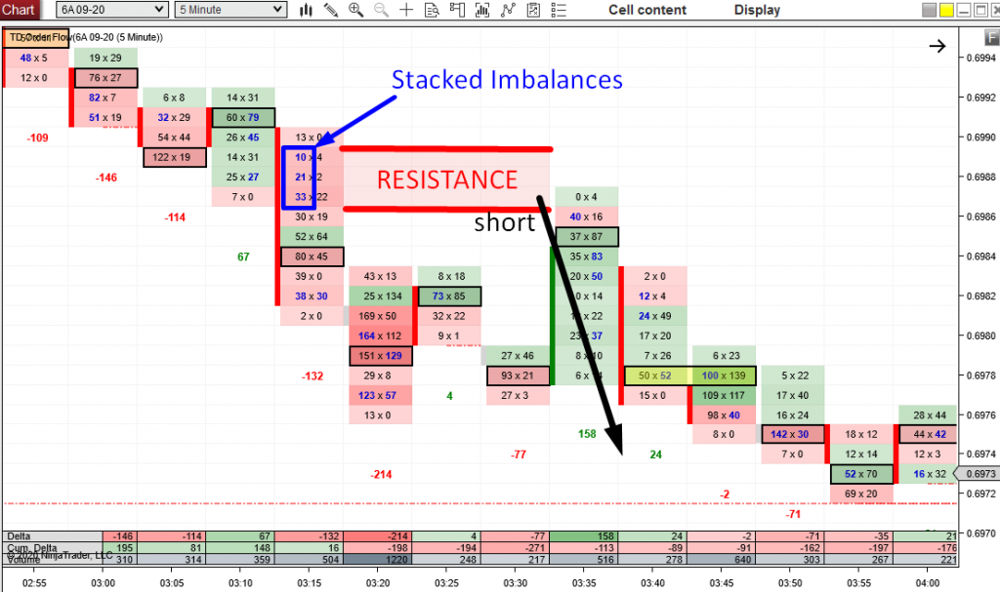

## Table of Contents

## What is a metaorder in financial markets?

A metaorder in financial markets is a big order that a trader splits into smaller pieces to buy or sell over time. Instead of putting in one huge order all at once, which could affect the market price a lot, the trader breaks it up. This way, they can try to get a better average price and not cause too much attention or price movement.

For example, if a trader wants to buy 100,000 shares of a stock, they might decide to buy 10,000 shares every hour for 10 hours. By doing this, they hope to keep the price stable and not scare other traders. Metaorders are often used by big investors or institutions who need to trade large amounts without causing big changes in the market.

## How does a metaorder differ from a regular order?

A metaorder is different from a regular order because it's much bigger and gets split into smaller parts. A regular order is usually placed all at once, like when you want to buy or sell a certain number of shares right away. But a metaorder is too big to do that without affecting the market price a lot, so the trader breaks it into smaller pieces and spreads them out over time.

For example, if you want to buy 100 shares of a company, you can just place a regular order for all 100 shares at once. But if you want to buy 100,000 shares, placing a regular order for that amount could make the price go up a lot. So, you would use a metaorder, splitting it into maybe 10,000 shares every hour for 10 hours. This way, you try to keep the price from jumping too much and get a better average price for your big order.

## What is meant by 'imbalance' in the context of metaorders?

In the context of metaorders, 'imbalance' refers to a situation where the buying or selling pressure from the metaorder is not balanced with the opposite side of the market. For example, if a trader is using a metaorder to buy a lot of shares, but there aren't enough people selling those shares at the same time, it creates a buying imbalance. This can push the price of the stock up because there's more demand than supply.

To manage this imbalance, traders need to carefully plan how they split their metaorder. They might slow down their buying or adjust the size of each smaller order to avoid causing big price movements. If the imbalance becomes too large, it can lead to sudden price jumps or drops, which is something traders want to avoid when they're trying to execute a big order without drawing too much attention.

## Why is metaorder imbalance important for traders and investors?

Metaorder imbalance is important for traders and investors because it can affect the price of a stock. When someone is using a metaorder to buy or sell a lot of shares, if there isn't enough opposite activity in the market, it can create an imbalance. This means there's more buying or selling pressure than normal, which can push the price up or down. Traders and investors need to watch for these imbalances because they can impact the price they get for their trades.

Understanding and managing metaorder imbalance helps traders get better prices for their big orders. If they can keep the buying and selling balanced, they can avoid sudden price changes that might hurt their overall cost. By carefully planning how they split up their metaorder, traders can minimize the impact on the market and achieve a more favorable average price for their large trades. This is why paying attention to metaorder imbalance is crucial for anyone dealing with big orders in the financial markets.

## How can metaorder imbalance affect market liquidity?

Metaorder imbalance can affect market [liquidity](/wiki/liquidity-risk-premium) by making it harder to buy or sell shares at the current price. When someone uses a metaorder to buy a lot of shares, but there aren't enough people selling, it creates a buying imbalance. This means there's more demand than supply, which can make the price go up. If the price goes up too fast, it might scare away other sellers, making it even harder to find someone willing to sell at the new higher price. This reduces the number of shares available for trading, which is what we call lower liquidity.

On the other hand, if someone is using a metaorder to sell a lot of shares and there aren't enough buyers, it creates a selling imbalance. This means there's more supply than demand, which can push the price down. If the price drops too quickly, it might scare away potential buyers, making it harder to find someone willing to buy at the new lower price. This also reduces the number of shares that can be easily traded, leading to lower liquidity. So, metaorder imbalances can make the market less liquid by causing big price changes that discourage trading.

## What are the common causes of metaorder imbalance?

Metaorder imbalance often happens when there's a big order that gets split into smaller parts over time. If the trader is buying a lot of shares, but not many people are selling at the same time, it creates a buying imbalance. This means there are more people wanting to buy than there are people wanting to sell. The opposite can happen too, where someone is selling a lot of shares, but not many people are buying. This creates a selling imbalance, where there's more supply than demand.

These imbalances can be caused by different things. Sometimes, big news about a company can make a lot of traders want to buy or sell at the same time, leading to an imbalance. Other times, it's just because the market is naturally quieter, with fewer people trading. Also, if a trader doesn't plan their metaorder well, they might buy or sell too quickly, causing an imbalance before they realize it. So, understanding the market and planning carefully is important to avoid these imbalances.

## How can one identify metaorder imbalance in trading data?

To spot a metaorder imbalance in trading data, you need to look at the [order book](/wiki/order-book-trading-strategies) and see if there are a lot more orders on one side than the other. For example, if you see a lot of buy orders but not many sell orders, it means there's a buying imbalance. You can also watch the [volume](/wiki/volume-trading-strategy) of trades. If you see a big spike in the number of shares being bought or sold, it might be because someone is using a metaorder and causing an imbalance.

Another way to identify a metaorder imbalance is by looking at the price movements. If the price starts moving quickly in one direction, like going up a lot because of many buy orders, it could be a sign of a buying imbalance. On the other hand, if the price drops fast because of many sell orders, it might show a selling imbalance. By keeping an eye on these signs, traders can better understand what's happening in the market and adjust their strategies accordingly.

## What are the potential risks associated with metaorder imbalance?

Metaorder imbalance can cause big price changes in the market. If someone is using a metaorder to buy a lot of shares and not many people are selling, it can make the price go up a lot. This is called a buying imbalance. The opposite can happen too, where someone is selling a lot of shares but not many people are buying, causing a selling imbalance and making the price go down. These sudden price changes can be risky for traders because they might not get the price they were hoping for when they trade.

Another risk is that metaorder imbalances can make the market less liquid. When there's a buying or selling imbalance, it can be hard to find someone to trade with at the current price. This means fewer shares can be easily bought or sold, which can make it harder for other traders to do their trades. If traders can't find enough people to trade with, they might have to wait or accept a worse price, which can hurt their overall trading results. So, it's important for traders to watch for these imbalances and plan their big orders carefully to avoid these risks.

## How do high-frequency trading strategies exploit metaorder imbalances?

High-frequency trading strategies can take advantage of metaorder imbalances by quickly buying or selling shares when they see a big order causing a price change. If they spot a buying imbalance, they might buy shares right before the price goes up, then sell them at the higher price to make a quick profit. On the other hand, if they see a selling imbalance, they might sell shares right before the price drops, then buy them back at the lower price to make money. These traders use fast computers and algorithms to act faster than others, making money from the small price changes caused by metaorder imbalances.

These strategies can also help high-frequency traders predict future price movements. By watching the order book and seeing a lot of buy orders coming in, they can guess that the price might go up soon because of a buying imbalance. They can then trade ahead of this change, buying shares before the price goes up and selling them after. This quick action can make them money, but it can also add to the price changes in the market, making the imbalances even bigger. So, while high-frequency traders can profit from metaorder imbalances, their actions can sometimes make the market more unstable.

## What are the advanced tools and algorithms used to detect and analyze metaorder imbalances?

To detect and analyze metaorder imbalances, traders use advanced tools and algorithms that help them understand the market better. One common tool is the order book, which shows all the buy and sell orders for a stock. By looking at the order book, traders can see if there are a lot more buy orders than sell orders or vice versa, which can signal a buying or selling imbalance. Another tool is the volume analysis, which tracks how many shares are being traded. If there's a sudden increase in the number of shares being bought or sold, it might mean someone is using a metaorder and causing an imbalance. These tools help traders spot imbalances quickly and make better decisions.

Algorithms play a big role too. They can look at past data and find patterns that show when a metaorder imbalance might happen. For example, some algorithms use [machine learning](/wiki/machine-learning) to predict when a big order might cause a price change. These algorithms can also help traders figure out how to split their own big orders to avoid causing an imbalance. By using these advanced tools and algorithms, traders can manage their trades more carefully and try to get the best prices for their big orders.

## How can regulatory frameworks address issues arising from metaorder imbalances?

Regulatory frameworks can help manage issues from metaorder imbalances by making rules that keep the market fair and stable. They might set limits on how fast someone can buy or sell a lot of shares to stop big price changes. They could also make rules about how much information traders need to share about their big orders. This helps everyone see what's happening in the market and can stop one person from causing too much trouble with a big order.

Another way regulators can help is by watching the market closely and stepping in if they see a big imbalance causing problems. They might pause trading for a little while if the price is moving too fast because of a metaorder. This gives everyone a chance to calm down and think. By doing these things, regulators can make sure the market stays a good place for everyone to trade, even when there are big orders causing imbalances.

## What future trends might impact the dynamics of metaorder imbalances in financial markets?

In the future, technology will play a big role in how metaorder imbalances work in financial markets. As computers get faster and smarter, traders will use more advanced tools to spot and handle these imbalances. For example, new algorithms might be able to predict when a big order will cause a price change even better than they do now. This could help traders split their big orders in smarter ways to avoid causing big price jumps. Also, more people might start using high-frequency trading, which can make the market move even faster and change how imbalances happen.

Another trend that might affect metaorder imbalances is how rules and regulations change. Governments and market watchdogs might make new rules to stop big orders from causing too much trouble. They could set limits on how fast someone can buy or sell a lot of shares, or they might ask traders to share more information about their big orders. This could make the market more stable and fair for everyone. But it might also make it harder for traders to use big orders without causing imbalances, so they'll need to be even more careful and smart about how they trade.

## References & Further Reading

[1]: Harris, L. (2003). *Trading and Exchanges: Market Microstructure for Practitioners*. Oxford University Press.  
This foundational text explores the intricate framework of market microstructure, offering a detailed examination of trading mechanisms, market design, and the behavior of various market participants. Through a systematic analysis, Harris elucidates the principles underpinning trading exchanges and the operational dynamics that influence price formation.

[2]: Hasbrouck, J. (2007). *Empirical Market Microstructure: The Institutions, Economics, and Econometrics of Securities Trading*. Oxford University Press.  
Hasbrouck provides an empirical perspective on market microstructure, incorporating rigorous econometric analyses to unravel the complexities of securities trading. The book emphasizes the importance of understanding the institutional context within which trading occurs, enhancing the reader's grasp of market liquidity, price discovery, and the impacts of trading activity on asset prices.

[3]: Aldridge, I. (2013). *High-Frequency Trading: A Practical Guide to Algorithmic Strategies and Trading Systems, Second Edition*. Wiley.  
A comprehensive guide to the world of high-frequency trading, Aldridge's work bridges the gap between theoretical concepts and practical application. The text covers diverse algorithmic strategies, shedding light on their implementation within high-speed trading environments. It also addresses the technical challenges and risks associated with developing and deploying trading algorithms in fast-paced markets.

[4]: Kissell, R. (2014). *The Science of Algorithmic Trading and Portfolio Management*. Academic Press.  
Kissell's work offers an in-depth exploration of [algorithmic trading](/wiki/algorithmic-trading) strategies, examining their role in modern portfolio management. The book delves into quantitative models, risk management techniques, and execution strategies that optimize trading performance. Through its systematic approach, it provides valuable insights into the integration of algorithmic tools within investment processes.

These resources collectively impart a robust understanding of trading mechanics, market structures, and the strategic deployment of algorithmic techniques in financial markets.

