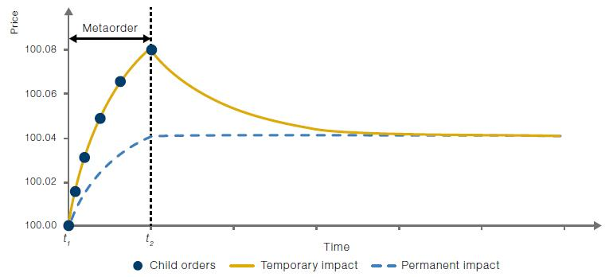

## Table of Contents

## What is a metaorder?

A metaorder is a big order in trading that is split into smaller orders. Traders do this to hide their big order from others in the market. By breaking it into smaller pieces, they can buy or sell without moving the market price too much.

This strategy is useful because if everyone knows about a big order, they might change their trading behavior. This could make the price go up or down quickly. By using metaorders, traders can keep their plans secret and get a better price for their trades.

## How does a metaorder differ from a regular order?

A metaorder is different from a regular order because it's a big order that gets split into smaller pieces. When you place a regular order, you usually want to buy or sell a certain amount of something all at once. But with a metaorder, you break that big amount into smaller orders that you spread out over time. This helps keep the big order a secret from other traders.

The main reason traders use metaorders instead of regular orders is to avoid moving the market price too much. If everyone knows about a big order, they might start buying or selling too, which can make the price change quickly. By using metaorders, traders can slowly buy or sell without causing a big stir in the market. This way, they can get a better price for their trades and keep their trading plans hidden.

## What are the main types of metaorders?

There are a few main types of metaorders that traders use. One type is called a VWAP (Volume Weighted Average Price) metaorder. With this type, traders split their big order into smaller pieces based on how much trading is happening in the market. They try to match their smaller orders with the average price of trades over a certain time. This helps them get a fair price without moving the market too much.

Another type is called a TWAP (Time Weighted Average Price) metaorder. Here, traders spread their big order evenly over a set period of time. They do this by placing smaller orders at regular intervals, no matter how much trading is happening. This can help them avoid big price changes and keep their trading secret.

The last common type is an implementation shortfall metaorder. This type focuses on reducing the difference between the price when the trader decides to trade and the actual price they get. Traders using this type try to place their smaller orders quickly and smartly to minimize this difference. Each type of metaorder has its own way of helping traders achieve their goals without causing too much attention in the market.

## What are the benefits of using metaorders in trading?

Using metaorders in trading can help traders keep their big orders secret. When you have a big order, other traders might see it and start buying or selling too, which can make the price go up or down quickly. By breaking the big order into smaller pieces, traders can hide what they're doing. This way, they can buy or sell without everyone knowing about it, which helps them get a better price for their trades.

Another benefit of metaorders is that they can help traders avoid big changes in the market price. If you place a big order all at once, it might cause the price to move a lot. But if you use metaorders, you can spread out your trades over time. This means you can buy or sell slowly without making the price jump around too much. It's like sneaking into a room quietly instead of bursting through the door. By doing this, traders can get a better deal and keep the market calm.

## How do metaorders help in managing large volumes of trades?

Metaorders help in managing large volumes of trades by breaking them into smaller pieces. Instead of placing one big order, traders spread it out over time. This way, they can buy or sell a lot without making the market price move too much. It's like taking small sips of a drink instead of gulping it all at once. By doing this, traders can manage their large trades without causing a big stir in the market.

Another way metaorders help is by keeping the big order a secret. If everyone knows about a big order, they might start trading too, which can push the price up or down quickly. But with metaorders, traders can hide what they're doing. They place small orders slowly, so others don't notice the big plan. This helps them get a better price for their trades and manage large volumes without everyone knowing about it.

## What are the common strategies for executing metaorders?

One common strategy for executing metaorders is using VWAP (Volume Weighted Average Price). This means traders break their big order into smaller pieces based on how much trading is happening in the market. They try to match their smaller orders with the average price of trades over a certain time. This helps them get a fair price without moving the market too much. It's like trying to blend in with the crowd so you don't stand out.

Another strategy is using TWAP (Time Weighted Average Price). Here, traders spread their big order evenly over a set period of time. They place smaller orders at regular intervals, no matter how much trading is happening. This can help them avoid big price changes and keep their trading secret. It's like taking small steps instead of one big jump, so you don't cause a big splash.

The last common strategy is called implementation shortfall. This focuses on reducing the difference between the price when the trader decides to trade and the actual price they get. Traders using this type try to place their smaller orders quickly and smartly to minimize this difference. It's like trying to get the best deal by being quick and clever about when and how you place your orders.

## How do market conditions affect the execution of metaorders?

Market conditions can really change how traders use metaorders. If the market is busy with lots of trading, it's easier to hide a big order. Traders can break their metaorder into smaller pieces and blend them in with all the other trades happening. This way, they can buy or sell without making the price move too much. But if the market is quiet, it's harder to hide a big order. When there's not much trading, even small orders can make the price change. So, traders need to be careful and might need to spread their metaorder out over a longer time to keep it secret.

Another thing to think about is how the market is moving. If prices are going up or down a lot, traders need to adjust their metaorder strategy. In a fast-moving market, they might need to place their smaller orders more quickly to keep up with the price changes. But if the market is stable, they can take their time and spread out their orders more evenly. Understanding the market conditions helps traders decide the best way to use metaorders to get the best price for their trades without causing too much attention.

## What are the risks associated with metaorders?

Using metaorders can be risky because they might not always work as planned. If the market is too quiet, the smaller orders from a metaorder can still cause the price to move. This can make it hard to hide the big order and might lead to a worse price for the trader. Also, if the market moves quickly, the trader might not be able to place all their smaller orders at good prices. This can lead to a bigger difference between the planned price and the actual price they get.

Another risk is that other traders might figure out what's happening. If someone notices the pattern of the smaller orders, they might guess that a big metaorder is in play. This can lead to other traders trying to take advantage of the situation by buying or selling in a way that pushes the price against the metaorder. This makes it harder for the trader to get a good price and can even lead to losses. So, while metaorders can help manage big trades, they come with risks that traders need to be careful about.

## How can technology and algorithms improve metaorder execution?

Technology and algorithms can make metaorder execution better by helping traders place their smaller orders at the best times. They use smart math to figure out when the market is busy or quiet. This way, they can hide the big order better and get a good price. Algorithms can also look at past data to see how the market usually moves. This helps them decide the best way to spread out the smaller orders over time. By using technology, traders can make their metaorders work more smoothly and avoid big price changes.

Another way technology helps is by making the whole process faster. Algorithms can place orders very quickly, which is important in a fast-moving market. This means traders can react to price changes right away and still get a good deal. Plus, technology can keep an eye on the market all the time and adjust the metaorder plan if needed. This makes it easier to manage big trades without causing too much attention. So, with the right tools, traders can use metaorders more effectively and safely.

## What metrics are used to evaluate the performance of metaorders?

Traders use different numbers to see how well their metaorders are doing. One important number is the implementation shortfall, which shows the difference between the price when the trader decides to trade and the actual price they get. A smaller difference means the metaorder worked well. Another number is the market impact, which looks at how much the price moved because of the metaorder. If the price didn't move much, it means the metaorder was good at hiding the big order.

Another useful number is the [volume](/wiki/volume-trading-strategy) participation rate, which shows how much of the total market trading was done by the metaorder. If this number is close to the average trading volume, it means the metaorder blended in well with other trades. Traders also look at the timing risk, which is how much the price changed while the metaorder was being placed. If the price stayed stable, it means the metaorder was spread out well over time. By looking at these numbers, traders can see if their metaorders are working and make changes if needed.

## How do regulatory requirements impact the use of metaorders?

Regulatory requirements can affect how traders use metaorders. Rules from places like the SEC or other financial watchdogs can limit how traders can break up their big orders. For example, some rules might say that traders need to show their big orders to everyone in the market. This makes it harder to use metaorders because the whole point is to keep the big order a secret. Also, there might be rules about how fast traders can place their smaller orders. If the rules say they have to slow down, it can be harder to get a good price for the metaorder.

Another way regulations impact metaorders is through reporting requirements. Traders might have to tell the regulators about their big orders, even if they are using metaorders. This means they need to keep good records and be ready to explain their trading plans. If they don't follow these rules, they could get in trouble. So, traders need to know the rules and plan their metaorders carefully to stay on the right side of the law while still trying to get the best price for their trades.

## What are the future trends and developments expected in metaorder technology?

In the future, we might see even smarter algorithms for metaorders. These algorithms could use things like [artificial intelligence](/wiki/ai-artificial-intelligence) to predict how the market will move. This means they could place the smaller orders at even better times, making it easier to hide the big order and get a good price. Also, technology might get even faster, letting traders react to market changes in the blink of an eye. This would help them use metaorders more effectively, especially in fast-moving markets.

Another trend could be more focus on how to follow the rules while still using metaorders well. As regulators keep an eye on trading, they might make new rules that change how traders can use metaorders. So, future technology might need to be good at following these rules while still helping traders get the best price. This could mean new tools that help traders keep track of their orders and make sure they are doing everything by the book.

## References & Further Reading

[1]: Bouchaud, J.-P., Bonart, J., Donier, J., & Gould, M. (2018). ["Trades, Quotes and Prices: Financial Markets Under the Microscope"](https://api.pageplace.de/preview/DT0400.9781108639064_A34411323/preview-9781108639064_A34411323.pdf) Cambridge University Press.

[2]: Almgren, R., Thum, C., Hauptmann, E., & Li, H. (2005). ["Direct Estimation of Equity Market Impact"](https://www.semanticscholar.org/paper/Direct-Estimation-of-Equity-Market-Impact-Almgren-Thum/00777edc168f26633de9f5b9ff4c4f74bd9790e3) Risk, com.

[3]: Cartea, Á., Jaimungal, S., & Penalva, J. (2015). ["Algorithmic and High-Frequency Trading"](https://assets.cambridge.org/97811070/91146/frontmatter/9781107091146_frontmatter.pdf) Cambridge University Press.

[4]: Gatheral, J. (2010). ["No-Dynamic-Arbitrage and Market Impact"](https://papers.ssrn.com/sol3/papers.cfm?abstract_id=1292353) Quantitative Finance, 10(7), 749-759.

[5]: Lopez de Prado, M. (2018). ["Advances in Financial Machine Learning"](https://books.google.com/books/about/Advances_in_Financial_Machine_Learning.html?id=oU9KDwAAQBAJ) Wiley.