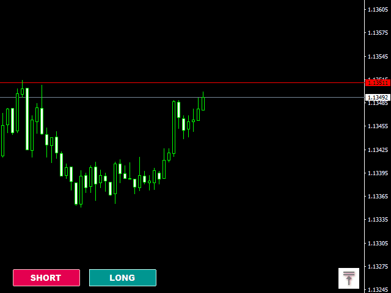

In the dynamic world of financial markets, algorithmic trading has transformed how trades are executed, facilitating faster and more efficient transactions. A central element of this transformation is the concept of metaorders, which play a pivotal role in the functioning of algorithmic trading systems. Metaorders refer to the strategic fragmentation of large orders into smaller, manageable parts, which are then executed over a designated period. This practice is crucial in minimizing the impact of large trades on market prices, thereby optimizing trade execution.

Understanding the intricacies of metaorders is essential as they significantly improve the efficiency and effectiveness of trading strategies. By incorporating metaorders, traders can enhance their ability to execute large trades without attracting unnecessary attention, thereby reducing potential market disruptions. The integration of metaorders optimizes transaction costs, maintains market liquidity, and stabilizes market operations, making it an indispensable strategy in algorithmic trading.

As algorithmic trading continues to expand and evolve, mastering the implementation and function of metaorders becomes increasingly important. Traders equipped with a deep understanding of metaorders are better positioned to capitalize on the advantages offered by technology-driven markets. This article investigates the role and impact of metaorders within algorithmic trading, emphasizing their significance in maintaining competitive advantage in modern financial markets.

## Table of Contents

## What are Metaorders?

Metaorders refer to substantial trading orders that are deconstructed into smaller, more manageable segments to minimize their impact on the market. This segmentation occurs to facilitate optimal trade execution, thereby reducing the inherent visibility and potential market disruption of large transactions. By fragmenting a single sizable order into multiple smaller ones and executing them over time, traders can effectively mask their trading intentions, ensuring that the large orders do not unduly influence market prices.

In algorithmic trading, metaorders are pivotal because they help maintain market balance and liquidity. The execution of smaller orders is strategically timed and distributed, preventing wide price swings that a single large order might trigger. This mechanism is crucial for traders who seek to execute significant trades without causing drastic alterations in market prices.

Structuring and implementing metaorders requires a deep understanding of market dynamics and execution strategies. Traders must be adept at dissecting large orders into optimal sequences of manageable trades and determining the timing of each to align with market conditions. This approach mitigates risks associated with market volatility, enabling traders to achieve their objectives of minimizing transaction costs while maximizing execution efficiency.

By leveraging sophisticated algorithmic solutions, traders can enhance their execution strategies, harnessing the full potential of metaorders to navigate the complexities of financial markets effectively. Through the strategic deployment of metaorders, traders are able to exercise greater control over their trading activities, aligning them with broader market conditions to mitigate adverse impacts and capitalize on available opportunities.

## The Importance of Metaorders in Algorithmic Trading

Algorithmic trading's effectiveness is significantly enhanced by the utilization of metaorders. These large orders, strategically divided into smaller subsets, facilitate traders in executing substantial trades without unnaturally influencing market prices, therefore reducing transaction costs. This is paramount in preserving the overall market [liquidity](/wiki/liquidity-risk-premium) and stability, vital traits in increasingly volatile financial markets. 

By minimizing market impact through the fragmentation of orders, metaorders allow traders to stagger their transactions, thereby ensuring execution at more consistent price levels. This approach mitigates the risk of slippage—a situation where the execution price diverges from the expected price due to market fluctuations caused by significant trades. Consequently, traders are able to save on the costs associated with these potential price deviations, leading to more cost-effective trading operations.

Furthermore, metaorders are instrumental in strategic planning, providing traders the flexibility to adjust their strategies dynamically based on real-time market conditions. This enables them to capitalize on short-term fluctuations and exploit opportunities as they arise, crucial in high-frequency trading ([HFT](/wiki/high-frequency-trading-strategies)) environments where speed and precision are of the essence. Using metaorders, traders can systematically align their trading activities with incoming market data, maximizing potential profits while minimizing risks.

Moreover, metaorders play a crucial role in enabling traders to maintain a competitive edge. In highly competitive markets, having the foresight to execute large trades with minimal impact grants traders the ability to better leverage information and make informed decisions swiftly. The strategic use of metaorders thus becomes a key driver for traders striving to achieve superior trading outcomes in [algorithmic trading](/wiki/algorithmic-trading) landscapes.

## Detecting Metaorders in Limit Order Book Markets

Identifying metaorders in limit [order book](/wiki/order-book-trading-strategies) (LOB) markets poses a significant challenge due to the complexity and dynamic nature of these markets. The practice of detecting metaorders is critical as it provides valuable trading insights that can be leveraged for strategic decision-making. Metaorders, by their nature, are large trade orders broken into smaller parts to minimize market impact. Successfully detecting these orders within the LOB involves utilizing sophisticated modeling techniques and algorithms.

Advanced modeling approaches such as [machine learning](/wiki/machine-learning) and statistical analysis are employed to filter through vast amounts of LOB data to identify patterns indicative of metaorder activity. For instance, algorithms can analyze order flow and trade imbalances over time to detect anomalies that suggest the presence of a metaorder. Models like Hidden Markov Models (HMM) and Kalman filters are among the tools used to infer hidden states from observed order flows, tracking their evolution through time.

One key area of research focuses on understanding the price impact associated with these large orders. Metaorders typically exert a substantial influence on price dynamics due to their [volume](/wiki/volume-trading-strategy). Researchers use regression models to quantify the relationship between the size of an order and its subsequent impact on price. The goal is to distinguish between price movements driven by regular traders and those instigated by market makers or other participants involved in executing metaorders.

Differentiating regular traders from market makers within the LOB is another critical aspect. Market makers frequently adjust their quotes rapidly to manage inventory risks and capture spreads. Algorithms can be designed to monitor quote updates and order cancellations, using latency as an indicator to separate market-making activities from metaorder executions. These algorithms might, for instance, flag a series of rapid quote changes without accompanying trade executions as market-making rather than metaorder activity.

Furthermore, the development of these detection models gives traders practical tools to adapt their trading strategies in response to real-time market conditions. Implementing models that provide real-time insights into order book dynamics allows traders to anticipate liquidity changes and adjust their trading strategies accordingly. For example, traders can use Python-based tools like pandas for time series analysis, alongside machine learning libraries such as scikit-learn, to discern patterns predictive of market [volatility](/wiki/volatility-trading-strategies) prompted by metaorder execution.

By harnessing such techniques, traders can enhance their strategic decision-making and maintain a competitive edge in fast-paced electronic markets, even as these markets continue to evolve and grow in complexity.

## The Role of MQL5 in Developing Metaorders

The MQL5 integrated development environment (IDE) is a pivotal tool in the development and execution of algorithmic trading strategies, particularly in the design and implementation of metaorders. It empowers traders with advanced features that facilitate the creation of sophisticated trading robots tailored to optimize trade executions.

MQL5 provides an array of tools that streamline the development process. The MQL5 Wizard is one such feature, simplifying the creation of trading robots by guiding users through a series of pre-defined templates and parameters. This feature allows for the rapid development of algorithmic strategies that can effectively manage metaorders by breaking down large trades into smaller, manageable segments.

Another key feature is the MetaEditor, a comprehensive code editor tailored for the development of complex trading algorithms. MetaEditor supports the MQL5 language, which is robust and capable of handling intricate trading strategies. With its debugging and error-checking capabilities, traders can refine their algorithms to ensure they execute metaorders with precision and efficiency.

The Strategy Tester is another integral component, enabling traders to backtest their trading strategies against historical data. This tool is crucial for the evaluation and optimization of algorithms, offering insights into the performance of metaorders under various market conditions. The ability to simulate market scenarios and adjust strategies accordingly ensures that traders can maximize the effectiveness of their metaorders.

Additionally, the extensive MQL5 Code Base and a vibrant community of traders and developers provide a rich resource for learning and innovation. The Code Base offers a repository of scripts, indicators, and strategies that can serve as building blocks or inspiration for developing custom algorithms incorporating metaorders. Community support, through forums and collaboration platforms, facilitates the exchange of ideas and solutions, further enhancing the development of tailored trading strategies.

By leveraging these tools and resources, traders can effectively design, implement, and refine metaorders, adapting their strategies to the ever-evolving dynamics of financial markets. As a result, MQL5 stands as a significant contributor to the advancement of algorithmic trading methodologies.

## Conclusion

Metaorders are an indispensable component of successful algorithmic trading strategies. Their structured approach to managing large trades without adversely influencing market prices renders them invaluable to traders. By fragmenting a substantial order into smaller, executable segments, traders mitigate the risk of significant price shifts and preserve market stability. This strategic management of trade execution is crucial, particularly in maintaining liquidity and reducing transaction costs.

As financial markets continue to evolve, traders equipped with knowledge of metaorders and algorithmic strategies gain a competitive advantage. The dynamic nature of trading requires continuous adaptation and optimization of trading strategies for efficiency. A deep understanding of metaorders allows traders to strategically plan and implement trades that capitalize on sensitive market information without alerting competitors.

Embracing evolving tools and technologies that facilitate the incorporation of metaorders can lead to more robust and profitable trading outcomes. Platforms like MQL5 empower traders to harness complex algorithms for developing, testing, and fine-tuning trading strategies. Such technological advancements ensure that traders can effectively utilize metaorders, optimizing trade execution in a fast-paced trading environment. Consequently, the adept use of metaorders not only enhances trading precision but also contributes to long-term profitability in algorithmic trading.

## References & Further Reading

[1]: Bouchaud, J.-P., Bonart, J., Donier, J., & Gould, M. (2018). ["Trades, Quotes and Prices: Financial Markets Under the Microscope"](https://api.pageplace.de/preview/DT0400.9781108639064_A34411323/preview-9781108639064_A34411323.pdf) Cambridge University Press.

[2]: Almgren, R., Thum, C., Hauptmann, E., & Li, H. (2005). ["Direct Estimation of Equity Market Impact"](https://www.semanticscholar.org/paper/Direct-Estimation-of-Equity-Market-Impact-Almgren-Thum/00777edc168f26633de9f5b9ff4c4f74bd9790e3) Risk, com.

[3]: Cartea, Á., Jaimungal, S., & Penalva, J. (2015). ["Algorithmic and High-Frequency Trading"](https://assets.cambridge.org/97811070/91146/frontmatter/9781107091146_frontmatter.pdf) Cambridge University Press.

[4]: Gatheral, J. (2010). ["No-Dynamic-Arbitrage and Market Impact"](https://papers.ssrn.com/sol3/papers.cfm?abstract_id=1292353) Quantitative Finance, 10(7), 749-759.

[5]: Lopez de Prado, M. (2018). ["Advances in Financial Machine Learning"](https://books.google.com/books/about/Advances_in_Financial_Machine_Learning.html?id=oU9KDwAAQBAJ) Wiley.