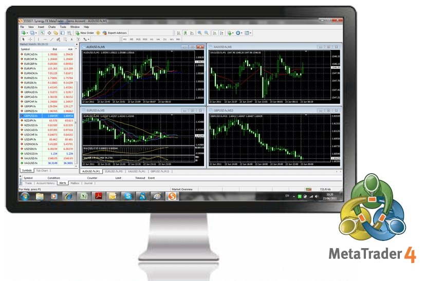

## Table of Contents

## What is the MetaTrader platform?

The MetaTrader platform is a popular software used by traders to buy and sell financial instruments like stocks, forex, and commodities. It is developed by a company called MetaQuotes Software and is available in two main versions: MetaTrader 4 (MT4) and MetaTrader 5 (MT5). Traders use this platform because it is easy to use and has many tools that help them make decisions about when to trade.

One of the main features of MetaTrader is its ability to use automated trading systems, also known as Expert Advisors (EAs). These are programs that can trade automatically based on rules set by the trader. This means that traders can set up their trading strategies and let the software do the work for them, even when they are not at their computer. Additionally, MetaTrader offers charting tools, technical indicators, and the ability to trade directly from the charts, making it a comprehensive tool for both beginner and experienced traders.

## What are the different versions of MetaTrader available?

There are two main versions of MetaTrader that traders use: MetaTrader 4 (MT4) and MetaTrader 5 (MT5). MT4 is the older version and is very popular because it's easy to use and works well for trading forex, which is trading different currencies. Many traders like MT4 because it has lots of tools that help them decide when to buy or sell, and it lets them use special programs called Expert Advisors to trade automatically.

MT5 is the newer version of MetaTrader. It has all the features of MT4 but also adds more tools and options. For example, MT5 can handle more types of financial instruments, not just forex, but also stocks and commodities. It also has better charting and analysis tools, which can help traders make better decisions. Some traders choose MT5 because it is more advanced and can do more things than MT4.

## How can I download and install MetaTrader?

To download and install MetaTrader, first you need to choose if you want MetaTrader 4 (MT4) or MetaTrader 5 (MT5). Once you decide, go to the website of a broker that offers MetaTrader or directly to the MetaQuotes Software website. Look for the download section and click on the link to download the version you want. Make sure to download the right version for your computer, like Windows, Mac, or mobile. After the download finishes, open the file and follow the instructions to install it on your computer.

After installing MetaTrader, you'll need to open the program and set up an account. You can either use a demo account to practice trading without real money, or a live account if you're ready to trade with real money. To set up an account, you'll need to enter your personal details and choose a broker. Once your account is set up, you can log in and start using MetaTrader to trade. The platform is easy to use, and you can find many tutorials online if you need help getting started.

## What are the basic features of MetaTrader for beginners?

For beginners, MetaTrader has a lot of helpful features. One of the main features is the easy-to-use interface. When you open MetaTrader, you will see a screen with different windows. One window shows the prices of the things you want to trade, like currencies or stocks. Another window has charts that help you see how the prices are changing over time. You can also see your account balance and any trades you have made. This layout makes it simple for beginners to find what they need and start trading.

Another great feature for beginners is the ability to use demo accounts. A demo account lets you practice trading without using real money. This is really helpful because you can try out different strategies and learn how the platform works without risking any money. MetaTrader also has many tools that can help you make decisions. For example, you can use indicators on the charts to see trends and patterns. These tools can make it easier for beginners to understand the market and make better trading choices.

## How do I set up a trading account on MetaTrader?

To set up a trading account on MetaTrader, first, you need to choose a broker that offers MetaTrader. Go to the broker's website and look for an option to open an account. You can usually choose between a demo account, which lets you practice trading with pretend money, or a live account, which you use with real money. Fill out the form with your personal details like your name, email, and phone number. Make sure to read and agree to the broker's terms and conditions. After you submit the form, you'll get an email with instructions on how to finish setting up your account.

Once you have your account set up with the broker, open the MetaTrader platform on your computer or mobile device. Click on "File" at the top of the screen, then choose "Login to Trade Account." Enter the account number and password that your broker gave you. If you're using a demo account, you might need to create a new one within the platform. After you log in, you'll see your account balance and be ready to start trading. If you need help, MetaTrader has a lot of tutorials and guides that can show you what to do next.

## What are the charting tools available on MetaTrader?

MetaTrader has many charting tools that help traders see how prices are moving. You can look at different time periods, like minutes, hours, days, or even months. The platform lets you draw lines and shapes on the charts to spot trends and patterns. There are also different types of charts you can use, like line charts, bar charts, and candlestick charts. Candlestick charts are very popular because they show you the open, high, low, and close prices in a way that's easy to understand.

Another helpful feature is the technical indicators. These are tools that you can add to your charts to help you make better trading decisions. For example, you can use moving averages to see the average price over time, or the Relative Strength Index (RSI) to see if a currency is overbought or oversold. MetaTrader comes with a lot of these indicators built-in, and you can also find more online or create your own. All these tools make it easier for traders to analyze the market and plan their trades.

## How can I use technical indicators on MetaTrader?

To use technical indicators on MetaTrader, first, open the platform and choose the chart you want to look at. Click on the "Insert" menu at the top of the screen, then move your mouse over "Indicators." You'll see a list of different indicators you can add to your chart. Click on the one you want to use, like the Moving Average or the Relative Strength Index (RSI). A window will pop up where you can change the settings for the indicator, like the time period or the color. After you set it up the way you want, click "OK," and the indicator will show up on your chart.

Once the indicator is on your chart, you can use it to help you make trading decisions. For example, if you're using a Moving Average, you might buy when the price goes above the line and sell when it goes below. If you're using the RSI, you might look for times when it's over 70 (which means the market might be overbought) or under 30 (which means it might be oversold). You can add as many indicators as you want to your chart, but remember that too many can make it hard to see what's going on. Practice using different indicators to find out which ones work best for you.

## What are Expert Advisors and how do I use them on MetaTrader?

Expert Advisors, or EAs, are special programs that you can use on MetaTrader to trade automatically. They work by following rules that you set up, like when to buy or sell a currency. This means you can let the computer do the trading for you, even when you're not at your computer. EAs can be really helpful because they can trade faster than a person and don't get tired or make mistakes. You can find EAs that other people have made, or you can make your own if you know how to program.

To use an Expert Advisor on MetaTrader, first, you need to find one that you like. You can download EAs from the internet or buy them from the MetaTrader Market. Once you have an EA, open MetaTrader and go to the "Navigator" window on the left side of the screen. Right-click on "Expert Advisors" and choose "Open data folder." This will open a folder on your computer where you can put the EA file. After you put the file in the folder, go back to MetaTrader, find the EA in the "Navigator" window, and drag it onto the chart you want to use it on. A window will pop up where you can change the settings for the EA. Once you're happy with the settings, click "OK," and the EA will start trading for you.

## How can I backtest trading strategies on MetaTrader?

To backtest trading strategies on MetaTrader, you need to use the Strategy Tester tool. First, open MetaTrader and click on the "View" menu at the top of the screen. Then, choose "Strategy Tester" to open it. You'll see a new window at the bottom of the screen. In this window, you can choose the Expert Advisor (EA) you want to test. If you don't have an EA, you can write your own trading rules using the MetaEditor, which is like a special program for making EAs. Once you pick your EA, you can set the time period you want to test, like the last year or the last five years, and choose the currency pair or stock you want to test it on.

After setting up your test, click the "Start" button, and MetaTrader will run the test using old price data. This lets you see how your trading strategy would have worked in the past. You can watch the test run and see how much money you would have made or lost. The Strategy Tester will show you a report with numbers like profit, drawdown, and win rate. This report helps you understand if your strategy is good or if you need to change it. Backtesting is a great way to practice and improve your trading without risking real money.

## What are the advanced features of MetaTrader for experienced traders?

For experienced traders, MetaTrader offers many advanced features that can help them trade better. One of these features is the ability to use multiple time frames on the same chart. This means you can look at how prices are moving over different periods, like minutes, hours, and days, all at the same time. This can help you see trends and patterns that you might miss if you only look at one time frame. Another advanced feature is the option to use custom indicators and scripts. These are special tools that you can make or find online to help you analyze the market in ways that the built-in tools can't. Experienced traders often use these custom tools to get a better understanding of the market and make smarter trading decisions.

MetaTrader also lets experienced traders use advanced order types, like stop orders and limit orders. These orders help you set up trades that will happen automatically when the price reaches a certain level. This can be really helpful for managing risk and making sure you don't miss out on good trading opportunities. Additionally, the platform has a feature called "hedging," which lets you open multiple positions on the same currency pair, one to buy and one to sell. This can help you protect your trades from big losses if the market moves against you. With all these advanced features, MetaTrader is a powerful tool for experienced traders who want to take their trading to the next level.

## How does MetaTrader support algorithmic trading?

MetaTrader supports algorithmic trading through its use of Expert Advisors (EAs). EAs are special programs that you can set up to trade automatically based on rules you create. This means you can tell the computer exactly when to buy or sell, and it will do it for you, even when you're not at your computer. You can find EAs that other people have made, or if you know how to program, you can make your own. This is really helpful for traders who want to use complex strategies that need to be done quickly and accurately.

Another way MetaTrader helps with algorithmic trading is through its Strategy Tester. This tool lets you test your trading strategies using old price data to see how they would have worked in the past. You can set up your EA and run a test to see if it makes money or loses money. This is a great way to practice and improve your strategies without risking real money. With these features, MetaTrader makes it easy for traders to use and test their algorithmic trading strategies.

## What are the security features and considerations when using MetaTrader?

When using MetaTrader, it's important to know about the security features that keep your information and money safe. One big security feature is encryption. This means that when you send information to your broker, it gets turned into a special code that only your broker can read. This helps keep your personal details and trading information private. Another important security feature is two-factor authentication (2FA). This means you need to enter a special code, usually sent to your phone, along with your password to log in. This makes it much harder for someone else to get into your account, even if they know your password.

There are also some things you should do to stay safe when using MetaTrader. Always use a strong, unique password for your trading account and change it regularly. Be careful about downloading Expert Advisors (EAs) or other programs from the internet, because some might have viruses or be designed to steal your information. It's a good idea to only download EAs from trusted sources and to have good antivirus software on your computer. Also, make sure to keep your MetaTrader software up to date, because updates often include important security fixes. By following these simple steps, you can help keep your trading safe and secure.

## How can one develop and optimize trading algorithms?

Creating an algorithm for algorithmic trading on MetaTrader primarily involves defining specific trading rules, which are subsequently coded into trading programs known as Expert Advisors (EAs) using the MQL5 language. The MQL5 language, designed specifically for developing trading strategies on the MetaTrader 5 platform, provides traders with the capability to automate complex trading strategies by specifying precise rule sets and conditions under which trades should be executed.

The Strategy Tester in MetaTrader plays a crucial role in the development and optimization of trading algorithms. This integrated tool allows traders to backtest their EAs against historical market data to determine the algorithm's potential performance before deploying it in live trading environments. Backtesting is essential as it offers insights into how the trading strategy might perform under different market conditions, thereby facilitating the identification of potential weaknesses or inefficiencies in the algorithm.

Optimization of trading algorithms is a meticulous process that involves fine-tuning various parameters within the EA to enhance its performance. Key parameters that are often optimized include indicator settings, Stop Loss, and Take Profit levels. The objective of optimization is to achieve the best possible performance metrics, such as maximum profit or minimal drawdown, over a wide range of market scenarios. 

For instance, the Stop Loss ($SL$) and Take Profit ($TP$) levels can be optimized by systematically adjusting these parameters to evaluate their impact on the algorithm's profitability:

$$
\text{Net Profit} = \sum (\text{Profit from winning trades}) - \sum (\text{Losses from losing trades})
$$

where the settings for $SL$ and $TP$ directly affect the size of profits and losses recorded in each trade.

The Strategy Tester offers a robust environment called "Genetic Algorithm" which streamlines the optimization process by using advanced algorithms to selectively test combinations of input parameters, prioritizing those which yield the best results.

In addition to automated parameter tuning, traders can manually adjust trading rules within the code to better align with their strategic objectives. Here is an example of a simple algorithm snippet in MQL5 that defines basic entry and [exit](/wiki/exit-strategy) rules for an EA:

```cpp
// Example EA in MQL5
void OnTick() {
    double maFast = iMA(NULL, 0, 12, 0, MODE_EMA, PRICE_CLOSE, 0);
    double maSlow = iMA(NULL, 0, 26, 0, MODE_EMA, PRICE_CLOSE, 0);

    // Buy condition
    if (maFast > maSlow && OrderSend(Symbol(), OP_BUY, 1.0, Ask, 2, 0, 0) > 0) {
        printf("Buy Order Placed");
    }
    // Sell condition
    if (maFast < maSlow && OrderSend(Symbol(), OP_SELL, 1.0, Bid, 2, 0, 0) > 0) {
        printf("Sell Order Placed");
    }
}
```

This code snippet demonstrates a straightforward implementation of a moving average crossover strategy, a common trading strategy where trades are executed based on the relative position of two moving averages.

In conclusion, developing and optimizing trading algorithms on MetaTrader requires a blend of trading strategy development, proficient coding ability, and an iterative optimization process using the platform's powerful tools. Achieving the desired blend of these elements can lead to robust and efficient trading algorithms tailored for success in dynamic financial markets.

## References & Further Reading

[1]: ["MetaTrader 5 User Guide"](https://www.metatrader5.com/en/terminal/help) - Official documentation for MetaTrader 5, covering features and functionalities.

[2]: ["Algorithmic Trading: A Comprehensive Beginner's Guide"](https://www.amazon.com/Algorithmic-Trading-Comprehensive-Beginners-Training/dp/1091263973) - University of Michigan library guide on algorithmic trading.

[3]: ["Algorithmic Trading & DMA: An introduction to direct access trading strategies"](https://www.amazon.com/Algorithmic-Trading-DMA-introduction-strategies/dp/0956399207) by Barry Johnson

[4]: ["Expert Advisor Programming for MetaTrader 5"](https://www.amazon.com/Expert-Advisor-Programming-MetaTrader-automated/dp/0982645953) by Andrew R. Young

[5]: ["Quantitative Trading: How to Build Your Own Algorithmic Trading Business"](https://books.google.com/books/about/Quantitative_Trading.html?id=j70yEAAAQBAJ) by Ernest P. Chan