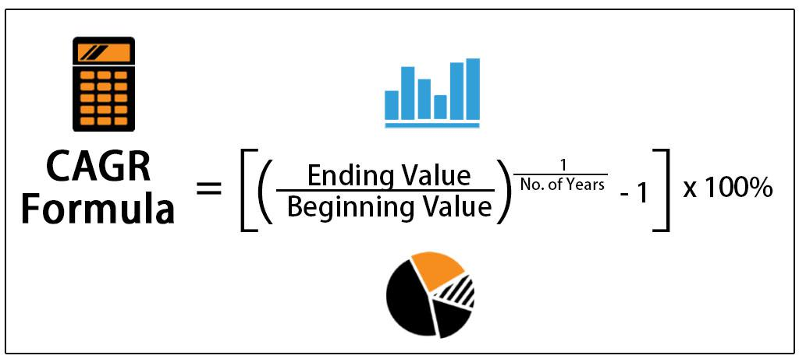

The concept of the Metaverse is rapidly evolving into a digital ecosystem where traditional boundaries dissolve. This transformation is characterized by the integration of various technological advancements, including social media, gaming, virtual reality (VR), and augmented reality (AR). Together, these elements contribute to creating an immersive digital environment that transcends conventional digital interactions.

One of the defining aspects of the Metaverse is the emergence of virtual economies that closely mimic real-world economic systems. These economies facilitate a burgeoning digital marketplace where digital goods and services are exchanged. This simulation of real-world economic activity within virtual platforms enables the creation of value and opportunities that were previously unimaginable. 



In parallel, algorithmic trading within the Metaverse represents a new frontier of opportunities in virtual commerce and finance. Leveraging sophisticated algorithms to execute trades with speed and precision, this practice extends financial strategies into the digital domain, enhancing the potential for profit and innovation. The integration of algorithmic trading within these virtual ecosystems further demonstrates the adaptability of financial institutions to evolving technological landscapes.

This article explores the intersection of Metaverse functionality, virtual worlds, and algorithmic trading. It looks into how these components redefine digital ecosystems, impacting traditional and virtual economies while opening new horizons for financial engagement and technological growth. As the Metaverse continues to grow, understanding these intersections becomes crucial for individuals and businesses looking to navigate and capitalize on the opportunities within this dynamic digital frontier.

## Table of Contents

## Understanding Metaverse Functionality

The Metaverse is an emerging digital ecosystem that allows users to interact within 3D virtual environments where digital presence can achieve an influence comparable to that of physical presence. At the heart of this functionality are key technologies such as virtual reality (VR), augmented reality (AR), and blockchain. These technologies collectively enable a transformative experience for users, allowing them to socialize, work, play, and trade within these digital worlds, thus transcending traditional internet capabilities.

VR and AR provide the immersive and interactive capabilities necessary for a realistic experience in virtual worlds. VR technology creates a simulated environment that can be similar to or completely different from the real world, offering users a fully immersive experience. AR overlays digital information onto the physical world, enhancing the sensory experience of users without removing them from their real-world environment. These technologies complement each other, expanding the potential of the Metaverse to create rich, interactive digital experiences.

Blockchain technology is crucial for ensuring the integrity and security of digital interactions within the Metaverse. By employing decentralized ledgers for transactions, blockchain supports the creation and exchange of digital assets with transparency and trust. This technology underpins the virtual economies within the Metaverse, allowing users to securely own, trade, and monetize digital assets, thereby creating real value in virtual environments.

The Metaverse offers innovative paradigms for business, education, and digital interactions. Businesses can utilize the Metaverse to create virtual brand experiences, conduct virtual meetings, and provide immersive product demonstrations. Education can be significantly enhanced with interactive and engaging learning experiences that extend beyond geographical constraints. Digital interactions within the Metaverse facilitate new forms of socialization and community building, offering users unique experiential opportunities.

The virtual environment of the Metaverse is anticipated to transform how we perceive and engage with the digital world. As the technological landscape continues to evolve, the Metaverse provides a glimpse into a future where the distinction between digital and physical realities increasingly blurs, promising novel applications and interactions that will redefine our digital experience. The continued development of Metaverse functionality signals a shift towards more integrated and immersive digital interactions, with wide-ranging implications for various sectors and industries.

## Virtual Worlds and Economies

Virtual worlds within the Metaverse exemplify complex digital ecosystems where economic structures enable virtual assets and currencies to attain tangible value. These digital environments provide a framework for users to not only interact but also engage in commerce that parallels traditional economic systems.

One of the earliest examples of virtual economies can be seen in the online game Second Life. Launched in 2003, Second Life introduced the idea of a virtual marketplace where users could trade virtual goods using a digital currency, known as the Linden Dollar. These transactions mirrored real-world economic interactions and set the stage for more advanced virtual economic models. As technology progressed, blockchain innovations integrated into these systems facilitated secure transactions and introduced new forms of digital ownership.

At the heart of these virtual economies are non-fungible tokens (NFTs), which play a crucial role in allowing users to own and trade digital content uniquely. NFTs are blockchain-based tokens that certify the uniqueness and ownership of a digital asset. They transform how digital assets are perceived, providing a mechanism for artists, developers, and users to claim verifiable ownership of digital expressions, artworks, and other creations. This capability has infused digital marketplaces with a level of authenticity and scarcity, similar to physical marketplaces.

In addition to virtual goods, virtual real estate has emerged as a significant component of Metaverse economies. Platforms such as Decentraland and The Sandbox offer users the opportunity to purchase, sell, and develop virtual plots of land. These properties can be monetized through activities like leasing or hosting virtual events, thereby mirroring functionality seen in tangible real estate markets. The virtual land economy echoes real-world dynamics and engages participants in digital property markets influenced by speculation, development potential, and community engagement.

These burgeoning virtual economies facilitate an intersection of commerce, innovation, and creativity. They reflect real-world financial systems with their structured transactions, economic incentives, and market-driven behaviors. The growth of virtual economies showcases the potential for digital creativity to forge economic interactions that rival and, at times, surpass the complexities of traditional markets. 

In conclusion, virtual worlds and their economies within the Metaverse are not merely extensions of existing systems but are evolving entities that challenge and redefine the nature of value, ownership, and economic structure in a digital age.

## Algorithmic Trading in Virtual Worlds

Algorithmic trading has revolutionized financial markets by leveraging automated software to execute trades based on pre-set criteria. This sophistication now extends to virtual markets within the Metaverse, where rapid execution and data analysis are paramount. Algorithmic trading optimizes speed and efficiency, crucial for navigating the Metaverse's bustling marketplaces.

Incorporating these strategies allows traders to manage digital portfolios effectively, crucial in environments that operate 24/7 without traditional market closures. The perpetual nature of the Metaverse presents distinctive opportunities and challenges for [algorithmic trading](/wiki/algorithmic-trading), necessitating constant attention to market shifts.

Virtual economies within the Metaverse are becoming increasingly intertwined with traditional financial systems. As digital currencies and assets, such as cryptocurrencies and non-fungible tokens (NFTs), gain prominence, algorithmic trading stands as a pivotal tool in capitalizing on these assets. The expansive potential for trading virtual assets transforms the Metaverse from a novelty into a viable and lucrative investment platform.

The following Python pseudo-code outlines a basic framework for an algorithmic trading strategy that could be employed in a virtual market setting:

```python
# Import necessary libraries
import pandas as pd
import numpy as np

# Define a basic moving average strategy
def moving_average_strategy(prices, short_window, long_window):
    signals = pd.DataFrame(index=prices.index)
    signals['price'] = prices
    signals['short_mavg'] = prices.rolling(window=short_window, min_periods=1).mean()
    signals['long_mavg'] = prices.rolling(window=long_window, min_periods=1).mean()
    signals['signal'] = 0.0

    # Generate signals
    signals['signal'][short_window:] = np.where(signals['short_mavg'][short_window:] > signals['long_mavg'][short_window:], 1.0, 0.0)
    signals['positions'] = signals['signal'].diff()

    return signals

# Sample use case where `virtual_prices` is a placeholder for real-time asset prices
short_window = 40
long_window = 100

# Apply strategy
signals = moving_average_strategy(virtual_prices, short_window, long_window)

# Example output
print(signals)
```

This script outlines a basic moving average strategy, pivotal in identifying potential buy and sell signals in a dynamic, virtual market environment. As traders and developers refine such algorithms, they will harness them to manage and profitably navigate virtual assets, further integrating them with broader financial practices. Algorithmic trading thus forms an essential component of the Metaverse's economic framework, offering substantial investment opportunities in these evolving virtual worlds.

## Future Implications and Opportunities

The Metaverse, characterized by its rapidly evolving capabilities and emerging technologies, presents a transformative potential for innovation and profit within digital economies. As traditional economic structures are increasingly mirrored within these virtual realms, the potential for growth and investment becomes evident.

Digital economies within the Metaverse are poised to expand significantly, potentially rivaling their traditional counterparts. This expansion is facilitated by the integration of digital currencies, non-fungible tokens (NFTs), and blockchain technology, which enable the seamless transaction and verification of digital assets. As these virtual economies mature, they provide lucrative investment opportunities, attracting not only individual investors but also institutional participants.

A significant future implication is the potential integration of real-world financial systems with virtual economies. This integration could lead to a scenario where virtual assets play a pivotal role in financial portfolios, much like stocks and bonds today. Financial institutions might begin to incorporate virtual assets into their offerings, creating hybrid portfolios that include both real-world and digital investments. This would necessitate the development of new financial tools and products aimed at managing and optimizing these unique digital assets.

Entrepreneurs and businesses are positioned to harness the unique dynamics of the Metaverse for brand building and consumer engagement. Virtual worlds offer immersive experiences unparalleled by traditional digital platforms, allowing businesses to create interactive and engaging environments for users. This offers brands an innovative way to engage with their audience, leading to enhanced brand loyalty and increased customer retention. For instance, virtual storefronts and showrooms could revolutionize how products are marketed and sold.

The convergence of virtual worlds with algorithmic trading represents a frontier with substantial technological and economic potential. Algorithmic trading, which utilizes automated systems for executing trades based on predefined rules, can be significantly enhanced within the Metaverse's 24/7 operational environment. The continuous nature of virtual economies allows for constant trading opportunities, presenting an expansive landscape for the application of algorithmic strategies tailored to the nuances of digital markets.

Furthermore, the potential for trading virtual assets like NFTs and cryptos in these environments is vast. Developers and traders can employ sophisticated algorithms to manage and optimize digital asset portfolios, driving efficiency and maximizing returns. As a result, the landscape of investment and trading is expected to evolve, creating new opportunities for technological advancement and wealth generation.

In conclusion, the Metaverse's progressing capabilities and intertwining with algorithmic trading illustrate an exciting future for technological development and economic growth, shaping the landscape of digital economies in unprecedented ways.

## Conclusion

As the Metaverse continues to accelerate in its development, the scope for digital transformation is expansive and offers unprecedented opportunities for innovation. The convergence of Metaverse functionality, virtual economies, and algorithmic trading signifies a substantial shift in digital interactions and presents new paradigms for engaging in personal and commercial activities. The blurring lines between physical and digital worlds underscore the importance of adopting and embracing these emerging digital economies as integral components of future-oriented strategies.

This transformation extends beyond mere economic transactions, integrating deeply with social interactions, work environments, and entertainment. The immersive nature of the Metaverse provides a canvas for creativity and connectivity, enabling individuals and businesses alike to explore novel means of expression and engagement. Virtual economies, supported by blockchain innovations such as non-fungible tokens (NFTs) and cryptocurrencies, offer unique platforms for ownership and trade, enriching the potential for economic activities.

Algorithmic trading, in particular, exemplifies how traditional financial strategies can be adapted to operate within these dynamic digital landscapes. The Metaverse’s persistent and interactive environment facilitates a round-the-clock market where automated trading strategies can optimize transaction efficiency and leverage virtual asset portfolios to a greater extent.

As innovation within this digital sphere continues, a new era emerges where virtual experiences considerably influence and shape economic landscapes across the globe. This ongoing development promises to redefine how society engages with digital platforms, urging a reevaluation of how we perceive value, ownership, and participation in both personal and commercial spheres. The Metaverse, with its multifunctional capabilities, thus heralds a future filled with potential for revolutionary changes in the way we interact with technology and each other.

## References & Further Reading

[1]: ["Snow Crash"](https://en.wikipedia.org/wiki/Snow_Crash) by Neal Stephenson.

[2]: ["The Metaverse: And How it Will Revolutionize Everything"](https://www.amazon.com/Metaverse-How-Will-Revolutionize-Everything/dp/1324092033) by Matthew Ball

[3]: Nakamoto, S. (2008). ["Bitcoin: A Peer-to-Peer Electronic Cash System."](https://nakamotoinstitute.org/library/bitcoin/)

[4]: ["Non-Fungible Tokens (NFT): Overview, Evaluation, Opportunities and Challenges"](https://arxiv.org/abs/2105.07447) by Chen, N. et al. 

[5]: Thomas, D.A. and Baird, R.N. (2022). ["Understanding Algorithimic Trading"](https://onlinelibrary.wiley.com/doi/full/10.1111/1475-679X.12540). 

[6]: ["Decentraland White Paper"](https://docs.decentraland.org/decentraland/whitepaper/) - Detailed information on the virtual reality platform powered by Ethereum blockchain.