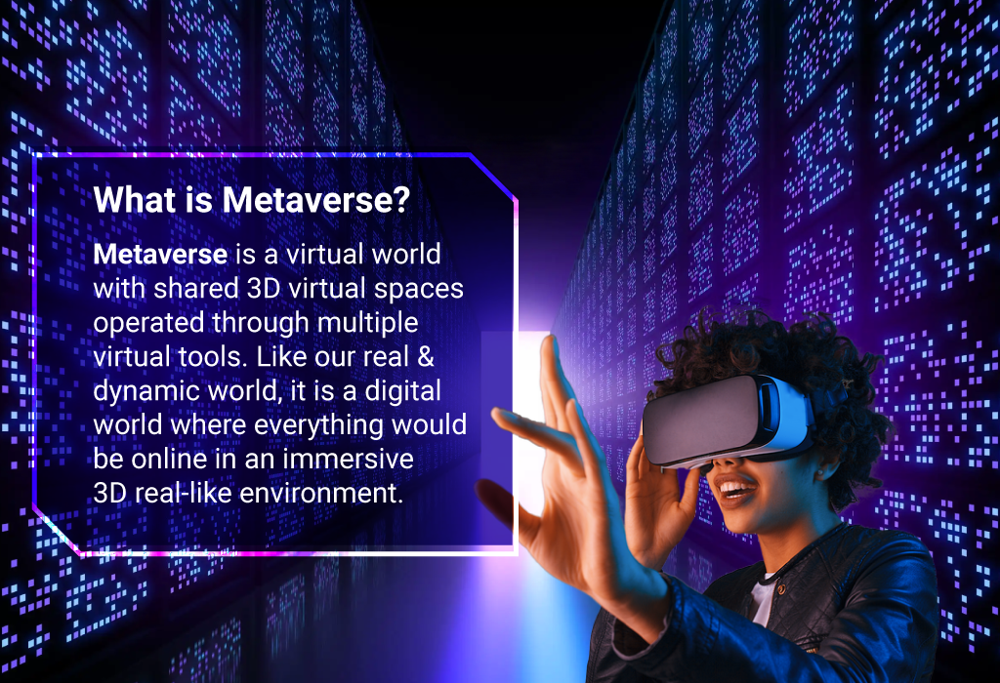

## Table of Contents

## What is the metaverse?

The metaverse is a virtual world where people can interact with each other and digital things using the internet. It's like a big online space where you can play games, go to concerts, work, or just hang out with friends, all from your computer or a special headset.

Think of it as a mix of video games and social media, but much bigger and more immersive. In the metaverse, you can create your own avatar, which is a digital version of yourself, and explore different virtual places. It's still a new idea, and many people and companies are working to make it better and more exciting.

## How does the metaverse differ from traditional virtual reality?

The metaverse and traditional virtual reality (VR) are both digital spaces where you can experience things that aren't real, but they have some key differences. Traditional VR is usually about one specific experience or game. You put on a VR headset and get immersed in that one world or activity, like playing a game or exploring a single virtual environment. It's like going to a movie theater; you go in, watch the movie, and then leave.

The metaverse, on the other hand, is more like a whole city or even a universe of connected virtual spaces. Instead of just one experience, the metaverse lets you move between different worlds and activities, all within the same platform. You can go from playing a game to attending a virtual concert to meeting friends in a virtual cafe, all without leaving the metaverse. It's more social and interconnected, aiming to be a place where you can live, work, and play in a digital world that feels more like real life.

## What are the key components that make up the metaverse?

The metaverse is made up of a few important parts that work together to create a big, shared virtual world. One key part is virtual reality (VR) and augmented reality (AR) technology, which let you see and interact with the metaverse in a more real way. Another part is avatars, which are digital versions of you that you can customize and use to explore the metaverse. You also need good internet and computer systems to make sure everything runs smoothly and quickly.

Another important component is the idea of interoperability, which means that different parts of the metaverse can work together. This lets you move from one virtual world to another without starting over. For example, you might use the same avatar and money in different games or spaces. Social features are also a big part of the metaverse, letting you meet and talk with other people, join events, and make friends in the virtual world.

Lastly, the metaverse needs a way to create and share content. This means having tools that let people build their own virtual spaces, games, and experiences. It also involves a digital economy where you can buy, sell, or trade things like virtual land, items, or services. All these parts come together to make the metaverse a lively, interactive place where people can do many different things.

## How can users interact within the metaverse?

In the metaverse, users can interact in many ways that feel a lot like real life. They can use avatars, which are like digital versions of themselves, to move around and explore different virtual places. Users can talk to each other using voice or text chat, making it easy to have conversations and make friends. They can also use gestures and movements, especially if they have VR or AR gear, to do things like waving hello or playing games together. This makes the experience more fun and real.

Another way users interact is by joining events and activities. In the metaverse, you can go to virtual concerts, attend meetings, or play games with others. These events can be big, with lots of people, or small, just with a few friends. Users can also create their own spaces and invite others to visit, share things, or work on projects together. All these ways of interacting make the metaverse a lively place where people can do many things together, just like in the real world.

## What technologies are essential for the functioning of the metaverse?

The metaverse needs a few key technologies to work well. Virtual reality (VR) and augmented reality (AR) are very important because they let you see and interact with the virtual world in a way that feels real. You can put on a VR headset or use AR glasses to move around and do things in the metaverse. Another important technology is good internet and computer systems. These help everything run smoothly and quickly so that you can explore and interact without delays or problems.

Another essential part is the technology that lets different parts of the metaverse work together, called interoperability. This means you can use the same avatar and money in different games or spaces without starting over. Also, social technologies like voice and text chat are crucial because they help you talk to other people and make friends in the virtual world. Finally, the metaverse needs tools for creating and sharing content, so people can build their own virtual spaces and things to do. All these technologies come together to make the metaverse a fun and interactive place.

## What are some current examples of metaverse platforms?

One popular example of a metaverse platform is Roblox. Roblox is like a big playground where you can play games made by other people or even make your own games. You can use an avatar to explore different worlds, play with friends, and do all sorts of fun activities. It's a good example because it lets you move between different games and spaces, and you can buy and sell things with Robux, which is the money used in Roblox.

Another example is Decentraland. In Decentraland, you can own virtual land and build things on it, like houses or shops. You can walk around with your avatar, meet other people, and go to events like art shows or parties. Decentraland uses a special kind of money called MANA, which you can use to buy land or other things in the virtual world. It's interesting because it's all about letting people create and own parts of the metaverse.

A third example is VRChat. VRChat is a place where you can hang out with friends in different virtual worlds. You can use VR to make it feel more real, but you don't have to. You can dance, play games, or just chat with others. VRChat is great for socializing and trying out different experiences, showing how the metaverse can bring people together in fun ways.

## How does the metaverse impact social interactions and community building?

The metaverse changes the way people meet and make friends by giving them a big virtual world to hang out in. Instead of just talking online, you can use an avatar to go to places like virtual parks, concerts, or game worlds. This makes it feel more like you're really there with other people. You can chat with friends, meet new people, and even join clubs or groups that share your interests. Because the metaverse is always open, it's easy to find someone to talk to or do things with, no matter where you are in the real world.

The metaverse also helps people build communities because it lets them create their own spaces and events. If you like art, you can set up a virtual gallery and invite others to see your work. If you're into gaming, you can start a tournament and play with people from all over the world. These shared experiences help people feel connected and part of something bigger. Even though the metaverse is digital, the friendships and communities you build there can be just as strong as in real life.

## What are the economic opportunities and challenges within the metaverse?

The metaverse opens up a lot of new ways to make money. People can buy, sell, and trade things like virtual land, clothes for their avatars, or special items in games. Companies can also set up shops or hold events in the metaverse, reaching people from all over the world. For example, someone who makes art can sell their work in a virtual gallery, or a musician can perform at a virtual concert and earn money from tickets. This means there are lots of new jobs and ways to earn a living, from making things to running events or even helping people learn how to use the metaverse.

But there are also challenges to making money in the metaverse. One big problem is that the rules about who owns what can be confusing. If you buy a piece of virtual land, do you really own it, or can the company that runs the metaverse take it away? Also, the money used in the metaverse, like Robux or MANA, can go up and down in value, which makes it hard to know how much things are really worth. Plus, setting up a business or selling things in the metaverse can be tricky because you need to understand how to use the technology and reach people in this new world. All these things can make it hard to make money and build a successful business in the metaverse.

## How is privacy and security managed in the metaverse?

In the metaverse, keeping your information safe and private is really important. Companies that run metaverse platforms use different ways to protect your data, like strong passwords and special codes called encryption that keep your chats and personal info safe from hackers. They also have rules about what information they can collect and how they use it, which helps to keep your privacy. But because the metaverse is a big, open place, it can be hard to make sure everything is always safe. So, it's a good idea to be careful about what you share and to use strong passwords and other safety tools.

Another big part of security in the metaverse is making sure that people can't pretend to be someone else or do bad things. Platforms use things like checking IDs and watching for strange behavior to stop people from causing trouble. They also have ways to report and deal with problems quickly. But even with all these safety steps, there can still be risks, like someone trying to trick you or steal your virtual stuff. So, it's important to learn about the safety features of the metaverse and use them to stay safe while you're exploring and having fun.

## What are the potential future developments in metaverse technology?

In the future, metaverse technology could get even better and more exciting. One big change might be that VR and AR headsets become smaller and easier to use, so more people can enjoy the metaverse without feeling uncomfortable. Also, the internet and computers might get faster, making everything in the metaverse run smoother and feel more real. Another cool thing could be that different metaverse platforms start working together more, so you can move from one world to another without starting over. This would make the metaverse feel like one big, connected place where you can do all sorts of things.

Another future development might be more ways to create and share things in the metaverse. People might have even better tools to build their own virtual spaces, games, and experiences, making the metaverse a place where everyone can be a creator. Also, the money used in the metaverse could become more stable and easier to use, helping more people buy, sell, and trade things. As the metaverse grows, it could also become a bigger part of our everyday lives, with more people using it for work, school, and hanging out with friends, making it feel more like a second home.

## How can businesses leverage the metaverse for marketing and operations?

Businesses can use the metaverse to reach more people and show off their products in new ways. They can set up virtual shops where people can walk around and see things like they're in a real store. This can make shopping more fun and interesting. Companies can also hold events like virtual concerts or fashion shows, which can attract a lot of people and help them stand out. By using the metaverse, businesses can talk to customers from all over the world and make their brand more known.

Another way businesses can use the metaverse is for their everyday work. They can have meetings in virtual spaces, which can save time and money on travel. Employees can work together on projects from anywhere, making it easier to get things done. The metaverse can also be a place to try out new ideas and see how customers react before spending a lot of money on them in the real world. This can help businesses make better decisions and improve how they work.

## What ethical considerations should be taken into account in the development and use of the metaverse?

When making and using the metaverse, it's important to think about fairness and inclusion. Everyone should be able to join and have fun, no matter where they come from or how much money they have. This means making sure the metaverse is easy to use and not too expensive. It also means stopping people from being bullied or treated badly. If the metaverse becomes a big part of our lives, it should be a place where everyone feels safe and welcome.

Another big thing to think about is privacy and how our information is used. Companies need to be clear about what they collect and why, and they should keep it safe. People should know what they're sharing and be able to choose what they want to keep private. Also, the metaverse should not trick people or make them do things they don't want to do. It's important to make sure the metaverse is a good place that helps people, not one that causes problems or hurts anyone.

## References & Further Reading

[1]: ["Snow Crash"](https://en.wikipedia.org/wiki/Snow_Crash) by Neal Stephenson.

[2]: ["The Metaverse: And How it Will Revolutionize Everything"](https://www.amazon.com/Metaverse-How-Will-Revolutionize-Everything/dp/1324092033) by Matthew Ball

[3]: Nakamoto, S. (2008). ["Bitcoin: A Peer-to-Peer Electronic Cash System."](https://nakamotoinstitute.org/library/bitcoin/)

[4]: ["Non-Fungible Tokens (NFT): Overview, Evaluation, Opportunities and Challenges"](https://arxiv.org/abs/2105.07447) by Chen, N. et al. 

[5]: Thomas, D.A. and Baird, R.N. (2022). ["Understanding Algorithimic Trading"](https://onlinelibrary.wiley.com/doi/full/10.1111/1475-679X.12540). 

[6]: ["Decentraland White Paper"](https://docs.decentraland.org/decentraland/whitepaper/) - Detailed information on the virtual reality platform powered by Ethereum blockchain.