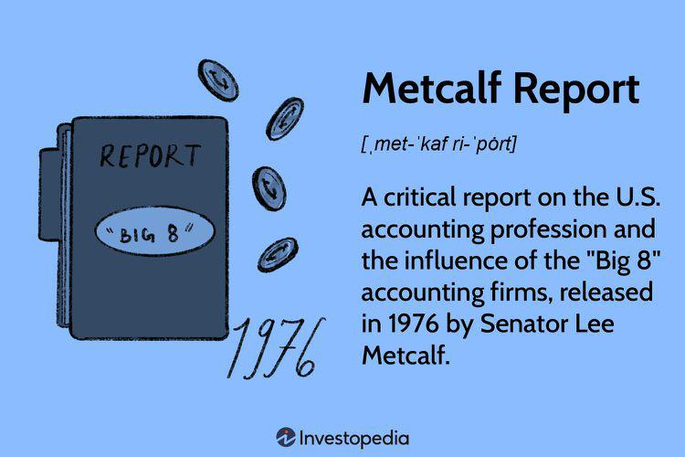

The Metcalf Report, released in 1976, profoundly influenced the financial landscape by sparking debates about regulatory practices within the accounting and trading sectors that persist to this day. Through its analysis, the report critically assessed the influence of the 'Big 8' accounting firms, highlighting potential issues of dominance that called for more stringent government intervention and oversight. The findings underscored a need for accountability and transparency that continues to resonate, particularly as these themes intersect with modern trading practices like algorithmic and high-frequency trading (HFT).

Algorithmic trading represents a significant advancement in the financial markets, characterized by the use of computer algorithms to execute trades at speeds and frequencies beyond human capability. High-frequency trading, a subset of algorithmic trading, involves the rapid execution of a large number of orders across various markets in fractions of a second. While these technologies have brought certain efficiencies to the market, such as enhanced liquidity and price efficiency, they also introduce complexities that necessitate careful oversight.

Today's financial markets, heavily influenced by technological advancements, present challenges similar to those highlighted by the Metcalf Report over four decades ago. The necessity for adaptive regulatory frameworks that address the unique issues posed by algorithmic and high-frequency trading is evident. This article will explore how the Metcalf Report's call for improved regulation and oversight remains relevant, particularly as these principles apply to managing the potential risks associated with modern trading technologies. The lessons from past regulatory assessments can provide valuable insights as the financial sector navigates these technological evolutions.

## Table of Contents

## Overview of the Metcalf Report

Released in 1976, the Metcalf Report provided a critical examination of the U.S. accounting profession, pointing out the influence exerted by the 'Big 8' accounting firms over auditing standards and accounting practices. This dominance raised concerns about the impartiality and effectiveness of accounting oversight at that time.

The report highlighted several significant issues related to accounting oversight. Primarily, it noted a lack of sufficient regulatory control, which compromised the integrity of financial reporting and auditing processes. This situation was attributed largely to the monopolistic power of the 'Big 8', which curtailed competition and limited independent auditing practices. Consequently, the report argued that there was an urgent need for government intervention to ensure that auditing and accounting standards were fair and robust.

In response to these concerns, the Metcalf Report made several crucial recommendations. One key suggestion was the establishment of federal auditing standards to create a uniform and unbiased framework for auditing practices. This proposal aimed to diminish the overpowering influence of large accounting firms and level the playing field for smaller firms, thereby fostering a more competitive and accountable environment.

Furthermore, the report emphasized the importance of legal reforms to restore individuals' rights to sue for negligence, which were then substantially restricted. By advocating for these changes, the Metcalf Report sought to enhance the accountability of accounting firms and protect the interests of stakeholders, including shareholders and the general public.

Overall, the recommendations within the Metcalf Report underscored the need for systemic changes to restore trust and transparency in the U.S. accounting profession. They foreshadowed ongoing discussions about regulatory oversight and the balance between independence and accountability in professional practice.

## Key Takeaways from the Metcalf Report

The Metcalf Report, issued in 1976, serves as a critical historical document that exposed the systemic inadequacies in accounting oversight, highlighting a pressing need for robust checks and balances within the profession. At its core, the report underscored the dominance of a handful of large accounting firms, referred to as the "Big 8," which wielded considerable influence over auditing standards and practices. This concentration of power was identified as a significant risk to the integrity and reliability of financial reporting, necessitating regulatory intervention.

One of the central recommendations of the Metcalf Report was the establishment of federal oversight on auditing standards. This suggestion arose from the discovery that the existing self-regulatory frameworks were insufficient for maintaining high standards of fairness and transparency in all auditing processes. The report argued that federal oversight would provide a uniform set of auditing standards and reduce conflicts of interest inherent within a self-regulated industry.

Additionally, the report advocated for a participatory standard-setting process that would allow for public input and wider stakeholder engagement. The concept here was to democratize the process of establishing audit standards, ensuring that it is not only the remit of a few large entities but also inclusive of various stakeholders who may be affected by accounting practices.

Furthermore, the Metcalf Report placed substantial emphasis on legal reforms aimed at empowering individuals against accounting firms. It recognized that without the ability to hold firms accountable, individuals and smaller entities were vulnerable to malpractice. Thus, the report suggested enhancing the legal framework to allow individuals to sue for negligence and other malpractice by accounting firms. This recommendation was intended to foster a culture of accountability and transparency, ensuring that accounting firms cannot operate with impunity.

Overall, the Metcalf Report was a call to action for a comprehensive overhaul of the accounting regulatory framework, urging for measures that would safeguard the interests of the public, enhance transparency, and ensure the reliability of financial information.

## Algorithmic Trading Analysis: Insights from the SEC Report

In a 2020 report, the U.S. Securities and Exchange Commission (SEC) examined the role and impact of algorithmic and high-frequency trading ([HFT](/wiki/high-frequency-trading-strategies)) in capital markets. The analysis provided extensive insights into how these technological advancements are reshaping the trading landscape. Algorithmic trading, which refers to the use of computer algorithms to conduct trading decisions, has become integral to the functioning of modern markets.

One of the primary findings of the report highlighted that [algorithmic trading](/wiki/algorithmic-trading) substantially enhances [liquidity](/wiki/liquidity-risk-premium). This increase in liquidity implies that there is a greater availability of buyers and sellers at any given time, which facilitates more trades at lower price impacts. Consequently, this mechanism contributes to price efficiency, whereby security prices more accurately reflect available market information.

Moreover, the SEC report noted that algorithmic trading effectively reduces transaction costs. By automating the trading process, algorithms can execute large orders at more favorable prices compared to manual trading methods. This efficiency arises from the algorithm's ability to swiftly analyze market conditions and strategically place orders that minimize price slippage—a form of implicit cost in trading.

However, the report also cautioned against the potential risks associated with algorithmic and high-frequency trading, especially during market crises. An example highlighted by the SEC was the Flash Crash that occurred on May 6, 2010, during which major U.S. stock indices temporarily plummeted before recovering quickly. During such events, algorithms can amplify market [volatility](/wiki/volatility-trading-strategies), primarily due to their speed and automated nature. They may react rapidly to market movements, exacerbating trends and contributing to pricing anomalies.

In summary, while the benefits of algorithmic trading in enhancing liquidity, promoting price efficiency, and reducing transaction costs under normal market conditions are considerable, the SEC recognized the necessity of monitoring and regulating its application to mitigate systemic risk during periods of market instability.

## Comparative Analysis: Metcalf Report Recommendations and Algorithmic Trading

The Metcalf Report, published in 1976, made significant recommendations advocating for stringent regulatory oversight within the accounting profession. This emphasis on oversight reflects current debates surrounding algorithmic trading, where similar concerns about market stability arise. The Metcalf Report highlighted the dominance of major accounting firms and called for independent oversight to prevent conflicts of interest and promote transparency. These themes resonate in today's financial markets, especially with the rise of algorithmic and high-frequency trading.

Algorithmic trading, characterized by the use of advanced algorithms to automate trading decisions and executions, plays a pivotal role in today's financial markets. While it offers benefits such as enhanced liquidity and improved price discovery, it also introduces risks, particularly concerning market volatility during periods of stress. The "Flash Crash" of 2010, for example, highlighted how algorithmic trading can exacerbate market fluctuations. The concerns regarding market stability and transparency necessitate robust regulatory frameworks similar to those proposed by the Metcalf Report for the accounting industry.

Efforts to enhance transparency in algorithmic trading are akin to the Metcalf Report's advocacy for accountability within accounting. Calls for more stringent disclosure requirements for trading algorithms and monitoring of market behavior mirror the report's push for more participatory and transparent standard-setting processes in accounting. Legislative and regulatory bodies are increasingly focusing on measures to ensure that algorithmic trading activities do not undermine market integrity, similar to how the Metcalf Report underscored the need for federal oversight to maintain fair auditing standards.

Overall, the parallels between the Metcalf Report's recommendations and contemporary discussions on algorithmic trading underline the persistent need for regulatory vigilance across various sectors to ensure stability and trust in financial markets.

## Current Implications and Future Directions

The ongoing evolution of trading practices, particularly with the advancement of algorithmic and high-frequency trading (HFT), requires adaptive regulatory frameworks that can effectively protect market integrity while simultaneously promoting innovation. These frameworks must incorporate insights from historical reports such as the Metcalf Report to ensure an optimal balance between regulation and technological advancements within the financial industry.

One crucial lesson from the Metcalf Report is the need for robust oversight mechanisms. The financial sector today can draw parallels between the accounting oversight issues identified in the 1970s and the challenges of moderating algorithmic trading practices. Regulation should aim to foster transparency within high-frequency trading activities, creating an environment where market participants can operate with integrity and fairness. For example, regulators might consider mandating detailed disclosures of trading algorithms or preventing certain high-risk practices that could destabilize markets.

Moreover, regulatory bodies such as the Securities and Exchange Commission (SEC) ought to prioritize measures that enhance transparency and accountability within algorithmic trading. Measures might include enforcing real-time monitoring of trading behaviors or leveraging advancements in technology, such as [machine learning](/wiki/machine-learning), to predict and curb potential market abuses. Implementing such systems could reduce information asymmetry and mitigate risks associated with abrupt market fluctuations.

Future policies should also be geared towards rigorous oversight with a focus on maintaining market stability during times of crisis. As noted in the aftermath of events like the Flash Crash, algorithm-driven environments can lead to increased volatility. Therefore, the emphasis must be on designing policies that sufficiently deter disruptive trading practices while ensuring that innovation in trading technologies continues unabated. For instance, circuit breakers and volatility controls could be enhanced to manage unforeseen spikes in trade volumes.

In the broader scope, the emergence of machine learning and [artificial intelligence](/wiki/ai-artificial-intelligence) in trading presents both novel challenges and opportunities. Regulators are tasked with understanding these technologies to effectively oversee their application in market activities. Collaborative efforts between financial institutions, technology experts, and regulatory agencies are necessary to develop comprehensive frameworks that are both adaptive and forward-looking.

In summary, learning from historical reports like the Metcalf's, the focus for the financial industry should be on crafting agile and dynamic regulatory policies. These should encourage transparency, ensure meticulous oversight, and safeguard against potential market disruptions caused by high-frequency trading, thereby promoting a secure and innovative trading environment.

## Conclusion

The Metcalf Report's legacy underscores a persistent challenge in balancing the delicate interplay between professional independence and the necessity for stringent oversight. This challenge remains relevant as the financial industry navigates the complexities introduced by algorithmic trading. The automation and speed inherent in such trading practices have transformed markets, demanding nuanced regulatory frameworks that both encourage innovation and mitigate associated risks. 

Algorithmic trading has brought about significant enhancements in terms of market efficiency, liquidity, and cost reductions. However, its rapid and automated nature also poses potential risks, particularly in times of market stress where it can amplify volatility, as evidenced in events like the Flash Crash of 2010. To address these emerging issues, regulatory bodies must adopt informed responses that balance the pace of technological advancement with the protection of market integrity. 

Reflecting on themes from historical documents like the Metcalf Report, which advocated for accountability and transparency within the accounting profession, today's industry leaders and regulators should remain proactive. The crafting of effective policies will require a keen appreciation of past insights, as well as foresight geared towards future innovations. Such policies should strive for transparency, systemic oversight, and development of mechanisms to guard against disruptions arising from high-frequency trading. As the financial landscape continues to evolve, the lessons from the Metcalf Report offer crucial guidance in maintaining market stability while fostering an environment conducive to growth and innovation.

## References & Further Reading

[1]: U.S. Senate, Subcommittee on Reports, Accounting and Management of the Committee on Government Operations. (1976). ["The Accounting Establishment: A Staff Study."](https://www.sechistorical.org/collection/papers/1970/1976_1201_MetcalfSummaryT.pdf) U.S. Government Printing Office. (Metcalf Report)

[2]: U.S. Securities and Exchange Commission (2020). ["SEC's Report on Algorithmic and High-Frequency Trading"](https://www.sec.gov/files/Algo_Trading_Report_2020.pdf)

[3]: Kirilenko, A. A., Kyle, A. S., Samadi, M., & Tuzun, T. (2017). ["The Flash Crash: High-Frequency Trading in an Electronic Market."](https://www.jstor.org/stable/26652722) Review of Financial Studies, 30(11), 2221-2229.

[4]: Patterson, S. (2013). ["Dark Pools: High-Speed Traders, A.I. Bandits, and the Threat to the Global Financial System"](https://books.google.com/books/about/Dark_Pools.html?id=LIoNSKUEn24C) Crown Business.

[5]: De Prado, M. L. (2018). ["Advances in Financial Machine Learning"](https://www.amazon.com/Advances-Financial-Machine-Learning-Marcos/dp/1119482089) Wiley.

[6]: Aldridge, I. (2009). ["High-Frequency Trading: A Practical Guide to Algorithmic Strategies and Trading Systems"](https://www.tradebit.com/usr/ledsin/pub/9003/_excerpt_High-frequencyTrading.pdf) Wiley.

[7]: Markose, S. (2013). ["Systemic Risk from Global Financial Derivatives: A Network Analysis of Contagion and Its Mitigation with Super-spreader Tax"](https://papers.ssrn.com/sol3/papers.cfm?abstract_id=2199301) The Review of Financial Studies, 26(9), 1976-2015.