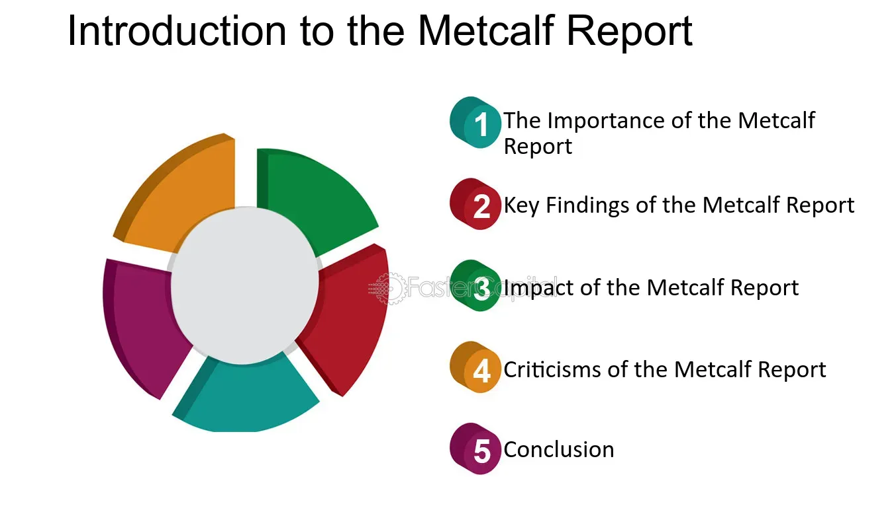

## Table of Contents

## What is the Metcalf Report?

The Metcalf Report is a document that was created after a big event at Metcalf, California. In 2013, someone attacked a power station there. They cut fiber-optic cables and shot at the transformers. This made people worried about how safe the power grid is.

After the attack, a group of experts wrote the Metcalf Report. They wanted to find out what happened and how to stop it from happening again. The report talks about ways to make power stations safer. It suggests things like better security cameras and stronger fences. The report is important because it helps keep the power on and safe for everyone.

## Who authored the Metcalf Report?

The Metcalf Report was put together by a group of experts from the electric power industry. They worked together to figure out what happened during the attack on the Metcalf power station and how to prevent similar attacks in the future. The group was led by people who know a lot about keeping power stations safe.

The report was not written by just one person. Instead, it was a team effort by many people who wanted to make the power grid safer. They shared their knowledge and ideas to come up with good ways to protect power stations from attacks.

## When was the Metcalf Report published?

The Metcalf Report was published in 2014. This was a year after the attack on the power station in Metcalf, California happened. The report came out to help everyone understand what went wrong and how to fix it.

A group of experts from the electric power industry worked together to write the report. They wanted to make sure that power stations would be safer in the future. The report gave ideas like using better security cameras and stronger fences to keep bad things from happening again.

## What are the main objectives of the Metcalf Report?

The main goal of the Metcalf Report is to figure out what happened during the attack on the power station in Metcalf, California, and to stop similar things from happening again. The report looks at the details of the attack, like how the attackers cut fiber-optic cables and shot at transformers. By understanding these details, the experts who wrote the report can find ways to make power stations safer.

Another important objective of the report is to suggest ways to improve security at power stations. The report talks about using better security cameras, stronger fences, and other safety measures. These ideas are meant to help keep the power grid safe and make sure that people have electricity without worrying about attacks.

## What industries does the Metcalf Report primarily focus on?

The Metcalf Report mainly focuses on the electric power industry. This is because the attack happened at a power station in Metcalf, California. The report looks at how to keep power stations safe from attacks. It talks about things like better security cameras and stronger fences to protect the power grid.

The report also touches on the telecommunications industry a bit. This is because the attackers cut fiber-optic cables during the attack. These cables are important for communication. So, the report suggests ways to protect these cables too. This helps make sure that both power and communication stay safe and reliable.

## How does the Metcalf Report impact regulatory policies?

The Metcalf Report has a big impact on the rules that keep power stations safe. After the attack at Metcalf, California, people realized that power stations needed better protection. The report showed how attackers could harm the power grid and suggested ways to stop them. This made government and industry leaders think about new rules to make power stations safer. They started looking at things like better security cameras, stronger fences, and other ways to protect the power grid.

Because of the Metcalf Report, new rules were made to help keep the power on and safe for everyone. These rules tell power companies what they need to do to protect their stations from attacks. For example, they might have to use special security measures or check their systems more often. The report helped everyone understand the risks and work together to make the power grid stronger. This way, people can trust that their electricity will keep working, even if someone tries to harm it.

## What are the key findings of the Metcalf Report?

The Metcalf Report found out that the attack on the power station in Metcalf, California, was very serious. The attackers cut important fiber-optic cables and shot at the transformers. This made people realize that the power grid was not as safe as they thought. The report said that it's important to understand how these attacks happen so we can stop them from happening again. It showed that the attackers knew what they were doing and planned it carefully.

The report also suggested ways to make power stations safer. It talked about using better security cameras and stronger fences to keep bad people out. The report said that power companies should check their systems more often and use special security measures. By doing these things, we can protect the power grid and make sure that people have electricity without worrying about attacks. The Metcalf Report helped everyone understand the risks and work together to make the power grid stronger.

## How does the Metcalf Report suggest addressing the issues it identifies?

The Metcalf Report suggests that to fix the problems found during the attack on the Metcalf power station, power companies should use better security cameras. These cameras can help watch over the station and catch any bad people trying to get in. The report also says that stronger fences are important. Strong fences can keep attackers out and make it harder for them to reach the transformers and other important parts of the station.

Another way the report suggests addressing the issues is by checking the power systems more often. Regular checks can help find any weak spots that attackers might use. The report also talks about using special security measures, like alarms and sensors, to keep the power station safe. By doing these things, the power grid can be better protected, and people can have electricity without worrying about attacks.

## What methodologies were used in the research for the Metcalf Report?

The Metcalf Report used different ways to study the attack on the power station in Metcalf, California. The experts looked at what happened during the attack, like how the attackers cut the fiber-optic cables and shot at the transformers. They also talked to people who work at the power station to learn more about what they saw and heard. By putting all this information together, the experts could understand how the attack happened and why it was successful.

The report also used other studies and reports about power station security. The experts read about what other people have found out about keeping power stations safe. They used this information to come up with their own ideas about how to protect power stations better. By combining what they learned from the attack with what they read in other studies, the experts could suggest good ways to stop similar attacks from happening again.

## How has the Metcalf Report been received by different stakeholders?

The Metcalf Report has been well-received by many people in the electric power industry. They see it as an important document that helps them understand the risks to power stations. The report's suggestions for better security, like using better cameras and stronger fences, have been taken seriously. Many power companies have started to use these ideas to make their stations safer. The report has also helped start conversations about how to keep the power grid safe from attacks.

Government agencies have also paid attention to the Metcalf Report. They have used the report to make new rules that help protect power stations. These rules tell power companies what they need to do to keep their stations safe. The report has made people in the government think more about how to stop attacks on the power grid. It has helped them work with the power industry to make the grid stronger and more secure.

Some people in the telecommunications industry have also looked at the Metcalf Report. They are interested because the attackers cut fiber-optic cables during the attack. The report's ideas about protecting these cables have been useful for them. They have started to think about how to keep their own systems safe from similar attacks. Overall, the Metcalf Report has been seen as a helpful tool by many different groups who want to keep the power and communication systems safe.

## What are the limitations of the Metcalf Report according to critics?

Some people think the Metcalf Report has problems. They say it only looks at one attack, so it might not help with all kinds of attacks on power stations. The report focuses a lot on physical attacks, like shooting at transformers and cutting cables. But there are other ways to harm power stations, like using computers to mess with them. Critics think the report should talk about these other risks too.

Another thing critics say is that the report's suggestions might be hard for some power companies to use. Things like better cameras and stronger fences can cost a lot of money. Not all power companies have enough money to do everything the report suggests. Critics think the report should give more ideas that are easier and cheaper for everyone to use. They want the report to help all power companies, not just the ones with a lot of money.

## How has the Metcalf Report influenced subsequent research and policy-making in its field?

The Metcalf Report has had a big impact on how people study and make rules about keeping power stations safe. After the report came out, more experts started looking into ways to protect the power grid from attacks. They used the report's ideas to guide their own research. For example, they studied how to use better security cameras and stronger fences to stop attackers. The report also made people think more about the risks to power stations, which led to more studies on different kinds of attacks, like cyber attacks. This helped everyone learn more about how to keep the power on and safe for everyone.

The report also changed how rules are made to keep power stations safe. Governments and power companies used the report to make new rules that tell power stations what they need to do to protect themselves. These rules are based on the report's suggestions, like checking systems more often and using special security measures. The report helped start conversations between the government and the power industry about how to work together to make the power grid stronger. This has made the power grid safer and more reliable, which is good for everyone who uses electricity.

## References & Further Reading

[1]: U.S. Senate, Subcommittee on Reports, Accounting and Management of the Committee on Government Operations. (1976). ["The Accounting Establishment: A Staff Study."](https://www.sechistorical.org/collection/papers/1970/1976_1201_MetcalfSummaryT.pdf) U.S. Government Printing Office. (Metcalf Report)

[2]: U.S. Securities and Exchange Commission (2020). ["SEC's Report on Algorithmic and High-Frequency Trading"](https://www.sec.gov/files/Algo_Trading_Report_2020.pdf)

[3]: Kirilenko, A. A., Kyle, A. S., Samadi, M., & Tuzun, T. (2017). ["The Flash Crash: High-Frequency Trading in an Electronic Market."](https://www.jstor.org/stable/26652722) Review of Financial Studies, 30(11), 2221-2229.

[4]: Patterson, S. (2013). ["Dark Pools: High-Speed Traders, A.I. Bandits, and the Threat to the Global Financial System"](https://books.google.com/books/about/Dark_Pools.html?id=LIoNSKUEn24C) Crown Business.

[5]: De Prado, M. L. (2018). ["Advances in Financial Machine Learning"](https://www.amazon.com/Advances-Financial-Machine-Learning-Marcos/dp/1119482089) Wiley.

[6]: Aldridge, I. (2009). ["High-Frequency Trading: A Practical Guide to Algorithmic Strategies and Trading Systems"](https://www.tradebit.com/usr/ledsin/pub/9003/_excerpt_High-frequencyTrading.pdf) Wiley.

[7]: Markose, S. (2013). ["Systemic Risk from Global Financial Derivatives: A Network Analysis of Contagion and Its Mitigation with Super-spreader Tax"](https://papers.ssrn.com/sol3/papers.cfm?abstract_id=2199301) The Review of Financial Studies, 26(9), 1976-2015.