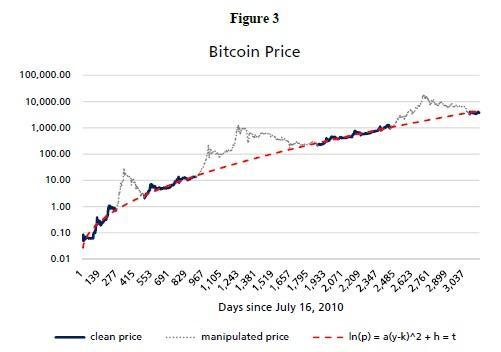

## Table of Contents

## What is Metcalfe's Law?

Metcalfe's Law is a concept about networks. It says that the value of a network grows a lot as more people join it. The law was named after Robert Metcalfe, who helped create Ethernet. He thought that if you double the number of people in a network, the value of the network goes up even more than just double.

Imagine a telephone network. When there are only two people with phones, they can only call each other. But if you add a third person, now each of the first two can call the third person too. The more people you add, the more connections you can make. This is why social media platforms, like Facebook or X (formerly Twitter), become more useful as more people use them. The idea helps explain why networks can grow so quickly and become very valuable.

## How does Metcalfe's Law apply to networks in general?

Metcalfe's Law applies to all kinds of networks, not just phone lines or social media. It says that the more people or devices that join a network, the more valuable that network becomes. This is because each new member can connect with all the existing members, creating many more possible connections. Think of it like a party. If there are only two people at the party, they can only talk to each other. But if you invite more friends, everyone can talk to everyone else, making the party much more fun and valuable.

This idea helps explain why networks can grow so fast. When a network gets bigger, it becomes more useful to everyone who uses it. People are more likely to join a network if they know lots of other people are already there. This can lead to a snowball effect where the network grows bigger and bigger. For example, a messaging app becomes much more useful if all your friends are using it too. That's why companies that run networks often try to get as many users as possible, because the more users they have, the more valuable their network becomes.

## What is Bitcoin and how does it function as a network?

Bitcoin is a type of digital money that you can use to buy things online. It's different from regular money because it's not controlled by a bank or government. Instead, it uses a technology called blockchain, which is like a big, public record book that keeps track of all Bitcoin transactions. Anyone can see these transactions, but they are secure because they use special codes to keep them private.

Bitcoin functions as a network because it relies on lots of computers around the world working together. These computers, called nodes, help to check and record transactions on the blockchain. When someone sends Bitcoin to another person, the network of nodes verifies that the sender has the Bitcoin to spend and then adds the transaction to the blockchain. This process, called mining, involves solving complex math problems, and the miners are rewarded with new Bitcoin. The more people and computers that join the Bitcoin network, the more secure and valuable it becomes, following the idea of Metcalfe's Law.

## How does Metcalfe's Law specifically relate to Bitcoin?

Metcalfe's Law says that the value of a network grows a lot when more people join it. For Bitcoin, this means that the more people use it, the more valuable it becomes. This is because each new user can make transactions with everyone else on the network, creating more connections and making the network more useful.

As more people join the Bitcoin network, it becomes more secure too. More users mean more computers (called nodes) are checking and recording transactions. This makes it harder for anyone to cheat the system. So, just like with social media or phone networks, Bitcoin benefits from having lots of users, making it a good example of Metcalfe's Law in action.

## Can you explain the correlation between the number of Bitcoin users and its value according to Metcalfe's Law?

Metcalfe's Law says that the value of a network goes up a lot as more people join it. For Bitcoin, this means that the more people who use Bitcoin, the more valuable it becomes. This is because each new user can make transactions with all the other users, creating more connections and making the network more useful. When more people use Bitcoin, it becomes easier to buy and sell things with it, which makes it more valuable to everyone.

As more people join the Bitcoin network, it also becomes more secure. More users mean more computers, called nodes, are checking and recording transactions. This makes it harder for anyone to cheat the system because there are so many people watching. So, the more people who use Bitcoin, the more valuable and secure it becomes, which is exactly what Metcalfe's Law predicts.

## What empirical evidence supports the application of Metcalfe's Law to Bitcoin?

Researchers have found evidence that supports Metcalfe's Law when it comes to Bitcoin. They looked at how the number of active Bitcoin users relates to its price. They found that as the number of users goes up, the price of Bitcoin also goes up, and this relationship follows the pattern that Metcalfe's Law predicts. This means that the value of Bitcoin grows faster than just the number of users, showing that each new user adds a lot of value to the network.

One study used data from Bitcoin's early years to show this. They tracked the number of active addresses on the Bitcoin network and compared it to the price of Bitcoin. The results showed a strong link between the two, supporting Metcalfe's Law. This evidence helps explain why Bitcoin can become more valuable as more people start using it, and it shows how important the network effect is for cryptocurrencies like Bitcoin.

## How have researchers tested Metcalfe's Law in the context of Bitcoin?

Researchers have tested Metcalfe's Law for Bitcoin by looking at how the number of people using Bitcoin relates to its price. They collected data on the number of active Bitcoin addresses over time and compared it to the price of Bitcoin. They found that when more people started using Bitcoin, its price went up. This matches what Metcalfe's Law says: the value of a network grows a lot as more people join it. So, the more people using Bitcoin, the more valuable it becomes.

One specific study used data from Bitcoin's early days to test this idea. They tracked the number of active addresses and saw how it changed over time. When they compared this to the price of Bitcoin, they found a strong connection. The price of Bitcoin followed the pattern that Metcalfe's Law predicts, showing that each new user adds a lot of value to the Bitcoin network. This evidence supports the idea that the network effect is very important for the value of cryptocurrencies like Bitcoin.

## What are the criticisms or limitations of applying Metcalfe's Law to Bitcoin?

Some people think that using Metcalfe's Law to understand Bitcoin's value has problems. One big issue is that it's hard to know exactly how many people are really using Bitcoin. Just because there are a lot of active addresses doesn't mean there are a lot of different people using them. Some people might have many addresses, or some addresses might not be used much. This makes it tricky to say for sure that more addresses mean more value.

Another problem is that Bitcoin's value can be affected by many other things, not just the number of users. Things like news, laws, and what people think about Bitcoin can change its price a lot. So, even if more people start using Bitcoin, its value might not go up if other things are happening. This means Metcalfe's Law might not always be the best way to predict Bitcoin's value because it doesn't take all these other factors into account.

## How does the growth rate of Bitcoin's network affect its valuation under Metcalfe's Law?

The growth rate of Bitcoin's network is really important for its value according to Metcalfe's Law. This law says that the more people who join a network, the more valuable it becomes. So, if Bitcoin's network grows quickly, with lots of new people using it, the value of Bitcoin should go up a lot. This is because each new user can make transactions with everyone else, making the network more useful and valuable.

However, the growth rate isn't the only thing that affects Bitcoin's value. Other things like news, laws, and what people think about Bitcoin can also change its price. If the network grows fast but other things are making people worried about Bitcoin, its value might not go up as much as Metcalfe's Law would predict. So, while a fast-growing network can make Bitcoin more valuable, it's not the whole story.

## What are the future implications of Metcalfe's Law for Bitcoin's growth and adoption?

Metcalfe's Law suggests that as more people start using Bitcoin, it will become more valuable and useful. This means that if Bitcoin keeps growing and more people join the network, it could become a lot more popular and widely used. Just like how social media gets better with more users, Bitcoin could become the go-to money for buying things online if lots of people use it. This could lead to more businesses accepting Bitcoin, making it easier and more common to use in everyday life.

However, there are challenges too. If Bitcoin's growth slows down or if people lose trust in it because of bad news or new laws, its value might not keep going up like Metcalfe's Law predicts. Also, if other cryptocurrencies become more popular, they could take users away from Bitcoin, slowing down its growth. So, while Metcalfe's Law gives us a good idea of how Bitcoin could grow, it's not the only thing that matters. The future of Bitcoin will depend on many things, including how well it keeps growing and how people feel about using it.

## How do other cryptocurrencies compare to Bitcoin in terms of Metcalfe's Law?

Other cryptocurrencies, like Ethereum, Litecoin, and others, can also be looked at using Metcalfe's Law. Just like Bitcoin, the more people who use these other cryptocurrencies, the more valuable they become. Each new user adds more connections to the network, making it more useful and valuable for everyone. For example, Ethereum has a lot of users who use it for things like smart contracts and decentralized apps, so it might follow Metcalfe's Law in a similar way to Bitcoin.

However, not all cryptocurrencies grow at the same rate or have the same number of users. Some, like Dogecoin, might have a lot of users but not as much real use in buying things or other serious stuff. Others, like Litecoin, might have fewer users but be used more for actual transactions. This means that Metcalfe's Law might work differently for each cryptocurrency, depending on how fast they grow and what people use them for. So, while the basic idea of Metcalfe's Law applies to all cryptocurrencies, how well it fits each one can be different.

## What advanced metrics or models beyond Metcalfe's Law are used to evaluate Bitcoin's network value?

Besides Metcalfe's Law, people use other ways to figure out how valuable Bitcoin's network is. One way is called the "Network Value to Transactions" (NVT) ratio. This looks at the total value of Bitcoin and compares it to how much Bitcoin is being used for buying and selling things. If the NVT ratio is high, it might mean Bitcoin is overvalued because its price is a lot higher than how much it's actually being used. If it's low, it might mean Bitcoin is undervalued because its price is low compared to how much it's being used.

Another way is the "Stock-to-Flow" model. This model looks at how much new Bitcoin is made each year compared to how much Bitcoin already exists. If less new Bitcoin is made each year, it becomes more valuable because it's harder to get. This model helps people guess what Bitcoin's price might be in the future based on how much new Bitcoin will be made. Both of these ways, along with Metcalfe's Law, help people understand Bitcoin's value from different angles.

## What are the implications for algorithmic trading?

Metcalfe's Law, which posits that the value of a network is proportional to the square of its number of users, provides insightful perspectives for [algorithmic trading](/wiki/algorithmic-trading), particularly regarding Bitcoin. Traders can leverage this principle to enhance trading algorithms by integrating network growth metrics into predictive models. This approach can lead to more informed and potentially profitable trading strategies.

### Incorporating Network Growth Metrics in Predictive Models

Algorithmic trading relies heavily on predictive models that can forecast asset price movements. By incorporating network growth metrics, such as user adoption rates and transaction volumes, traders can develop models that better reflect a digital currency’s intrinsic value. For instance, if $n$ represents the number of users in a network, Metcalfe's Law suggests that the value $V$ of the network could be approximated by the formula:

$$
V \propto n^2
$$

Using this relationship, traders can track user growth and use it as a proxy for potential price movements. In practice, data on Bitcoin wallet addresses, active users, and transaction count can serve as inputs for algorithms designed to assess market sentiment and predict price trends.

### Examples of Algorithmic Strategies Benefiting from Network Data

Several algorithmic strategies can benefit from integrating network data informed by Metcalfe's Law:

1. **Momentum Trading**: Momentum trading strategies capitalize on existing trends in the market. By using network growth as an indicator of price direction, traders can identify momentum signals more reliably. For example, a sustained increase in new Bitcoin addresses might suggest a bullish sentiment, guiding traders to buy.

2. **Mean Reversion**: This strategy is based on the assumption that an asset's price will return to its mean over time. By analyzing deviations between expected values derived from network data and actual market prices, algorithms can identify potential reversion points. If Bitcoin's market price diverges significantly from the value suggested by Metcalfe's Law, it could indicate a probable correction.

3. **Sentiment Analysis**: Network metrics can enhance sentiment analysis models, which extract market outlook data from various sources such as social media and news. Data such as the rise in transaction counts or growth in network size can be combined with sentiment scores to generate more robust trading signals.

4. **Arbitrage Opportunities**: By comparing Bitcoin valuations across multiple exchanges using network-informed valuation benchmarks, algorithms can detect pricing discrepancies that present arbitrage opportunities.

Implementing network data into algorithmic models requires proficient data parsing and analysis capabilities. Python, with libraries such as NumPy and Pandas, can be used to handle large datasets and perform complex calculations efficiently. Below is a simple Python example illustrating how network data might be incorporated into a trading algorithm:

```python
import numpy as np
import pandas as pd

# Example data: daily number of Bitcoin users
user_data = pd.Series([1000, 1500, 2000, 2200, 2500])

# Calculating perceived network value using Metcalfe's Law
network_value = user_data ** 2

# Logic to generate buy/sell signals based on network growth
buy_signals = network_value.pct_change() > 0.05  # buying when growth > 5%
sell_signals = network_value.pct_change() < -0.05 # selling when decline > 5%

buy_dates = user_data.index[buy_signals]
sell_dates = user_data.index[sell_signals]
```

This illustration shows how changes in network growth can activate buy and sell signals. By factoring Metcalfe's Law into the development of trading strategies, traders harness an additional layer of analysis, improving the sophistication and responsiveness of their trading algorithms to the fundamental aspects of Bitcoin's market dynamics.

## References & Further Reading

[1]: Metcalfe, Robert M. (1995). ["Metcalfe's Law: A network becomes more valuable as it reaches more users."](http://ctlj.colorado.edu/wp-content/uploads/2015/12/v2.Final-Yoo-11.25.15-JRD.pdf) Omni Magazine, Vol 17, No. 9.

[2]: Nakamoto, Satoshi. (2008). ["Bitcoin: A Peer-to-Peer Electronic Cash System."](https://nakamotoinstitute.org/library/bitcoin/) Bitcoin.org.

[3]: Croman, K., Decker, C., Eyal, I., Gencer, A. E., Juels, A., Kosba, A., Miller, A., Saxena, P., Shi, E., Sirer, E. G., Song, D., & Wattenhofer, R. (2016). ["On Scaling Decentralized Blockchains."](https://experts.illinois.edu/en/publications/on-scaling-decentralized-blockchains-a-position-paper) Financial Cryptography and Data Security.

[4]: Biais, B., Bisière, C., Bouvard, M., & Casamatta, C. (2019). ["The Blockchain Folk Theorem"](https://academic.oup.com/rfs/article/32/5/1662/5427771). The Review of Financial Studies, 32(5), 1662-1715.

[5]: Huberman, Gur, Jacob Leshno, and Ciamac Moallemi. (2019). ["Monopoly Without a Monopolist: An Economic Analysis of the Bitcoin Payment System."](https://papers.ssrn.com/sol3/papers.cfm?abstract_id=3025604) Columbia Business School Research Paper.

[6]: Jansen, Stefan. (2020). ["Machine Learning for Algorithmic Trading, Second Edition: Predictive models to extract signals from market and alternative data."](https://www.amazon.com/Machine-Learning-Algorithmic-Trading-alternative/dp/1839217715) Packt Publishing. 

[7]: Lopez de Prado, Marcos. (2018). ["Advances in Financial Machine Learning."](https://www.amazon.com/Advances-Financial-Machine-Learning-Marcos/dp/1119482089) John Wiley & Sons.

[8]: Chan, Ernest P. (2008). ["Quantitative Trading: How to Build Your Own Algorithmic Trading Business."](https://github.com/ftvision/quant_trading_echan_book) John Wiley & Sons.