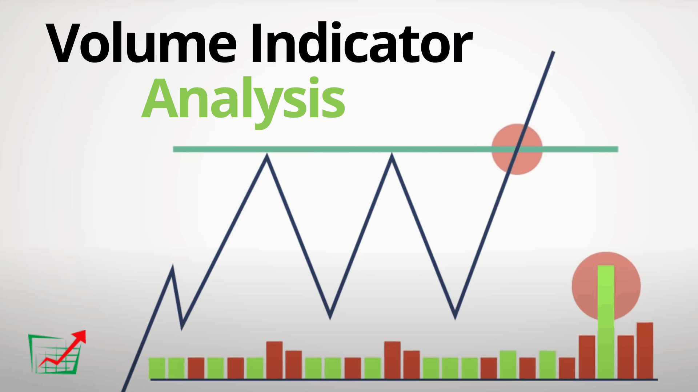

## Table of Contents

## What is intraday trading volume?

Intraday trading volume is the total number of shares or contracts traded in a particular security during a single trading day. It shows how active the market is for that security on that day. When more people are buying and selling a stock, the trading volume goes up. This can be important for traders because high volume can mean the stock price might move more.

Traders look at intraday trading volume to make decisions. If a stock has a high volume, it might be easier to buy or sell it quickly without affecting the price too much. On the other hand, if the volume is low, it might be harder to trade without moving the price. Watching the volume can help traders understand if a price change is strong or if it might not last long.

## Why is it important to interpret intraday trading volume?

Interpreting intraday trading volume is important because it helps traders understand how active the market is for a specific stock on a given day. When a lot of people are buying and selling a stock, it means the trading volume is high. This can tell traders that the stock is popular and there might be more interest in it. If the volume is low, it means fewer people are trading the stock, which can make it harder to buy or sell without affecting the price a lot.

Knowing the intraday trading [volume](/wiki/volume-trading-strategy) can also help traders decide if a change in the stock's price is likely to last. If a stock's price goes up and the volume is high, it might mean more people believe the price will keep going up. But if the price goes up and the volume is low, it might not be a strong move and the price could go back down soon. By looking at the volume, traders can make smarter choices about when to buy or sell a stock.

## How can beginners identify high volume periods during the trading day?

Beginners can identify high volume periods during the trading day by watching the stock's trading activity closely. Most trading platforms show a chart or a graph that displays the volume of trades happening in real time. If you see the volume bar getting taller, it means more people are buying and selling the stock at that time. Usually, the start of the trading day, around the market open, and the end of the day, near the market close, are times when you might see higher volumes because many traders are active then.

Another way to spot high volume periods is by looking at historical data. Many trading platforms let you see what the volume was like on past days at different times. By comparing today's volume to what it was like in the past, you can tell if the current volume is high or low. Also, some stocks have regular times when they get more trading activity, like during company news announcements or earnings reports. By keeping an eye on these patterns, beginners can get better at spotting when volume is likely to be high.

## What are the common patterns of intraday volume that traders look for?

Traders often look for certain patterns in intraday volume to help them make decisions. One common pattern is a spike in volume at the market open and close. Many traders are active at these times, so the volume can be much higher. This can show that there's a lot of interest in the stock, and the price might move more. Another pattern traders watch for is a sudden increase in volume during the day. This can happen when there's big news about the company, like a new product or earnings report. If the volume goes up a lot and the price moves too, it might mean the price change is strong and could last longer.

Another pattern traders pay attention to is volume trends. If the volume is slowly getting higher over the day, it might mean more traders are getting interested in the stock. On the other hand, if the volume is slowly going down, it might mean traders are losing interest. Also, some traders look for what's called 'volume confirmation.' This is when the volume goes up at the same time the price is moving in a certain direction. If the price goes up and the volume goes up too, it can confirm that the price move is strong. But if the price goes up and the volume stays low, the move might not be as strong and could change direction soon.

## How does volume relate to price movement in intraday trading?

Volume and price movement in intraday trading are closely related. When the volume of a stock goes up, it means more people are buying and selling it. This can make the stock's price move more because there's more activity. If the price of a stock goes up and the volume is high too, it can mean that the price increase is strong and might keep going up. But if the price goes up and the volume is low, it might mean the price increase is not very strong and could go back down soon.

Traders watch volume to understand if a price change is likely to last. If the volume is high when the price moves, it can show that many traders agree with the price change. This is called volume confirmation. For example, if a stock's price drops and the volume is high, it might mean the drop is strong and the price could keep going down. But if the price drops and the volume is low, it might not be a big deal, and the price could go back up soon. By looking at volume and price together, traders can make better decisions about when to buy or sell a stock.

## What tools or software can be used to analyze intraday trading volume?

Many traders use trading platforms like MetaTrader 4 or 5, Thinkorswim, and TradingView to analyze intraday trading volume. These platforms show real-time charts that include volume bars, making it easy to see when a stock is being traded a lot. They also let you look at past volume data, so you can see if today's volume is high or low compared to other days. Some platforms even have special tools like volume indicators that can help you spot trends and patterns in the volume.

Another tool traders use is volume profile, which can be found on platforms like NinjaTrader or Sierra Chart. Volume profile shows where most of the trading is happening at different price levels during the day. This can help you understand if a price change is strong or not. For example, if a lot of trading happens at a certain price, it might be a key level to watch. There are also software programs like Amibroker or MultiCharts that let you create your own volume analysis tools, so you can look at the data in a way that works best for you.

## How can volume spikes be interpreted in different market conditions?

Volume spikes can mean different things depending on what's happening in the market. If the market is calm and prices are not moving much, a sudden spike in volume can be a big sign that something important is happening. It might mean that new information, like a news report or earnings announcement, has come out and traders are reacting to it. If the price goes up with the volume spike, it might mean more people think the price will keep going up. But if the price goes down with the volume spike, it might mean more people are selling and the price could keep going down.

In a market that's moving a lot, volume spikes can be a bit harder to understand. If the market is already moving up or down a lot, a volume spike might just be part of the big moves. But it's still important to watch. If the volume spike is bigger than what you usually see during these big moves, it might mean the current trend is getting stronger. For example, if the market is going up and you see a big volume spike, it might mean the upward trend is strong and could keep going. But if the volume spike happens when the market is going down, it might mean the downward trend is strong and could keep going too.

## What are the key differences between volume analysis in intraday versus daily trading?

Volume analysis in intraday trading looks at how many shares or contracts are traded within a single trading day. Traders watch the volume closely during the day to see when a stock is being bought or sold a lot. If the volume goes up a lot at certain times, it might mean something important is happening, like news about the company. Intraday traders use this information to make quick decisions about buying or selling stocks. They pay attention to volume spikes and trends during the day to understand if a price change is strong or might not last long.

In daily trading, volume analysis looks at the total number of shares or contracts traded over the whole day. Daily traders are more interested in how the volume compares to other days. If the volume is higher than usual, it might mean more people are interested in the stock, and the price change could be strong. Daily traders use this information to make decisions about holding onto a stock for a longer time. They look at the volume over several days or weeks to see if there are patterns or trends that can help them predict what might happen next with the stock's price.

## How can advanced traders use volume profile to enhance their trading strategies?

Advanced traders can use volume profile to see where most of the trading happens at different price levels during the day. This helps them find important price levels where a lot of buying or selling is happening. For example, if a lot of trading happens at a certain price, it might be a key level to watch. Traders can use this information to decide when to buy or sell a stock. If the price reaches a level with a lot of volume, it might be a good time to enter or [exit](/wiki/exit-strategy) a trade because it shows where other traders are interested.

Traders can also use volume profile to understand if a price change is strong or not. If the price moves to a new level with a lot of volume, it might mean the move is strong and could last longer. But if the price moves to a new level with little volume, it might not be a strong move and could change direction soon. By looking at the volume profile, advanced traders can make better decisions about their trading strategies. They can see where the market is most active and use that information to find the best times to trade.

## What are the limitations of relying solely on volume for intraday trading decisions?

Relying only on volume for intraday trading decisions can be tricky. Volume shows how many people are buying and selling a stock, but it doesn't tell you why they are doing it. For example, a high volume might mean good news or bad news about a company. Without knowing the reason, it's hard to decide if the price will go up or down. Also, volume can be affected by things like the time of day or overall market activity, so a high volume at one time might not mean the same thing at another time.

Another problem with using just volume is that it doesn't give you the whole picture. Other things like the stock's price, news about the company, and what's happening in the market can be just as important. If you only look at volume, you might miss out on important information that could change your trading decision. For example, if the volume is high but the price isn't moving much, it might mean that traders are not agreeing on the price, and it could be risky to trade based on volume alone.

## How can one incorporate volume data into algorithmic trading systems?

Volume data can be added to algorithmic trading systems to help them make better trading decisions. In these systems, volume can be used as a signal to buy or sell a stock. For example, if the system sees a big jump in volume, it might decide to buy the stock because a lot of people are interested in it. The system can also use volume to check if a price change is strong. If the price goes up and the volume goes up too, the system might think the price will keep going up and decide to keep the stock.

To use volume data in an algorithmic trading system, traders need to set up rules for how the system should use the volume information. They can program the system to look at volume spikes, volume trends, or even use volume profile to find important price levels. By adding volume data to the system, traders can make their algorithms smarter and more likely to make good trading decisions. But it's important to remember that volume is just one piece of information, so the system should also look at other things like price and news to make the best choices.

## What are the latest research findings on the effectiveness of volume-based trading strategies in intraday markets?

Recent research on volume-based trading strategies in intraday markets shows that these strategies can be useful but have limits. Studies have found that using volume to decide when to buy or sell stocks can help traders make money, especially when there are big jumps in volume. For example, if a stock's volume goes up a lot and the price moves too, it might be a good time to trade. But volume alone isn't enough to make good decisions all the time. Other things like the stock's price and news about the company also matter. So, while volume can be a helpful tool, it works best when used with other information.

Some studies also look at how volume can help predict what will happen to a stock's price. They found that if the volume is high when the price changes, it might mean the price change will last longer. But if the volume is low, the price change might not be as strong. Researchers also found that volume patterns can change depending on the time of day or what's happening in the market. So, traders need to be careful and think about these things when using volume to make trading decisions. Overall, volume can be a good part of a trading strategy, but it's not the only thing traders should look at.

## What insights can we gain from analyzing trading volume?

Analyzing trading volume involves comparing intraday volume with average daily volume to gain insights into market activity. This comparison is essential for traders seeking to understand volume patterns and make informed trading decisions.

### Techniques for Comparing Intraday Volume with Average Daily Volume

A common approach to comparing intraday volume with average daily volume is through volume benchmarks. The average daily volume serves as a baseline for measuring intraday deviations. Traders track the current day's volume against this benchmark to identify anomalies or significant changes. Relative Volume (RVOL) is a metric often used for this purpose. It is calculated as:

$$
\text{RVOL} = \frac{\text{Current Intraday Volume}}{\text{Average Daily Volume}}
$$

A higher RVOL value may indicate unusual trading activity, prompting further analysis or trading decisions.

### Volume Run Rate: Calculation and Analysis

Volume Run Rate is another useful technique for analyzing intraday trading volume. It estimates the end-of-day volume by extrapolating current trading volume. The formula to calculate the Volume Run Rate (VRR) is:

$$
\text{VRR} = \frac{\text{Current Intraday Volume}}{\text{Elapsed Time Fraction}}
$$

Here, the Elapsed Time Fraction is the ratio of the time elapsed in the trading session over the total trading session duration. For example, if the trading session is six hours long and two hours have passed, the Elapsed Time Fraction would be $\frac{1}{3}$.

Analyzing VRR helps traders anticipate whether the day's total volume will exceed or fall short of average levels, allowing preemptive strategy adjustments.

### Utilizing the Quote Sheet Method for Practical Volume Analysis

The quote sheet method involves manually or electronically entering real-time quotes and volumes into a sheet or software for analysis. This approach allows traders to visualize volume data alongside price movements, aiding real-time decision-making. Here is a Python snippet that demonstrates a simple version of collecting volume data:

```python
import pandas as pd
import yfinance as yf  # For more datasets, visit: https://paperswithbacktest.com/datasets

def get_volume_data(ticker, period='1d', interval='5m'):
    data = yf.download(ticker, period=period, interval=interval)
    return data[['Volume']]

# Example usage
volume_data = get_volume_data('AAPL')
print(volume_data.tail())
```

With this data, traders can apply volume analyses techniques, such as calculating RVOL or VRR, directly within a spreadsheet tool or a custom-built analytics platform. This integrated approach facilitates quicker assessments of market conditions during trading hours. 

By accurately comparing intraday volume against historical averages and leveraging the quote sheet method, traders can enhance their market analysis, identify potential trading opportunities, and improve their overall strategy execution.

## What is the Role of Volume in Algorithmic Trading?

Algorithmic trading, often referred to as algo trading, utilizes computer programs to execute trades at speeds and frequencies unachievable by human traders. This automated approach allows traders to capitalize on market opportunities with precision, often relying heavily on the analysis of trading volume as a key input.

Volume analysis is integral to [algorithmic trading](/wiki/algorithmic-trading) because it provides vital insights into market strength and price dynamics. Intraday volume, the measure of the number of shares traded within a single trading day, helps algorithms detect trends and gauge [liquidity](/wiki/liquidity-risk-premium). By analyzing volume patterns, algorithms can distinguish between significant price movements and those that are less consequential. 

Two critical volume indicators extensively used in algorithmic strategies are On-Balance Volume (OBV) and Volume Weighted Average Price (VWAP).

**On-Balance Volume (OBV)** is a momentum indicator that relates volume to price change. It operates on the premise that volume precedes price movements, thus providing predictive insights. OBV is calculated using the formula:

$$
OBV = OBV_{\text{previous}} + \begin{cases} 
\text{Volume}, & \text{if price closed higher than previous close} \\ 
-\text{Volume}, & \text{if price closed lower than previous close} \\ 
0, & \text{if price closed unchanged} 
\end{cases}
$$

Algorithmic systems utilize OBV to confirm trends; a rising OBV suggests an upward trend, while a declining OBV indicates a downward trend. This indicator helps algorithms make buying or selling decisions by confirming market trends, thus reducing the risk of false signals.

**Volume Weighted Average Price (VWAP)**, on the other hand, is used as a trading benchmark. It calculates the average price of a security, weighted by volume over a particular period, offering a picture of the average price at which a stock has traded throughout the day based on both volume and price. VWAP is particularly useful for institutional traders executing large orders, helping them ascertain the optimal trade price. The formula for VWAP is:

$$
VWAP = \frac{\sum (Price_i \times Volume_i)}{\sum Volume_i}
$$

where $Price_i$ and $Volume_i$ are the price and volume of trade $i$.

Algorithmic trading strategies incorporate VWAP to improve execution efficiency and minimize market impact. For instance, an algorithm may strive to buy below the VWAP and sell above it, thus achieving better pricing than the market average.

Examples of strategies using these indicators include:

1. **VWAP Strategy**: Algorithms can be designed to automatically execute trades when the market price deviates significantly from the VWAP, suggesting a potential price correction.

2. **OBV Crossover**: In strategies where OBV is used, algorithms might trigger trades when the OBV crosses a particular moving average, indicating a change in market momentum.

3. **Liquidity Seeking Algorithms**: These algorithms use volume data to determine the best times to transact large volume orders without significantly affecting stock price, often utilizing VWAP as a guide for price benchmarking.

In conclusion, volume analysis stands at the forefront of algorithmic trading, offering a window into market conditions that price alone cannot provide. By leveraging sophisticated volume indicators like OBV and VWAP, algorithms enhance their predictive power and trade execution, achieving market efficiencies that contribute to broader financial market stability.

## What are Volume-Based Trading Strategies?

Volume-based trading strategies are crucial for traders aiming to capitalize on fluctuations and anomalies in intraday volume. These strategies focus on identifying patterns and opportunities created by sudden increases or decreases in trading volume that may precede significant price movements. Understanding and employing these strategies can provide traders with an edge in the fast-paced environment of intraday trading. 

Intraday volume anomalies often signal shifts in market sentiment or impending price changes. Traders adopt several strategies to exploit these occurrences. One common strategy is the "Volume Spike" approach, where traders look for unusual spikes in volume accompanied by price movements, signifying potential [breakout](/wiki/breakout-trading) or reversal scenarios. For example, a substantial increase in volume after a period of low trading activity might indicate that a trend is gaining [momentum](/wiki/momentum) or a reversal is imminent. 

Another popular strategy is the "Volume Price Trend" (VPT) analysis, which combines volume and price movement. The VPT can be calculated using the formula:

$$
VPT_t = VPT_{t-1} + \left(\frac{{P_t - P_{t-1}}}{P_{t-1}} \right) \times V_t
$$

where $VPT_t$ is the volume price trend at time $t$, $P_t$ is the price at time $t$, and $V_t$ is the volume at time $t$. This indicator helps traders assess whether a security is bought or sold based on volume changes and price direction.

Integrating volume analysis into trading algorithms enhances the ability to automate identification and responses to volume anomalies. For example, a Python script can automate monitoring for volume spikes:

```python
import pandas as pd

def identify_volume_spikes(data, threshold=2):
    """
    Identify volume spikes using a specified threshold.

    :param data: DataFrame containing 'Volume' column.
    :param threshold: Multiplier for average volume to identify spikes.
    :return: List of indices where volume spikes occur.
    """
    average_volume = data['Volume'].mean()
    spikes = data[data['Volume'] > threshold * average_volume].index.tolist()
    return spikes

# Example usage
data = pd.DataFrame({'Volume': [100, 200, 150, 300, 600, 400]})
spike_indices = identify_volume_spikes(data)
```

This code identifies instances where the trading volume exceeds twice the average volume, highlighting potential buying or selling opportunities.

Traders should also consider integrating advanced volume indicators, such as On-Balance Volume (OBV) and Volume-Weighted Average Price (VWAP), into their trading algorithms for enhanced decision-making accuracy. OBV can reveal accumulation and distribution phases, while VWAP provides insights into average trading price levels during specific intraday periods.

By incorporating these strategies and tips, traders can better navigate the complexities of intraday trading, leveraging volume data to make more informed and profitable trading decisions.

## What are the details of Volume Indicators: OBV and VWAP?

On-Balance Volume (OBV) and Volume-Weighted Average Price (VWAP) are pivotal volume indicators utilized in trading for decision-making and strategy formulation.

### On-Balance Volume (OBV)

On-Balance Volume (OBV) is a technical trading momentum indicator that uses volume flow to predict changes in stock price. Joseph Granville developed OBV, and the basic premise is that volume precedes price movement, so if a security is seeing increased volume without significant price movement, the price will eventually move upwards or downwards.

**Calculation of OBV:**
OBV is calculated on a day-to-day basis by adding the day’s volume to a cumulative total when the closing price is higher than the previous day’s close, and subtracting it when the closing price is lower. If the closing price is unchanged, the OBV remains the same.

$$
OBV = OBV_{\text{previous}} + \begin{cases} 
            \text{Volume}, & \text{if } \text{close}_\text{today} > \text{close}_\text{yesterday} \\
            -\text{Volume}, & \text{if } \text{close}_\text{today} < \text{close}_\text{yesterday} \\
            0, & \text{otherwise}
        \end{cases}
$$

The notion behind OBV is that smart money can be tracked by the volume before price trends become apparent. Traders monitor these OBV trends to predict potential breakouts or breakdowns.

**Example Use Case:**
A trader observes that the OBV of a stock has been rising steadily while the price has been relatively flat. This divergence suggests that there is accumulation, and a price breakout may follow, presenting a potential buy opportunity.

### Volume-Weighted Average Price (VWAP)

Volume-Weighted Average Price (VWAP) is a trading benchmark used to give the average price a security has traded at throughout the day, based on both volume and price. It provides traders with insight into the intraday price trend.

**Calculation of VWAP:**
VWAP is calculated using the following formula:

$$
\text{VWAP} = \frac{\sum (\text{Price}_t \times \text{Volume}_t)}{\sum \text{Volume}_t}
$$

**Practical Applications:**
- Institutional traders use VWAP to ensure they are executing trades at favorable prices. Buying below the VWAP and selling above it is often seen as advantageous.
- Algorithmic trading strategies often incorporate VWAP as it assists in minimizing market impact by aligning trades with the average market price.

**Example Scenario:**
Assume a trading algorithm decides to execute a buy order only when the current price is below the VWAP, signaling a potential undervaluation. Conversely, a sell order might be executed when the price exceeds the VWAP, signifying a potential overvaluation.

In practice, OBV and VWAP are effective in different scenarios: OBV is significant in identifying volume trends relative to price fluctuations, whereas VWAP is essential in executing trades based on the day's average price [statistics](/wiki/bayesian-statistics). Using these indicators in tandem can provide comprehensive insights into price movements and trend continuations or reversals, essential for both manual and algorithmic traders.

## References & Further Reading

[1]: ["Advances in Financial Machine Learning"](https://www.amazon.com/Advances-Financial-Machine-Learning-Marcos/dp/1119482089) by Marcos Lopez de Prado

[2]: ["Evidence-Based Technical Analysis: Applying the Scientific Method and Statistical Inference to Trading Signals"](https://www.amazon.com/Evidence-Based-Technical-Analysis-Scientific-Statistical/dp/0470008741) by David Aronson

[3]: ["Machine Learning for Algorithmic Trading"](https://github.com/stefan-jansen/machine-learning-for-trading) by Stefan Jansen

[4]: ["Quantitative Trading: How to Build Your Own Algorithmic Trading Business"](https://www.amazon.com/Quantitative-Trading-Build-Algorithmic-Business/dp/1119800064) by Ernest P. Chan

[5]: L. K. C. Chan and J. Lakonishok, ["The Behavior of Stock Prices Around Institutional Trades"](https://www.jstor.org/stable/2329347), The Journal of Finance, 1995.