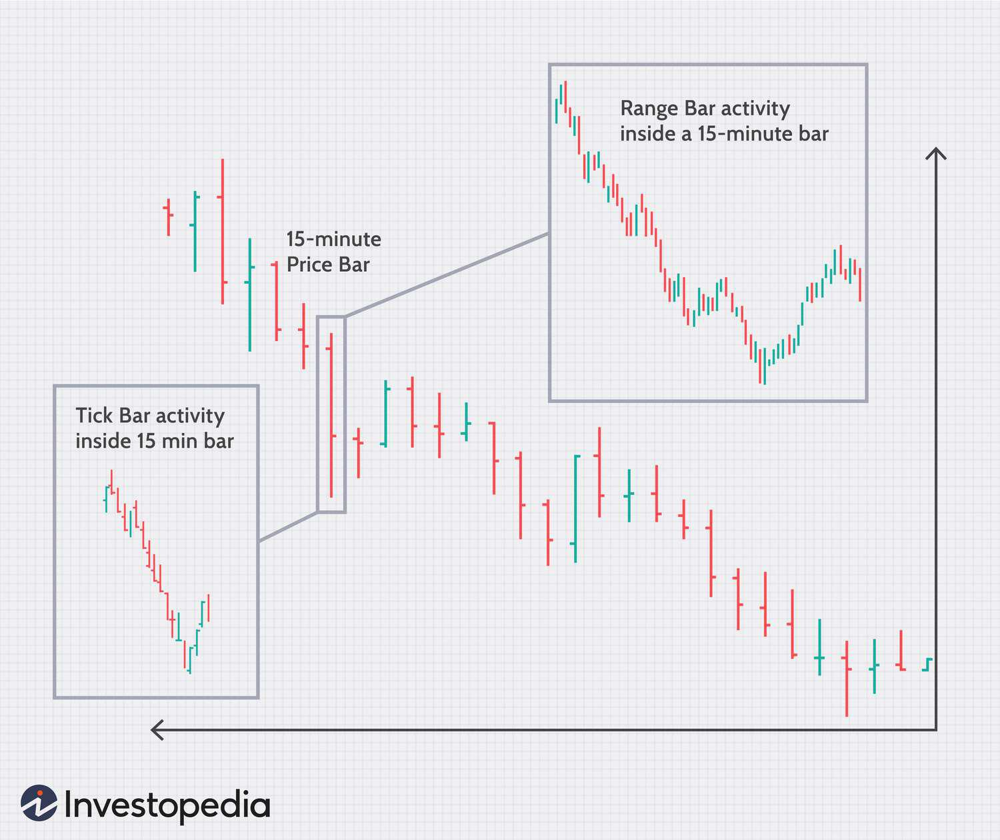

Intraday volume plays a crucial role in stock market trading as it provides insights into the level of activity and participation that occurs within a single trading day. It serves as a barometer for traders and investors to understand short-term market dynamics and make informed decisions. Unlike daily trading volume, which aggregates data from the opening to the closing of the market, intraday volume focuses on the fluctuations that occur within the trading day, offering a more granular view of market activity.

Volume analysis is integral to the practice of algorithmic trading, where traders utilize computational algorithms to execute trading strategies at high speeds and frequencies. Understanding volume patterns can help traders predict price movements and enhance the precision of their trading algorithms. In algorithmic trading, intraday volume data is often used to optimize trade execution and assess market liquidity, ensuring that large orders can be executed without causing significant price changes.



The difference between intraday and daily trading volume lies in their temporal scope. Intraday volume captures the ebb and flow of trading activities as they occur within various intervals of the trading day, providing more immediate signals that can be exploited for short-term opportunities. In contrast, daily volume aggregates all trades within the day, offering a broader perspective suited for long-term analysis. This distinction is critical for traders who need to respond quickly to market changes, as intraday volume can indicate periods of heightened interest or the presence of institutional investors actively trading during the day. By focusing on intraday volume, traders are better equipped to make swift, informed decisions that align with their trading strategies.

## Table of Contents

## Understanding Intraday Volume

Intraday volume refers to the total number of shares or contracts traded within a single trading session. It is a critical aspect of market analysis as it provides insights into the market's strength, direction, and potential price movements on a more granular level than daily trading volume. Unlike daily volume, which represents the total trades from open to close, intraday volume assesses these trades at various times throughout the day, offering a more dynamic view of market activity.

Analyzing intraday volume involves understanding its typical fluctuation patterns. Volume tends to be higher at the market open as traders react to overnight news and execute previously planned trades. There is usually a decline during the mid-day period when traders take breaks, followed by a surge in the afternoon as new information emerges and traders position themselves before the close. These patterns are essential for traders, as they highlight when liquidity and volatility are likely to increase.

High-volume periods are noteworthy as they typically indicate strong market interest and can lead to significant price movements. For example, a spike in volume might signal that new information is influencing traders' decisions, potentially leading to a price breakout. Traders can use this information to validate trends; a price movement accompanied by high volume is often seen as more sustainable than one with low volume. Conversely, if volume does not confirm the price trend, it could be an early warning sign of a potential reversal.

Understanding and utilizing intraday [volume](/wiki/volume-trading-strategy) patterns enables traders to make informed decisions and potentially capitalize on short-term market inefficiencies.

## Analyzing Trading Volume

Analyzing trading volume involves comparing intraday volume with average daily volume to gain insights into market activity. This comparison is essential for traders seeking to understand volume patterns and make informed trading decisions.

### Techniques for Comparing Intraday Volume with Average Daily Volume

A common approach to comparing intraday volume with average daily volume is through volume benchmarks. The average daily volume serves as a baseline for measuring intraday deviations. Traders track the current day's volume against this benchmark to identify anomalies or significant changes. Relative Volume (RVOL) is a metric often used for this purpose. It is calculated as:

$$
\text{RVOL} = \frac{\text{Current Intraday Volume}}{\text{Average Daily Volume}}
$$

A higher RVOL value may indicate unusual trading activity, prompting further analysis or trading decisions.

### Volume Run Rate: Calculation and Analysis

Volume Run Rate is another useful technique for analyzing intraday trading volume. It estimates the end-of-day volume by extrapolating current trading volume. The formula to calculate the Volume Run Rate (VRR) is:

$$
\text{VRR} = \frac{\text{Current Intraday Volume}}{\text{Elapsed Time Fraction}}
$$

Here, the Elapsed Time Fraction is the ratio of the time elapsed in the trading session over the total trading session duration. For example, if the trading session is six hours long and two hours have passed, the Elapsed Time Fraction would be $\frac{1}{3}$.

Analyzing VRR helps traders anticipate whether the day's total volume will exceed or fall short of average levels, allowing preemptive strategy adjustments.

### Utilizing the Quote Sheet Method for Practical Volume Analysis

The quote sheet method involves manually or electronically entering real-time quotes and volumes into a sheet or software for analysis. This approach allows traders to visualize volume data alongside price movements, aiding real-time decision-making. Here is a Python snippet that demonstrates a simple version of collecting volume data:

```python
import pandas as pd
import yfinance as yf  # For more datasets, visit: https://paperswithbacktest.com/datasets

def get_volume_data(ticker, period='1d', interval='5m'):
    data = yf.download(ticker, period=period, interval=interval)
    return data[['Volume']]

# Example usage
volume_data = get_volume_data('AAPL')
print(volume_data.tail())
```

With this data, traders can apply volume analyses techniques, such as calculating RVOL or VRR, directly within a spreadsheet tool or a custom-built analytics platform. This integrated approach facilitates quicker assessments of market conditions during trading hours. 

By accurately comparing intraday volume against historical averages and leveraging the quote sheet method, traders can enhance their market analysis, identify potential trading opportunities, and improve their overall strategy execution.

## The Role of Volume in Algorithmic Trading

Algorithmic trading, often referred to as algo trading, utilizes computer programs to execute trades at speeds and frequencies unachievable by human traders. This automated approach allows traders to capitalize on market opportunities with precision, often relying heavily on the analysis of trading volume as a key input.

Volume analysis is integral to [algorithmic trading](/wiki/algorithmic-trading) because it provides vital insights into market strength and price dynamics. Intraday volume, the measure of the number of shares traded within a single trading day, helps algorithms detect trends and gauge [liquidity](/wiki/liquidity-risk-premium). By analyzing volume patterns, algorithms can distinguish between significant price movements and those that are less consequential. 

Two critical volume indicators extensively used in algorithmic strategies are On-Balance Volume (OBV) and Volume Weighted Average Price (VWAP).

**On-Balance Volume (OBV)** is a momentum indicator that relates volume to price change. It operates on the premise that volume precedes price movements, thus providing predictive insights. OBV is calculated using the formula:

$$
OBV = OBV_{\text{previous}} + \begin{cases} 
\text{Volume}, & \text{if price closed higher than previous close} \\ 
-\text{Volume}, & \text{if price closed lower than previous close} \\ 
0, & \text{if price closed unchanged} 
\end{cases}
$$

Algorithmic systems utilize OBV to confirm trends; a rising OBV suggests an upward trend, while a declining OBV indicates a downward trend. This indicator helps algorithms make buying or selling decisions by confirming market trends, thus reducing the risk of false signals.

**Volume Weighted Average Price (VWAP)**, on the other hand, is used as a trading benchmark. It calculates the average price of a security, weighted by volume over a particular period, offering a picture of the average price at which a stock has traded throughout the day based on both volume and price. VWAP is particularly useful for institutional traders executing large orders, helping them ascertain the optimal trade price. The formula for VWAP is:

$$
VWAP = \frac{\sum (Price_i \times Volume_i)}{\sum Volume_i}
$$

where $Price_i$ and $Volume_i$ are the price and volume of trade $i$.

Algorithmic trading strategies incorporate VWAP to improve execution efficiency and minimize market impact. For instance, an algorithm may strive to buy below the VWAP and sell above it, thus achieving better pricing than the market average.

Examples of strategies using these indicators include:

1. **VWAP Strategy**: Algorithms can be designed to automatically execute trades when the market price deviates significantly from the VWAP, suggesting a potential price correction.

2. **OBV Crossover**: In strategies where OBV is used, algorithms might trigger trades when the OBV crosses a particular moving average, indicating a change in market momentum.

3. **Liquidity Seeking Algorithms**: These algorithms use volume data to determine the best times to transact large volume orders without significantly affecting stock price, often utilizing VWAP as a guide for price benchmarking.

In conclusion, volume analysis stands at the forefront of algorithmic trading, offering a window into market conditions that price alone cannot provide. By leveraging sophisticated volume indicators like OBV and VWAP, algorithms enhance their predictive power and trade execution, achieving market efficiencies that contribute to broader financial market stability.

## Advantages of High Trading Volume

High trading volume in the stock market is a crucial aspect that contributes significantly to liquidity and market efficiency. Liquidity refers to the ease with which an asset can be bought or sold in the market without affecting its price. High trading volume generally indicates robust liquidity, allowing for smoother and more efficient trade executions. 

### Liquidity and Market Efficiency

High trading volume facilitates better market efficiency by narrowing bid-ask spreads. A narrow bid-ask spread signifies that the difference between what sellers are asking for their shares and what buyers are willing to pay is small, reflecting a more competitive price. This environment ensures that traders can execute large orders quickly without causing significant price fluctuations, thus maintaining price stability.

### Impact on Price Stability and Trade Execution

High trading volume tends to stabilize prices, mitigating the impact of large trades on price [volatility](/wiki/volatility-trading-strategies). With more participants in the market, the buy and sell orders are distributed across a larger base, absorbing fluctuations more effectively. This stabilization is critical for traders executing substantial positions who need confidence that their market activity won't excessively sway prices, which can be disruptive in thinly traded securities.

For example, a high-volume day might see hundreds of thousands or even millions of shares traded, meaning any single buy or sell transaction will constitute a much smaller proportion of the overall activity. This diminishes the price impact of any large transaction, facilitating more predictable and stable market conditions.

### Leveraging High Volume for Informed Decisions

Traders can capitalize on high trading volumes by making informed decisions based on the activity levels. For instance, they can identify emerging trends or shifts in market sentiment. Analyzing volume alongside other indicators, such as price movements, can provide insights into the strength and sustainability of a trend.

Developing strategies around volume spikes can be advantageous. For instance, if a stock experiences a sudden increase in volume, it could indicate that institutional investors are moving in. Such insight might serve as a signal for traders to investigate further if it aligns with their trading strategies or potential trend reversals.

In practice, algorithmic traders often incorporate volume metrics into their algorithms to guide entry and [exit](/wiki/exit-strategy) points. High trading volumes can be indicative of [breakout](/wiki/breakout-trading) opportunities, providing a cue for algorithms to either capitalize on [momentum](/wiki/momentum) or enter contrarian positions depending on additional analyses or indicators like the On-Balance Volume (OBV) or Volume-Weighted Average Price (VWAP).

Overall, high trading volume is a vital component for market participants, offering benefits of liquidity, efficiency, and actionable insights that form the bedrock of informed trading strategies.

## Volume-Based Trading Strategies

Volume-based trading strategies are crucial for traders aiming to capitalize on fluctuations and anomalies in intraday volume. These strategies focus on identifying patterns and opportunities created by sudden increases or decreases in trading volume that may precede significant price movements. Understanding and employing these strategies can provide traders with an edge in the fast-paced environment of intraday trading. 

Intraday volume anomalies often signal shifts in market sentiment or impending price changes. Traders adopt several strategies to exploit these occurrences. One common strategy is the "Volume Spike" approach, where traders look for unusual spikes in volume accompanied by price movements, signifying potential breakout or reversal scenarios. For example, a substantial increase in volume after a period of low trading activity might indicate that a trend is gaining momentum or a reversal is imminent. 

Another popular strategy is the "Volume Price Trend" (VPT) analysis, which combines volume and price movement. The VPT can be calculated using the formula:

$$
VPT_t = VPT_{t-1} + \left(\frac{{P_t - P_{t-1}}}{P_{t-1}} \right) \times V_t
$$

where $VPT_t$ is the volume price trend at time $t$, $P_t$ is the price at time $t$, and $V_t$ is the volume at time $t$. This indicator helps traders assess whether a security is bought or sold based on volume changes and price direction.

Integrating volume analysis into trading algorithms enhances the ability to automate identification and responses to volume anomalies. For example, a Python script can automate monitoring for volume spikes:

```python
import pandas as pd

def identify_volume_spikes(data, threshold=2):
    """
    Identify volume spikes using a specified threshold.

    :param data: DataFrame containing 'Volume' column.
    :param threshold: Multiplier for average volume to identify spikes.
    :return: List of indices where volume spikes occur.
    """
    average_volume = data['Volume'].mean()
    spikes = data[data['Volume'] > threshold * average_volume].index.tolist()
    return spikes

# Example usage
data = pd.DataFrame({'Volume': [100, 200, 150, 300, 600, 400]})
spike_indices = identify_volume_spikes(data)
```

This code identifies instances where the trading volume exceeds twice the average volume, highlighting potential buying or selling opportunities.

Traders should also consider integrating advanced volume indicators, such as On-Balance Volume (OBV) and Volume-Weighted Average Price (VWAP), into their trading algorithms for enhanced decision-making accuracy. OBV can reveal accumulation and distribution phases, while VWAP provides insights into average trading price levels during specific intraday periods.

By incorporating these strategies and tips, traders can better navigate the complexities of intraday trading, leveraging volume data to make more informed and profitable trading decisions.

## Volume Indicators in Detail: OBV and VWAP

On-Balance Volume (OBV) and Volume-Weighted Average Price (VWAP) are pivotal volume indicators utilized in trading for decision-making and strategy formulation.

### On-Balance Volume (OBV)

On-Balance Volume (OBV) is a technical trading momentum indicator that uses volume flow to predict changes in stock price. Joseph Granville developed OBV, and the basic premise is that volume precedes price movement, so if a security is seeing increased volume without significant price movement, the price will eventually move upwards or downwards.

**Calculation of OBV:**
OBV is calculated on a day-to-day basis by adding the day’s volume to a cumulative total when the closing price is higher than the previous day’s close, and subtracting it when the closing price is lower. If the closing price is unchanged, the OBV remains the same.

$$
OBV = OBV_{\text{previous}} + \begin{cases} 
            \text{Volume}, & \text{if } \text{close}_\text{today} > \text{close}_\text{yesterday} \\
            -\text{Volume}, & \text{if } \text{close}_\text{today} < \text{close}_\text{yesterday} \\
            0, & \text{otherwise}
        \end{cases}
$$

The notion behind OBV is that smart money can be tracked by the volume before price trends become apparent. Traders monitor these OBV trends to predict potential breakouts or breakdowns.

**Example Use Case:**
A trader observes that the OBV of a stock has been rising steadily while the price has been relatively flat. This divergence suggests that there is accumulation, and a price breakout may follow, presenting a potential buy opportunity.

### Volume-Weighted Average Price (VWAP)

Volume-Weighted Average Price (VWAP) is a trading benchmark used to give the average price a security has traded at throughout the day, based on both volume and price. It provides traders with insight into the intraday price trend.

**Calculation of VWAP:**
VWAP is calculated using the following formula:

$$
\text{VWAP} = \frac{\sum (\text{Price}_t \times \text{Volume}_t)}{\sum \text{Volume}_t}
$$

**Practical Applications:**
- Institutional traders use VWAP to ensure they are executing trades at favorable prices. Buying below the VWAP and selling above it is often seen as advantageous.
- Algorithmic trading strategies often incorporate VWAP as it assists in minimizing market impact by aligning trades with the average market price.

**Example Scenario:**
Assume a trading algorithm decides to execute a buy order only when the current price is below the VWAP, signaling a potential undervaluation. Conversely, a sell order might be executed when the price exceeds the VWAP, signifying a potential overvaluation.

In practice, OBV and VWAP are effective in different scenarios: OBV is significant in identifying volume trends relative to price fluctuations, whereas VWAP is essential in executing trades based on the day's average price [statistics](/wiki/bayesian-statistics). Using these indicators in tandem can provide comprehensive insights into price movements and trend continuations or reversals, essential for both manual and algorithmic traders.

## Challenges and Considerations

Trading volume is a critical metric for traders, but its interpretation can be fraught with challenges. Accurately analyzing volume is vital for making informed trading decisions, yet misinterpretations are common. One significant challenge is the tendency to view volume changes in isolation. Volume spikes might suggest heightened buying or selling interest; however, without context, they may not necessarily indicate a trend shift. For instance, a high trading volume could result from a single large transaction, which may not reflect broader market sentiment.

To avoid misinterpretation, traders should adopt a holistic approach, integrating volume analysis with other indicators such as price patterns or market news. By combining volume data with other analyses, more reliable conclusions can be drawn. Volume should also be compared against historical data to distinguish between normal fluctuations and significant changes. Analyzing volume in conjunction with moving averages can help identify whether increased volume supports a continuing trend or signals a reversal.

Market conditions further complicate volume analysis. During periods of high volatility, typically seen during economic announcements or geopolitical events, volume levels can significantly alter. In such environments, large volume transactions might amplify rather than negate volatility, contrary to the stabilizing effect volume may have under normal conditions. Consequently, traders should remain cautious about relying solely on volume signals during these periods and instead consider additional risk management strategies.

Volume indicators like On-Balance Volume (OBV) and Volume-Weighted Average Price (VWAP) are widely used, yet they come with limitations. OBV can sometimes generate misleading signals when large block trades distort the line, leading to incorrect predictions. VWAP, while useful for assessing trading performance against average prices, may not account for rapid price changes in highly volatile markets, making it less effective in such scenarios.

To mitigate these challenges, traders should ensure that their volume-based strategies are adaptable to varying market conditions. Incorporating these strategies within a broader investment framework, combined with continuous learning and [backtesting](/wiki/backtesting), can improve their robustness and reliability. Employing algorithmic trading strategies that automatically adjust parameters based on market conditions can also reduce the risk of misinterpretations. By leveraging technology and maintaining a comprehensive view, traders can better navigate the complexities of volume analysis.

## Conclusion

Intraday trading volume plays a crucial role in modern financial markets, serving as a key indicator of market activity and participant behavior. Unlike daily trading volume, which aggregates data at the end of the trading day, intraday volume provides real-time insights into market dynamics. It allows traders to gauge the intensity of buying or selling pressure and make timely decisions based on emerging patterns.

Effective integration of volume analysis into algorithmic trading can significantly enhance a strategy's performance. Volume indicators such as On-Balance Volume (OBV) and Volume-Weighted Average Price (VWAP) are especially helpful in algorithmic frameworks. OBV tracks the cumulative flow of volume to anticipate potential price changes, while VWAP provides a benchmark for price stability throughout the trading day, enabling traders to assess whether they are buying or selling at a favorable average price.

Moreover, leveraging intraday volume data can reveal anomalies that might indicate potential breakout opportunities or reversals, offering traders a competitive edge. By monitoring real-time volume shifts, traders can enhance trade execution and liquidity assessment, thus optimizing transaction costs and minimizing slippage.

In conclusion, incorporating intraday trading volume into algorithmic strategies can provide traders with actionable insights and improve decision-making processes. As market environments evolve, harnessing the power of volume data not only aids in understanding current market conditions but also in predicting future movements. Traders are encouraged to tap into the wealth of information provided by volume analysis to achieve more informed and potentially profitable trading outcomes.

## References & Further Reading

[1]: ["Advances in Financial Machine Learning"](https://www.amazon.com/Advances-Financial-Machine-Learning-Marcos/dp/1119482089) by Marcos Lopez de Prado

[2]: ["Evidence-Based Technical Analysis: Applying the Scientific Method and Statistical Inference to Trading Signals"](https://www.amazon.com/Evidence-Based-Technical-Analysis-Scientific-Statistical/dp/0470008741) by David Aronson

[3]: ["Machine Learning for Algorithmic Trading"](https://github.com/stefan-jansen/machine-learning-for-trading) by Stefan Jansen

[4]: ["Quantitative Trading: How to Build Your Own Algorithmic Trading Business"](https://www.amazon.com/Quantitative-Trading-Build-Algorithmic-Business/dp/1119800064) by Ernest P. Chan

[5]: L. K. C. Chan and J. Lakonishok, ["The Behavior of Stock Prices Around Institutional Trades"](https://www.jstor.org/stable/2329347), The Journal of Finance, 1995.