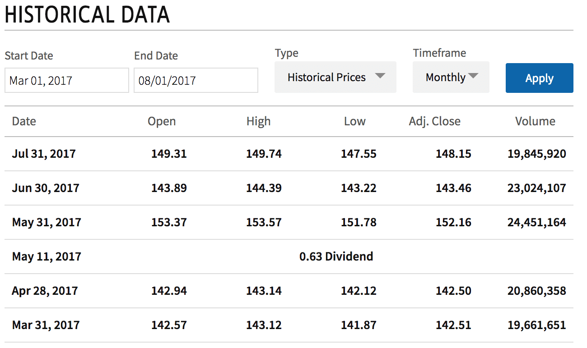

## Table of Contents

## What are historical stock prices and why are they important?

Historical stock prices are the past prices at which a stock was traded on the stock market. These prices are recorded daily and can show how the value of a stock has changed over time. You can find this information for any publicly traded company, and it's usually easy to look up on financial websites.

Knowing historical stock prices is important for a few reasons. First, it helps investors see how a stock has performed in the past. This can give them an idea of how risky the stock might be and help them decide if they want to buy it. Second, historical prices can be used to study patterns and trends in the market. This can help people make better guesses about what might happen to stock prices in the future.

## Where can beginners start looking for historical stock price data?

Beginners can start looking for historical stock price data on popular financial websites like Yahoo Finance and Google Finance. These websites are easy to use and provide a lot of information for free. Just type in the name or the stock symbol of the company you're interested in, and you'll find a chart showing how the stock's price has changed over time. You can usually choose different time periods, like one year or five years, to see the long-term trends.

Another good place to look is the website of the stock exchange where the company is listed, like the New York Stock Exchange (NYSE) or NASDAQ. These websites also offer historical price data, although they might be a bit more complicated to navigate. If you want more detailed data, you might need to pay for it from financial data providers like Bloomberg or Reuters. But for most beginners, the free data from Yahoo Finance or Google Finance should be enough to start learning about stock prices.

## How can one access historical stock prices through financial websites?

To access historical stock prices through financial websites, start by visiting a site like Yahoo Finance or Google Finance. Once you're on the homepage, find the search bar at the top of the page. Type in the name of the company or its stock symbol, like "Apple" or "AAPL" for Apple Inc. After you hit enter, you'll be taken to a page with lots of information about the stock. Look for a tab or section labeled "Historical Data" or "Chart." Click on it, and you'll see a chart showing how the stock's price has changed over time.

On the historical data page, you can usually choose the time period you want to look at, like one month, one year, or even ten years. This lets you see how the stock has performed over different lengths of time. You can also download the data if you want to use it in a spreadsheet or for more detailed analysis. Just click on the download button, and you'll get a file with all the prices listed out. It's that simple!

## What are the steps to download historical stock data from Yahoo Finance?

To download historical stock data from Yahoo Finance, first go to the Yahoo Finance website. At the top of the page, you'll see a search bar. Type in the name of the company or its stock symbol, like "Apple" or "AAPL" for Apple Inc. After you press enter, you'll go to a page with a lot of information about the stock. Look for a tab that says "Historical Data" and click on it. You'll see a chart showing how the stock's price has changed over time.

On the Historical Data page, you can pick the time period you want to see, like one month, one year, or even ten years. Once you've chosen the time period, look for a button that says "Download." Click on it, and a file will start downloading to your computer. This file will have all the historical stock prices listed out, which you can open in a spreadsheet program like Excel to look at the data more closely.

## How can historical stock prices be accessed through APIs?

You can use APIs to get historical stock prices. An API is a way for computers to talk to each other and share information. For example, you can use the Alpha Vantage API or the Yahoo Finance API to get stock data. First, you need to sign up for an API key, which is like a special password that lets you use the API. Once you have the key, you can send a request to the API with the stock symbol and the time period you want. The API will then send back the historical prices in a format you can use, like JSON or CSV.

Using an API can be helpful if you want to get a lot of data quickly or if you want to use the data in a computer program. For example, you can write a program that asks the API for stock prices every day and then uses that data to make charts or do other analysis. APIs are often used by people who want to build their own tools for looking at stock data, like apps or websites. Just remember that some APIs might charge you money if you use them a lot, so make sure to read the rules before you start using them.

## What are some popular APIs for retrieving historical stock data?

Some popular APIs for retrieving historical stock data are Alpha Vantage, Yahoo Finance, and IEX Cloud. These APIs let you get stock prices from the past by sending a request with the stock symbol and the time period you want. To use these APIs, you need to sign up for an API key, which is like a special password that lets you access the data. Once you have your key, you can use it to ask the API for the information you need.

Alpha Vantage is easy to use and gives you a lot of free data, which is good for beginners. It can give you daily, weekly, or monthly prices for stocks. Yahoo Finance API is another popular choice, especially because it's connected to the well-known Yahoo Finance website. It's good for getting detailed historical data, but you might need to pay for it if you want to use it a lot. IEX Cloud is also popular because it's reliable and offers both free and paid plans, depending on how much data you need.

## How can one use Python to fetch historical stock prices?

To fetch historical stock prices using Python, you can use an API like Alpha Vantage. First, you need to sign up for an API key on their website. Once you have your key, you can use a Python library called `requests` to send a request to the API. You'll need to include your API key and the stock symbol you want to look up, like "AAPL" for Apple. The API will send back the historical prices in a format called JSON, which you can then read and use in your Python program.

After you get the JSON data, you can use another Python library called `pandas` to turn it into a nice table. With `pandas`, you can easily look at the data, make charts, or do other calculations. For example, you can find out the highest and lowest prices over time or see how the stock has done over different periods. This way, you can use Python to get and analyze historical stock prices, which can help you understand how stocks have performed in the past.

## What are the considerations for data accuracy and reliability when accessing historical stock prices?

When you're looking at historical stock prices, it's really important to make sure the data you're using is correct and reliable. Different places where you can get this data, like financial websites or APIs, might have small differences in the prices they show. This can happen because of how they collect the data or when they update it. So, it's a good idea to check more than one source to make sure the numbers are the same. Also, some sources might give you free data, but it might not be as detailed or up-to-date as what you'd get if you paid for it. 

Another thing to think about is the time period you're looking at. If you're looking at prices from a long time ago, like many years back, the data might not be as accurate as more recent data. This is because older data might have been recorded differently or might have been changed over time. Also, make sure the source you're using is well-known and trusted. Popular websites like Yahoo Finance or APIs like Alpha Vantage are usually good choices because a lot of people use them and they have a good reputation for being accurate.

## How can advanced users manipulate and analyze historical stock data using programming?

Advanced users can use programming to manipulate and analyze historical stock data by writing scripts in languages like Python. They can fetch data from APIs like Alpha Vantage or Yahoo Finance, and then use libraries like `pandas` to organize the data into tables. These tables make it easy to look at the data, do calculations, and find patterns. For example, users can calculate moving averages, which help them see how the stock price is trending over time. They can also use statistical tools to figure out things like [volatility](/wiki/volatility-trading-strategies), which tells them how much the stock price moves up and down.

Once they have the data organized, advanced users can use programming to create visualizations like charts and graphs. Libraries like `matplotlib` or `seaborn` in Python can help them make these visuals. They can plot the stock prices over time, add indicators like moving averages or Bollinger Bands, and even create interactive charts that let them zoom in on specific time periods. By doing this, users can spot trends and patterns that might be hard to see just by looking at numbers. This kind of analysis can help them make better decisions about when to buy or sell stocks, or just understand the market better.

## What are the legal and ethical considerations when accessing and using historical stock data?

When you use historical stock data, it's important to think about the rules and what's right. Some places where you can get this data, like financial websites or APIs, have rules about how you can use their information. For example, they might say you can't share the data with other people or use it to make money without paying them. It's really important to read and follow these rules, so you don't get in trouble. If you're not sure about the rules, it's a good idea to ask someone who knows about this stuff, like a lawyer.

Also, think about what's fair and honest when you use this data. For example, if you find out something important from the data, it's not right to use that information to trick other people into buying or selling stocks. This is called insider trading, and it's against the law. Always be honest and fair when you're working with stock data, and remember that other people are looking at the same information and trying to make good choices too.

## How can historical stock prices be integrated into financial models and algorithms?

Historical stock prices can be used in financial models and algorithms to help people make better guesses about what might happen to stock prices in the future. When you build a financial model, you can use past prices to see how a stock has moved up and down over time. This can help you create rules or formulas that might predict how the stock will act in the future. For example, you can use historical data to figure out things like moving averages or other patterns that can tell you when a stock might go up or down. By putting these patterns into your model, you can make smarter choices about buying or selling stocks.

Algorithms can also use historical stock prices to do things automatically. For example, if you write a program that looks at past prices, it can follow rules you set up to buy or sell stocks without you having to do it yourself. This can be really helpful if you want to trade stocks quickly based on what the data is telling you. By using historical data in your algorithms, you can make sure your program is making choices based on real information from the past, which can help it work better. Just remember to keep checking and updating your models and algorithms, because what worked in the past might not always work in the future.

## What are the latest trends and technologies in accessing and analyzing historical stock data?

The latest trends in accessing and analyzing historical stock data involve using advanced technologies like [machine learning](/wiki/machine-learning) and [artificial intelligence](/wiki/ai-artificial-intelligence). These technologies help people find patterns and make predictions about stock prices more accurately. For example, machine learning algorithms can look at huge amounts of historical data to spot trends that might be hard for a person to see. This can help traders and investors make better decisions about when to buy or sell stocks. Also, cloud computing is becoming more popular because it lets people store and process a lot of data without needing expensive computers. This makes it easier for more people to access and analyze historical stock data.

Another trend is the use of real-time data feeds and APIs. These tools let people get the most up-to-date stock prices and combine them with historical data for better analysis. For example, APIs from services like Alpha Vantage or IEX Cloud give you quick and easy access to stock data, which you can then use in your own programs or apps. Also, data visualization tools are getting better, making it easier to see and understand stock trends through interactive charts and graphs. These tools help people see the big picture and make sense of the data more easily.

## References & Further Reading

[1]: ["Advances in Financial Machine Learning"](https://www.amazon.com/Advances-Financial-Machine-Learning-Marcos/dp/1119482089) by Marcos Lopez de Prado

[2]: ["Evidence-Based Technical Analysis: Applying the Scientific Method and Statistical Inference to Trading Signals"](https://www.amazon.com/Evidence-Based-Technical-Analysis-Scientific-Statistical/dp/0470008741) by David Aronson

[3]: ["Machine Learning for Algorithmic Trading"](https://github.com/stefan-jansen/machine-learning-for-trading) by Stefan Jansen

[4]: ["Quantitative Trading: How to Build Your Own Algorithmic Trading Business"](https://www.amazon.com/Quantitative-Trading-Build-Algorithmic-Business/dp/1119800064) by Ernest P. Chan

[5]: "Bodie, Z., Kane, A., & Marcus, A. J. (2014). Investments. McGraw-Hill Education."