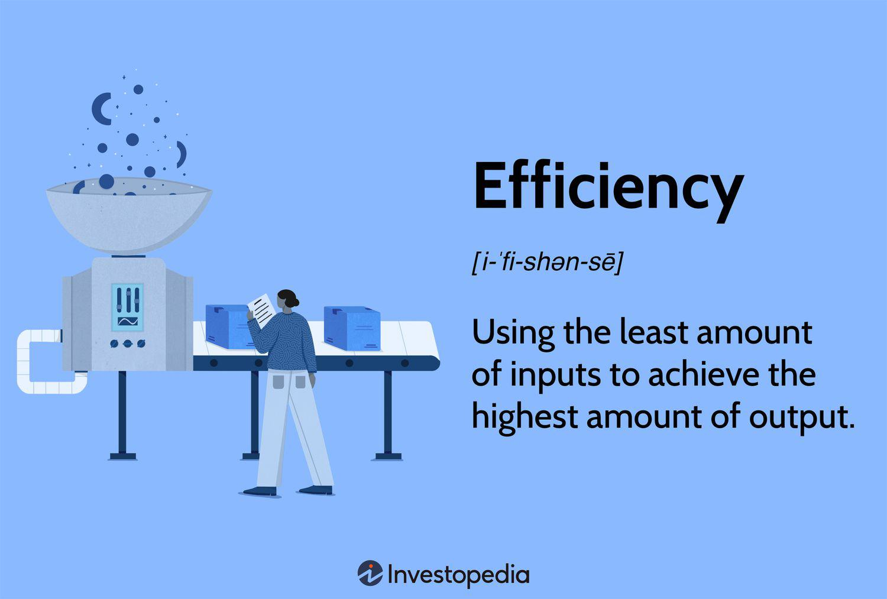

## Table of Contents

## What is economic growth and why is it important?

Economic growth is when a country's economy gets bigger over time. It means that people in the country are making more things and providing more services, and the total value of everything they produce goes up. This is usually measured by something called Gross Domestic Product, or GDP, which adds up the value of all goods and services made in a country in a year. When GDP grows, it often means that businesses are doing well and people might have more money to spend.

Economic growth is important because it can lead to better lives for people. When the economy grows, there are usually more jobs available, which means more people can work and earn money. This can help reduce poverty and improve living standards. Also, when the economy is growing, the government usually has more money to spend on things like schools, hospitals, and roads, which can make life better for everyone. So, economic growth is key to making a country a better place to live.

## How can increasing the labor force contribute to economic growth?

Increasing the labor force can help the economy grow by having more people working. When more people have jobs, they can make more things and provide more services. This means the total amount of goods and services in the country goes up, which is what we call economic growth. More workers can also mean that businesses can produce more without having to pay more for each worker, which can make things cheaper and help the economy grow even more.

Also, when more people are working, they earn money and can spend it on things they need or want. This spending helps other businesses grow because they sell more. When businesses do well, they might hire even more people, which keeps the cycle of growth going. So, having a bigger labor force can start a chain reaction that helps the whole economy get bigger and stronger.

## What role does technological advancement play in boosting economic growth?

Technological advancement helps economic growth by making it easier and faster for people to do their jobs. When new technology comes out, it can make businesses more efficient. This means they can make more things or provide more services with the same amount of work. For example, a new machine in a factory can make more products in less time than before. When businesses can produce more, the total value of what the country makes goes up, which is what we call economic growth.

Also, new technology can create new jobs and industries. When something new is invented, like smartphones or the internet, it can lead to whole new types of jobs that didn't exist before. This means more people can work and earn money, which helps the economy grow. Plus, when people use new technology, they often find new ways to solve problems or make life better, which can lead to even more growth in the future.

## How do investments in infrastructure affect economic growth?

Investments in infrastructure, like roads, bridges, and power plants, help the economy grow by making it easier for people and goods to move around. When roads and bridges are good, trucks can deliver things faster and cheaper. This means businesses can sell their products in more places and maybe even sell more. Also, good infrastructure helps workers get to their jobs easier, so they can work more and earn more money. All of this helps the economy get bigger because more things are being made and sold.

Also, when the government spends money on infrastructure, it creates jobs for the people who build these projects. This means more people are working and [earning](/wiki/earning-announcement) money, which they can spend on things they need or want. When people spend more, it helps other businesses grow because they sell more. So, investing in infrastructure can start a cycle where more people work, more things are made, and the economy keeps growing.

## What are the effects of education and human capital development on economic growth?

Education and human capital development help the economy grow by making people smarter and better at their jobs. When people go to school and learn new things, they can do their work better and come up with new ideas. This means businesses can make more things and provide better services. For example, a well-educated worker might find a faster way to do their job, which helps the company make more money. When businesses do well, they can grow and hire more people, which makes the whole economy bigger.

Also, education helps people learn skills that are important for new jobs and industries. When people have the right skills, they can work in new areas like technology or healthcare. This creates more jobs and helps the economy grow even more. Plus, when people are educated, they often earn more money and can spend more on things they need or want. This spending helps other businesses grow because they sell more. So, education and human capital development are key to making the economy stronger and bigger.

## How does government policy influence economic growth?

Government policy can help the economy grow by making rules that help businesses do well. For example, the government can lower taxes for companies so they have more money to spend on growing their business. They can also make it easier for businesses to start up by cutting red tape, which is all the rules and paperwork that can slow things down. When businesses can grow and hire more people, the whole economy gets bigger because more things are being made and more people are working.

Also, the government can spend money on things like schools and roads, which helps the economy grow. When the government builds new roads, it makes it easier for people and goods to move around. This helps businesses sell their products in more places and maybe even sell more. When the government spends money on schools, it helps people get a better education, which means they can do their jobs better and earn more money. All of this spending by the government can start a cycle where more people work, more things are made, and the economy keeps growing.

## What is the impact of international trade on a country's economic growth?

International trade helps a country's economy grow by letting it sell things to other countries and buy things it needs. When a country can sell its products to other places, it can make more money. This money can be used to grow businesses and hire more people. Also, when a country can buy things from other places, it can get things cheaper or better than it could make on its own. This helps businesses save money and maybe even sell more because they can offer better prices or products.

International trade also helps create new jobs. When a country sells more things to other countries, it needs more people to make those things. This means more jobs for people, which helps them earn money and spend it on things they need or want. When people spend more, it helps other businesses grow because they sell more. So, trading with other countries can start a cycle where more people work, more things are made, and the economy keeps growing.

## How can fiscal policy be used to stimulate economic growth?

Fiscal policy is when the government uses its spending and taxes to help the economy grow. One way the government can do this is by spending more money on things like building roads, schools, and hospitals. When the government spends more, it creates jobs for the people who work on these projects. More jobs mean more people are working and earning money, which they can spend on things they need or want. This spending helps other businesses grow because they sell more, and the whole economy gets bigger.

The government can also lower taxes to help the economy grow. When taxes are lower, people and businesses have more money to spend or invest. If people spend more, it helps businesses sell more things. If businesses invest more, they can grow and hire more people. Both of these things help the economy get bigger. So, by spending more and lowering taxes, the government can start a cycle where more people work, more things are made, and the economy keeps growing.

## What are the potential drawbacks of rapid economic growth?

Rapid economic growth can sometimes cause problems. One big problem is that it can make the gap between rich and poor people even bigger. When the economy grows fast, the people who already have a lot of money might get even richer, while poor people might not see as much benefit. This can lead to more inequality in the country, which can cause social problems and make some people feel left out.

Another issue with fast growth is that it can hurt the environment. When businesses grow quickly, they might use more resources and create more pollution. This can damage nature and make it harder for people to live healthy lives. If the government doesn't make rules to protect the environment, rapid growth can lead to serious problems like dirty air and water, which can affect everyone in the country.

## How do natural resources and their management affect economic growth?

Natural resources like oil, gas, and minerals can help a country's economy grow. When a country has a lot of these resources, it can sell them to other countries and make money. This money can be used to build things like roads and schools, which help the economy grow even more. Also, when a country uses its natural resources well, it can create jobs for people who work in industries like mining or farming. More jobs mean more people can earn money and spend it on things they need, which helps the whole economy get bigger.

But, if a country doesn't manage its natural resources well, it can cause problems. If a country uses up all its resources too quickly, it might not have anything left to sell in the future. This can hurt the economy because the country won't have as much money coming in. Also, if a country doesn't take care of its environment while using its resources, it can lead to pollution and other problems that can make life harder for people. So, it's important for a country to manage its natural resources carefully to help the economy grow in a way that lasts.

## What are the differences between short-term and long-term economic growth strategies?

Short-term economic growth strategies focus on quick fixes to help the economy grow right away. These can include things like the government spending more money on projects like building roads or lowering taxes so people and businesses have more money to spend. These actions can create jobs and boost spending in the short term, which helps the economy grow faster right away. But, these strategies might not last long because they don't always fix the bigger problems that can slow down the economy in the future.

Long-term economic growth strategies are about making changes that help the economy grow over many years. These can include investing in education so people can learn new skills and get better jobs, or building better infrastructure like roads and bridges to help businesses work more efficiently. They can also include policies that encourage innovation and new technology, which can create new industries and jobs. These strategies take time to work, but they can help the economy grow steadily and make it stronger in the long run.

## How can sustainable development principles be integrated into economic growth plans?

Sustainable development means making sure that the economy grows in a way that doesn't hurt the environment or use up all our resources too quickly. To do this, countries can include sustainable practices in their economic growth plans. For example, they can invest in green energy like solar or wind power instead of using fossil fuels that pollute the air. They can also make rules that protect forests and rivers so that nature stays healthy. By doing these things, a country can grow its economy while also taking care of the planet for future generations.

Another way to integrate sustainable development into economic growth is by focusing on education and training. When people learn about sustainability, they can find new ways to do their jobs that are better for the environment. Governments can also support businesses that make eco-friendly products or use less energy. This can create new jobs and industries that help the economy grow in a sustainable way. By thinking about the long-term health of the planet, countries can build an economy that lasts and benefits everyone.

## What is the difference between understanding economic development and economic growth?

Economic development and economic growth are fundamental concepts in understanding the progress and prosperity of nations, yet they are distinct from one another in various significant ways. Economic growth generally refers to an increase in a country's output of goods and services, typically measured by Gross Domestic Product (GDP). It is characterized by the quantitative expansion of economic output and is a narrower concept compared to economic development. GDP, a key indicator of economic growth, is the sum of gross value added by all resident producers in an economy plus any product taxes and minus any subsidies not included in the value of the products. The GDP formula can be represented as:

$$
\text{GDP} = C + I + G + (X - M)
$$

where $C$ is consumption, $I$ is investment, $G$ is government spending, and $(X - M)$ is net exports (exports minus imports).

Economic development, on the other hand, encompasses broader aspects of human and societal advancement, including improvements in living standards, reduction in poverty, enhancement of health and education, and increased participation in social and political processes. While economic growth can occur without significant improvements in the well-being of a society, economic development implies that growth is accompanied by favorable changes in these societal dimensions.

The relationship between economic development and economic growth is mutually reinforcing: economic growth can provide the resources needed for developmental initiatives, while economic development can foster an environment that promotes sustainable economic growth. Economic growth provides the financial means and incentives for governments and private sectors to invest in infrastructure, education, and public services, which are fundamental components of economic development.

Indicators of economic development include Human Development Index (HDI), which measures life expectancy, education, and per capita income indicators to assess the average achievements in a country. Another indicator can be the Gini coefficient, which measures income inequality within a population.

The interdependence of economic development and growth is key to achieving prosperity. While economic growth focuses on the outputs of an economy, economic development ensures that these outputs translate into real improvements in people's lives. For instance, increased GDP should ideally lead to better healthcare, improved education, and viable employment opportunities, thereby enhancing the overall quality of life.

In conclusion, understanding the nuances between economic development and economic growth is crucial for policymakers as they devise strategies to ensure not just an increase in economic productivity but also comprehensive societal advancement. Balancing growth with development efforts can lead to sustainable prosperity and a more equitable distribution of economic benefits, leading to a stable and robust economy.

## References & Further Reading

[1]: Bergstra, J., Bardenet, R., Bengio, Y., & Kégl, B. (2011). ["Algorithms for Hyper-Parameter Optimization."](https://dl.acm.org/doi/10.5555/2986459.2986743) Advances in Neural Information Processing Systems 24.

[2]: ["Advances in Financial Machine Learning"](https://www.amazon.com/Advances-Financial-Machine-Learning-Marcos/dp/1119482089) by Marcos Lopez de Prado

[3]: ["Evidence-Based Technical Analysis: Applying the Scientific Method and Statistical Inference to Trading Signals"](https://www.amazon.com/Evidence-Based-Technical-Analysis-Scientific-Statistical/dp/0470008741) by David Aronson

[4]: ["Machine Learning for Algorithmic Trading"](https://github.com/stefan-jansen/machine-learning-for-trading) by Stefan Jansen

[5]: ["Quantitative Trading: How to Build Your Own Algorithmic Trading Business"](https://www.amazon.com/Quantitative-Trading-Build-Algorithmic-Business/dp/1119800064) by Ernest P. Chan